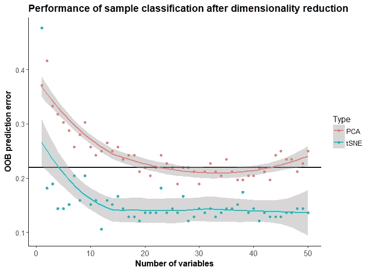

# 使用 t-SNE 降低代谢组学数据集的维数

> 原文：<https://towardsdatascience.com/use-of-t-sne-to-reduce-the-dimensionality-of-metabolomics-datasets-f8a36120ca32?source=collection_archive---------4----------------------->

任何对代谢组学研究数据集有经验的人都会有需要降低其维数的经验。探索性分析所需的可视化极大地受益于将变量减少到可管理的数量。此外，一些变量可能是无信息的或多余的。当执行后面的统计分析或模型时，这些变量会增加计算时间，并会影响它们的性能。

降维可以基于信息特征的选择，或者基于更少数量的变量的合成，其最佳地保留了原始数据集中存在的信息。在代谢组学中执行维数减少的标准方法是[主成分分析](https://en.wikipedia.org/wiki/Principal_component_analysis) (PCA)。然而，越来越多的新方法在减少变量数量时有望获得更好的性能。

一种趋势降维方法被称为 [t 分布随机邻居嵌入](https://en.wikipedia.org/wiki/T-distributed_stochastic_neighbor_embedding) (t-SNE)。有多个在线例子显示了 t-SNE 优于 PCA 的优势(这里的例子)。然而，研究往往是根据以前是如何完成的来进行的。这种效应被称为[路径依赖](https://en.wikipedia.org/wiki/Path_dependence)，会滞后研究效率，因为更好的方法会发现一些阻力，需要在该领域建立标准。我这篇博文的目的是展示 t-SNE 应用于代谢物定量数据集有多容易，以及应用它可能带来的好处。

[MTBLS1](https://www.ebi.ac.uk/metabolights/mtbls1) 代谢研究包括对 48 名二型糖尿病患者的尿液样本和 84 份尿液对照样本之间的代谢差异的研究。存储库包含一个[预处理代谢物量化数据集](https://www.ebi.ac.uk/metabolights/MTBLS1/files/ADG_transformed_data.xlsx)，包含 132 个观察值、188 个量化变量和一个标识符变量。许多变量是有噪声的，因为它们没有代表性的代谢物，或者是多余的，因为它们介导相同代谢物的信号。在 R 中，加载数据集和执行降维包括以下步骤:

> 库(tsne)
> 库(readxl)
> ADG _ 变换 _ 数据< -读取 _ excel(" ADG _ 变换 _ 数据. xlsx ")
> ADG _ 变换 _ 数据$ `主 id ` = NULL
> tsne _ ADG _ 变换 _ 数据= tsne(ADG _ 变换 _ 数据，困惑=50)

通过比较变量降维前后的样本分类，可以检验降维方法是否有效地综合了数据集的信息。预计更好的降维技术有助于提高样本分类的性能，因为它们以所选的分类算法能够更好地“理解”的方式分布和合成数据。

在原始数据集中进行[随机森林](https://www.google.es/url?sa=t&rct=j&q=&esrc=s&source=web&cd=2&cad=rja&uact=8&ved=0ahUKEwiMv9G7-tbWAhWDDxoKHWb_CKkQFggxMAE&url=https%3A%2F%2Fen.wikipedia.org%2Fwiki%2FRandom_forest&usg=AOvVaw0H4kXRhWcf28po9b-MQHFV)分类时，样本分类时的出袋预测误差为 21.97%。当对输出维数不断增加的原始数据集执行 t-SNE 和 PCA 时，结果如下图所示(原始数据集中 21.97%的误差用黑线标记):

可以观察到通过 PCA 的维数减少几乎不能提高 MTBLS1 数据集中样本分类的性能。为了开始改善原始性能，需要将减少限制到至少 25 个变量。相比之下，t-SNE 帮助样本分类实现了低于 15%的误差。此外，它只需要略多于 10 个输出变量来实现这些好处。

这是一个 t-SNE 是一种非常有前途且易于应用的技术的例子，以在代谢组学研究中的样品分类期间实现更好的性能。