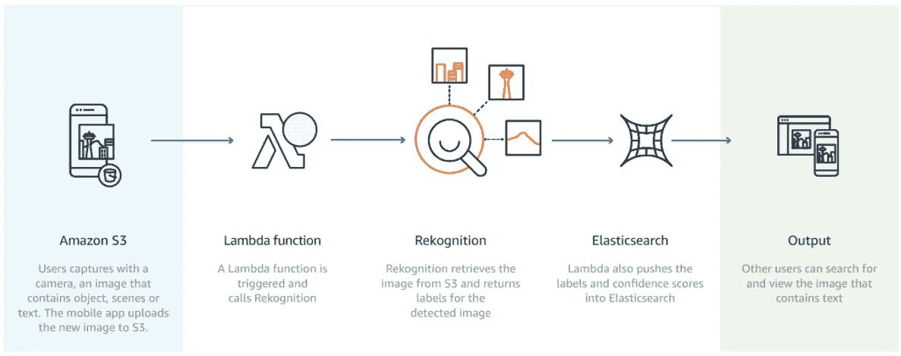
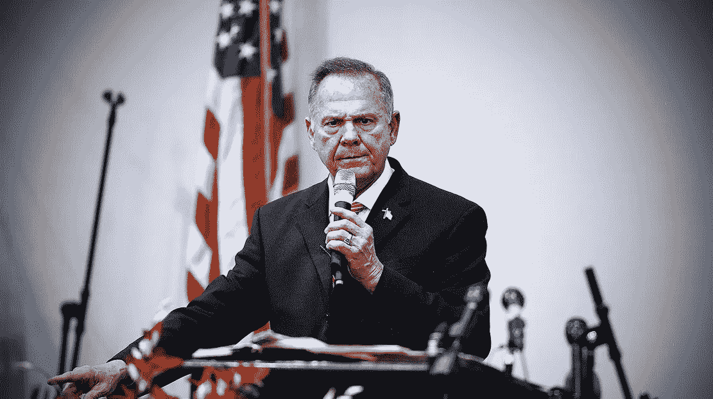
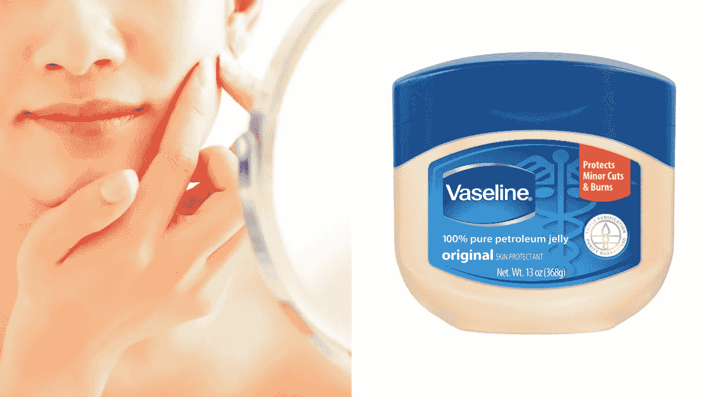
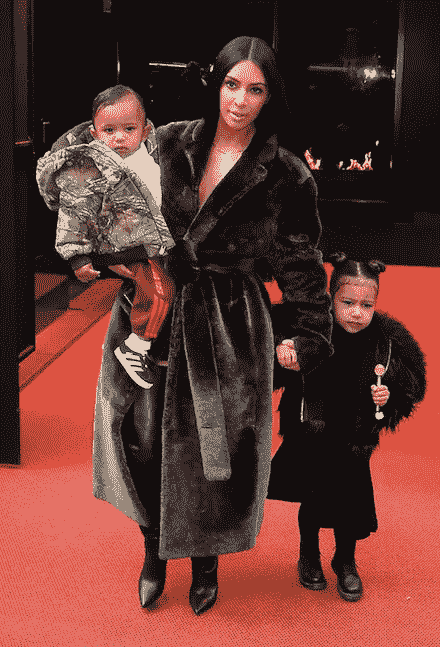
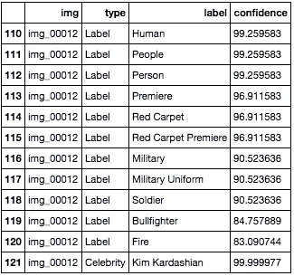
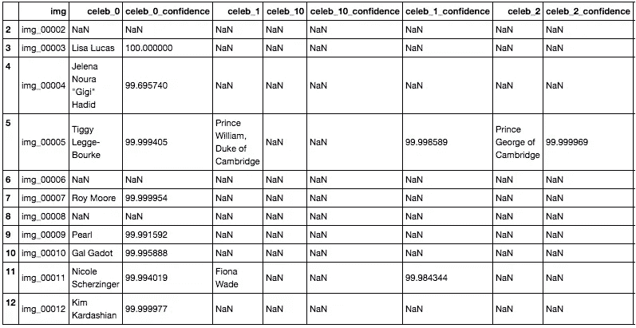
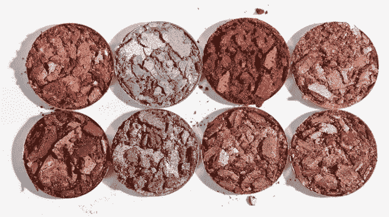

# 使用 Python 通过 AWS 的反向图像搜索引擎 Rekognition 收集图像标签

> 原文：<https://towardsdatascience.com/use-python-to-collect-image-tags-using-aws-reverse-image-search-engine-rekognition-eccf1f259a8d?source=collection_archive---------7----------------------->

这篇博文讨论了如何将你的图片转化为描述图片内容的文本，这样你就可以在 Jupyter 笔记本上对图片的内容和主题进行分析。一个有用的例子是，如果你收到了数千条推文，你想知道图片媒体对参与度有没有影响。幸运的是，亚马逊、谷歌和微软的工程师没有编写自己的图像识别工具，而是完成了这项任务，并使他们的 API 可以访问。这里我们将使用 Rekognition，这是亚马逊基于深度学习的图像和视频分析工具。

本博客作为如何使用不同的 Rekognition 操作提取信息的示例，并不能代替阅读文档。我尽我所能提供链接，因为它们可能是有用的。

因此，为了收集图像的文本数据，我们将:

1.  将图像存储在 AWS S3 桶中
2.  使用 AWS Rekognition 反转图像搜索并返回每个图像的标签
3.  将数据保存在长数据框和宽数据框中——您可能只需要一个数据框，但是我在代码中给出了将数据保存为两个数据框的方法。

亚马逊在这里描述了 Rekognition 是如何工作的。



[https://aws.amazon.com/rekognition/](https://aws.amazon.com/rekognition/)

打开 Jupyter 笔记本并将数据存储为 pandas 数据框对象后，我们希望导入相关的库。我使用了来自 Twitter 的数据，那里的图像数据是 URL 形式的。

```
import boto
import boto3
conn = boto.connect_s3()
import requests
```

如果你在这里遇到了错误，[安装 AWS CLI](http://docs.aws.amazon.com/cli/latest/userguide/tutorial-ec2-ubuntu.html#install-cli) ，并确保你已经安装了 [boto](http://boto.cloudhackers.com/en/latest/getting_started.html) 和 [boto3](http://boto3.readthedocs.io/en/latest/guide/quickstart.html) 。

现在连接到我们的桶:

```
*# Uses the creds in ~/.aws/credentials*
s3 = boto3.resource('s3')
bucket_name_to_upload_image_to = '#########' *#insert the name of your bucket here.*
```

你如何创建一个桶？什么是水桶？[点击此处。](http://docs.aws.amazon.com/AmazonS3/latest/user-guide/create-bucket.html)

你连接到你的桶了吗？我从用户 [GISD](https://stackoverflow.com/users/5770412/gisd) 对以下 [StackOverflow 问题](https://stackoverflow.com/questions/14346065/upload-image-available-at-public-url-to-s3-using-boto)的回答中了解到这个检查。

```
*# Do this as a quick and easy check to make sure your S3 access is OK*
**for** bucket **in** s3.buckets.all():
    **if** bucket.name == bucket_name_to_upload_image_to:
        print('Good to go. Found the bucket to upload the image into.')
        good_to_go = **True**

**if** **not** good_to_go:
    print('Not seeing your s3 bucket, might want to double check permissions in IAM')
```

# 第一步:将图像存储在 AWS S3 桶中

我们所有的图像都是以网址的形式，我们想把它们都上传到一个 S3 桶，而不必先把它们存储在我们的硬盘上。方法如下:

请记住，这还会创建一个 mapping_dict，这样，如果您的图像 URL 列表是从另一个数据框中获得的，您就能够将其与在以下步骤中创建的图像标签数据框合并。

# 第二步:使用 AWS Rekognition 反向搜索图像并返回每个图像的标签

首先，我们将探索 AWS API 的三个特性，巧合的是，它们对我的目的最有帮助:[检测标签](http://docs.aws.amazon.com/rekognition/latest/dg/API_DetectLabels.html)、[检测文本](http://docs.aws.amazon.com/rekognition/latest/dg/API_DetectText.html)和[识别名人](http://docs.aws.amazon.com/rekognition/latest/dg/celebrities.html)。Rekognition 还拥有许多其他功能,包括检测和分析人脸，跟踪人脸，以及检测儿童的不安全内容。

**检测标签**

response will be a dictionary with keys [‘OrientationCorrection’, ‘Labels’, ‘ResponseMetadata’]

```
[Output]
{'Labels': [{'Confidence': 99.28775787353516, 'Name': 'Human'},
  {'Confidence': 99.2877426147461, 'Name': 'People'},
  {'Confidence': 99.28775787353516, 'Name': 'Person'},
  {'Confidence': 91.67272186279297, 'Name': 'Audience'},
  {'Confidence': 91.67272186279297, 'Name': 'Crowd'},
  {'Confidence': 91.67272186279297, 'Name': 'Speech'},
  {'Confidence': 78.27274322509766, 'Name': 'Clothing'},
  {'Confidence': 78.27274322509766, 'Name': 'Coat'},
  {'Confidence': 78.27274322509766, 'Name': 'Overcoat'},
  {'Confidence': 78.27274322509766, 'Name': 'Suit'}],
 'OrientationCorrection': 'ROTATE_0',
 'ResponseMetadata': {'HTTPHeaders': {'connection': 'keep-alive',
   'content-length': '536',
   'content-type': 'application/x-amz-json-1.1',
   'date': 'Mon, 04 Dec 2017 03:13:26 GMT',
   'x-amzn-requestid': '18599e6b-d8a1-11e7-8234-c9f1716fbb2e'},
  'HTTPStatusCode': 200,
  'RequestId': '18599e6b-d8a1-11e7-8234-c9f1716fbb2e',
  'RetryAttempts': 0}}
```

对于下图:



**检测文本**

text_in_image will be a dictionary with keys [‘TextDetections’, ‘ResponseMetadata’]

注意这里的输出是一个字典的字典。既然这么长，这里就不完整收录了。以下是 text _ in _ image[' text detections ']的简短输出:

```
[Output]
[{'Confidence': 87.87747955322266,
  'DetectedText': 'Protects',
  'Geometry': {'BoundingBox': {'Height': 0.0289202518761158,
    'Left': 0.8098856210708618,
    'Top': 0.3966602385044098,
    'Width': 0.05391734838485718},
   'Polygon': [{'X': 0.8098856210708618, 'Y': 0.3966602385044098},
    {'X': 0.863802969455719, 'Y': 0.3976689577102661},
    {'X': 0.8636319041252136, 'Y': 0.4265892207622528},
    {'X': 0.8097145557403564, 'Y': 0.4255805015563965}]},
  'Id': 0,
  'Type': 'LINE'},
 {'Confidence': 81.16915130615234,
  'DetectedText': 'Minorcuts',
  'Geometry': {'BoundingBox': {'Height': 0.025231996551156044,
    'Left': 0.8168795108795166,
    'Top': 0.4240514636039734,
    'Width': 0.06063205003738403},
   'Polygon': [{'X': 0.8168795108795166, 'Y': 0.4240514636039734},
    {'X': 0.8775115609169006, 'Y': 0.4253864288330078},
    {'X': 0.8773359060287476, 'Y': 0.4506184160709381},
    {'X': 0.8167038559913635, 'Y': 0.4492834508419037}]},
  'Id': 1,
  'Type': 'LINE'},
.
.
.
}]
```

对于下图:



See “Protects” and “Minorcuts”?

**认识名人**

celeb_detect will be a dictionary with keys [‘OrientationCorrection’, ‘CelebrityFaces’, ‘UnrecognizedFaces’, ‘ResponseMetadata’]

类似于 DetectText，recognize small ness 返回字典的字典。以下是 celeb_detect["CelebrityFaces"]的输出:

```
[Output]
[{'Face': {'BoundingBox': {'Height': 0.10687500238418579,
    'Left': 0.4807872474193573,
    'Top': 0.15562500059604645,
    'Width': 0.16026242077350616},
   'Confidence': 99.9999771118164,
   'Landmarks': [{'Type': 'eyeLeft',
     'X': 0.5403168201446533,
     'Y': 0.19756773114204407},
    {'Type': 'eyeRight', 'X': 0.5921167731285095, 'Y': 0.20492416620254517},
    {'Type': 'nose', 'X': 0.5595902800559998, 'Y': 0.22208547592163086},
    {'Type': 'mouthLeft', 'X': 0.5338063836097717, 'Y': 0.23306140303611755},
    {'Type': 'mouthRight', 'X': 0.5765158534049988, 'Y': 0.23889882862567902}],
   'Pose': {'Pitch': -3.3401520252227783,
    'Roll': 11.797859191894531,
    'Yaw': -0.263323575258255},
   'Quality': {'Brightness': 23.701353073120117,
    'Sharpness': 99.99090576171875}},
  'Id': '1ax3nr0o',
  'MatchConfidence': 94.0,
  'Name': 'Kim Kardashian',
  'Urls': ['www.imdb.com/name/nm2578007']}]
```

对于下图:



# 第三步:将数据保存在长和宽的数据框中

还不错！现在把它们放在一个 for 循环中，这样你就可以得到一个数据帧，其中包含了我们想要使用 Rekognition 检索的所有信息。

长数据将像这样存储:



Data Cleaning idea: If it is a celebrity, remove all other labels as celebrity fashion can be difficult for Rekognition.

宽数据将像这样存储，每张图片一行，列跨越标签、单词和它们的置信度。



这个 for 循环步骤需要很长时间才能用完你的 Jupyter 笔记本。对于 10，000 张图片，我花了大约 8 个小时。Try/except 语句包含在每个组成部分 detect_labels、detect_text 和 recognize _ 中，因为并非所有图像都会从所有三个操作中得到响应。

图像处理愉快！

关于这个主题有很多资源，你可以在我发现每个资源最有用的步骤中找到我使用的链接。我发现 Rekognition 非常有效，但它确实有一些问题(就像任何图像识别工具一样)。特别是，没有被很好分类的照片是特定身体部位(即:嘴)的特写，一张眼影化妆的图像被分类为巧克力或软糖。



I can see how this can be mistaken for chocolate or fudge.

如果您在执行分析之前使用了这段代码，请在评论中链接您的项目，我很乐意看到您的工作。如果 Rekognition 给你的图片带来了任何古怪的标签或者错误的分类，我也想听听。

在我的 GitHub 上找到我的 Jupyter 笔记本:[https://GitHub . com/nmolivo/Blogs/tree/master/002 _ AWS recognition](https://github.com/nmolivo/Blogs/tree/master/002_AWSRekognition)