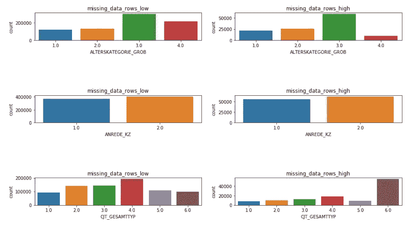
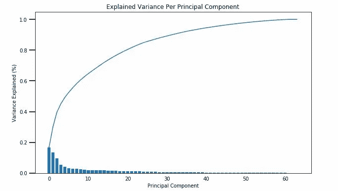
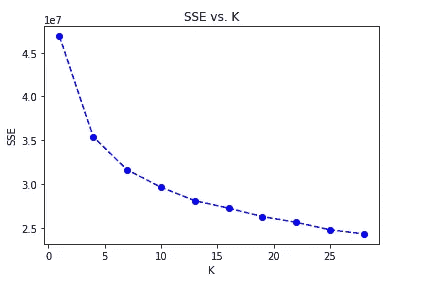
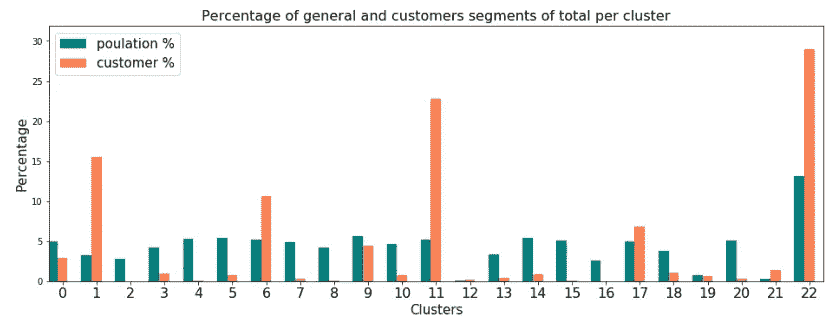
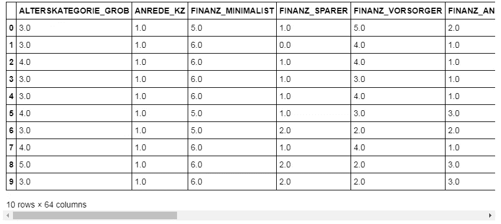
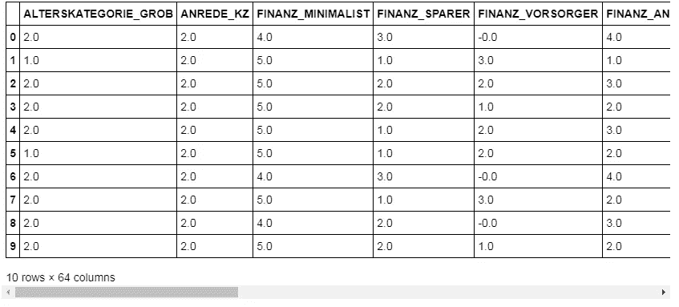

# 使用无监督的机器学习来寻找你的产品的潜在买家

> 原文：<https://towardsdatascience.com/use-unsupervised-machine-learning-to-find-potential-buyers-of-your-products-cd75edaeefc7?source=collection_archive---------18----------------------->

## 让算法自己学习…

## 什么是无监督机器学习

欢迎来到我关于数据科学的第三篇文章！在我之前的帖子中，我讨论了我如何使用监督机器学习来为一个慈善机构寻找捐助者。回想一下，在监督机器学习中，您有输入变量(X)和输出变量(Y ),并且您使用算法来学习从输入到输出的映射函数。**相比之下，在无监督的机器学习中你只有输入数据(X)而没有相应的输出变量。**无监督学习的目标是对数据中的底层结构或分布进行建模，以便了解更多关于数据的信息。这些被称为非监督学习，因为不像上面的监督学习，没有正确的答案，也没有老师。算法被留给它们自己的装置去发现和呈现数据中有趣的结构。

> 无监督学习问题可以进一步分为聚类和关联问题。*聚类*:聚类问题是您想要发现数据中的内在分组，比如按照购买行为对客户进行分组。关联:关联规则学习问题是你想要发现描述大部分数据的规则，比如购买 X 的人也倾向于购买 y。

## 项目亮点

在我将在这里描述的项目中，我使用了来自德国一家邮购销售公司的 Bertelsmann Arvato Analytics 的真实财务数据。我的任务是识别构成该公司用户基础核心的人群。换句话说，我处理了一个集群问题。

在接下来的段落中，我将详细阐述我实现目标的步骤。就像在大部分机器学习问题中，无论你的算法有多复杂，都必须先清理数据。我们开始吧:)

## 数据处理

有四个数据集与此案例相关:

*   `Udacity_AZDIAS_Subset.csv`:德国一般人口的人口统计数据；891211 人(行)x 85 个特征(列)。
*   `Udacity_CUSTOMERS_Subset.csv`:邮购公司客户的人口统计数据；191652 人(行)x 85 特征(列)。
*   `Data_Dictionary.md`:所提供数据集中要素的详细信息文件。
*   `AZDIAS_Feature_Summary.csv`:人口统计数据特征属性汇总；85 个特征(行)x 4 列

人口统计文件的每一行代表一个人，但也包括个人以外的信息，包括他们的家庭、建筑和邻居的信息。我使用这些数据将普通人群分成具有相似人口统计特征的群体。目的是了解客户数据集中的人如何适应这些创建的分类。

让我们看看我们将使用哪些功能。

```
*# Load in the general demographics data.*
azdias = pd.read_csv('Udacity_AZDIAS_Subset.csv', sep = ';')

*# Load in the feature summary file.*
feat_info = pd.read_csv('AZDIAS_Feature_Summary.csv', sep = ';')print(feat_info)
```


在字典文件中，所有这些特性都有更详细的描述。即，提供了它们在英语中的含义，以及这些特征的不同级别的含义。

请注意，特征属性摘要的第四列(在上面作为`feat_info`载入)记录了数据字典中的代码，这些代码表示缺失或未知的数据。虽然文件将它编码为一个列表(例如`[-1,0]`)，但它将作为一个字符串对象读入。我将匹配“缺失”或“未知”值代码的数据转换为 numpy NaN 值。

```
*# turn missing_or_unknown to list* 
feat_info['missing_or_unknown'] = feat_info['missing_or_unknown'].apply(**lambda** x: x[1:-1].split(','))

*# Identify missing or unknown data values and convert them to NaNs.*
**for** attrib, missing_values **in** zip(feat_info['attribute'], feat_info['missing_or_unknown']):
    **if** missing_values[0] != '':
        **for** value **in** missing_values:
            **if** value.isnumeric() **or** value.lstrip('-').isnumeric():
                value = int(value)
            azdias.loc[azdias[attrib] == value, attrib] = np.nan
```

**评估各栏缺失数据**

```
*# Perform an assessment of how much missing data there is in each column of the*
*# dataset.*
missing_data = pd.Series(azdias.isnull().sum() / len(azdias))
missing_data.plot(kind='barh', figsize=(10, 20))missing_data[missing_data > 0.2].index.tolist()['AGER_TYP',
 'GEBURTSJAHR',
 'TITEL_KZ',
 'ALTER_HH',
 'KK_KUNDENTYP',
 'KBA05_BAUMAX']*# Remove the outlier columns from the dataset. (You'll perform other data engineering tasks such as re-encoding and imputation later.)*azdias = azdias.drop(['AGER_TYP','GEBURTSJAHR','TITEL_KZ','ALTER_HH','KK_KUNDENTYP','KBA05_BAUMAX'], axis = 1)
```

我已经用柱状图评估了缺失的数据。我已经将丢失值超过 20%的列归类为异常值。结果，我找到了 6 个这样的列，我放弃了。其他突出的异常值是有 13%缺失值的 PLZ8 特性；以及具有 15%缺失值的 KBA05 功能。

**评估每行的缺失数据**

就像评估列中缺失数据的情况一样，我寻找含有缺失数据的异常行。我将阈值设置为每行 10 个缺失值，并将数据分为两组:缺失值数量多的行(即高于 10)，缺失值数量少的行(即低于 10)。我比较了这两组之间几个非缺失特征的分布。目的是了解我是否应该以特定的方式对待这些数据点。

```
*# How much data is missing in each row of the dataset?*
missing_data_rows = azdias.isnull().sum(axis = 1)missing_data_rows_low = azdias[azdias.isnull().sum(axis=1) < 10].reset_index(drop=**True**)

missing_data_rows_high = azdias[azdias.isnull().sum(axis = 1) >= 10].reset_index(drop=**True**)**def** countplot(columns, num):
    fig, axs = plt.subplots(num, 2, figsize=(15, 15))
    fig.subplots_adjust(hspace =2 , wspace=.2)
    axs = axs.ravel()

    **for** i **in** range(num):

        sns.countplot(missing_data_rows_low[columns[i]], ax=axs[i*2])
        axs[i*2].set_title('missing_data_rows_low')
        sns.countplot(missing_data_rows_high[columns[i]], ax=axs[i*2+1])
        axs[i*2+1].set_title('missing_data_rows_high')

countplot(missing_data_rows_high.columns, 3)
```



对于我检查过的一些特性，缺失值多的行和缺失值少的行之间似乎有不同的分布。这意味着缺失值数量多的行和缺失值数量少的行之间的数据在性质上是不同的。缺失数据数量少的行组将被考虑用于进一步分析，而缺失数据数量多的行组最终将被视为附加聚类。

**数据角力**

```
**def** clean_data(df):
    *"""*
 *Perform feature trimming, re-encoding, and engineering for demographics*
 *data*

 *INPUT: Demographics DataFrame*
 *OUTPUT: Trimmed and cleaned demographics DataFrame*
 *"""*

    *# Put in code here to execute all main cleaning steps:*
    *# convert missing value codes into NaNs, ...*

    df_copy = df.copy()

*# Identify missing or unknown data values and convert them to NaNs.*
    **for** col_name **in** df.columns:
        df_copy[col_name] = df_copy[col_name].map(**lambda** x: np.nan **if** str(x) **in** feat_info.loc[col_name].missing_or_unknown **else** x)

    *# remove selected columns and rows, ...*
    c_removed =['AGER_TYP','GEBURTSJAHR','TITEL_KZ','ALTER_HH','KK_KUNDENTYP','KBA05_BAUMAX']

    **for** c **in** c_removed:
        df_copy.drop(c, axis=1, inplace=**True**)

    df_copy = df_copy[df_copy.isnull().sum(axis=1) < 10].reset_index(drop=**True**)

    **for** col **in** df_copy.columns:
        df_copy[col] = df_copy[col].fillna(df_copy[col].mode()[0])

    *# select, re-encode, and engineer column values.*
    multi_level = []
    **for** column **in** df_copy.columns:
        **if** feat_info.loc[column].type == 'categorical' **and** len(df_copy[column].unique()) > 2:
            multi_level.append(column)

    **for** col **in** multi_level:
        df_copy.drop(col, axis=1, inplace=**True**)

    df_copy['decade'] = df_copy['PRAEGENDE_JUGENDJAHRE'].apply(create_interval_decade)
    df_copy['movement'] = df_copy['PRAEGENDE_JUGENDJAHRE'].apply(create_binary_movement)
    df_copy.drop('PRAEGENDE_JUGENDJAHRE', axis=1, inplace=**True**)

    df_copy['wealth'] = df_copy['CAMEO_INTL_2015'].apply(wealth)
    df_copy['life_stage'] = df_copy['CAMEO_INTL_2015'].apply(life_stage)
    df_copy.drop('CAMEO_INTL_2015', axis=1, inplace=**True**)

    df_copy = pd.get_dummies(data=df_copy, columns=['OST_WEST_KZ'])

    mixed = ['LP_LEBENSPHASE_FEIN','LP_LEBENSPHASE_GROB','WOHNLAGE','PLZ8_BAUMAX']

    **for** c **in** mixed:
        df_copy.drop(c, axis=1, inplace=**True**)

     *# Return the cleaned dataframe.*
    **return** df_copy
```

我创建了一个清理数据函数，可以应用于一般人口统计数据和客户统计数据。

## 主成分分析

PCA 是最常用的无监督机器学习工具之一。**主成分**是数据集中原始特征的线性组合，旨在保留原始数据中的大部分信息。主成分分析是一种基于现有特征从数据集中提取新的“潜在特征”的常用方法。想象一个*主成分*，就像你想象一个*潜在特征*一样。

当我们拥有包含成百上千个特征的数据集时，为了有效地构建模型，我们必须减少维数。有两种方法可以做到这一点:

a) *特征选择:*特征选择包括从您确定最相关和最有用的原始数据特征中寻找一个**子集**。

b) *特征提取:*特征提取包括提取或构建称为**潜在特征**的新特征。

## 特征转换

我执行了*特征缩放*，这样主成分向量就不会受到特征缩放的自然差异的影响。

```
*# Fill the Nan values with the mode of that respective column.***for** col **in** missing_data_rows_low.columns:
        missing_data_rows_low[col] = missing_data_rows_low[col].fillna(missing_data_rows_low[col].mode()[0])*# Apply feature scaling to the general population demographics data.*normalizer = StandardScaler()
missing_data_rows_low[missing_data_rows_low.columns] = normalizer.fit_transform(missing_data_rows_low[missing_data_rows_low.columns])missing_data_rows_low.head()
```

**降维**

```
*# Apply PCA to the data.*

pca = PCA()
missing_data_rows_low_pca = pca.fit_transform(missing_data_rows_low)*# Investigate the variance accounted for by each principal component.***def** scree_plot(pca):
    *'''*
 *Creates a scree plot associated with the principal components* 

 *INPUT: pca - the result of instantian of PCA in scikit learn*

 *OUTPUT:*
 *None*
 *'''*
    num_components = len(pca.explained_variance_ratio_)
    ind = np.arange(num_components)
    vals = pca.explained_variance_ratio_

    plt.figure(figsize=(10, 6))
    ax = plt.subplot(111)
    cumvals = np.cumsum(vals)
    ax.bar(ind, vals)
    ax.plot(ind, cumvals)

    ax.xaxis.set_tick_params(width=0)
    ax.yaxis.set_tick_params(width=2, length=12)

    ax.set_xlabel("Principal Component")
    ax.set_ylabel("Variance Explained (%)")
    plt.title('Explained Variance Per Principal Component')

scree_plot(pca)
```



```
*# Re-apply PCA to the data while selecting for number of components to retain.*

pca = PCA(n_components=41)
missing_data_rows_low_pca = pca.fit_transform(missing_data_rows_low)
```

基于 PCA 图，解释的方差在 41 个成分之后变得极低，并且之后不变。所以我又用 41 个成分做了主成分分析。

每个主成分是一个指向最高方差方向的单位向量(在考虑了早期主成分捕获的方差之后)。权重离零越远，主分量在相应特征的方向上就越多。如果两个特征具有相同符号的较大权重(都是正的或都是负的)，那么一个特征的增加会与另一个特征的增加相关联。相比之下，具有不同符号的特征可能会表现出负相关性:一个变量的增加会导致另一个变量的减少。

## 对普通人群应用聚类分析

```
**def** get_kmeans_score(data, center):
    *'''*
 *returns the kmeans score regarding SSE for points to centers*
 *INPUT:*
 *data - the dataset you want to fit kmeans to*
 *center - the number of centers you want (the k value)*
 *OUTPUT:*
 *score - the SSE score for the kmeans model fit to the data*
 *'''*
    *#instantiate kmeans*
    kmeans = KMeans(n_clusters=center)

    *# Then fit the model to your data using the fit method*
    model = kmeans.fit(data)

    *# Obtain a score related to the model fit*
    score = np.abs(model.score(data))

    **return** score*# Over a number of different cluster counts...*
*# run k-means clustering on the data and...*
*# compute the average within-cluster distances.*scores = []
centers = list(range(1,30,3))

**for** center **in** centers:
    scores.append(get_kmeans_score(missing_data_rows_low_pca, center))*# Investigate the change in within-cluster distance across number of clusters.*
*# HINT: Use matplotlib's plot function to visualize this relationship.*plt.plot(centers, scores, linestyle='--', marker='o', color='b');
plt.xlabel('K');
plt.ylabel('SSE');
plt.title('SSE vs. K')
```



```
*# Re-fit the k-means model with the selected number of clusters and obtain*
*# cluster predictions for the general population demographics data.*

*# Re-fit the k-means model with the selected number of clusters and obtain*
*# cluster predictions for the general population demographics data.*

kmeans = KMeans(n_clusters=22)
model_general = kmeans.fit(missing_data_rows_low_pca)predict_general = model_general.predict(missing_data_rows_low_pca)
```

根据该图，我们可以看到 22 似乎是一个足够的集群数量。后来的变化率是 SSE 极低。

## 将客户数据与人口统计数据进行比较

在对人口统计数据进行聚类之后，我们对客户统计数据应用相同的数据清理步骤和聚类。目的是看哪个对公司来说是强大的客户群。

如果与一般人群相比，客户数据的聚类中有更高比例的人(例如，5%的人被分配到一般人群的聚类，但是 15%的客户数据最接近该聚类的质心)，则这表明该聚类中的人是公司的目标受众。另一方面，聚类中的数据在一般人群中的比例大于客户数据(例如，只有 2%的客户最接近捕获 6%数据的人群质心)表明该人群在目标人口统计之外。



**分析客户数据过多的聚类**

```
*# What kinds of people are part of a cluster that is overrepresented in the*
*# customer data compared to the general population?*
over = normalizer.inverse_transform(pca.inverse_transform(customers_clean_pca[np.where(predict_customers==11)])).round()
df_over = pd.DataFrame(data = over, columns = customers_clean.columns)
df_over.head(10)
```



这个细分市场由年龄在 46 岁到 60 岁之间的个人组成，他们不是财务上的最低要求者。也就是说，他们可能是退休或接近退休的人，渴望消费商品和服务。

**分析客户数据代表性不足的聚类**

```
*# What kinds of people are part of a cluster that is underrepresented in the*
*# customer data compared to the general population?*
under = normalizer.inverse_transform(pca.inverse_transform(customers_clean_pca[np.where(predict_customers==16)])).round()
df_under = pd.DataFrame(data=under, columns=customers_clean.columns)
df_under.head(10)
```



这部分人由较年轻年龄组(45 岁以下)的人组成，失业人口比例较大。

## 项目结束

回想一下，在数据处理步骤中，我们确定丢失数据数量较多的行组最终将被视为一个额外的聚类。上述组中的簇 22 是最后添加的簇。我们可以看到，在大多数集群中，人口百分比和客户百分比之间存在相当大的差异。在大多数集群中，一般人口所占比例过大。例如，在聚类 11 中，客户部分被过度表示；它由年龄在 46 岁到 60 岁之间的人组成，他们都不是财务上的极简主义者。也就是说，他们可能是退休或接近退休的人，渴望消费商品和服务。所以把它当成一个客户群是有道理的。另一方面，在聚类 16 中，客户细分未被充分代表。这部分人由较年轻年龄组(45 岁以下)的人组成，失业人口比例较大。由于他们大多失业，他们很可能依靠社会保障生活。因此，他们没有大量的可支配资金来购买销售给他们的产品。

## 结束语

如果你坚持到了最后，非常感谢你的阅读:)我知道这些帖子很长，并且包括许多代码片段，但我真的认为忽略机器学习的技术方面对于展示算法如何工作是不可行的。这个项目对我来说是有益的，因为它包含了真实世界的财务数据和真实世界的商业目标。

我希望这能让你理解无监督机器学习如何应用于商业和营销。如果你想浏览我写的所有代码，你可以在我的 [github](https://github.com/andreigalanciuc/UNSUPERVISED-MACHINE-LEARNING/blob/master/Identify_Customer_Segments%20(1).ipynb) 上访问我的项目。

在 LinkedIn 上关注我:【https://www.linkedin.com/in/andreigalanchuk/ 

上帝保佑你！