# 检测盈余操纵和欺诈的有用工具

> 原文：<https://towardsdatascience.com/useful-tools-for-detecting-earning-manipulation-and-fraud-b203ae02cb87?source=collection_archive---------9----------------------->

在 MSBA 的夏季学期，我遇到了当时我处理过的最大的数据集。这是财务会计课程的作业。该主题与利用公司会计数据检测盈余操纵和欺诈有关。

数据集来自 Compustat，这是一个关于全球活跃和不活跃的全球性公司的金融、统计和市场信息的数据库(引自维基)。老师给我们提供了数据库。我们的任务是通过不同的模型和工具来检测收入异常。

这个过程令人生畏，但充满乐趣。一个月后，我决定重温这些作业。在这篇文章中，我将介绍我所学到的检测盈余操纵和潜在欺诈的模型和工具。

这篇文章将从理论和实践两方面来写。我将尽力阐述我所知道的工具，并展示如何实现结果的代码。这些工具应用于 1988 年至 2017 年的年度数据，以及数据集中的每一家公司，这些数据展示了盈余操纵趋势的整体情况。

在下一篇文章中，我将介绍我是如何使用这些工具对全球最大的生物技术公司之一安进公司进行盈余操纵研究的。


# 工具和技能

*主要工具:Python Spyder 和 R*

*使用的技巧:用熊猫清理数据，用 Matplotlib 和 ggplot2 可视化，线性回归，固定效应回归*

# 分析工具和流程概述

A.清理和切片数据

B.简单的探索性数据分析

C.盈余管理的间接证据

D.本福特定律

E.全权应计模型

F.经营现金流和应计模型

# A.清理和切片数据

Compustat 是一个庞大的数据集。在数据字典中，它包含近 1000 个变量，数据跨越近半个世纪，包含详细的公司信息。它的 CSV 文件将近 1.6GB，用户无法用一个简单的 excel 打开它，加载到 R 和 Python 需要一段时间。

在作业中，我的目标是描述某个数据块的经济真相。所以我按照教授的指导进行了数据清理和切片，后来我将数据导出为大小合适的 csv 文件，并将其附在我的 Github 中。如果感兴趣，可以下载并试用它。

数据清理过程需要几个步骤。

(1)仅选择几个变量，包括 gvkey(公司标识符)、datadate(报告期)、fyear(财政年度)、revt、rect、ppegt、epspi、ni、at、oancf、sic 和 rdq。

(2)样本年份限定在 1988 年至 2017 年之间。

(3)放弃任何缺少资产、收入、净收入、每股收益、应收账款和经营现金流的观察。

(4)如果 PPE 丢失，将其设置为零。

(5)放弃任何收入和应收账款为负数的观察。

(6)删除基于除列 rdq 之外的所有列的重复观察。

按照说明，我编写了如下 python 代码。在该过程之后，数据帧保持大约 248，288 行，这是可以接受的。

```
compustat = pd.read_csv("compustat_1950_2018_annual_merged.csv")
compustat_1 = compustat[["gvkey","datadate","fyear","revt","rect","ppegt","epspi","ni","at","oancf","sic","rdq"]]
compustat_2 = compustat_1.loc[compustat_1["fyear"] > 1987]
compustat_2 = compustat_2.loc[compustat_2['fyear'] < 2018]
compustat_3 = compustat_2[compustat_2["revt"] >=0]
com_3 = compustat_3[compustat_3['rect'] >= 0]
com_4 = com_3.dropna(subset = ['at','revt','ni','epspi','rect','oancf'])
com_5 = com_4.drop_duplicates(com_4.columns.difference(['rdq']))
com_6 = com_5.fillna(0)
```

# B.简单的探索性数据分析

这一部分试图呈现我清理的数据的全貌。我先简单算一下文件中所有公司的组合 2017 年的营收、净收入、总资产的平均值。逻辑讲师选择这三个指标进行观察的原因非常简单。这些指标对投资者来说很容易理解，也成为操纵的首要目标。

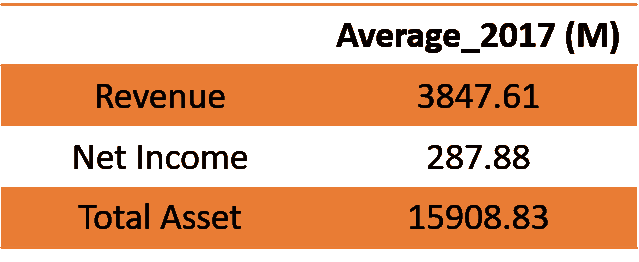

此外，我用简单的代码块绘制了从 1988 年到 2017 年这三个指标的趋势。

```
df2 = df.groupby('fyear').agg({'revt':'mean', 'ni':'mean', 'at':'mean'})plt.figure(figsize=(10,8))
plt.plot(df2['revt'], linestyle = 'solid')
plt.plot(df2['ni'], linestyle = 'dashed')
plt.plot(df2['at'], linestyle = 'dashdot')
plt.legend(df2.columns.values.tolist())
plt.title('Trend for Revenue, Net Income & Total Asset 1988-2017')
plt.show()
```

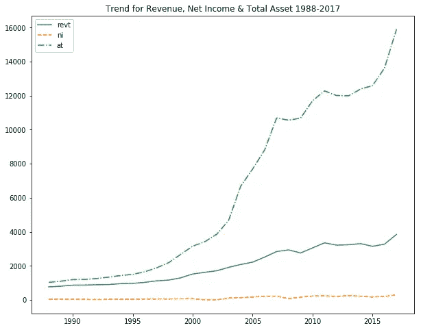

从上面的图像中，我们可以看出，与收入和净收入相比，总资产的平均值大幅增加。对于整个行业来说，财政的资产数量正在增长。这是否意味着某种操纵？(暂时不知道)。至于净收入，其平均值多年来没有太大变化。也许这意味着净收入的质量或计算方式使其更难操纵。我将更进一步，并在稍后揭示这些工具的不同应用的更多细节。

# C.盈余管理的间接证据

接下来，我计算了每个公司从 t 年到 t-1 年的每股收益(EPS)和资产回报率(ROA)的变化，并进一步在-0.1 和+0.1 的范围内绘制成直方图。这张图表可以给我们一个可能的盈余管理的更间接的暗示。

我使用 group by 和 shift 函数来创建滞后年度的 EPS 和 ROA。

```
df3 = df
df3['previous_eps'] = df3.sort_values(['fyear']).groupby('gvkey')['epspi'].shift()
df3['eps_change'] = df3.epspi - df3.previous_eps
```

我用 Matplotlib 创建了两个相似的图表。

```
plt.style.use('seaborn-white')
plt.figure(figsize = [15,6])
plt.hist(df4_eps, bins=20, align = 'left')
plt.plot((0,0),(0,8000),'r--')
plt.title('EPS Change Distirbution')
```

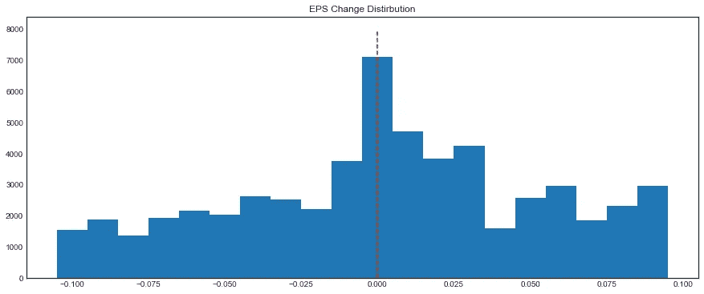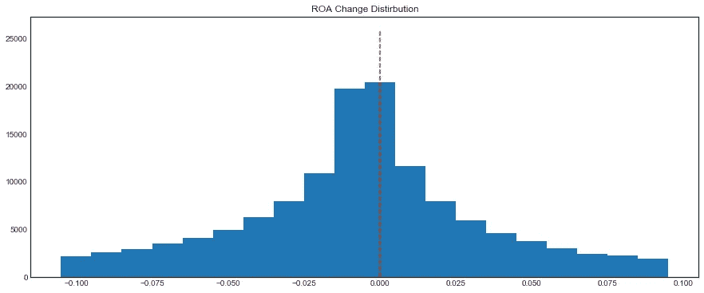

图表显示，在数据集中的所有公司中，每股收益的分布比净资产收益率的分布更不对称。此外，我们还观察到，对于每股收益，正数的频率略大于零，这意味着每年，公司的每股收益往往比前一年表现更好。

这种差异有几个原因。盈余管理可能是一个原因，其他原因如经理更加努力工作也是可能的。

通常，EPS 是利益相关者和市场更关心的指标。它比 ROA 更明显地反映了经理的表现。此外，可以通过回购或向市场释放更多股票来操纵或控制每股收益。这可能是两个关键指标图形对称性差异的原因。

变成单个公司范围，也可以让我们一窥盈余操纵的证据。我可以对某个公司的数据进行子集化，就像上面那样画出对称图，观察异常。

# D.本福特定律

本福德定律，也称为首位数定律，是关于许多现实生活中的数字数据集中前导数字的频率分布的观察结果(引自维基百科)。对于一大组数据或列值，本福德定律告诉我们，第一个数字的出现遵循一些规则和概率。因此，如果计数/频率的结果与本福特定律有一些偏差，则存在更高的操纵可能性。

按照老师的指示，我将工具从 Python 切换到 benford.analysis 软件包可以轻松计算列的第一位和第二位。我用**收入**、**经营现金流**和**总资产**作为观测值。

```
revenue_bf <- data.frame(benford(abs(df$revt), number.of.digits = 1, sign = 'positive', discrete = TRUE, round = 3)$bfd)[,c("digits","data.dist", "benford.dist")]colnames(revenue_bf) <- c('Digit', 'Sample_Revenue', 'Benford_Distribution')ggplot(data = revenue_bf, aes(x = as.factor(Digit), y =Benford_Distribution)) +
  geom_bar(stat='identity') + 
  geom_line(aes(Digit, Sample_Revenue, col = 'Sample_Revenue'), linetype = 1) + 
  geom_point(aes(Digit, Sample_Revenue), size = 4, col = 'red')+
  ggtitle('Theoretical Distribution v.s. Sample Revenue Distribution - 1st Digits ')
```

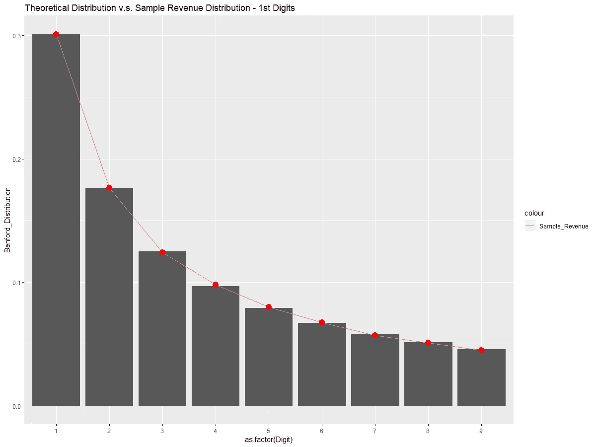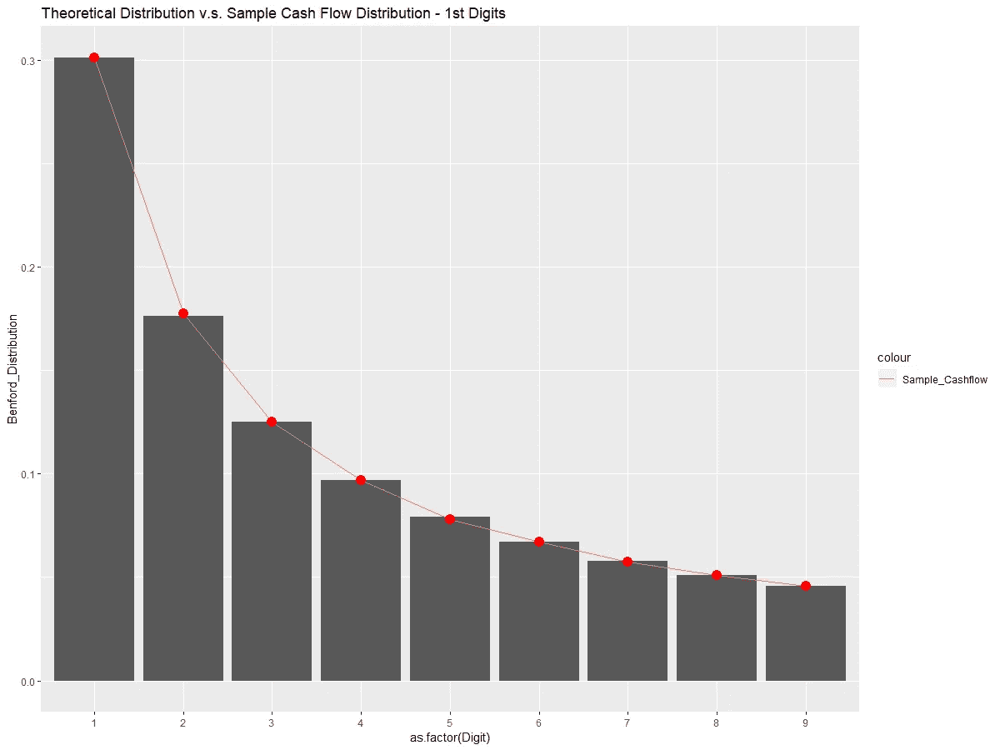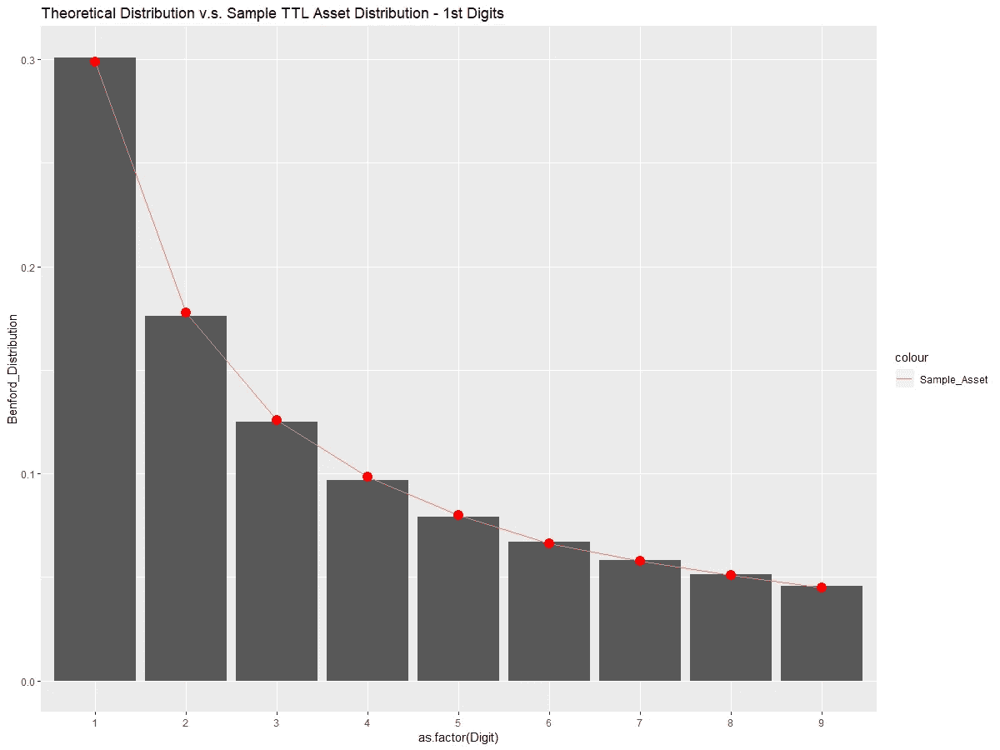

从上面的三张图中，我们可以看到三列中第一位数字的理论分布和样本分布。视觉上，没有那么巨大的差别。

我决定利用卡方检验来看看理论分布和样本分布之间是否真的没有显著性差异。结果如下。

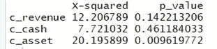

从 p 值来看，经营性现金流并不重要也就不足为奇了。然而，根据测试，收入不会偏离太多，这超出了我的预期，这表明在第一位数操纵的可能性很低。对于资产而言，当其 p 值较低且显著时，其第一位数被操纵的概率较高。还记得一年中的资产图表吗？它的平均值增长了很多。从本福德定律中，我进一步证实了操纵资产的可能性高于所有公司。

在查看第一个数字后，每个特定列的第二个数字也值得调查。与第一个数字略有不同，第二个数字包含数字零，这改变了每个数字的分布百分比。三个指标的结果如下所示。

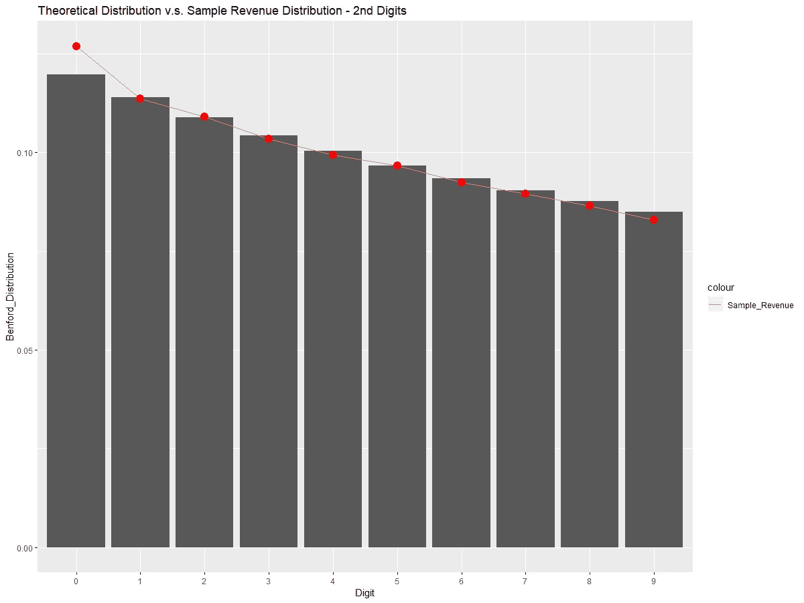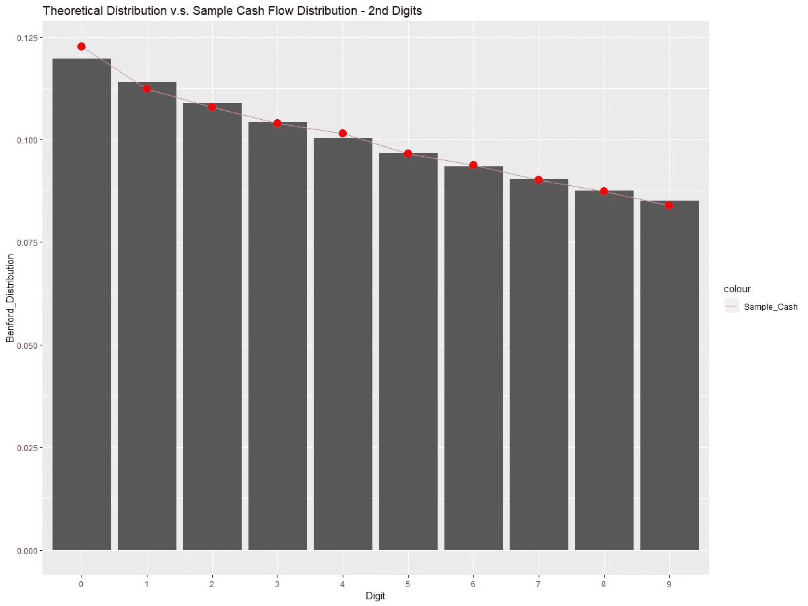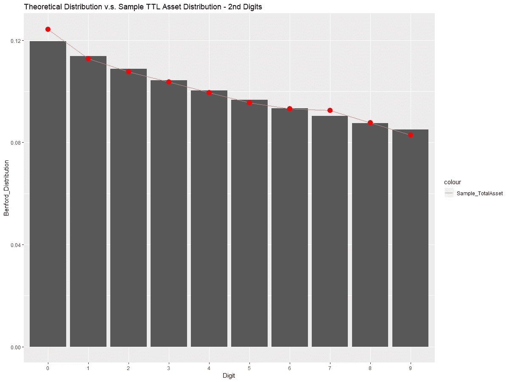

从上面的三张图中可以明显看出，样本收入、现金流和资产中零的出现频率高于理论上的本福特分布。一种可能的解释是，当公司计算数字时，他们可能倾向于将 9 四舍五入到 10，这导致 0 多 9 少。这可能是有意或无意的，但绝对值得更多的检查，尤其是在分析单个公司时。

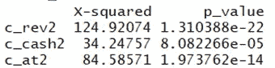

从卡方检验来看，所有三个指标的 p 值都非常显著。在所有的收入中，最重要的一项是，这可能意味着经理们倾向于做一些把戏，如收入四舍五入，以获得更好的数字表现。

# E.全权应计模型

讲师告诉我们，证券交易委员会使用自主应计模型来筛选公司的不当盈余管理。公式如下:

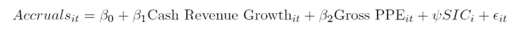

在这个 OLS 模型中，应计项目是净收入减去经营现金流。除了 SIC 之外的所有变量都来自上一年的数据。因此，简单地说，OLS 模型试图测试以前的业绩指标对今年应计项目的预测能力。SIC 是行业分类器，这意味着对于不同的行业，可能有不同的组和不同水平的估计，可能授予不同的应计项目。

因此，使用面板数据回归来运行整个数据集是一个好主意。代码如下。

```
fixed_effect.accrual <- plm(accrual ~ cash_revenue + ppe + sic, data= accrual_df, index = c('sic'), model = 'within')
```

拟合直线后，模型的真正目标是找到残差的绝对值。对此的解释是，如果一个公司，与同行业的其他公司相比，有更高的残差绝对值。其收益更偏离行业标准，具有更高的操纵可能性。

```
accrual_df$residual <- fixed_effect.accrual$residuals
accrual_df$residual <- abs(accrual_df$residual)
```

我将在下一篇文章中展示 Amgen 公司的流程。

# F.经营现金流和应计模型

该模型还使用 OLS 预测能力，使用应计项目和上一年的经营现金流来预测下一年的经营现金流。公式如下:

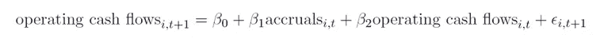

我决定对数据集中的每一行进行回归拟合。代码是这样的。我们得到拟合回归的总结。

```
df$accurals = df$ni - df$oancfdf2 <- df[,c('gvkey','fyear','oancf')]
df3 <- mutate(df2, fyear = fyear - 1) %>%
  rename(., next_oancf = oancf)
df <- left_join(df, df3, by = c('gvkey',"fyear"))oc_reg <- lm(df$next_oancf ~ df$accurals + df$oancf)
summary(oc_reg)
```

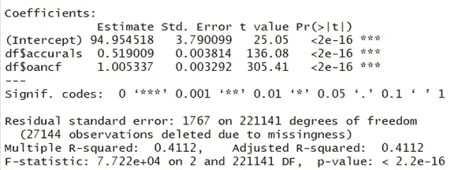

综上所述，应计项目和前期现金流量的 p 值显著，这意味着两者都与下一年的经营现金流量高度相关，并且与目标变量正相关。

之后，导师让我们把数据分成两组，2002 年之前和之后。因此，我在两组数据上运行相同的模型，并得到两个拟合的 OLS 模型的摘要。

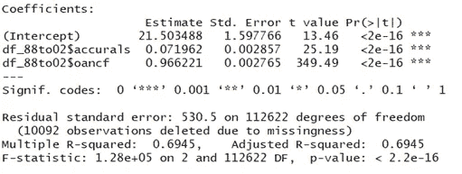

1988–2002 Operating cash flow model

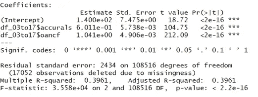

2003–2017 Operating cash flow model

从上面的总结中，我们可以从 r-squared 和估计中看出，模型的预测能力在 2002 年之前更为显著。这种差异的经济真相可能是，随着 2002 年后对应计项目或经营性现金流的更多操纵，该模型的预测能力从那时起就被扭曲了。

有了这个模型，它也有助于发现单个公司操纵现金流。策略是将数据分成相等的时间范围，并观察每个时间段的预测能力，以检测可能的盈余管理。在我的下一篇文章中，我也将再次讨论这个问题。

# 结论

在这篇文章中，我尽力阐述了我在课堂上学到的工具，并展示了将这些工具应用于整体数据的过程。这是一个真正具有挑战性的过程，但通过重新审视数据集和这些模型，我开始意识到进一步研究的深度。在不久的将来，我肯定会继续我的欺诈和利润操纵之旅。

*   特别感谢我的财务会计课的老师，他给了我一个鼓舞人心的夏天。
*   所有代码都可以在[我的 Github](https://github.com/yunhanfeng/Tools_for_Detecting_Earning_Manipulation_and_Fraud) 中找到。请随时给我一些反馈。

```
If you like the article, feel free to give me 5+ claps
If you want to read more articles like this, give me 10+ claps
If you want to read articles with different topics, give me 15+ claps and leave the comment hereThank for the reading
```