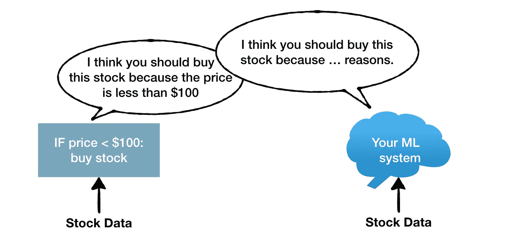
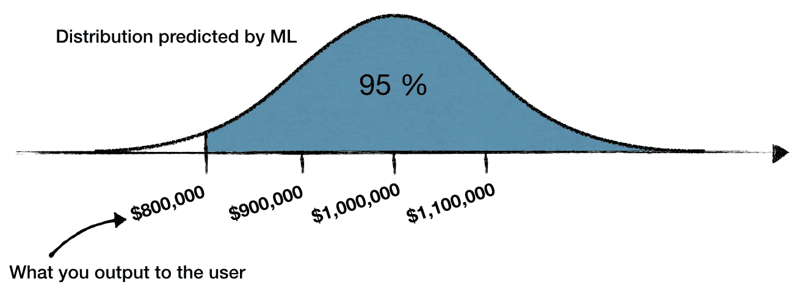
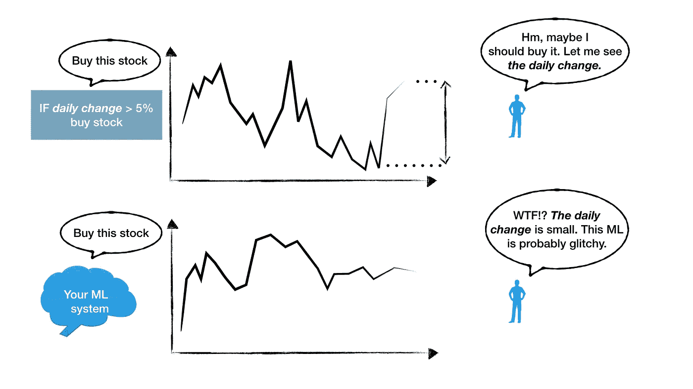

# 机器学习的用户体验

> 原文：<https://towardsdatascience.com/user-experience-with-machine-learning-3bcb90fa88a0?source=collection_archive---------5----------------------->

众所周知，机器学习在可解释性方面存在困难，或者更确切地说，是缺乏可解释性。如果您的用户必须处理数字输出，就像在销售、交易或市场营销中使用的系统一样，这是一个问题。如果用户对 ML 输出的解释是错误的，那么实际的度量标准就无关紧要了，你最终会得到糟糕的用户体验。如果您尝试将用户从旧的透明算法切换到 ML，问题甚至会更大——不满意的用户可能会试图反对切换到 ML。此外，尽管听起来有些反直觉，但用户的数学能力可能会对你不利，因为最有经验的用户会给你最大的阻力。

在这里，我概述了当您开始将系统切换到 ML 时，克服用户推回的方法。坦率地说，这些想法中的大多数可以应用于任何黑盒系统，而不仅仅是 ML。其中一些与前景理论有关，这在一本很棒的书《T2 思考，快与慢》中有描述。

# 变速杆

*一些司机喜欢手动档而不是自动档，仅仅是因为他们喜欢控制的感觉。*

假设旧系统实现了一个简单易懂的算法，用户可能会选择永远保留它，只是因为他们喜欢清晰和可控的感觉。你的 ML 模型将缺乏对它如何得出特定结果的可解释性，甚至最简单的算法，如基于阈值的 if-condition，在用户眼中也可能胜过 ML。

来自有经验的用户的反推甚至更强，因为他们已经掌握了多个临时变通办法，补偿了简单算法的低复杂性。变通方法的一个例子是:“如果价格低于 100 美元，但周差价小于 2%，那么不要买股票”。他们越有经验，就越看不到 ML 的附加值。

有两种方法，你可以尝试用变速杆。强调当这些权宜的解决方法严重失败时的场景。此外，如果没有其他事情，尝试将你的新 ML 模型与旧算法并行推出，以吸引两种受众——喜欢手动挡的用户和喜欢自动变速器的用户。

# 概率不是直观的

您可能认为增加输出的可信度会使它更容易理解。例如，ML 输出不是说“购买 APPL 股票”，而是说“以 80%的信心购买 APPL 股票”。可惜概率不是直观的。例如，与 5%和 0%相比，65%比 60%好多少？大家一致认为，把某人的胜算从 0%提高到 5%，比 60%→65%更让人印象深刻。

我们倾向于给 0%→5%的增长赋予不成比例的显著性，这被称为*可能性效应*。类似地，我们倾向于给 95%→100%的增长赋予不成比例的巨大意义——确定性效应*。*

## 例子

假设我们有一个 ML 系统，它会对你是否应该购买股票期权提出建议。它提出了两个建议:

> 购买股票期权 A，有 95%的机会获得 100 万美元
> 购买股票期权 B，有 100%的机会获得 91 万美元

大多数人会规避风险，选择 B，因为*确定性效应*，尽管第一笔交易的数学预期更好。

现在假设您的 ML 系统输出另一对推荐:

> 购买股票期权 C，有 5%的机会获得 100，000 美元
> 购买股票期权 D，有 100%的机会获得 5，100 美元

大多数人会冒险选择 C，再次无视数学期望。用户的偏见也会根据他们认为自己目前是处于赢还是输的情况而发生巨大变化，这可以用[的四重模式](https://en.wikipedia.org/wiki/Prospect_theory)来描述。

如果你在你的系统的输出中包括概率，你可能最终会被用户以他们自己的方式重新解释你的 ML 系统的输出，这取决于他们的个人因素。

解决方案之一是完全避免输出概率。例如，假设您的系统预测购买股票期权 A 将获得 1，000，000 美元的回报，其中 100，000 美元是标准差。您可以降低置信度，向用户推荐“购买股票期权 A 以获得 800，000 美元”，这里您忽略了这个推荐有 95%的置信度——2 个标准差。在某种程度上，你不是将评估概率的任务委托给用户，而是自己做决定。好处是用户之间对输出的解释不会有太大的不同。明显的缺点是，你要为自己打电话负责。

# 控制点

如果用户花时间思考系统的输出，那么[参考点](https://en.wikipedia.org/wiki/Prospect_theory)可能会出现在你面前。参考点是用户用来比较系统输出的东西。它可能是一些以前的历史数据，一些在过去发生的值得纪念的案例，或者一些他们用来最初测量输出的简单测量。

假设你的旧的简单算法根据股票价格的每日变化给出建议，例如，如果每日变化大于 5%，那么它建议买入。如果你的用户已经使用这个老算法很长时间了，那么他们可能已经开发了一个参考点——价格的每日变化。每次看到股票推荐，他们做的第一件事就是查看价格的每日变化。

你的新机器学习模型可能比旧算法更复杂，因为它可能能够挑选出与价格每日变化无关的其他信号。一旦你向用户提供的推荐没有显著的日常变化，用户可能会认为它们有问题而丢弃它们，你的系统将失去可信度。

了解用户是否有参考点以及参考点是什么非常重要。最好的方法是坐在用户旁边，让他们像平常一样使用你的系统。然后问关键问题:“当你开始查看系统的输出时，你做的第一件事是什么？”。答案很可能是参考点。

# 分三步走的计划

识别和处理变速杆可以让你照顾那些断然反对切换到 ML 的用户，独立于其质量。在用户界面中避免概率会让你摆脱大范围的人类偏见。有时最好自己打个电话，隐藏信心估计。参考点可能对你的 ML 模型有偏见，识别它将帮助你确保用户对你的 ML 系统有一个公正的评价。

照顾好这三个方面将会大大减少用户反对机器学习的机会。