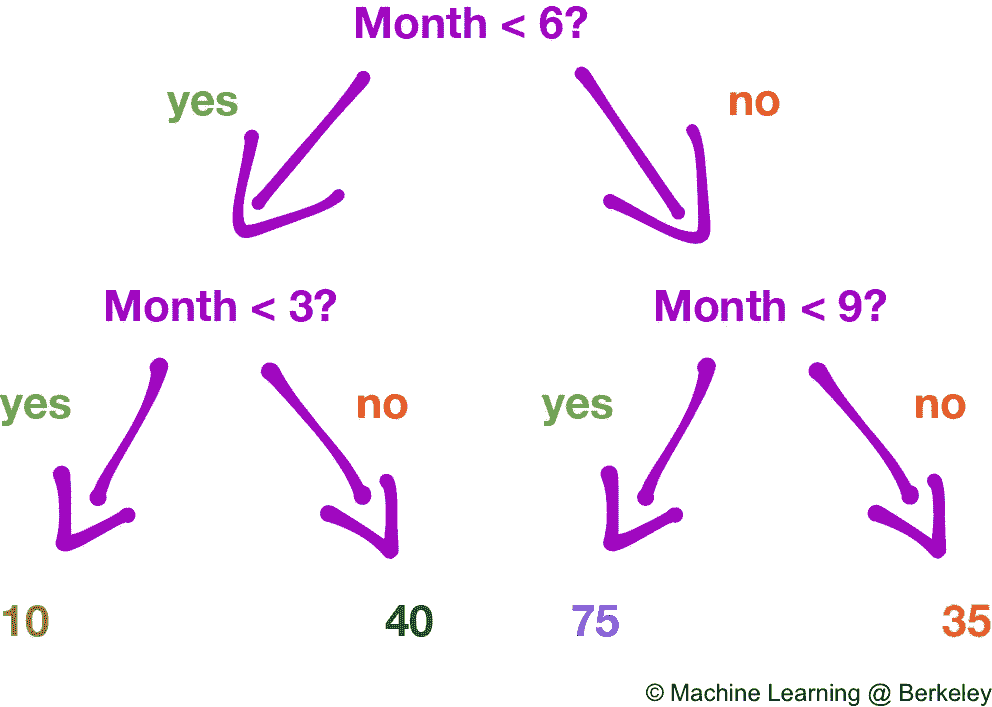
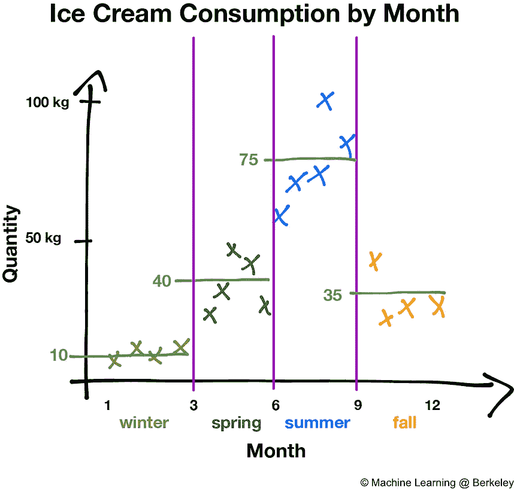
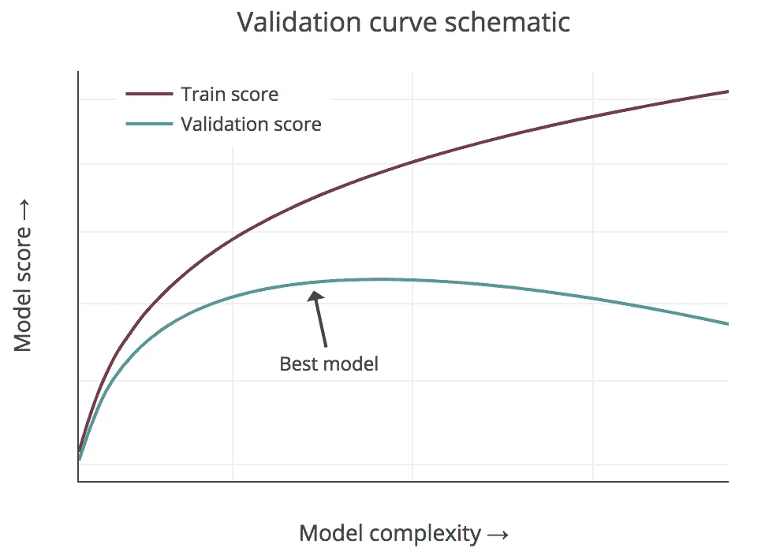
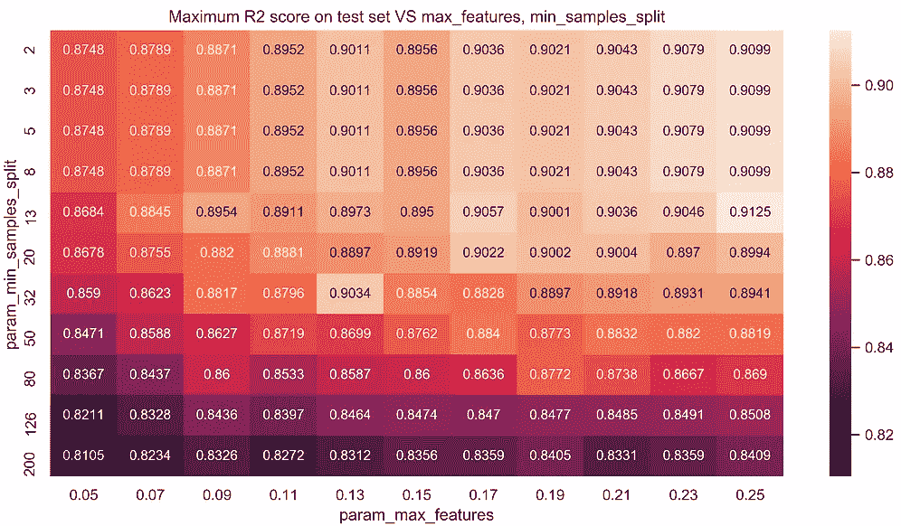
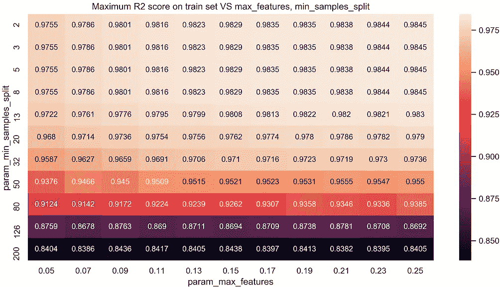
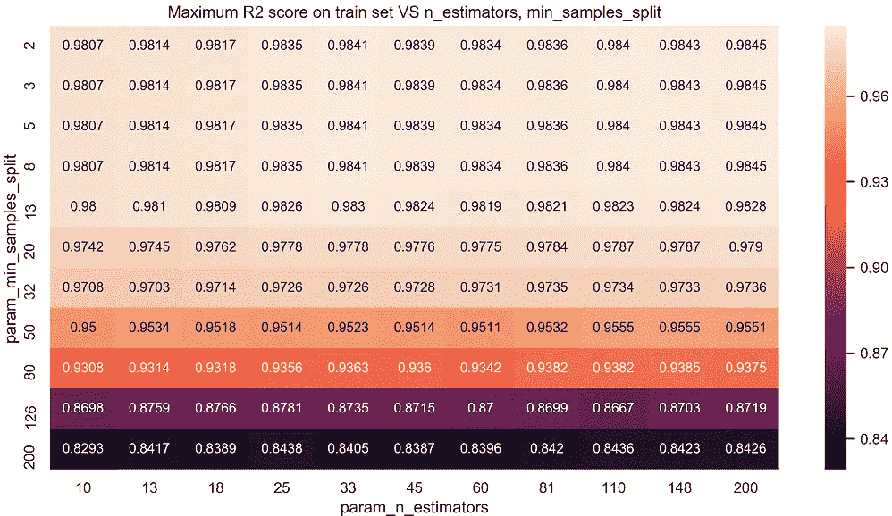
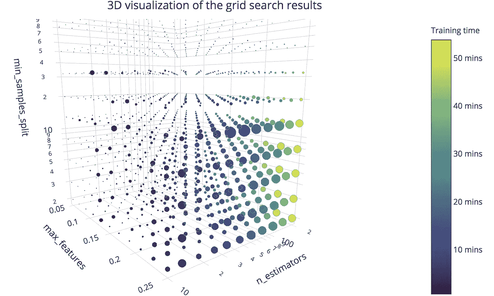

# 使用 3D 可视化来调整 ML 模型中的超参数

> 原文：<https://towardsdatascience.com/using-3d-visualizations-to-tune-hyperparameters-of-ml-models-with-python-ba2885eab2e9?source=collection_archive---------3----------------------->

这篇文章的大部分是交互式可视化，你可以在上面悬停、缩放和移动。在电脑上阅读比在手机上阅读更好，但手机上的横向模式至少会让你比纵向模式更好地看到情节。

想象一下，你正试图为 [Kaggle 的
Rossmann 商店销售](https://www.kaggle.com/c/rossmann-store-sales)竞争开发一个解决方案。你已经做了大量的功能工程，并创造了大量的新变量，这可能有助于你更好地预测未来的销售。

您创建了一个随机森林，并试图找到其最佳超参数。大概有 1000 多种你想要评估的组合。您可以运行[随机搜索](http://scikit-learn.org/stable/modules/generated/sklearn.model_selection.RandomizedSearchCV)来分析其中的一个子样本，或者运行[网格搜索](http://scikit-learn.org/stable/modules/generated/sklearn.model_selection.GridSearchCV)来探索整个参数网格。

Some of the parameters are evenly spaced on a log scale. You can do that with np.logspace

你做了后者，现在有了一些数据。使用 rf_gridsearch.best_params_ 可以获得在测试集上产生最佳结果的 3 个参数(max_features: 0.25，min_samples_split: 13，n_estimators: 45)。但是，如果你想在三维空间中可视化所有被训练的随机森林的表现呢？

## 等等，这些流行语是什么意思？

[**决策树**](https://en.wikipedia.org/wiki/Decision_tree_learning) 是一种受监督的机器学习算法，它给定一个数据集，将其递归地划分为具有彼此更相似的目标变量的子集。给定一些带有用于训练它的自变量的新数据，它可以预测因变量。

A decision tree used for regression. Credit: [this great post from UC Berkeley](https://ml.berkeley.edu/blog/2017/12/26/tutorial-5/)

一个 [**随机森林**](https://en.wikipedia.org/wiki/Random_forest) (从现在开始的 RF)是一个决策树的集合，这些决策树是在全部训练数据的子集上训练的，并且使用特征的子集。这允许它们具有较少相关的个体决策树，因此它们将更好地概括且具有较少的过度拟合。它们比神经网络训练起来更快，是解决结构化数据的分类和回归问题的一个很好的快速的首次尝试。

我们可以在 RFs 中设置几个超参数。请在 scikit-learn 的文档中阅读所有相关内容。其中一些最重要的是:

*   n _ estimators:RF 中树的数量。
*   min_samples_split:将一个子集(又名节点)再分成两个子集的最小样本数。与最小样本叶和最大深度相关
*   max_features **:** 分割节点时要考虑的最大特征数(独立变量)

RF 的复杂性随着较高的 n 估计量、最大特征和较低的最小样本分割而增加。

**交叉验证**是一种用于在机器学习模型中寻找最佳超参数的技术。为了执行它，我们必须[将数据分成](http://scikit-learn.org/stable/modules/generated/sklearn.model_selection.train_test_split.html)3 个子集:一个训练集(用于训练模型)、一个验证集(优化超参数)和一个测试集(最后检查模型的性能，就像我们已经在生产中一样)。我们使用一些[分数](http://scikit-learn.org/stable/modules/model_evaluation.html)来评估模型的性能，这些分数将根据我们试图解决的问题类型(回归、分类、聚类……)而变化。

A pic is always worth 1000 words!

对于回归， [R2 (R 平方)](http://scikit-learn.org/stable/modules/generated/sklearn.metrics.r2_score.html)效果很好，是我用过的。一般来说，模型越复杂，训练集中的分数就越好。在测试集上，它也会随着模型复杂度的增加而增加，但在某个点之后，它不会增加，还会减少。我们所做的交叉验证就是试图找到那个点。

# 好了，我们走吧🔥

在我们的例子中，模型复杂度是 3 个超参数的函数。我们接下来要做的是，尝试可视化在超参数的 3D 网格中找到最佳模型的位置，以及所有组合的表现。请注意，在图中，我使用了词语*测试集*和*测试分数*，但我指的是*验证。*

## 第一:2D 热图

作为一种快速的方法，我们可以用可能的不同参数对绘制热图，以查看在测试和训练集中实现最大 R2 的区域。这可以通过几行代码来完成:

R2 scores for the test sets

R2 scores for the training sets

但是这样做我们仍然只能看到结果的一小部分。为了看到所有这些(并且比热图更清晰)，我们需要创建 3D 可视化。

## 散点 3D

使用 [Plotly](http://plotly.com) 我们可以创建各种各样的漂亮的交互式可视化。首先，让我们创建一个 3D 散点图，其中点的大小与训练时间成比例，颜色与测试集中的 R2 分数成比例。

See this in fullscreen mode [here](https://plot.ly/~xoelop/147.embed)

很好，但我们还是看不到太多。我们可以说 max_features 越大，min_samples_split 越小，测试分数就越大，但是很难悬停在 3D 散点图中间的点上。

这样做的代码对于 Medium 来说太长了，但是你可以在这里看到所有的内容

## 更好:添加滑块

我们有 3 个独立变量，这 3 个参数是我们要优化的。更直观的方法是保持其中一个变量的值不变，绘制测试 R2 分数与其他两个变量的 3D 表面。
这更接近我们习惯看到的 1D 验证曲线，如果我们添加一个滑块来移动第三个变量，我们可以有效地看到与之前的图相同的信息，但以更清晰的方式

Fullscreen mode [here](https://plot.ly/~xoelop/137.embed).

或者，如果您更喜欢 3D 散点图，以便您可以看到每个单独的点，这就是。点数的大小与训练时间成比例，颜色与 R2 分数成比例。

[Fullscreen](https://plot.ly/~xoelop/139.embed)

## 最后但同样重要的是…

How the size of the bubbles will be after scaling it.

有一种方法可以显示第一个 3D 散点图，显示所有的点，但使测试分数最高的点比其他点大得多，这样我们就可以专注于它们。这是通过将平均测试分数除以其最大值，并以一种特殊的方式进行缩放来获得我们想要的大小。

最后，如果我们这样做，这就是情节的样子。重要的几点现在看得更清楚了:

This is an image. To see the interactive plot go [here](https://plot.ly/~xoelop/151.embed)

如果我们想更进一步，优化 4 个超参数，我们可以将第 4 个维度作为滑块添加到该图中，就像前面的例子一样，并且能够通过 4 个维度有效地可视化数据。想不到！

## **鳍**

点击查看 Python 笔记本中创建这个[的代码](https://github.com/xoelop/Medium-posts/blob/master/3d%20cross%20validation/ML%206%20-%20Gridsearch%20visulizations%20.ipynb)

玩得开心！