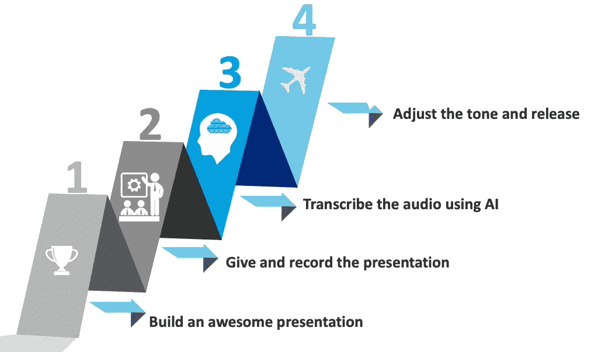
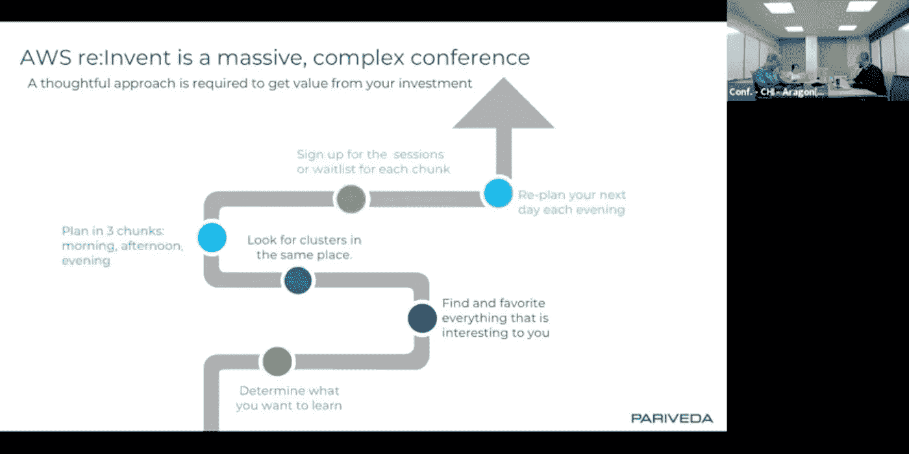
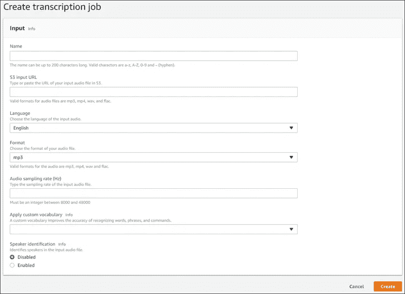
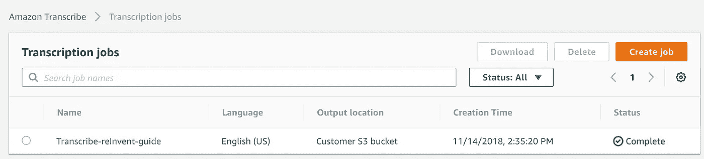

# 使用人工智能转录从你已经给出的演示文稿中创建博客文章

> 原文：<https://towardsdatascience.com/using-ai-transcription-to-build-blog-posts-form-the-presentations-you-already-give-a4cf9faf9aef?source=collection_archive---------25----------------------->

在我作为技术顾问的工作中，我最终要向我的公司 [Pariveda](https://www.parivedasolutions.com/) 的客户、合作伙伴和其他人做很多介绍。我一直在努力寻找更有效地传播知识的方法。科技让这变得容易多了。有了现代的会议软件，你可以很容易地记录你正在向别人演示的东西。在过去的一年左右，我一直采取“记录一切”的方法。如果录音很糟糕，或者我说了不该说的话，我可以删除录音，但如果录音很棒，我可以用它来分享 PowerPoint 演示文稿无法捕捉的深度。

在今年 AWS re:invent 的筹备阶段，我花了很多时间与客户一起工作，帮助他们计划他们的一周，使用我整理的快速卡片来记录我的提示&技巧。我在网上搜索，看看是否还有人提供同样的建议，结果一无所获。我觉得这是一个写博客来填补空白的好机会。然而，我是一个非常慢的作家，所以我不想从零开始。

AI 来救援了！随着 AWS 的最新进展，我可以在几分钟内获得录制的演示文稿的转录，并且只需支付[1 美元即可获得 40 多分钟的转录(在免费的 60 分钟/月之后)。我一直在想如何应用人工智能来帮助我提高效率，所以我采用了以下流程来构建这个帖子:](https://aws.amazon.com/transcribe/pricing/)

1.  制作一个演示文稿，亲自进行演示
2.  录制演示文稿(即使用网络会议软件或手机)
3.  使用人工智能转录工具，如[亚马逊转录](https://aws.amazon.com/transcribe/)从画外音获取文本
4.  将文本复制到博客平台，添加幻灯片中的图像，并调整语气，使其看起来像一篇博客文章



4 steps to build a blog post from what you’re already presenting

使用这种方法，我能够在大约一个小时内完成一篇 1300 字的中型文章。在这篇文章中，我将向你介绍我使用的过程，并讨论一些我认为可以使用的其他方法。让我们开始吧…

## 第一步:制作一份精彩的演示文稿，

在这种情况下，我在当天早些时候向 Pariveda 的观众演示了最大化 re:invent，演示被录制下来，以便其他人可以在以后观看。我确信几乎每个阅读这篇文章的人都做了很棒的演讲，所以我把这部分留给你。你不一定需要幻灯片演示，白板会议或只是一个讲座就可以了。

## 第二步:向某人演示，并记录演示过程

有很多方法可以记录你这些天说的话。如果您正在演示幻灯片，您可以使用公司的软件轻松启动网络会议，并以这种方式录制音频和幻灯片。Pariveda 使用 zoom 进行网络会议(旁白:Zoom 是高质量视频会议的一个很好的工具)，所以我使用 Zoom 来获得这个记录。如果你只是想要音频，你可以使用 iOS 上的内置语音备忘录应用程序或 Android 上的 Google Keep 来录制音频。关键是要获得音频记录文件，这样你就可以转录它，使你的职位。



Recording of the presentation video from Zoom

## **步骤 3:使用人工智能转录演示文稿**

所有三大云供应商都提供人工智能转录服务( [AWS](https://aws.amazon.com/transcribe/) 、[微软](https://cloud.google.com/speech-to-text/)、[谷歌](https://cloud.google.com/speech-to-text/))，许多其他供应商也是如此。在这种情况下，我正在为 AWS re:invent 做一个帖子，所以使用 AWS Transcribe 才有意义。为了使用这项服务，我首先将录音上传到 S3。接下来，我创建了一个指向该文件的新转录作业(您可以在控制台中完成)。



Creating a new Transcription Job

这将创建一个需要几分钟运行的作业。



Job completes after a few minutes

当作业完成时，您将能够找到并下载输出文本。在这种情况下，它运行了大约 6 分钟，并将结果文件放入我们的 S3 桶中。

```
{
    "TranscriptionJob": {
        ...,
        "Transcript": {
            **"TranscriptFileUri": "**[**https://s3.amazonaws.com/transcriptions-pariveda-chicago/Transcribe-reInvent-guide.json**](https://s3.amazonaws.com/transcriptions-pariveda-chicago/Transcribe-reInvent-guide.json)**"**
        },
        "CreationTime": "2018-11-14T20:35:20.418Z",
        "CompletionTime": "2018-11-14T20:41:02.633Z",
        "Settings": {
            "ChannelIdentification": false
        }
    }
}
```

当您下载 JSON 时，它会在一个名为**“抄本”**的字段中提供实际文本，该字段可用于从音频中捕获原始文本。

```
{
  "jobName": "Transcribe-reInvent-guide",
  "accountId": "336843223770",
  "results": {
    "transcripts": [
      {
        "transcript": "Sure. All right, so the biggest thing that i found last year reinvent was because **he's** grown so big..."
      }
    ],
    "items": [
      {
        "start_time": "1.954",
        "end_time": "2.304",
        "alternatives": [
          {
            "confidence": "0.5040",
            "content": "Sure"
          }
        ]
...
```

在浏览文档的过程中，您可能会发现一些特定的错误，这些错误基于您的讲话模式是非常常见的。我喜欢将内容复制到文本编辑器中，使用查找-替换来纠正单词，而不是那些人工智能一贯误认为这些单词的单词。此外，您还可以在此时向文本中添加段落。这也是更新你的自定义词汇的好机会。

> 另一个旁注:通过这个过程我学到的一件事是，我在我的谈话中经常使用“所以”这个词。我现在正在努力减少这种使用。

## 步骤 4:将文本复制到博客平台，添加幻灯片中的图像，并调整语气，使其看起来像一篇博客文章

现在您已经有了文本形式的演示文稿的编辑版本。你所需要做的就是添加一些图片，使帖子更有趣，并调整流程，使其感觉更像是书面的而不是口头的。这花了我大约一个小时，但这是我第一次经历这个过程。我希望接下来的几个会花更少的时间。

如果你有兴趣分享如何加快将有思想的内容发布到网上的技巧，请直接联系我或在评论中联系我。