# 使用 API 和 Google Sheets 评估梦幻英超的前景

> 原文：<https://towardsdatascience.com/using-apis-google-sheets-to-assess-fantasy-premier-league-prospects-1a2598c4b25e?source=collection_archive---------0----------------------->

我是一名狂热的 FPL 球员，使用梦幻英超的 API 和 Google Sheets 来轻松分析球员数据。

你可能会因为不得不依赖他人的零星数据(例如，进入[梦幻英超 Reddit](https://www.reddit.com/r/FantasyPL/) )而感到沮丧，并想要做自己的分析。

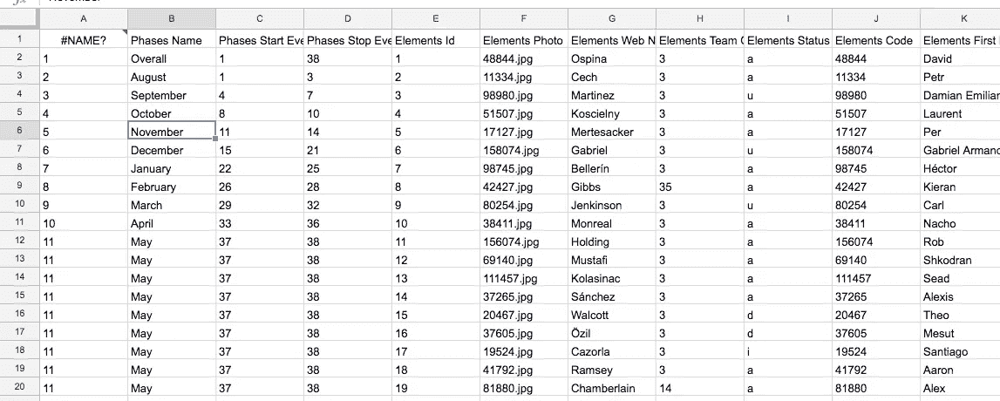

使用 Fantasy Premier League API 和一个电子表格工具，我们可以将球员数据加载到 Google Sheet 中，并过滤不同的选秀权、总得分、每场比赛的得分等等。

电子表格的伟大之处在于，几乎每个人都知道如何在某种程度上使用它们，而且通过对 Google Sheets 进行一些非常小的修改，就可以很容易地使用 Google Sheets 的 API，所以如果你不是技术人员，这不是问题。

在这之后的下一步将是真正地将数据加载到像 [Tableau Public](https://public.tableau.com/en-us/s/) 这样的工具中以评估数据，但现在我们只想得到数据并开始使用它。如果对 Tableau 公共教程有足够的需求，我也会写的，所以如果你想看的话，请鼓掌或者回应。

# 设置 Google 工作表

我们要做的第一件事是在[谷歌工作表](https://www.google.com/sheets/about/)中设置一个新的工作表。重要的是使用 Google Sheets 而不是 Excel 之类的东西，因为 Google Sheets 是可脚本化的，通常更擅长处理与互联网交互的东西，如 API。Excel 并不是真正为一个必须与互联网对话的世界而设计的。

我在这里使用了几个技术术语，因此，对于外行来说，API 是从数据库访问数据的常用方法(我们将使用的 API 被 FPL 用来生成他们的球员信息屏幕), JSON 是输出这些数据的标准格式。技术专家喜欢 JSON，因为它受到许多不同平台的支持，它有简单的标记，格式化后很容易阅读和查询。

但是 Google Sheets 不支持现成的 API 或 JSON，所以我们需要添加一个脚本，该脚本可以获取 API URL (Fantasy Premier League 的数据提要)并以 JSON 格式返回我们想要的数据，然后将其格式化为我们可以阅读的电子表格。

做到这一点真的很容易。

转到工具>脚本编辑器

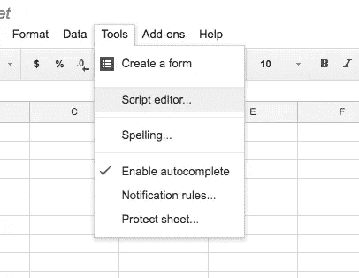

然后，您应该会看到这样的屏幕:

首先，您希望删除 Code.gs 文件中的所有内容，因此它是空白的:

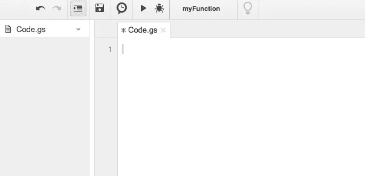

接下来，我们将重命名该文件:

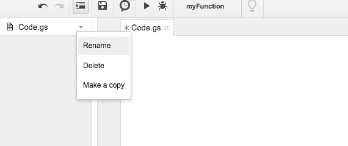

我们将把它命名为“ImportJSON”

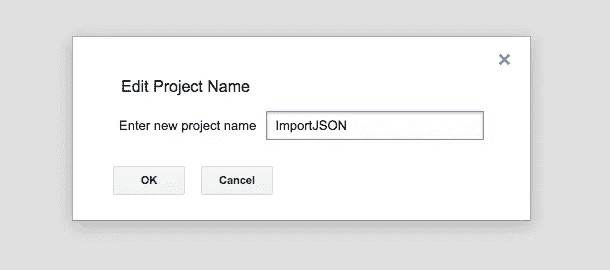

您的屏幕现在应该看起来像这样:

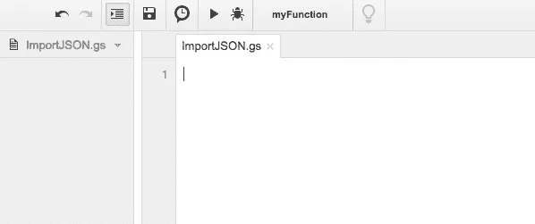

接下来，转到这个 [pastebin，](https://pastebin.com/ai1dc2QN)将所有内容复制到那里，并粘贴到 ImportJSON 文件中。屏幕现在应该看起来像这样:

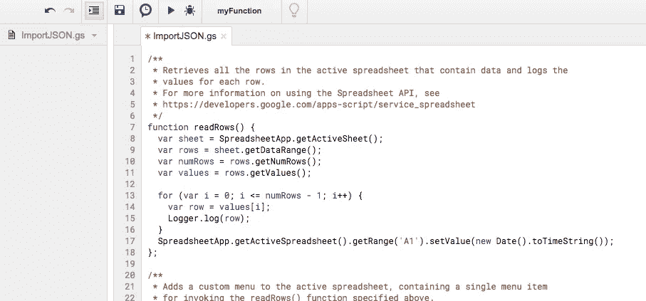

我们已经完成了这里的工作，是时候回到我们的 Google 工作表并加载数据了。点击文件>保存保存我们的功能。

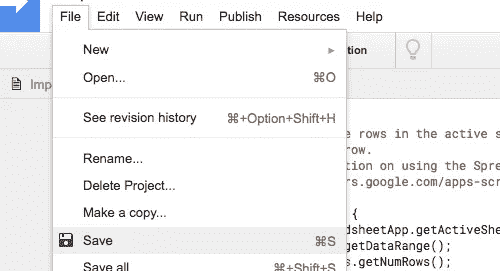

我们刚才所做的实际上是向这个 Google Sheet 添加一个名为 ImportJSON 的新函数，我们现在就要使用它。

返回到您的电子表格，它应该在另一个选项卡中打开。

# 使用 ImportJSON 提取梦幻英超 API 数据

现在，我们将使用刚刚创建的函数从梦幻英超 API 中提取数据。

在电子表格中，将此公式复制到单元格 A1:

> = ImportJSON("【https://fantasy.premierleague.com/drf/bootstrap-static】T2")

重要提示:在敲 enter 之前，复制最后一个引号(在 bootstrap-static 之后)，替换掉 *https://* 之前的花引号，否则会出错。Medium 自动将引号转换为花引号，Google Sheets 无法识别。

*注意:这个 API 没有被 FPL 官方记录或以任何方式支持，并且它会随着 FPL 网站的更新而不断变化。然而，这个特殊的 API 端点在过去的几个赛季中工作得很好，所以希望这个继续工作。如果我发现它坏了，我会进来更新这个帖子。*

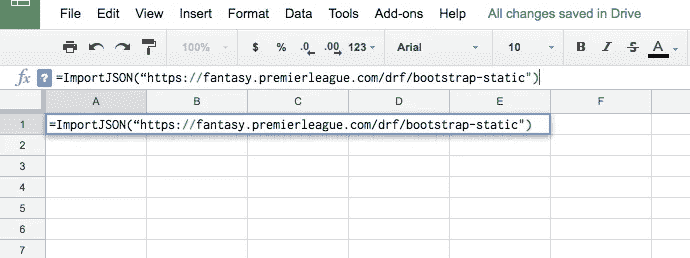

修改后的公式应该如下所示:

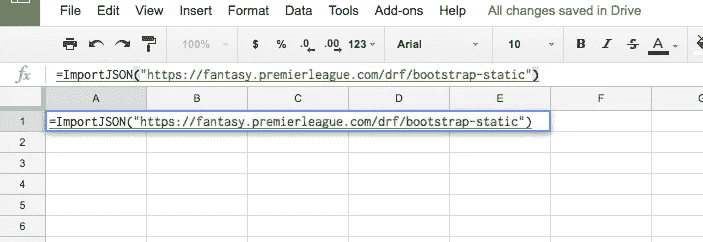

你会知道它起作用了，因为配方已经变绿了。然后你应该按回车键。如果你看到的不是上面的内容(比如公式后面的引号)，Google Sheets 已经破坏了这个公式，你应该再次粘贴这个公式。

然后，电子表格应该在第一个单元格中显示“正在加载”。不要担心当你悬停在上面时它会显示错误，Google Sheets 只是有一个想法:

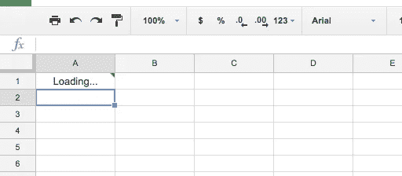

如果一切正常，数据应该已经加载到您的电子表格中，并按照每个玩家的数字 ID 进行排序。每个球员在整个赛季中都持有自己的 ID，这对于与其他数据源进行交叉引用非常有用，所以我不会删除“元素 ID”字段。

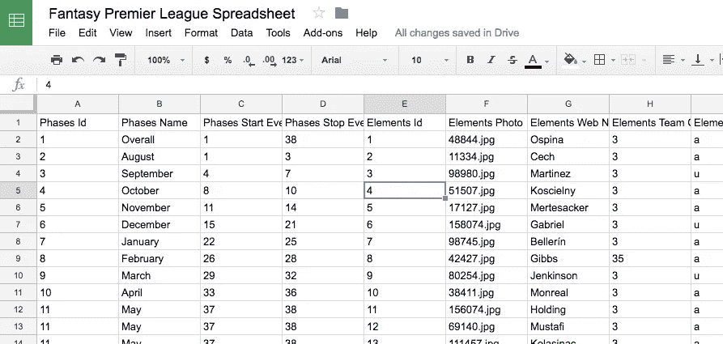

# Google Sheets / Excel 中的数据分析

我们就快成功了，但是在我们开始分析数据之前，还有几个重要的步骤要做。

我们需要做的第一件事是将这些数据复制到一个静态电子表格中。尽管 ImportJSON 非常擅长从 API 中提取数据，但它往往在排序和过滤数据方面有问题。

ImportJSON 还有一个令人讨厌的倾向，那就是不断尝试刷新数据，这使得处理起来很麻烦，并且很快就会达到 API 的极限。使用静态文档更容易(也更快),因为它不会不断地试图下拉数据。

旁白:不过，有帮助的是，你可以在每个游戏周之后回到谷歌电子表格(把这个放在你的谷歌硬盘里),它会提取最新的数据。我不建议在比赛周进行的时候这么做，因为我们都知道 FPL 在比赛周进行的时候似乎有问题。

不过，获得静态工作表的最简单方法是简单地将数据下载为 Excel 电子表格。这样，您就可以利用 Excel 的优势——处理相对大量的数据而不会出现延迟。

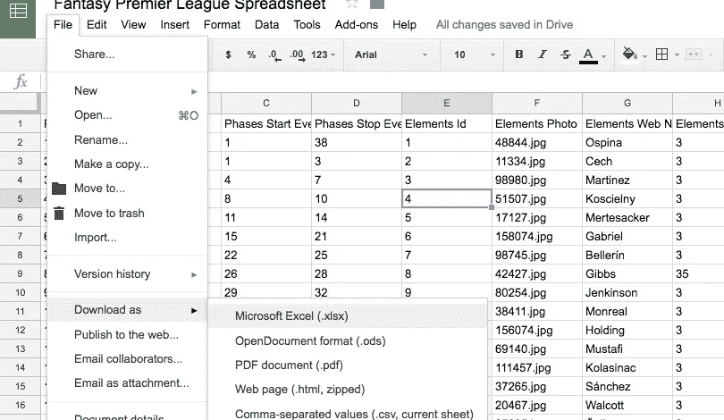

如果您确实想使用 Google Sheets 中的数据，您可以随时将数据导入到 Google Sheets 中，就像我在这里所做的那样。

您将会看到单元格 A1 现在是#NAME，因为这个新的电子表格不知道“=ImportJSON”是什么(保存时函数不会被转移)。请随意将该字段更改为 ID。

字段标题应该是不言自明的(包括一些看起来非常有趣的标题)，一旦你进入静态电子表格，你可以随意修改。

您的第一步应该是设置一些过滤器:

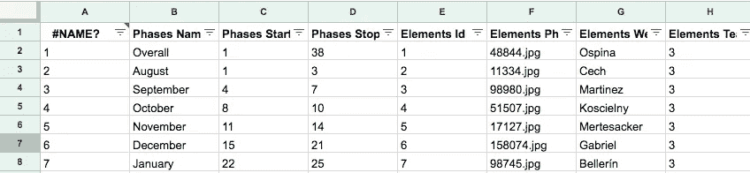

*   按每场比赛的点数排序(AJ 列)
*   将列 AJ 转换为数字列(格式>数字)，并过滤掉小于 4 的行。
*   将“元素选择方式”转换为数字列(“格式”>“数字”)，并过滤到 15%以下(如果您正在寻找差异)。

你也可以在不同的栏目中进行计算来制定你自己的标准，设置条件格式来突出显示符合特定条件的绿色玩家，或者过滤列表来匹配你在 FPL 的观察列表。

除了 Excel/Google Sheets，下一步将是使用 Tableau 之类的工具来绘制数据图表。这方面的一些高级示例如下:

*   [梦幻英超数据分析](https://public.tableau.com/en-us/s/gallery/fantasy-premier-league-player-analysis)
*   [FPL 球员表现与成本对比图](https://public.tableau.com/profile/mike.croom#!/vizhome/GraphofFPLPlayerPerformanceagainstcost/AveragePoints?publish=yes)

就是这样。现在你有数据知道是否真的值得在卡尔弗特-勒温身上下注，或者是否真的值得在阿圭罗身上花额外的钱而不是耶稣。

现在去看看剩下的列，过滤/排序到你的心满意足。即使您没有在 Tableau 中创建图表，这也会给您一些数据，帮助您研究您的选择。