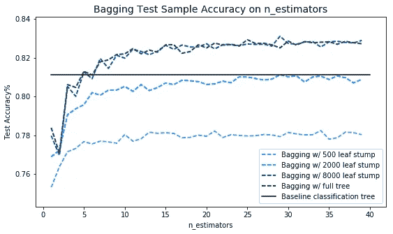
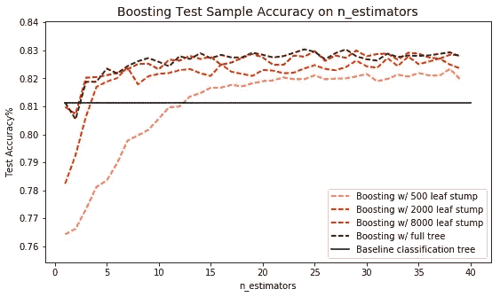
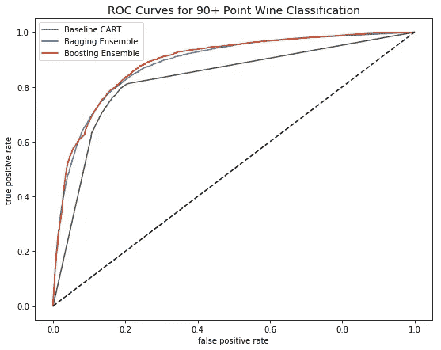

# 使用 Bagging 和 Boosting 提高分类树的准确性

> 原文：<https://towardsdatascience.com/using-bagging-and-boosting-to-improve-classification-tree-accuracy-6d3bb6c95e5b?source=collection_archive---------1----------------------->

Bagging 和 boosting 是两种可以用来提高分类回归树(CART)准确性的技术。在这篇文章中，我将从我在早期文章中开发的单个 90+点葡萄酒分类树开始，并将其分类精度与两个新的袋装和提升算法进行比较。

因为打包和提升都依赖于分类器的集合，所以它们被称为“集成”方法。这两种分类器本身都不是一种分类器，而是通过聚合其他几个子分类器的预测来产生分类预测。

我将再次使用从《葡萄酒爱好者》杂志上搜集的葡萄酒评论数据，该杂志可在 https://www.kaggle.com/zynicide/wine-reviews 的[免费获得。它包含了 150，000 种葡萄酒的分数，以及每瓶葡萄酒的价格、酒厂、产区、品种&等信息。对于这个项目，我将只使用美国种植的葡萄酒。](https://www.kaggle.com/zynicide/wine-reviews)

首先，我将使用 sci-kit learn 的 DecisionTreeClassifier 对我的 70%的数据(训练样本)训练一个单一的分类树，无需超参数调整。这将作为未来合奏表演的基准:

# 制袋材料

Bagging 使用了一种简单的方法，这种方法在统计分析中反复出现——通过合并多个估计值来改进一个估计值。Bagging 使用训练数据的引导抽样构建 n 个分类树，然后组合它们的预测以产生最终的元预测。

Sci-kit learn 实现的 bagging ensemble 是 BaggingClassifier，它接受一个基础分类器的名称作为输入，bagging ensemble 将复制该分类器 n 次。BaggingClassifier 的主要调整超参数是在元预测中创建和聚合的基本分类器的数量。

以下是 bagging 系综在改变(1)基本估计量的数量和(2)基本估计量的大小(叶子的数量)时的表现:

如上所示，bagging 预测精度对基础估计量的限制很敏感。在实践中，限制基估计量的大小在 bagging 系综中是多余的，因为 bootstrap 抽样获得了与限制基树相似的结果。

另一个关键的观察是，bagging 集成的性能不会超过单一 CART 基准，直到估计器的数量超过阈值水平。单树装袋集成的准确性比单个 CART 差很多——如果你问这是怎么回事，可以用 bootstrap 采样来解释:由于 bootstrap，单树装袋集成中的基本估计器不会使用 100%的训练数据。Bootstrap 采样是一种可调参数的 bagging 分类器。

# 助推

为了展示 boosting 方法的功效，我将使用 AdaBoost，它在 sci-kit learn 中实现为 AdaBoostClassifier。这种类型的集成创建了 n 个基本估计量，就像 bagging 一样，但它是以迭代的方式实现的，如下所示:

1.  使用正常方法训练基于估计值#1
2.  观察基础估计器#1 错误预测的训练数据样本，并为这些样本创建权重 D>1.0
3.  训练基础估计量#2，在计算同质性基尼/熵度量时将权重 D 应用于样本
4.  重复 n 次。

通过这种方式，增强创建了连续的基本分类器，这些基本分类器被告知对来自训练数据的误分类样本给予更大的重视。像 bagging 一样，来自*所有*提升基本分类器的结果被聚集以产生元预测。

与 bagging 相比，boosting 集成的精度随着基估计量的增加而迅速提高。此外，在我的示例中，无论基础估计器是终止的树桩还是完整的树，提升集成的精度都收敛到超过估计器数量= 15+时的原始 CART 精度。

Boosting 和 bagging 是两种能够从分类算法中挤出额外预测准确性的集成方法。使用任一方法时，应仔细调整超参数，以找到模型灵活性、效率和预测改进的最佳平衡。

 [## dasotelo/Wine_Bag_Boost.py

github.com](https://github.com/dasotelo/Python_Projects/blob/master/Wine_Bag_Boost.py)