# 利用双向生成对抗网络估算市场风险管理的风险价值

> 原文：<https://towardsdatascience.com/using-bidirectional-generative-adversarial-networks-to-estimate-value-at-risk-for-market-risk-c3dffbbde8dd?source=collection_archive---------3----------------------->

我们将探索双向生成对抗网络(甘比)在市场风险管理中的应用:评估投资组合风险度量，如风险价值(VaR)。生成敌对网络(GAN)允许我们隐式地最大化复杂分布的可能性，从而允许我们从这种分布中生成样本——这里的关键点是隐式最大似然估计原理，由此我们不指定这种复杂分布被参数化为什么。在许多其他金融服务用例中，处理可能来自复杂分布的高维数据是市场风险管理的一个关键方面。GAN，特别是本文中的，将允许我们处理潜在的复杂金融服务数据，这样我们就不必显式指定分布，如多维高斯分布。

## 市场风险管理:风险价值(VaR)

风险值是对投资组合风险的一种度量。例如， *-5%* 的 *1%* VaR 意味着有 1%的机会获得低于 *-5%* 的投资组合回报。把它想象成投资组合回报分布的(较低)百分位或分位数，也就是说，我们关心的是尾部风险——损失非常大的投资组合价值的小概率。如此巨大的损失是由我们自己的资金来弥补的，也就是说，与其他人的资金相比，资本是一种昂贵的资金来源，也就是债务。因此，风险值的估计和类似的市场风险管理措施告知银行和保险公司他们需要持有的资本水平，以便缓冲意外的经济下滑——市场风险。

出于我们的目的，让我们从从 Yahoo 获取 5 只股票的数据集开始。股票有苹果、谷歌、微软、英特尔和 Box。我们对 2016 年的数据使用每日频率。我们使用股票的每日收盘价来计算连续复利:

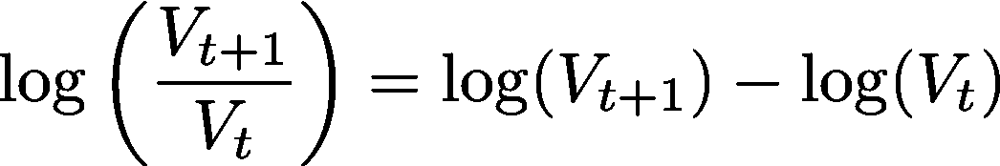

让我们假设我们投资组合中的 5 种资产的权重相等。基于这个投资组合权重的假设，我们可以计算投资组合的回报。

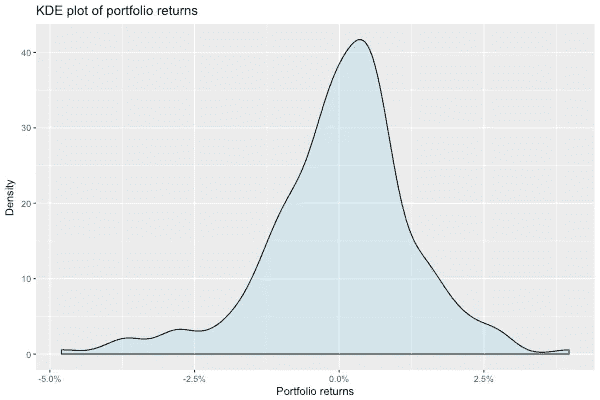

让我们估计预期收益向量、波动向量、相关性和方差-协方差矩阵。方差-协方差矩阵从估计的波动率向量和相关矩阵中恢复:

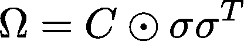

在哪里

是哈达玛的产品。

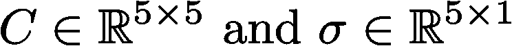

投资组合波动估计为:

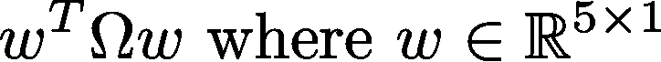

我们考虑市场风险管理中使用的 3 种主要方法，特别是对 VaR 的估计。请注意，有多种不同的方法来估计风险值和其他更一致的风险衡量指标，如条件风险价值(CVaR)，但是我们只考虑少数几个主要的方法。

## VaR:方差-协方差法

第一种是方差-协方差方法，使用估计的投资组合波动率

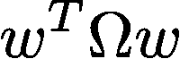

在高斯假设下估计 VaR。让我们假设我们试图估算 1%的 VaR:这意味着有 1%的概率获得低于 VaR 值的投资组合回报。使用方差-协方差方法，计算如下:

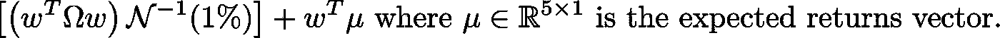

## VaR:历史模拟法

第二种方法是一种非参数方法，我们从历史数据中进行替换采样，以估计投资组合的回报分布。1%的风险值只是这个投资组合回报分布样本的适当分位数。

## VaR:蒙特卡罗方法

第三种方法是使用上述方法从多维高斯分布进行蒙特卡罗采样

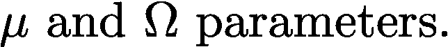

最后，1%的 VaR 仅仅是这个投资组合回报分布样本的适当分位数。

## VaR:估计值

对于我们的股票回报数据，来自上述 3 种银行常用的市场风险管理方法的 1% VaR 估计值如下:

> 方差-协方差:-2.87%历史模拟:-3.65%
> 蒙特卡洛模拟:-2.63%

现在我们转向使用双向生成敌对网络(甘比)进行 VaR 市场风险管理。

## 双向生成对抗网络(甘比)

生成性对抗网络(GAN)的两个主要组件是生成器和鉴别器。这两个组成部分相互竞争。这样，发生器学习如何从噪声中创建真实的合成样本，即潜在空间 *z* ，而鉴别器学习如何区分真实样本和合成样本。关于甘的详细解释，请看我下面这篇文章:

甘比通过添加第三个组件扩展了 GAN:编码器，它学习从数据空间 *x* 映射到潜在空间 *z* 。发生器的目标保持不变，而鉴别器的目标被改变以在真实样本和合成样本之间进行分类，此外还在真实编码(即由编码器给出的)和合成编码(即来自潜在空间 *z* 的样本)之间进行分类。

## 发电机

假设我们事先知道潜在空间 z 的位置:

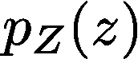

给定从这个潜在空间的抽取，生成器 *G，*深度学习器，输出合成样本。

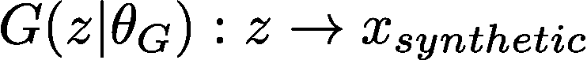

## 编码器

这可以显示为发生器的反转。给定从数据空间的抽取，深度学习器编码器 *E* 输出真实的编码。

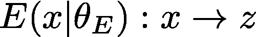

## 鉴别器

鉴别器 *D* 是一个深度学习器，目的是分类样本是真实的还是合成的，即样本是否来自真实数据分布，

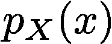

或合成数据分布。

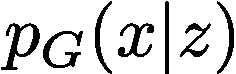

此外，它旨在对编码是否真实进行分类，

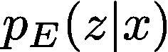

或者合成的。

让我们将鉴别器 *D* 表示如下。

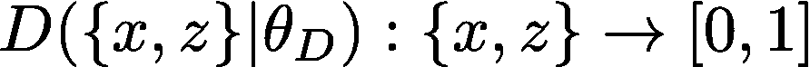

我们假设正面的例子是真实的，即，

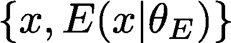

而反面例子是合成的，即，

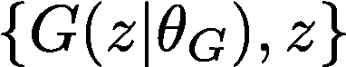

## 最佳鉴别器、编码器和发生器

类似于 GAN，甘比具有以下目标函数。

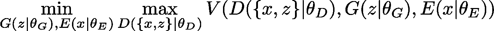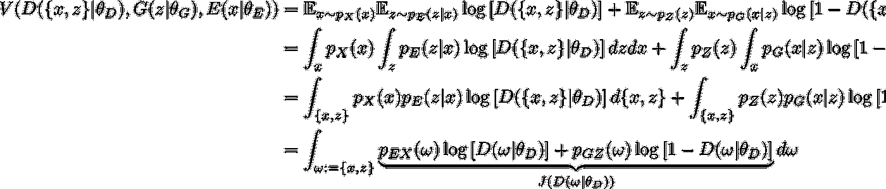

让我们仔细看看鉴别器的目标函数。

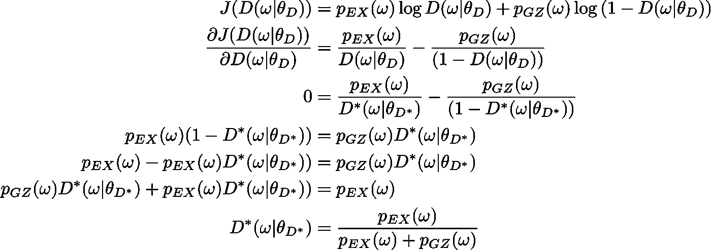

我们已经找到了给定一个生成器和一个编码器的最佳鉴别器。现在让我们关注发生器和编码器的目标函数，其本质上是最小化鉴别器的目标函数。

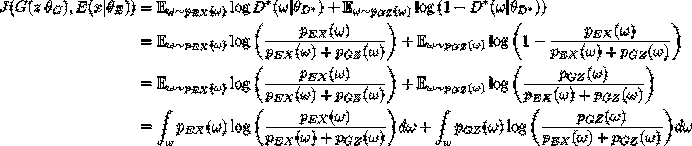

我们将注意到发生器和编码器的上述目标函数中的 kull back-lei bler(KL)偏差。

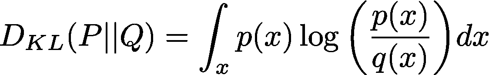

回想一下λ发散的定义。

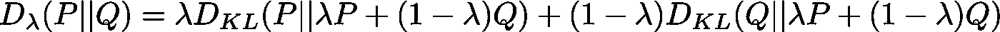

如果λ取值为 0.5，这就称为詹森-香农(JS)散度。这种发散是对称的和非负的。

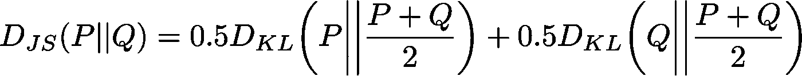

记住这一点，让我们再次看看发生器和编码器的目标函数。

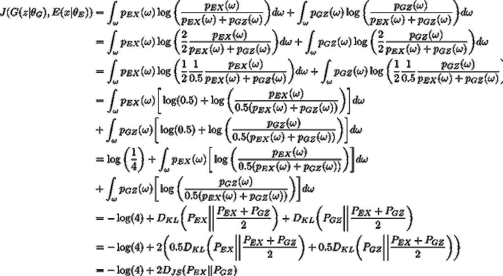

从上面的生成器和编码器的目标函数中可以清楚地看出，获得的全局最小值是 *-log(4)* ，这发生在以下条件成立时。

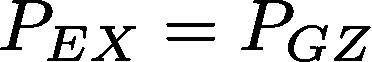

当上述保持詹森-香农发散时，即，

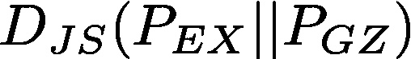

将为零。因此我们证明了最优解如下。

给定上述结果，我们可以证明最佳鉴别器将是 *0.5* 。

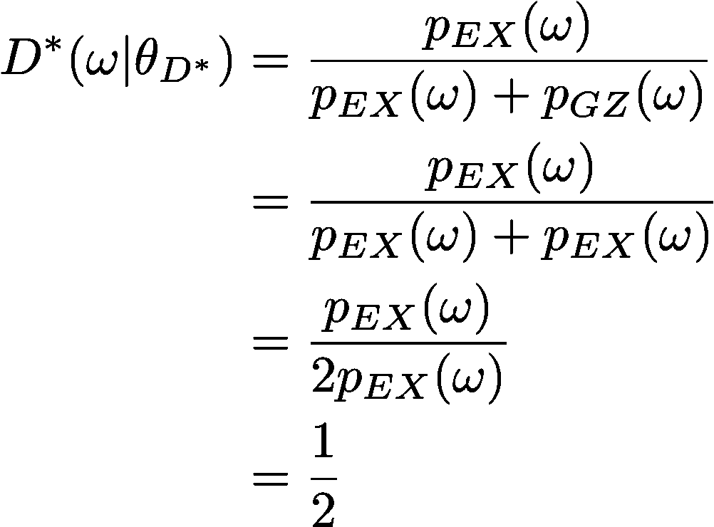

## 最佳编码器和生成器是彼此的反函数

在最优生成器和编码器中，我们可以证明生成器和编码器是彼此的反函数。回想一下前面的生成器和编码器的定义。

此时，最佳鉴别器是 *0.5* ，即鉴别器不能有效地区分真实数据和合成数据，因为合成数据是真实的。请记住，在这一点上，可能性已经被隐含地最大化，因此从合成分布中获取的任何样本都应该与从真实分布中获取的样本相似。简而言之，如果发生器、编码器和鉴别器的最优性成立，那么合成数据应该看起来与真实数据相似，或者更确切地说是相同。记住这一点，让我们稍微重写一下最佳发生器和编码器函数。

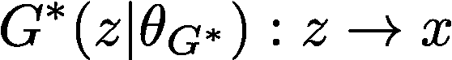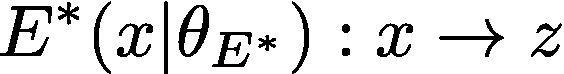

进一步回想一下，以下适用于最佳发生器和编码器。

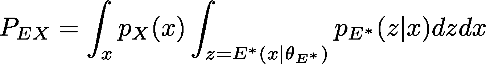

在上面请注意以下几点；还要注意，我们假设生成器不是编码器的反函数，以提供反证法。

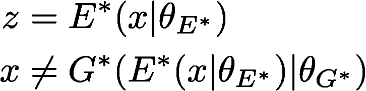

回想一下发生器和编码器最优性条件。

在上面请注意以下几点。

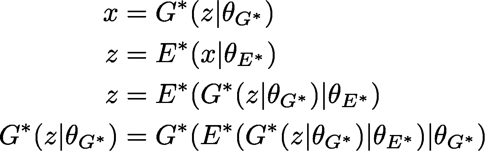

如果最优性成立，那么如下所示成立。

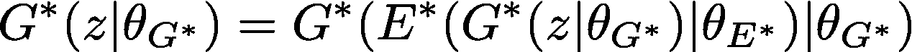

然而，由于我们假设生成器不是编码器的反函数，因此上述条件不成立，从而违反了最优性条件。

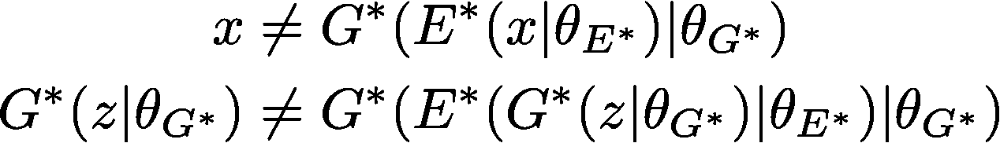

因此，我们通过矛盾证明了在生成器和编码器的最优性下，生成器是编码器的反函数。

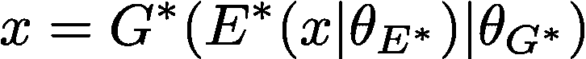

对于与发生器相反的编码器，可以显示出上述相同的论点。

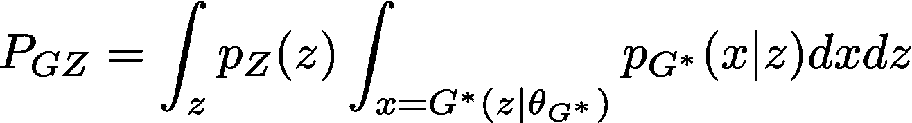

在上面请注意以下几点；还要注意，我们假设编码器不是通过矛盾提供证明的生成器的反函数。

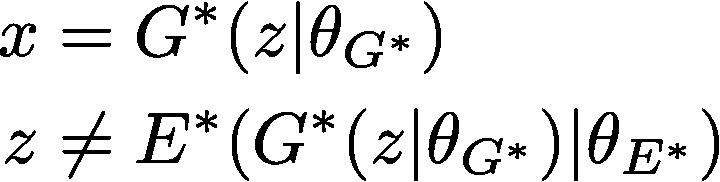

回想一下发生器和编码器最优性条件。

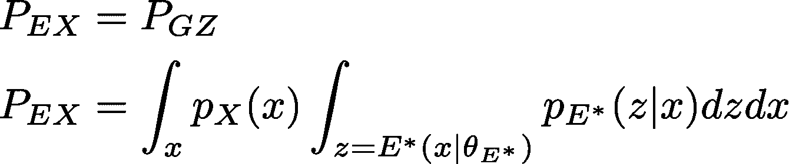

在上面请注意以下几点。

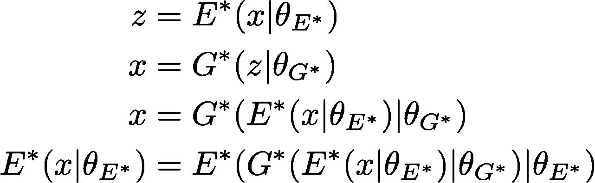

如果最优性成立，那么如下所示成立。

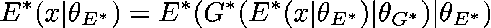

然而，由于我们假设编码器不是生成器的反函数，因此上述条件不成立，从而违反了最优性条件。

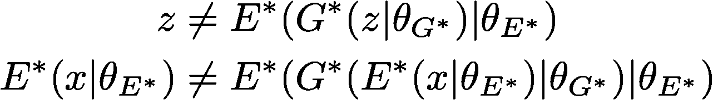

因此，我们已经通过矛盾表明，在生成器和编码器的最优性下，编码器是生成器的反函数。

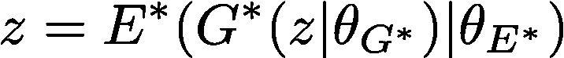

因此，我们已经通过反证法证明了最优编码器和生成器是彼此的反函数:如果它们不是彼此的反函数，那么这将违反编码器和生成器的最优条件，即，

## 甘比与自动编码器的关系

此时，在这里回顾我以前关于自动编码器的文章可能是个好主意:[https://goo.gl/qWqbbv](https://goo.gl/qWqbbv)

注意，给定一个最佳鉴别器，生成器和编码器的目标函数可以被认为是自动编码器的目标函数，其中生成器扮演解码器的角色。发生器和编码器的目标函数仅仅是最小化鉴别器的目标函数，即，我们没有明确地指定重建损失的结构，就像自动编码器那样。这种重建损失的隐式最小化是甘比的另一个优点:不需要明确定义重建损失。

让我们提醒自己生成器和编码器的目标函数。

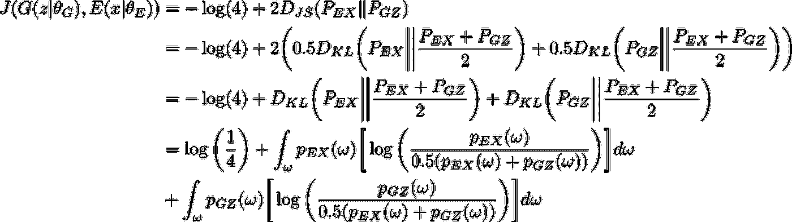

让我们来处理

首先，然后是

以类似的方式第二次。这些定义如下。

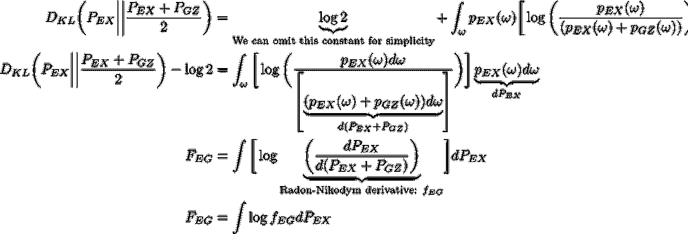

简要回忆一下 Radon-Nikodym 导数的定义:

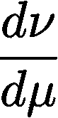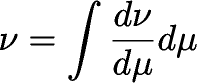

接下来就是。

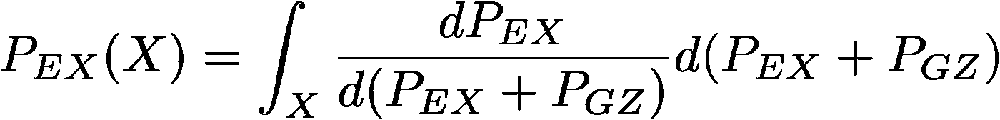

现在是第二个学期:

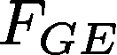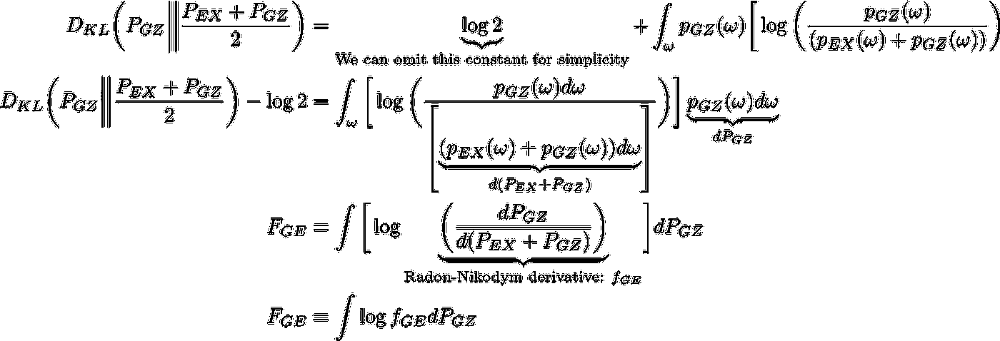

接下来就是。

还要注意。

现在我们将证明这一点

为了证明这一点，假设

因此，

随着

几乎到处都是。这意味着

定义得很好。

现在我们将证明这一点

为了证明这一点，假设

因此，

随着

几乎到处都是。这意味着

定义得很好。

这

在...的支持之外

是 *0* 。同样，在

在...的支持之外

是 *0* 。我们从前者开始。

注意，因为

这意味着

假设这个成立，我们清楚地表明

这是一个矛盾。

因此，

和

几乎无处不在

这意味着

几乎无处不在

因此

在支架上

是 *0* ，即:

在...的支持之外

是 *0* 。

这

在...的支持之外

是 *0* 。

注意，因为

这意味着

假设这个成立，我们清楚地表明

这是一个矛盾。

因此，

和

几乎无处不在

这意味着

几乎无处不在

因此

在支架上

是 *0* ，即:

在...的支持之外

是 *0* 。

因此，前面提到的 KL 偏差很可能是非零的

在这个空间中，我们展示了

让我们假设在这个地区

这一套

这意味着

和

因此，以下成立。

显然，上述内容意味着

并且与早先关于支持的定义相矛盾，即，

因此

是一个空集，因此

最后请注意，这意味着

让我们假设在这个地区

这一套

这意味着

和

因此，以下成立。

显然，上述内容意味着

并且与早先关于支持的定义相矛盾，即，

因此

是一个空集，因此

最后请注意，这意味着

我们已经清楚地表明

和

这意味着

是唯一一个

和

可能非零。

因此。

我们已经清楚地表明

因此，

我们已经清楚地表明

因此，

在上面的大量证明中，我们已经展示了甘比与自动编码器的关系。甘比可用于表示学习或自动特征工程。

在这一点上，我们已经定义了甘比，现在我们将实现它并将其用于我们前面提到的特定用例。

## 履行

我在这里做的工作是用 Python 和 R 代码在下面的 git repo 上维护的:【https://github.com/hamaadshah/market_risk_gan_keras】T4

## 结论

在我们结束这篇文章之前，让我们来看看一个未经训练的甘比的投资组合回报分布。

从上图可以清楚地看出，未经训练的甘比的样本投资组合收益分布与实际的投资组合收益分布明显不同。我们可以想象，这是可以预料的。

与经过训练的甘比形成对比:下图将清楚地显示 GAN 类型模型对于市场风险管理的价值，因为我们已经获得了这种学习的投资组合回报分布，而不必依赖于关于实际投资组合回报分布的可能不正确的假设，例如多维高斯分布。

请注意，我们也许应该使用进化算法或强化学习器来自动学习适当的 GAN 或甘比架构:也许这将是未来文章的主题。

最后，我们更新了使用不同市场风险管理方法的风险值估算表，如下所示。我们可以看到，甘比提供的风险值估计与其他市场风险管理方法提供的估计相似，如果不是完全相同的话。这为我们使用甘比进行市场风险管理提供了一个很好的健全性检查，因为它提供了相对于完善的现有市场风险管理方法的竞争结果。

> 方差-协方差:-2.87%历史模拟:-3.65%
> 蒙特卡洛模拟:-2.63%
> 
> 双向生成对抗网络:-4.42%

与我们可能拥有衍生品或其他投资组合组成部分的潜在投资组合相比，我们必须处理的 5 只股票的投资组合并不特别复杂。在一个潜在复杂的投资组合中，获得正确的投资组合回报分布是一个已经被证明可以通过深度学习解决的问题，特别是甘比。这个结果对于市场风险管理和任何其他不同的问题空间都是有用的，在这些问题空间中，我们需要从一个潜在的复杂的，也许是未知的分布中产生样本。

在我的后续文章中，我们可能会看到一个复杂的回溯测试场景，即验证甘比提供的市场风险管理 VaR 类型估计是否适用于我们尚未看到的未来投资组合回报分布，并可能使用更复杂的投资组合。

我的这篇文章的目的是清楚地表明，一个训练有素的甘比可以用于给定投资组合的市场风险管理风险值估计。

## 参考

1.古德费勒，我，本吉奥，y 和库维尔(2016)。深度学习(麻省理工出版社)。
2。Geron，A. (2017)。用 Scikit-Learn&tensor flow(O ' Reilly)动手进行机器学习。
3。金玛博士和韦林博士(2014 年)。自动编码变分贝叶斯(【https://arxiv.org/abs/1312.6114】T2)。
4。[http://scikit-learn.org/stable/#](http://scikit-learn.org/stable/#)5。[https://towards data science . com/learning-rate-schedules-and-adaptive-learning-rate-methods-for-deep-learning-2c8f 433990 D1](/learning-rate-schedules-and-adaptive-learning-rate-methods-for-deep-learning-2c8f433990d1)
6 .[https://stack overflow . com/questions/42177658/how-to-switch-back end-with-keras-from-tensor flow-to-the ano](https://stackoverflow.com/questions/42177658/how-to-switch-backend-with-keras-from-tensorflow-to-theano)
7 .[https://blog.keras.io/building-autoencoders-in-keras.html](https://blog.keras.io/building-autoencoders-in-keras.html)
8。[https://keras . io](https://keras.io)9。f . chollet(2018)。用 Python 深度学习(曼宁)。10。约翰·赫尔(2010 年)。风险管理和金融机构(皮尔逊)。
11。[https://towards data science . com/automatic-feature-engineering-using-deep-learning-and-Bayesian-inference-application-to-computer-7 B2 bb 8dc 7351](/automatic-feature-engineering-using-deep-learning-and-bayesian-inference-application-to-computer-7b2bb8dc7351)
12 .[https://towards data science . com/automatic-feature-engineering-using-generative-adversarial-networks-8e 24 B3 c 16 BF 3](/automatic-feature-engineering-using-generative-adversarial-networks-8e24b3c16bf3)
13 .Donahue，j .，krhenbüHL，p .和 Darrell，T. (2017 年)。对抗性特征学习([https://arxiv.org/pdf/1605.09782](https://arxiv.org/pdf/1605.09782))。
14。[https://github.com/eriklindernoren/Keras-GAN](https://github.com/eriklindernoren/Keras-GAN)