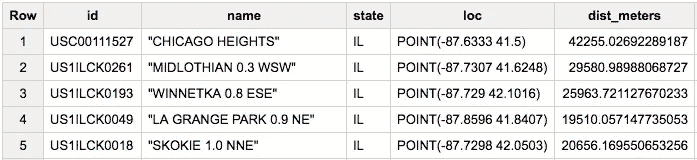
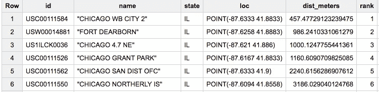
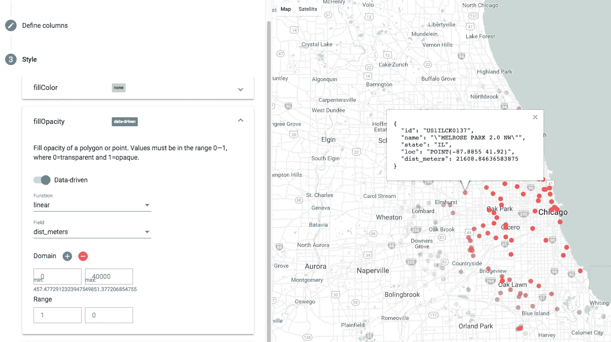
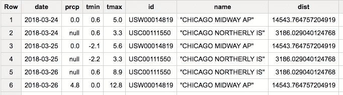
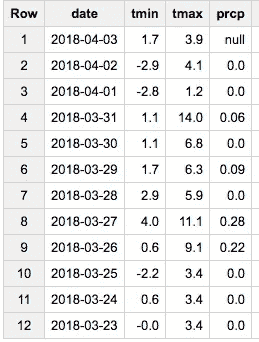
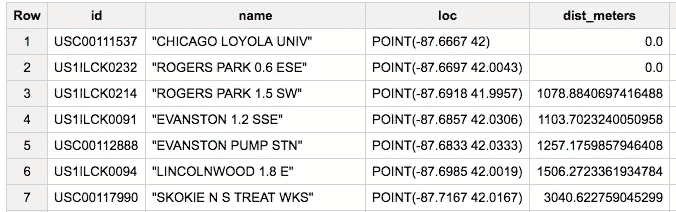

# 使用 BigQuery 的新地理空间函数来插值温度

> 原文：<https://towardsdatascience.com/using-bigquerys-new-geospatial-functions-to-interpolate-temperatures-d9363ff19446?source=collection_archive---------5----------------------->

当我写[博文](https://cloudplatform.googleblog.com/2016/09/global-historical-daily-weather-data-now-available-in-BigQuery.html)宣布来自全球历史气候网络(GHCN)的天气观测公共 BigQuery 数据集时，我展示了两个查询，一个是[在某个边界框内查找气象站](https://cloud.google.com/bigquery/public-data/noaa-ghcn#find_weather_stations_close_to_a_specific_location)，另一个是提取[某个气象站的最近天气](https://cloud.google.com/bigquery/public-data/noaa-ghcn#weather_for_the_past_two_weeks)数据。但是，查找边界框的查询使用了难看的纬度-经度限制检查，并且没有简单的方法将两个查询连接起来，以简单地从最近的气象站提取最近的气象数据(并非气象站数据集中的所有气象站现在都在运行，因此不能只使用限制)。

为什么不容易呢？因为 BigQuery 不支持地理空间功能。但是现在有了！因此，让我们将用例重写为一个单独的查询，并使它变得更好。我们不只是从最近的站获取数据。相反，我们将从附近的站点插入数据。如果您使用过 PostGIS 的 [ST_ functions](http://postgis.org/docs/reference.html#Spatial_Relationships_Measurements) ，那么 BigQuery 中的地理空间函数对您来说会很熟悉。

## 到点的距离

假设我们在纬度为(41.88，-87.63)的地方有一家比萨饼店，首先计算该点 50 公里范围内所有车站的距离:

```
#standardSQL
WITH params AS (
  SELECT ST_GeogPoint(-87.63, 41.88) AS center,
         50 AS maxn_stations,
         50 AS maxdist_km
),distance_from_center AS (
  SELECT
    id,
    name,
    state,
    ST_GeogPoint(longitude, latitude) AS loc,
    ST_Distance(ST_GeogPoint(longitude, latitude), params.center) AS dist_meters
  FROM
    `bigquery-public-data.ghcn_d.ghcnd_stations`,
    params
  WHERE ST_DWithin(ST_GeogPoint(longitude, latitude), params.center, params.maxdist_km*1000)
)SELECT * from distance_from_center
```

我设置了三个参数:中心位置、要使用的气象站的最大数量和插值的最大距离。然后，我使用 ST_Distance 计算距离，使用 ST_DWithin 过滤站点。(为什么不在 WHERE 子句中使用计算的距离？因为 DWITHIN 可以进行避免计算距离的优化，并且这样，仅针对足够近的站计算距离)。

此时的结果如下所示:



Distance of stations from our pizza joint

## 排名超过

50 公里内有 320 个车站。让我们把这个列表删减到前 50 名。我们不能使用 LIMIT，因为 LIMIT 需要硬编码的数字，而我们希望使用上面参数中的 maxn_stations。所以，有一种方法可以做到:

```
...nearest_stations AS (
  SELECT 
    *, 
    RANK() OVER (ORDER BY dist_meters ASC) AS rank
  FROM 
    distance_from_center
),nearest_nstations AS (
  SELECT 
    station.* 
  FROM 
    nearest_stations AS station, params
  WHERE 
    rank <= params.maxn_stations
)SELECT * from nearest_nstations
```

现在，结果按距离排序，并限制为 50:



Sorted by distance and limited to closest 50

## 使用 BigQuery GeoViz 可视化

我们可以用 [BigQuery mapper](https://bigquerygeoviz.appspot.com/) 来实现这一点:



Stations with opacity set by distance

## 连接表格

现在，让我们通过将上述表格与天气数据表连接起来，并通过 id 将其连接起来，来获取每个站点的最近天气数据:

```
wxobs AS (
  SELECT
    wx.date AS date,
    IF (wx.element = 'PRCP', wx.value/10, NULL) AS prcp,
    IF (wx.element = 'TMIN', wx.value/10, NULL) AS tmin,
    IF (wx.element = 'TMAX', wx.value/10, NULL) AS tmax,
    station.id AS id, 
    station.name AS name, 
    station.dist_meters AS dist
  FROM
    `bigquery-public-data.ghcn_d.ghcnd_2018` AS wx
  JOIN nearest_nstations AS station ON wx.id = station.id
  WHERE
    DATE_DIFF(CURRENT_DATE(), wx.date, DAY) < 15
),daily_wx AS (
  SELECT
    date,
    MAX(prcp) AS prcp,
    MAX(tmin) AS tmin,
    MAX(tmax) AS tmax,
    id,
    MAX(name) AS name,
    MAX(dist) AS dist
  FROM 
    wxobs
  GROUP BY
    date, id
  HAVING tmin > -100 AND tmax > -100
  ORDER BY
    date ASC
)
```

上面的奇怪之处是因为 gchnd_2018 表中的每条记录只包含一个观测值(tmin、tmax 或 prcp ),因此我们必须合并多行才能获得完整的观测值集。结果现在看起来像这样:



Daily weather from the two(!) stations with temperature data for each day

## 插入文字

现在，我们可以添加插值代码:

```
SELECT 
  date,
  ROUND(SUM(tmin/(dist*dist))/SUM(1/(dist*dist)),1) AS tmin,
  ROUND(SUM(tmax/(dist*dist))/SUM(1/(dist*dist)),1) AS tmax,
  ROUND(SUM(prcp/(dist*dist))/SUM(1/(dist*dist)),2) AS prcp
FROM 
  daily_wx
GROUP BY date
ORDER BY date desc
```

这给了我们:



Recent weather, interpolated to our pizza parlor

下面是[全查询](https://bigquery.cloud.google.com/savedquery/663413318684:ad97a1054f8c43be968858dc9883f8b4)。试试吧！

## 离多边形的距离

在上面的查询中，我计算了两点之间的距离。相反，如果您想找到邮政编码方圆 10 公里内的所有气象站，该怎么办呢？这里有一个[查询](https://bigquery.cloud.google.com/savedquery/663413318684:1346cd46943648b38d48612b03034a20)可以做到这一点:

```
#standardsql
WITH params AS (
  SELECT 60626 AS zipcode,
         10    AS maxdist_km
),zipcode AS (
   SELECT **ST_GeogFromText(WKT)** AS polygon 
   FROM `cloud-training-demos.demos.zipcode_polygon2017`, params 
   WHERE ZCTA5CE10 = params.zipcode
),stations AS (
  SELECT
    id,
    name,
    ST_GeogPoint(longitude, latitude) AS loc,
    **ST_Distance**(ST_GeogPoint(longitude, latitude), zipcode.polygon) AS dist_meters
  FROM
    `bigquery-public-data.ghcn_d.ghcnd_stations`,
    params,
    zipcode
  WHERE **ST_DWithin**(ST_GeogPoint(longitude, latitude), zipcode.polygon, params.maxdist_km*1000)
)SELECT * from stations
ORDER BY dist_meters ASC
LIMIT 100
```

需要注意的关键是，zipcodes 的 BigQuery 表包含众所周知的文本(WKT)的几何信息，所以我使用 ST_GeogFromText 来解析它。*【注意:不是将列存储为字符串，我可以将它存储为地理类型——这样，我只需解析字符串一次，而不是在每个分析函数中】*。一旦我有了多边形几何，我就可以将它传递到 ST_Distance 和 ST_DWithin 函数中，类似于我传递一个点的方式，并可视化结果:



请注意，到前两个站点的距离为零，因为它们在邮政编码范围内。其余的在邮政编码边界 10 公里以内。

尽情享受吧！