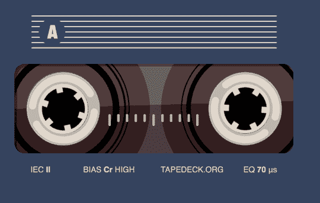
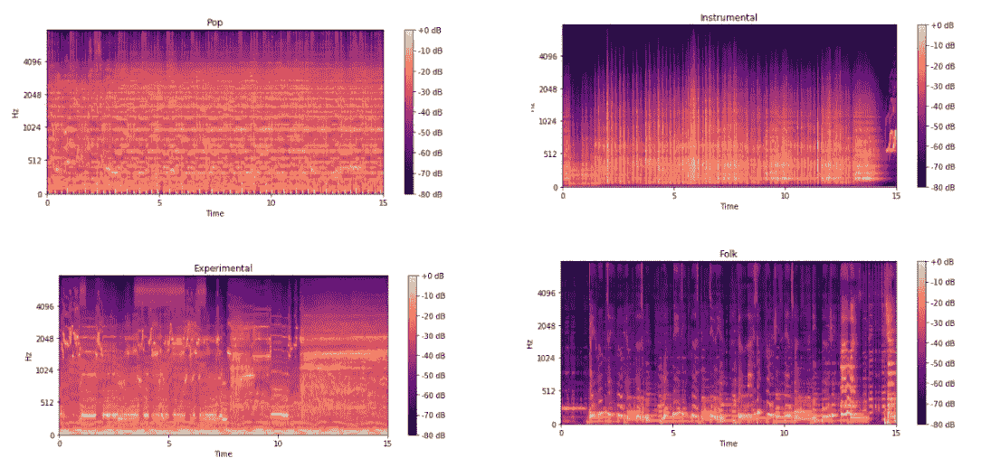
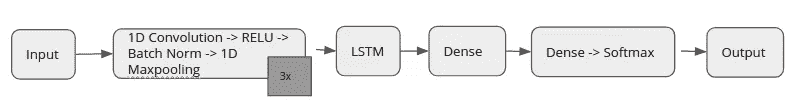
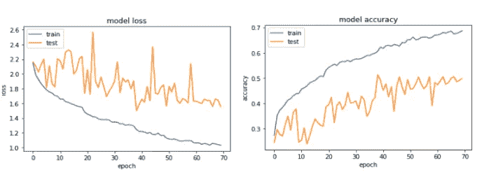
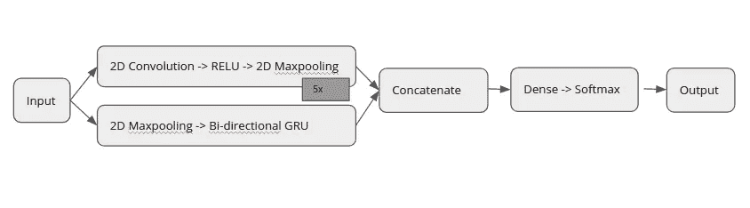
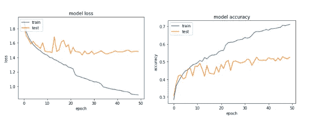
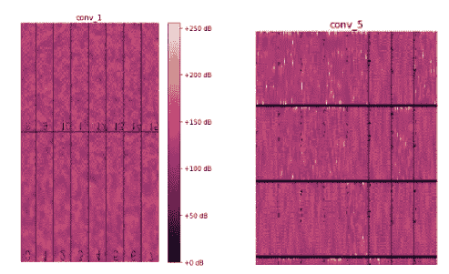

# 使用 CNN 和 RNNs 进行音乐流派识别

> 原文：<https://towardsdatascience.com/using-cnns-and-rnns-for-music-genre-recognition-2435fb2ed6af?source=collection_archive---------8----------------------->

## 用数据做很酷的事情！

音频数据正在成为机器学习的重要组成部分。我们正在使用音频与 Siri 和 Alexa 等智能代理进行交互。音频对于自动驾驶汽车也很重要，这样它们不仅可以“看到”周围的环境，还可以“听到”周围的声音。我想探索音频文件和音乐分析的深度学习技术，这似乎是一个有趣的领域，有很多有前途的研究。在这篇博客中，我研究了结合 CNN 和 RNNs 的架构，将音乐片段分为 8 种不同的类型。我也在不同的 CNN 层中可视化过滤器激活。如果你是深度学习的新手，想了解 CNN 和计算机视觉的深度学习，请查看我的博客[这里](https://medium.com/@priya.dwivedi)。

这个项目的代码可以在我的 [Github](https://github.com/priya-dwivedi/Music_Genre_Classification) 上找到。我希望这里提到的技术有更广泛的应用，而不仅仅是在音乐上。希望你喜欢！



Music Classification

# 数据集和转换成 Mel 光谱图

有几个不同的音乐数据集——[GTZan](http://marsyasweb.appspot.com/download/data_sets/)和百万首歌曲数据集( [MSD](https://labrosa.ee.columbia.edu/millionsong/) )是最常用的两个。但是这两个数据集都有局限性。GTZan 每个流派只有 100 首歌曲，而 MSD 有 100 万首歌曲，但只有它们的元数据，没有音频文件。我决定使用[免费音乐存档小](https://github.com/mdeff/fma)数据集。您可以使用他们的 github 链接下载小数据集(8 GB ),其中包含原始音频文件和元数据。我使用的 FMA 小数据集有 8 个流派，每个流派平均分布着 1000 首歌曲。这八个流派是电子、实验、民谣、嘻哈、器乐、国际、流行和摇滚。

**将音频数据转换成频谱图**

每个音频文件都被转换成频谱图，这是频谱随时间变化的直观表示。常规频谱是音频信号的短期傅立叶变换(STFT)的平方幅度。这种常规频谱使用 mel scale 进行压缩，将
音频转换为人类更容易理解的内容。我使用 librosa 库中的内置函数将音频文件直接转换成 mel-spectogram。变换中使用的最重要的参数是——窗口长度，它表示执行傅立叶变换的时间窗口，以及跳跃长度，它是连续帧之间的样本数。这种变换的典型窗口长度是 2048，转换成大约 10ms，这是人耳能够分辨的最短合理周期。我选择跳长为 512。此外，由 Librosa 产生的 Mel-光谱图由对数函数定标。这将
声音数据映射到正常的对数标度，该标度用于确定以分贝(dB)为单位的响度，因为它与人类感知的音高相关。作为这种变换的结果，每个音频文件被转换成形状为 640，128 的 mel 谱图。

如图 1 所示，不同的流派在他们的 Mel-spectrogram 中有明显的差异，这给了我们使用 CNN 进行分类的信心。



Spectogram — Pop(TL), Instrumental (TR), Experimental (BL) and Folk(BR)

Librosa 使得创建光谱图变得非常容易。一个 3 行代码可以将一个音频文件转换成一个频谱图！

```
y, sr = librosa.load(filename)
spect = librosa.feature.melspectrogram(y=y, sr=sr,n_fft=2048, hop_length=512)
spect = librosa.power_to_db(spect, ref=np.max)
```

为了加快训练速度，我将数据集分为训练、测试和验证，将它们各自的音频文件转换为频谱图，并挑选结果，以便这些经过腌制的数据可以直接加载。你可以在[驱动链接](https://drive.google.com/drive/folders/1KyHjMzsz1X7QzNx5kvhXVBvDJk8JFNKu)上找到这些数据。

# 构建 CNN-RNN 模型

**为什么要用 CNN 和 RNNs？**

出现的一个问题是，为什么我们需要同时使用 CNN 和 RNNs。频谱图是跨越频率和时间维度的音频的视觉表示。CNN 是有意义的，因为一首歌的频谱有点像一幅图像，每一幅都有自己独特的模式。rnn 通过使时间 t 的隐藏状态依赖于时间 t-1 的隐藏状态，在理解顺序数据方面表现出色。频谱图具有时间成分，并且 RNNs 可以更好地识别歌曲中的短期和长期时间特征。

我尝试了两种有趣的 CNN-RNN 架构——卷积递归模型和并行 CNN-RNN 模型。这两个模型都是用 Keras 编写的，你可以在我的 [Github](https://github.com/priya-dwivedi/Music_Genre_Classification) 上找到代码。

## 卷积递归模型

这个模型的灵感来自于 [deep sound](http://deepsound.io/music_genre_recognition.html) 的工作和 Keunwoo Choi 等人的[论文](https://arxiv.org/pdf/1609.04243.pdf)，这个模型使用的是 1D CNN，它只在时间维度上执行
卷积运算。每个 1D 卷积层从光谱图的一小片中提取特征。卷积运算后应用 RELU 激活
。完成批量归一化，最后执行 1D 最大池，这降低了图像的空间维度并防止过拟合。这个操作链——1D 卷积——RELU——批量归一化——1D 最大池被执行 3 次。来自 1D 卷积层的输出被馈送到 LSTM，该应该找到歌曲的短期和长期结构。LSTM 使用 96 个隐藏单元。来自 LSTM 的输出被传递到一个由 64 个单元组成的
密集层。模型的最终输出层是具有 Softmax 激活和 8 个隐藏单元的密集层，以将概率分配给 8 个类别。在所有层之间使用了丢弃和 L2 正则化来减少模型的过拟合。下图显示了该模型的整体
架构。



CRNN Model

使用 Adam optimizer 以 0.001 的学习率训练该模型，损失函数是分类交叉熵。该模型被训练 70 个时期，并且如果验证准确度稳定在至少 10 个时期，则学习率降低。

参见下面的训练和验证样品的损失和准确度曲线。正如所看到的，该模型具有低偏差但高方差，这意味着即使在使用了几种正则化技术之后，该模型对于训练来说还是有点过度拟合。



CRNN — Loss and Accuracy

总的来说，这个模型在验证集上达到了大约 53%的准确率。

## 并行 CNN-RNN 模型

受林芬和刘深兰的作品的启发，我也尝试了一个平行的 CNN-RNN 模式。这个网络背后的关键思想是，即使 CRNN 有 RNNs 作为时间摘要器，它也只能从 CNN 的输出中总结时间信息。在使用 CNN 的操作期间，原始音乐信号的时间关系没有被保留。该模型将输入频谱图并行通过 CNN 和 RNN 层，连接它们的输出，然后通过 softmax 激活的密集层发送，以执行分类，如下所示。



Parallel CNN-RNN Model

该模型的卷积块由 2D 卷积层和随后的 2D 最大汇集层组成。这与使用 1D 卷积和最大池层的 CRNN 模型形成对比。卷积最大池层有 5 个块。最终输出是平坦的，并且是无形状的张量 256。
复发块从池大小为 4，2 的 2D 最大池层开始，以在 LSTM 手术之前减小频谱图的大小。这种特征减少主要是为了加速处理。缩小的图像被发送到具有 64 个单元的双向 GRU。该层的输出是无形状的
张量，128。
来自卷积和递归块的输出然后被连接，产生形状张量，无，384。最后，我们有一个 softmax 激活的密集层。
使用 RMSProp 优化器训练模型，学习率为 0.0005，损失函数为分类交叉熵。该模型被训练 50 个时期，并且如果验证准确度稳定在至少 10 个时期，则学习率降低。

下图显示了该模型的损耗和精度曲线



该模型的验证损失约为 51%。这两个模型具有非常相似的整体精度，这很有趣，但它们的类智能性能非常不同。并行 CNN-RNN 模型对于实验、民谣、嘻哈和器乐流派有更好的表现。这两个模型的组合应该会产生更好的结果。

我问自己的一个问题是，为什么准确率只有 51%左右。我认为这有两个原因:

*   对于从零开始构建深度学习模型来说，1000 个光谱图的样本量实际上是一个非常小的样本。从损失曲线可以看出，两种模型都很快过度拟合。理想情况下，我们有一个更大的训练集，或者可以尝试的一件事是将每首歌曲分成 3 段，每段 10 秒，每个都有相同的标签，并使用它将数据集的大小增加两倍。
*   FMA 的数据集很有挑战性，特别是它有几个容易混淆的类，比如实验类和国际类。在 [FMA 流派识别](https://www.crowdai.org/challenges/www-2018-challenge-learning-to-recognize-musical-genre)挑战赛上的最高分只有 0.63 分左右

## 使用 Keras 可视化工具包可视化不同层中的激活

我研究了卷积模型的初始层和后续层的特征。对于这个分析，我使用了 [Keras 可视化包](https://github.com/raghakot/keras-vis)并选择了并行 CNN-RNN 模型，因为它使用了更容易可视化的 2D CNN 层。

该模型中的第一卷积块具有 16 个滤波器，第五卷积块具有 64 个滤波器。为了理解过滤器关注的是什么，我们来看看什么样的输入最大化了过滤器中的激活。下图显示了第一个卷积块中所有 16 个滤波器与第五个卷积块的前 24 个滤波器的滤波器激活。



Filter Activations for first and fifth convolutional block

我在这里观察到的是，第一层的过滤器相对简单。有在看一个 3，1 的小内核大小。因此，他们主要关注 50-200 db 之间的不同波动模式。在第五个卷积块中，由于卷积和最大池化操作导致特征图缩小，同一滤波器正在查看更大的输入图像
。现在，它能够聚焦于不同的特征，如振幅急剧增加至 250 db，以及振幅非常低的时段显示为黑色区域。

我希望您喜欢这个分析，并尝试自己的代码。

我有自己的深度学习咨询公司，喜欢研究有趣的问题。我已经帮助许多初创公司部署了基于人工智能的创新解决方案。请在 http://deeplearninganalytics.org/的[入住我们的酒店。](http://deeplearninganalytics.org/)

你也可以在[https://medium.com/@priya.dwivedi](https://medium.com/@priya.dwivedi)看到我的其他作品

如果你有一个我们可以合作的项目，请通过我的网站或 info@deeplearninganalytics.org 联系我

## 参考

*   [http://deepsound.io/music_genre_recognition.html](http://deepsound.io/music_genre_recognition.html)
*   免费音乐档案—[https://github.com/mdeff/fma](https://github.com/mdeff/fma)
*   [天秤座](https://librosa.github.io/librosa/)
*   [用于音乐分类的卷积递归神经网络](https://arxiv.org/abs/1609.04243)
*   [并行递归卷积神经网络的音乐流派分类](https://arxiv.org/abs/1712.08370)