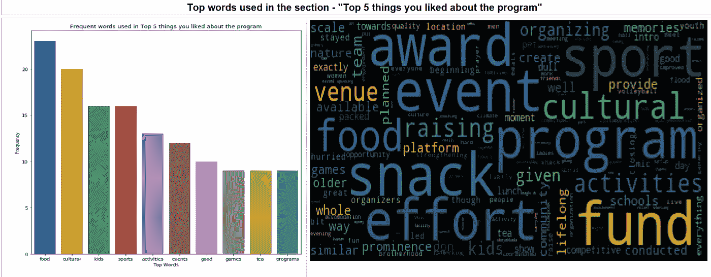
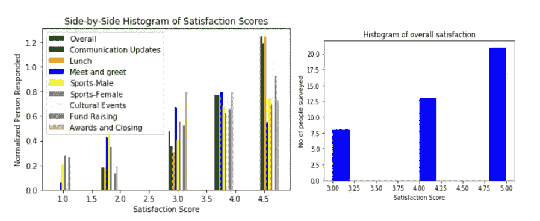
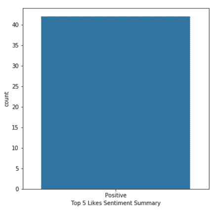
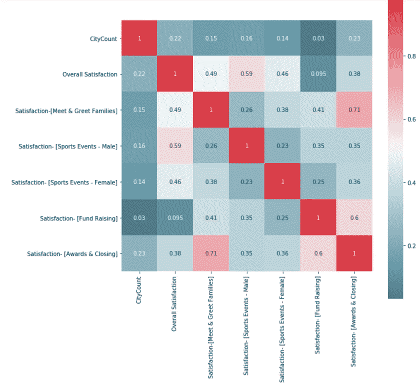

# 在日常生活中使用数据科学

> 原文：<https://towardsdatascience.com/using-data-science-in-everyday-life-f9b58f1f74af?source=collection_archive---------19----------------------->

我最近为我们社区组织了一次社交聚会。我们通过引入游戏和文化活动来组织这个特殊的聚会，并让达拉斯沃斯堡内的不同城市相互竞争一个总奖杯。由于我们有一个混合的聚会(保守派，自由派，在我们之外出生和长大的人，在美国出生和长大的人，孩子，18 到 50 岁的成年人)，组织这个聚会并确保每个人的参与是一个挑战。最后结果是个好玩的活动(至少我是这么认为的！！)，尽管中间下雨扫了兴。

聚会结束后不久，反对者们就开始对此议论纷纷。正如任何有着不同背景和品味的大群体一样，每个人都会有自己的看法。因此，我们发出了谷歌调查，以衡量满意度，以确保每个人的声音都被听到和衡量，而不是少数害群之马抹黑我们的努力。

作为一名组织者，衡量更广泛人群的总体满意度对我来说很重要，因此我决定利用我在数据科学、Python 和自然语言处理方面的技能来接受这一挑战..

**技术背景**

与任何数据科学项目一样，当我们处理结构化和非结构化数据时，大部分工作都花在组织数据、清理数据上。在仔细研究数据后，数据质量/特性工程工作包括以下
1)确保所有满意度度量都是整数(将字符串转换为整数，将 NaN 更改为 0 等)。)
2)删除所有特殊字符(/、@、。等等。)使用正则表达式
3)通过删除所有停用词并将所有词改为小写来清理数据

最后，没有足够的数据来对一些相关性指标得出有意义的结论。我很想使用 NaiveBayes 分类算法，但同样，没有太多的数据可供使用。

**Python 库的详细信息** 在这个项目中，我们计划衡量各种因素的满意度——总体满意度、与通信、食品、文化活动、体育等相关的满意度。这里是使用的各种 python 库

1.  利用 **pandas** 数据帧读取 CSV 文件并进行数据转换(添加列、测量相关性等。)
2.  使用 **NLTK** — FreqDist 和 NLTK 单词 tokenize 来统计在各种调查问题中使用最频繁的单词
3.  使用 **matplotlib.pyplot** 绘制各种满意度指标的直方图、条形图
4.  使用正则表达式( **re** 和 **Lambda** 来清理数据和进行转换
5.  使用 **TextBlob** 使用极性测量情绪(积极或消极),使用主观性测量主观性
6.  使用 **WorldCloud** 为非结构化数据生成单词云
7.  使用 **seaborn** 库绘制相关矩阵热图，柱状图

**结论**
经过分析，我很高兴地得出结论，大多数人喜欢这个活动(满意度指标的综合直方图中，4 分和 5 分表示人们喜欢这个活动)。世界云有助于挖掘非结构化数据，了解人们最关心的是什么。显然，人们最关心食物(事后看来，这是显而易见的:)
所以我们能够科学地压制反对者的声音。

下面是我使用的代码片段和图表。完整的代码在我的 github 库—[https://github.com/yasimk/](https://github.com/yasimk/nlp-sentiment-analysis-python/blob/master/NLP_sentiment_analysis_social_gathering.ipynb)

*##词云表示食品、文化、体育、小吃、奖项和节目被提及最多*

> ##下面的满意度矩阵综合了所有指标。如你所见，大多数分数在 4 或 5 分左右。这一结果证明这次活动是成功的
> 
> ###还为每个满意度分数创建了单独的直方图(由于缺乏实际资料，此处仅显示总体满意度)

> ###情感分析的条形图如下所示。如你所见，结果显示没有因小数据集而产生负面情绪。一个丰富而庞大的数据集，如 Twitter 选举反馈，会告诉我们一个不同的故事。我期待着分析 2018 年 11 月中期选举的推特数据

> 参见下面相关矩阵的热图分析
> ##总体满意度与男性体育赛事相关(0.59)。这是有道理的，因为喜欢运动的人是积极的类型，得分与总得分相关。
> ##迎送家属满意度与颁奖和结案相关(0.71)。这很直观，因为颁奖典礼将所有团体(女士、男士和小孩)聚集在一起，因此我们为会员提供了见面和问候的机会
> 
> ##体育赛事男性和女性的相关性最小(0.23)，这是有道理的，因为我们分开举办赛事
> ##体育赛事男性和见面问候家庭(0.26)的相关性不是那么大。这是有道理的，因为人们参加男性活动，他们不能花足够的时间见面和问候。
> 
> ##我试图检查特定城市的这些指标，以检查是否有任何相关性。然而，没有足够的数据来得出结论

代码可以重新用于 Twitter 情绪分析或任何非结构化数据分析。

完整代码可在 GitHub—[https://GitHub . com/yasi MK/NLP-opinion-analysis-python/blob/master/NLP _ opinion _ analysis _ social _ gathering . ipynb](https://github.com/yasimk/nlp-sentiment-analysis-python/blob/master/NLP_sentiment_analysis_social_gathering.ipynb)获得

希望您喜欢阅读关于如何在日常生活中使用数据科学的内容。你也可以每天利用数据科学的力量为你带来优势。如有任何问题或反馈，请给我留言。