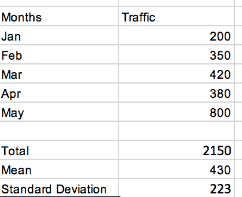
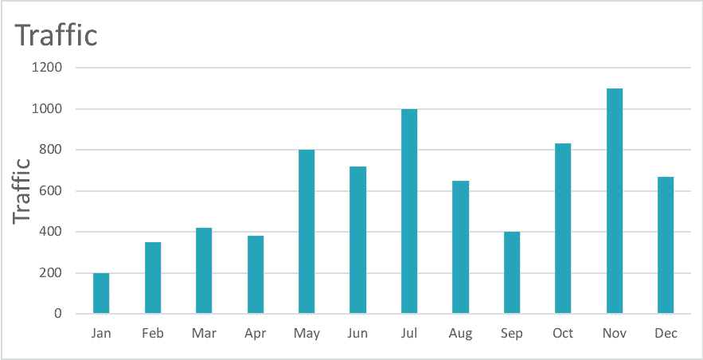
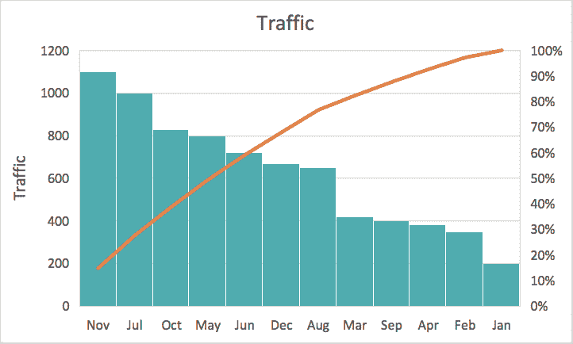
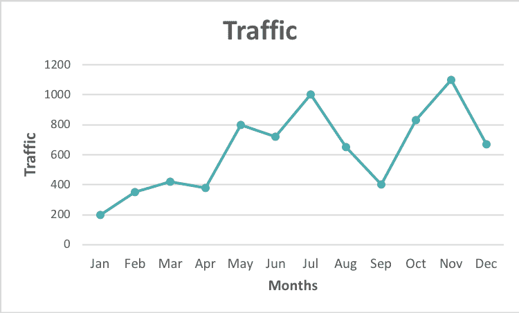
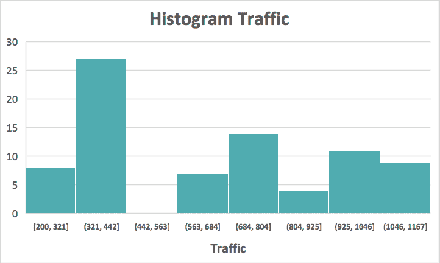
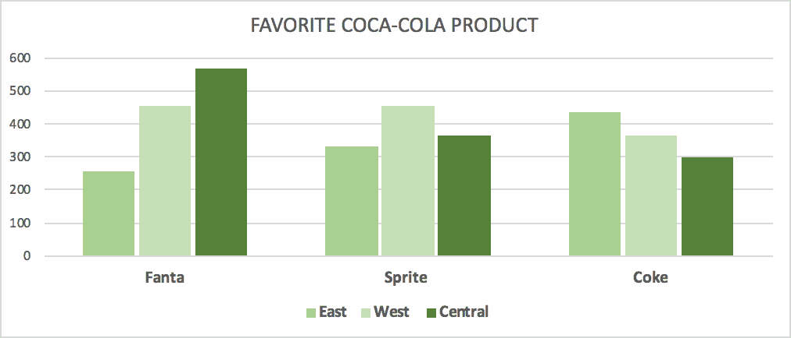
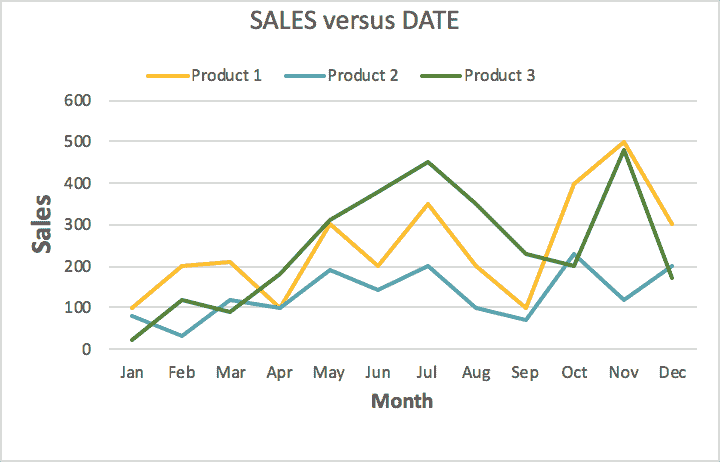
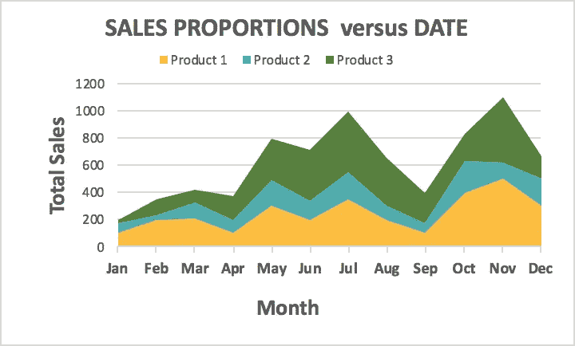
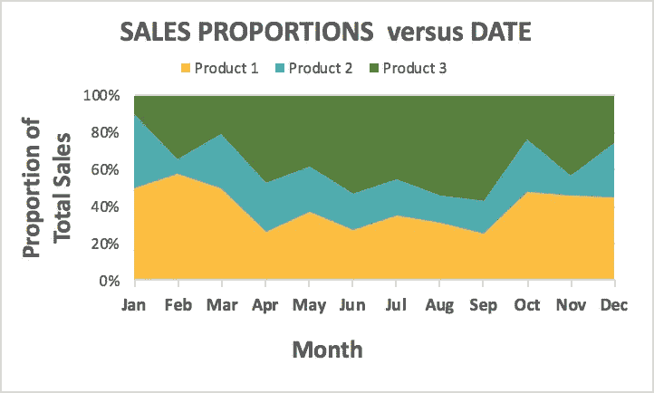
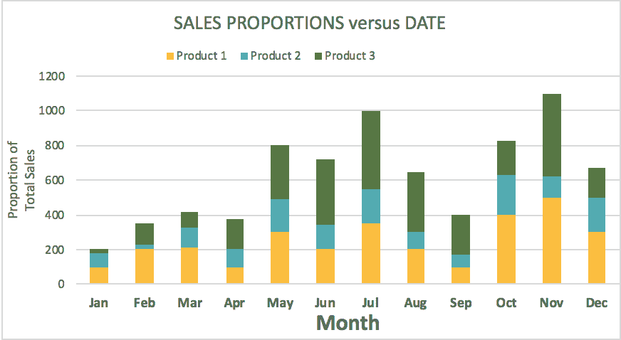

# 使用数据可视化快速回答业务问题

> 原文：<https://towardsdatascience.com/using-data-visualizations-to-quickly-answer-business-questions-de815be0ede0?source=collection_archive---------19----------------------->

学习如何交流从数据中获得的洞察力是你能拥有的最重要的技能之一。通常，交流数据信息的最引人注目的方式是可视化。但是，构建伟大的数据可视化的关键是让它们能够回答你想要回答的问题。

例如，假设我开了一个博客，我想知道我哪个月的流量最大。

我可以使用一个汇总表，基本上列出了每月的流量和数量。就像下面的表格，但是它的问题是，它不能帮助我很容易地比较每个月的流量。

但是这次绘制同样的数据，把它扩展到 12 个月的流量的条形图或帕累托图。显而易见，11 月和 7 月的流量最高。而一月最少。

**Bar Chart**

**Pareto Chart**

条形图或帕累托图最好地捕捉了每月的流量分布，尤其是帕累托图。帕累托图按照流量从高到低的顺序排列月份。每个条形代表特定月份的流量。

如果我想知道流量是否随着时间的推移而增加，最好的图表是折线图。

**Line Chart**

这里显示的是相同的信息，但更容易看到的是，从条形变为线状，整体流量似乎在增加。如果我有多年的数据，折线图也将有助于确定特定月份的流量是高于还是低于其他月份。也许一月总是低的，而十一月总是比一年中的其他月份高。

让我们试着回答更多的商业问题

我有多年的数据，我想知道访问者数量的分布情况，例如:

1.  一个月内有超过 200 名访客的频率是多少？
2.  最常见的访客人数是多少？

**Histogram**

无论是从条形图还是折线图来看，这都很难判断。这两个问题都不是为了理解时间成分。我对具体的计数感兴趣。

访问者数量的柱状图有助于更好地了解一个月内的典型访问者数量。条形图的高度告诉我一定数量的访问者出现的频率。

在博客上看到 500 个访问者的情况很少见吗？我能很快看出 500 是很少的。我也能看到总有 200 多的访客，但很少有超过 1167 人的。

最常见的访客数量在 321 到 442 之间。在条形图或帕累托图上很难看到这些观察结果。

同样，由于数据中的时间成分，折线图可能是最好的，但它最终取决于您想要传达的信息。用同样的数据，我只是找到了三种呈现数据的方式。可视化数据的正确方式是最能帮助你回答问题的方式。

**分类变量**

当观察一段时间内的变量或比较两个定量变量时，用于可视化这些情况的选择被标准化为折线图和散点图。然而，当您将分类变量引入可视化时，更多的选项现在变得可用。以及如何可视化分类变量之间的关系以及分类变量和定量变量之间的关系。

例如，我想知道三个地方的顾客最喜欢的可口可乐产品。为了比较两个分类变量，我可能会使用类似并排条形图的东西，显示一个类别的分组。在这种情况下，芬达、雪碧和可口可乐按照另一个变量的颜色分组，在这种情况下是三个位置。我可以快速识别每个地点最喜欢的汽水。中环芬达，西区雪碧，东区可乐。

**Side-by-Side bar chart**

如果我有两个以上的变量，比如我想查看不同产品在一段时间内的销售额，这里我有三个变量:销售额、时间和产品。我可能会从折线图开始，因为我在和时间打交道。然后，我可以将每种产品分成不同的系列。给线条着色并添加图例以提供产品名称。现在，我可以看到哪种产品表现良好，这可以帮助我做出更多针对具体产品的决策，而不是只看总体销售额。

**Line Chart**

在这种情况下，我还可以使用基本堆积面积图或 100%堆积面积图。当您想要显示部分到整体关系随时间的变化时，堆积面积图很有意义。视觉效果提供了基本相同的信息，但在 100%堆积面积图中，每种产品都以占总销售额的比例显示。

与基本堆积面积图不同，100%堆积图结果显示总销售额，以及每个产品线对总销售额的贡献。

**Basic Stacked Area Chart**

**100% Stacked Area Chart**

另一种方法是使用按年份排列的堆叠条形图。每个产品在条中都有一种颜色，条的高度就是销售额。

**Stack Bar Chart**

通过折线图、堆积折线图和堆积条形图，让我们来看看使用每个图表可以轻松回答的一些问题。

问题

1.  哪种产品 1-7 月销量增长最快？

这在其他一些图中很难看到，但在折线图中更容易看到。产品 3 和其他产品一样起步缓慢，但在 4 月至 7 月间有所增长。

2.产品 1 在哪一个月的销售额超过 50%?

从百分比堆积面积图中，您可以看到产品 1 在二月份的销售额超过了 50%。同样，选择图表要基于它对你回答问题的帮助程度。

3.总销量曾经超过 100 台吗？

是的在 11 月！基本堆积面积图或堆积条形图都适合这个问题。因为它们清楚地显示了这三种产品每个月的总销售额。

总之，构建信息丰富的数据可视化在很大程度上取决于您对现有绘图类型的理解以及您试图强调的洞察力。您使用的可视化方式还取决于您正在处理的数据类型，以及您希望在单个绘图中查看的数据集中有多少列。