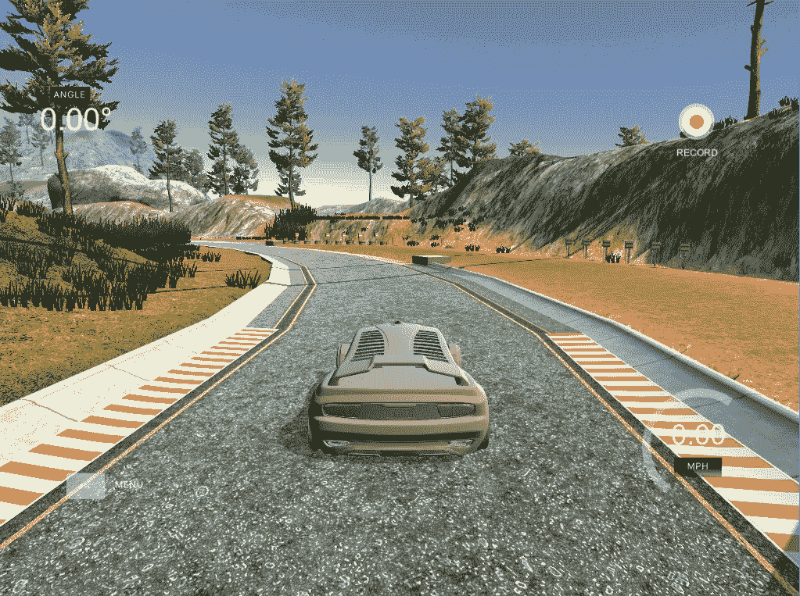
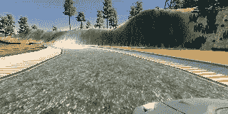
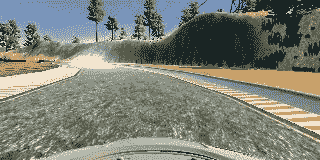
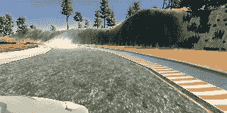
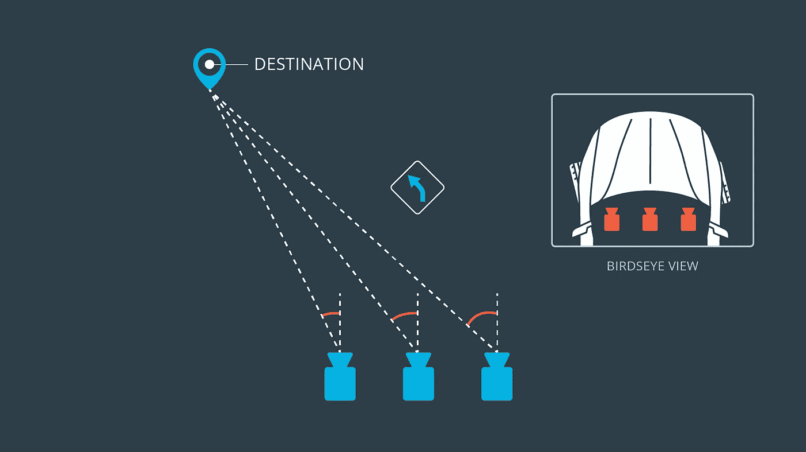
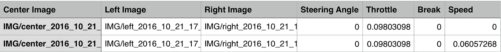
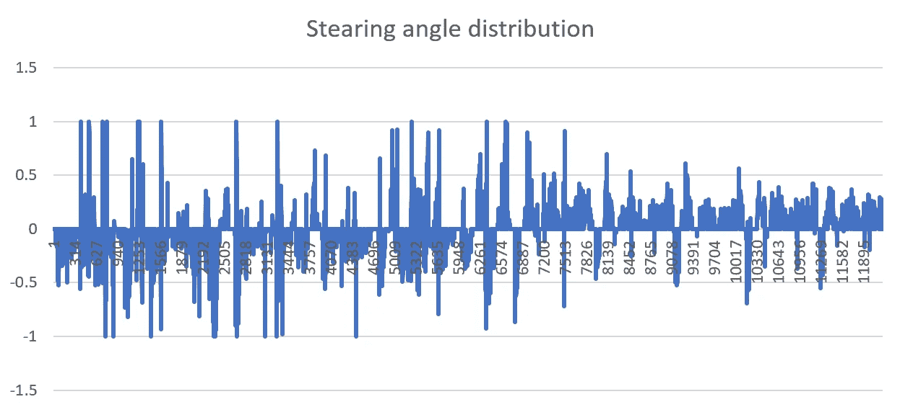
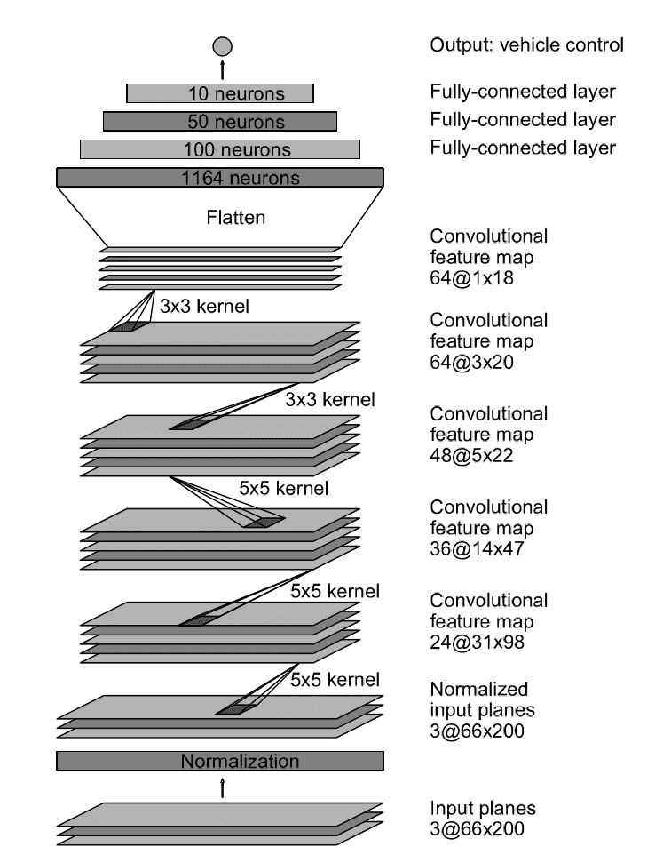

# 利用深度学习克隆驾驶行为

> 原文：<https://towardsdatascience.com/using-deep-learning-to-clone-driving-behavior-51f4c9593a57?source=collection_archive---------1----------------------->

在我关于自动驾驶汽车和相关的 [Udacity Nano degree](https://www.udacity.com/drive) 项目的[上一篇帖子](https://medium.com/@bdjukic/recognizing-traffic-signs-with-deep-neural-network-a725cd5a39fe)中，我写的是深度神经网络在交通标志分类中的应用。这一次，我将使用深度神经网络方法来模仿人类的驾驶行为(在这种特殊情况下，在模拟器中驾驶汽车)。

# 项目目标

这里的总体思路是通过在模拟器中驾驶汽车来收集训练数据，然后用这些数据训练深度神经网络，最后让汽车由深度神经网络生成的模型来驾驶。

You can find the simulator git repo [here](https://github.com/udacity/self-driving-car-sim)

# 训练数据分析

Udacity 已经提供了一些预先录制的圈数，但我决定自己用模拟器玩一玩。所以我在赛道的每个方向记录了 **5 圈**。为了避免深度神经网络偏向于转向道路的左侧，两个方向都是需要的。

该记录产生了 **36 534** 个捕获的图像。图像包含从汽车上的三个摄像头捕获的数据:左，中，右。

Captured images from left, center and right camera from the car

为了训练的目的，我只使用了中央摄像头，这足以获得非常好的最终效果。为了使模型更通用，建议对汽车使用所有三个摄像机，以便能够更好地处理返回轨道中心的场景。

当使用多个摄像机时，重要的是要记住，左右摄像机的转向角需要用一个常数进行适当调整。

Multiple camera capturing

训练数据还包含 CSV 文件，该文件包含带有时间戳的图像捕获以及转向角、油门、刹车和速度。

CSV file contains the metadata from the training data

由于训练数据包含两个轨道方向上的圈数，因此转向角没有偏差:

80%的数据用于培训，20%用于验证。所有的训练数据都可以在[这里](https://1drv.ms/u/s!As2zxTr-3Rwhg-t_9G7Eh6Nuw3AmCQ)找到。

# 数据扩充和预处理

为了进一步增加训练数据集的大小，我将每张图像都绕水平轴翻转。

在这种情况下，图像的预处理是在模型本身中完成的，因为与 CPU 相比，在 GPU 上完成的成本更低。我从每张图片的顶部裁剪了 50 个像素，从底部裁剪了 20 个像素，以去除图片中不必要的噪声(汽车的前部，天空，树木等)。).

# 模型架构

我实现了来自英伟达论文的深度神经网络架构:[自动驾驶汽车的端到端学习](https://images.nvidia.com/content/tegra/automotive/images/2016/solutions/pdf/end-to-end-dl-using-px.pdf)在 [Keras](https://keras.io/) 后台运行 [TensorFlow](https://www.tensorflow.org/) 。这是一篇优秀的论文，如果你更了解这种深度神经网络在现实世界中的应用，我建议你通读一下。

以下是 NVidia 在现实生活中基于上面的架构运行相同模型的汽车的短视频:

深度神经网络本身获取输入图像(160 x 320 x 3)。在最开始，它包含标准化和裁剪层。接着是 3 个卷积层，步长为 2x2，内核为 5x5。随后是额外的 2 个无跨距卷积层和 3×3 内核。卷积层连接到三个完全连接的层，从而产生一个输出控制值。用 RELU 函数在所有网络层之间引入非线性。ADAM 用于我们的学习率。

Deep neural network architecure used from [NVidia’s paper](https://images.nvidia.com/content/tegra/automotive/images/2016/solutions/pdf/end-to-end-dl-using-px.pdf)

辍学层是没有必要的，因为我没有注意到在培训期间任何重大的过度拟合。

# 培训和最终结果

训练在配备了 GPU 的 Amazon EC2 实例上进行。训练完成后，赛车能够自己完成赛道:

# 结论

这绝对是本课程迄今为止最有趣的项目。我的计划是将从这个项目中学到的知识应用到现实生活中的遥控汽车上，并在我的公寓里建造一个小型赛车道，在那里我可以训练它自动驾驶。

项目可以在我的 Github repo 上找到:

 [## 行为克隆 P3

### 行为克隆-P3-uda city 行为克隆项目的启动文件

github.com](https://github.com/bdjukic/CarND-Behavioral-Cloning-P3)