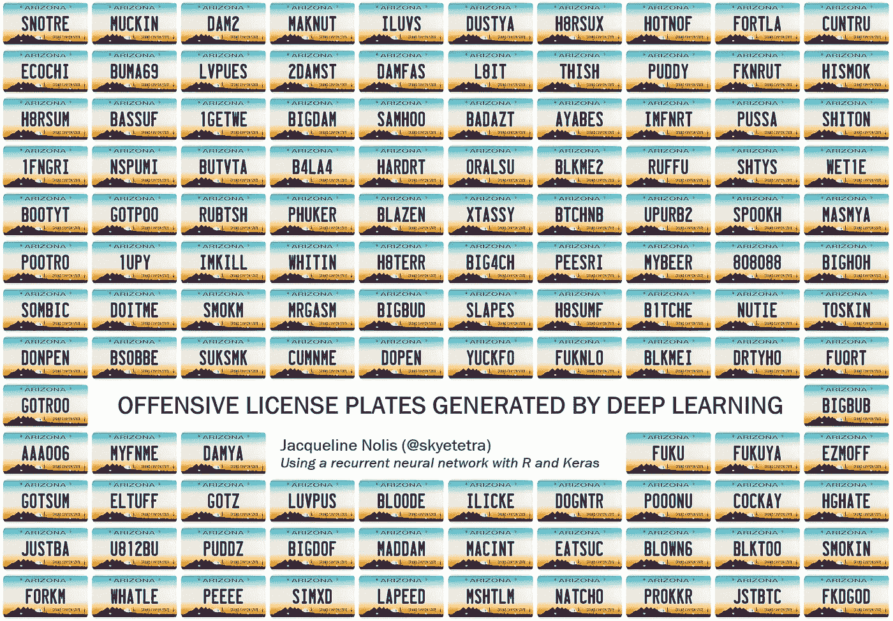
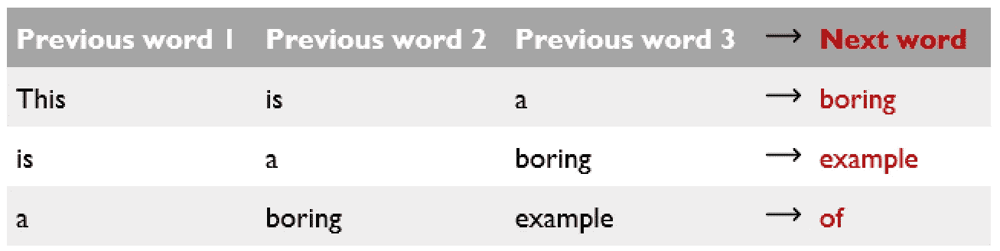
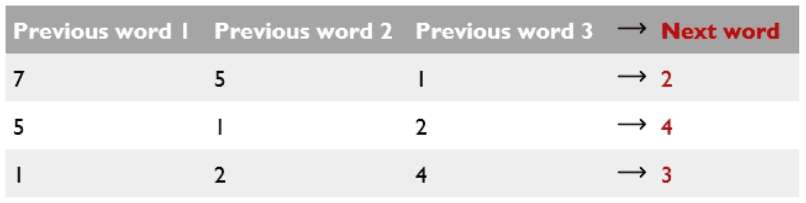
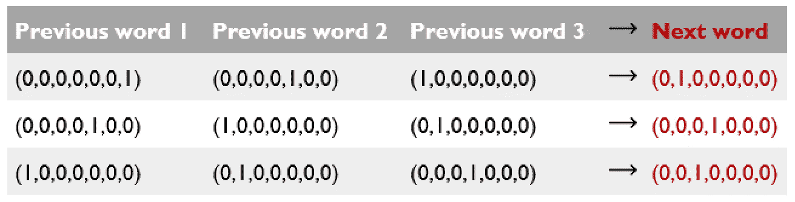
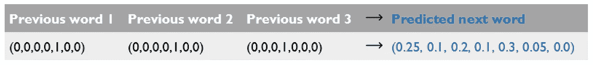

# 利用深度学习生成攻击性车牌

> 原文：<https://towardsdatascience.com/using-deep-learning-to-generate-offensive-license-plates-619b163ed937?source=collection_archive---------8----------------------->

## 将丰富的语料库与 R

如果你已经在互联网上呆了足够长的时间，你就会看到由深度学习算法生成的优质内容。这包括在[乐队名称](https://twitter.com/botnikstudios/status/955870327652970496)、[视频游戏名称](https://disexplications.tumblr.com/post/159165060164/video-game-titles-created-by-a-neural-network)和[神奇宝贝](http://aiweirdness.com/post/147834883707/pokemon-generated-by-neural-network)上训练的算法。作为一名想要跟上该领域现代趋势的数据科学家，我认为没有比找到一个有趣的主题来生成文本更好的方式来学习如何使用深度学习。有了这样做的愿望后，我等了一年才找到合适的数据集来做这件事，

我偶然发现了亚利桑那州禁止牌照的名单。这份名单包含了所有的个性化牌照，人们要求，但被亚利桑那州汽车部门拒绝。这个数据集包含超过 30，000 个车牌，这为深度学习算法提供了一组很好的文本。我将数据作为文本包含在我的 GitHub 库中，这样其他人就可以选择使用它。不幸的是，数据来自 2012 年，但我有一个活动的公共记录请求亚利桑那州更新名单。我强烈建议你看一看，它非常有趣。

下一步是实际了解深度学习是如何工作的，并编写代码。因为我的大部分工作都是在 R 中完成的，所以我希望使用它，谢天谢地，Rstudio 有一个叫“keras”的包，它使这变得很容易。虽然这个工具本身很容易使用，但我不得不通过仔细阅读互联网，自己拼凑出一个关于深度学习的介绍。现在回想起来，我大概应该只[买一本书](http://a.co/i61kMTM)。这篇文章的其余部分是我对我所学到的东西的总结，以便其他人可以阅读它，并找出如何生成他们自己的有趣文本。如果你想看我的实际代码，请查看我的 GitHub 库。

## 深度学习如何用于文本生成的口语化介绍

当人们谈论使用深度学习来生成文本时，他们几乎总是指的是递归神经网络(RNN)。这是一种特殊形式的人工神经网络，可以很好地处理数据点序列(例如，书中的单词序列)。忽略这背后的数学，想法是给定一个单词序列，例如“*这是一个单词序列*的无聊例子，”我们可以训练一个模型，根据序列中的单词预测序列中的单词(以及单词的顺序)。因此，在选择下一个单词之前，我们选择少量的前一个单词来考虑。如果我们之前的单词数是 3，那么我们的小序列将创建一个看起来像这样的数据集:

由于递归神经网络不能处理单词，而是需要数字，所以我们任意将每个单词分配给一个数字。例如，a = 1，boring = 2，this = 7，等等。那么我们的数据就变成了:

但不幸的是，即使这样，对 RNN 来说还是太复杂了。我们需要通过将每个数字转换成一个二进制向量来将它表示为一个分类变量。例如，我们可以将 7 个单词中的第 5 个编码为长度为 7 的二进制向量，只有第 5 个元素为 1。(0,0,0,0,1,0,0).如果我们对整个数据集这样做，我们会得到:

这是 RNN 可以研究的数据。该模型将适合它，然后我们可以给它一组前三个单词，让它猜下一个单词是什么。由于有许多可能的下一个单词，最终发生的是模型产生所有可能单词的组合，这些单词具有不同的权重，加起来等于 1。这些代表每个单词成为下一个单词的概率:

An example of a prediction generated from an RNN

为了让*生成*一个单词序列，我们选择三个单词作为起点，然后从模型预测的每个单词的概率中抽取第四个单词。例如，在上面的示例数据中，如果我们使用预测的下一个单词分布作为一组可能单词的权重，我们可以从样本中提取。如果我们画出与单词“boring”相对应的第二个元素，它将是序列中的下一个单词。然后，我们将它放入序列中，并使用序列中最近的元素来生成第五个单词，依此类推。

## 设置牌照数据

对于牌照数据，我们必须对这个主要思想进行一些修改。

*   这里的“单词”是指盘子里的字母和数字(不是完整的单词)。
*   由于车牌可能不是全长的，我们想知道何时停止它。因此，我们在每个牌照上附加一个终止字符'+'。因此板块 ABC001 变成了 ABC001+。如果在生成新的牌照时，我们生成了符号“+”，这就意味着我们需要停止这个序列。
*   我们用于训练数据的序列是数据中每个平板的子序列。例如，如果 ABC001+在数据中，我们希望在(A → B，AB →C，ABC →0，…)上训练模型。因为每个训练数据序列的长度必须相同，所以我们在开头填充数据(******A → B，*****AB →C，* * * * * ABC→0，…)。我们从每个板中生成所有序列，并将它们放入一个大的训练集中。

## 对张量流使用 R 和 Keras

我最终使用了三种相互叠加的不同技术来运行这个模型。这些术语经常出现，所以最好能清楚地区分每一个:

*   TensorFlow(基础技术):TensorFlow 是一组开源的库，用于运行深度学习算法。它非常强大，但是直接部署起来有点麻烦。
*   Keras (Python API): Keras 是一个 Python 库，它使得 TensorFlow 更容易使用。它消除了设置和部署 TensorFlow 的所有麻烦，并真正使深度学习对 Python 用户可用。
*   keras (R 包):这是 RStudio 的包，允许你在 R 中使用 keras 而不是 Python。这不是 Keras 本身，而是 Keras Python 库之上的一个包装器。好消息是它工作得非常好，遵循现代 R 编程原则，并且易于安装。坏消息是，它是一个包装上的包装，所以有时寻求帮助并不容易。但是据我所知，在 Python Keras 中可以做的任何事情在 R Keras 中也可以做。

通过遵循 keras 包的[文本生成示例](https://keras.rstudio.com/articles/examples/lstm_text_generation.html)，我弄清楚了这些东西是如何工作的。我一行一行地运行他们的代码，以了解它是如何工作的，然后为我的车牌项目修改它。要让代码运行起来，你需要安装 TensorFlow 和 Python， [Rstudio 包](https://keras.rstudio.com/index.html)会帮助你。

他们的示例文本生成代码实际上只做了几件关键的事情:

1.  加载示例文本数据并进行任何必要的格式化。在我的例子中，我需要添加上一节中的牌照修改。
2.  创建单词序列以用作训练数据，并将它们格式化为三维数组 x。数组的维数是:数据来自哪个序列，我们引用序列中的哪个元素，以及哪个单词。元素 X[i，j，k] =1 如果序列 *i* 在第 *j* 个字中作为 *k.* 预测被存储在一个二维数组 y 中。
3.  对数据运行 keras 模型。当指定一个模型时，你需要列出不同层的神经元来创建一个人工神经网络。老实说，我几乎不知道如何制定一个“好的”规范，所以对于我的代码，我使用了与 Rstudio 示例相同的规范。为神经网络选择层的艺术感觉是整个过程中最不清楚的部分，我希望了解更多。如果你是第一次尝试编写自己的深度学习代码，我建议借鉴正在解决类似问题的其他人的规范。
4.  使用创建的模型生成单词，并从这些单词创建新的序列。

一旦我让模型工作了，我就把一堆随机生成的盘子扔到一个图像里。这个项目总共花了我大约 8 个小时，如果我的代码中没有一些一个接一个的错误，这个时间会更快。我对结果非常满意，并对整个过程的简单明了感到惊讶。如果我知道会这么容易，我几个月前就做了。如果你对深度学习感兴趣，我强烈建议你获取一个文本语料库，并尝试自己生成新文本。它教会了我很多关于这个过程的知识，我觉得自己更有能力将深度学习用于更高级的项目。

代码是 GitHub 上的[，如果你对我做过的其他项目感兴趣，请查看](https://github.com/jnolis/banned-license-plates)[推特混搭](http://tweetmashup.com/)或我的 [F#物联网按钮](https://medium.com/@skyetetra/using-f-to-power-an-aws-iot-button-56bea2d36b9)。