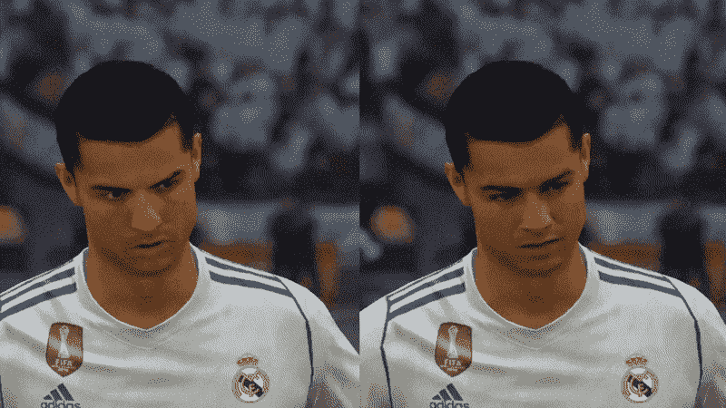
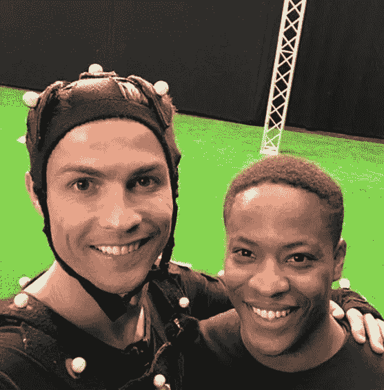
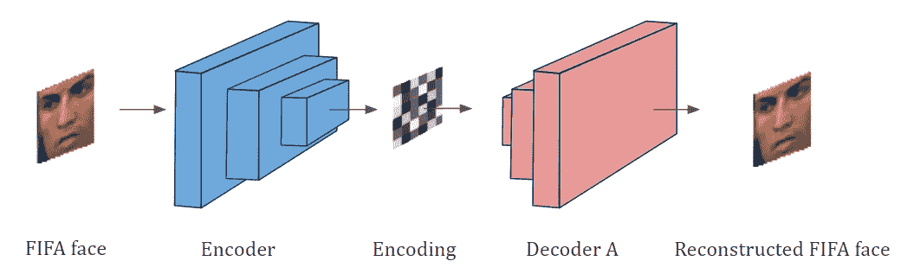
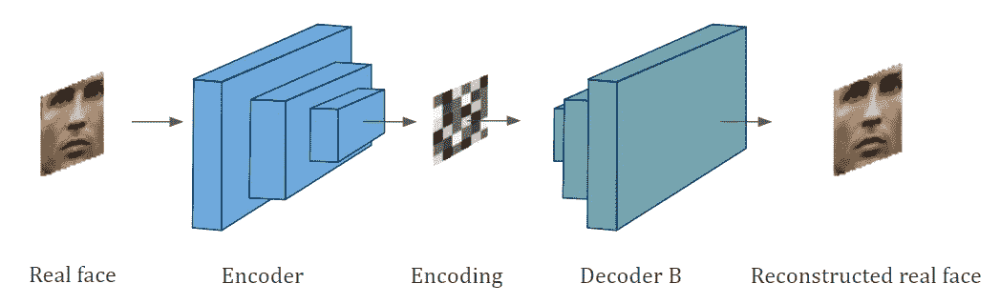
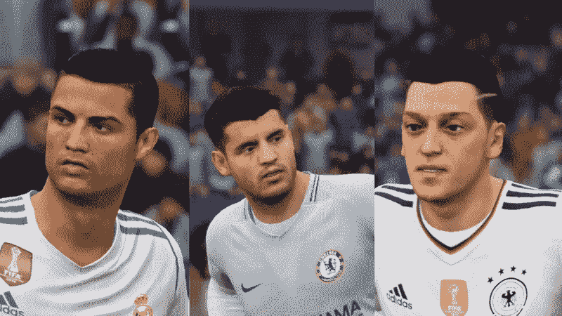
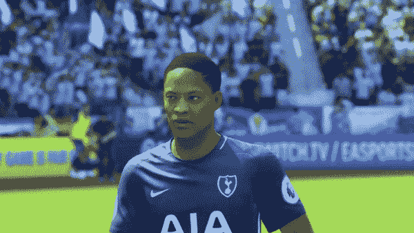

# 利用深度学习改进 FIFA 18 图形

> 原文：<https://towardsdatascience.com/using-deep-learning-to-improve-fifa-18-graphics-529ec44ea37e?source=collection_archive---------0----------------------->

Comparison of Cristiano Ronaldo’s face, with the left one from FIFA 18 and the right one generated by a Deep Neural Network.

游戏工作室花费数百万美元和数千个开发小时来设计游戏图形，试图使它们看起来尽可能接近现实。虽然图形在过去几年看起来非常逼真，但仍然很容易将它们与现实世界区分开来。然而，随着使用深度神经网络的图像处理领域取得的巨大进步，是时候我们可以利用它来改善图形，同时减少创建图形所需的工作了吗？

## 让我们试着用游戏 FIFA 18 来回答这个问题…

足球(即英式足球)是我最喜欢的运动，FIFA 成为我所有深度学习实验的自然选择。为了找出深度学习的最新发展是否可以帮助我回答我的问题，我试图专注于使用(in？)著名的 [deepfakes](https://github.com/deepfakes/faceswap) 算法。它是一个深度神经网络，可以被训练来学习和生成极其逼真的人脸。我在这个项目中的重点在于从游戏中重新创建玩家的面孔，并改进他们，使他们看起来完全像真正的玩家。

*注:* [*这里的*](https://www.youtube.com/watch?v=7XchCsYtYMQ) *很好的解释了 deepfakes 算法是如何工作的。TL；博士版本:它可以使用自动编码器和卷积神经网络将视频中任何人的脸与其他任何人的脸交换。*

## 收集培训数据

Unlike the game developers, I could collect all required data from Google search without having to trouble Ronaldo with any motion-capture fancy dress.

让我们先看看 FIFA 18 中设计最好的面孔之一，克里斯蒂亚诺罗纳尔多的面孔，看看我们是否可以改进它。为了收集 deepfakes 算法所需的数据，我只是从游戏中的即时重放选项中记录了玩家的面部。现在，我们想把这张脸换成 c 罗的真实面孔。为此，我从谷歌上下载了一堆图像，这些图像从不同的角度清晰地显示了他的脸。这就是我们开始模型培训过程所需要的全部内容。

## 模型架构和培训

deepfakes 算法涉及被称为自动编码器的深度神经网络的训练。这些网络用于无监督学习，并具有编码器和解码器，编码器可以将输入编码为称为“编码”的紧凑表示，解码器可以使用该编码来重建原始输入。这种架构迫使网络学习输入的底层分布，而不是简单地鹦鹉学舌般地重复输入。对于作为输入的图像，我们使用卷积网络作为编码器，使用去卷积网络作为解码器。这种结构被训练以最小化无监督学习的重建误差。

对于我们的例子，我们同时训练两个自动编码器网络。一个网络学会从 FIFA 18 图形重现罗纳尔多的脸。另一个网络学会了从罗纳尔多的真实照片中重建面孔。在 deepfakes 中，两个网络共享相同的编码器，但使用不同的解码器进行训练。因此，我们现在有两个网络知道了罗纳尔多在游戏中和现实生活中的样子。

First autoencoder network learning from FIFA graphics

Second autoencoder network from learning actual pictures

当在其他人脸上使用预训练模型进行训练时，在 GTX 1070 上，总损失在 4 小时内从大约 0.06 下降到 0.02。在我的例子中，我在原始的 CageNet 模型上继续训练，该模型已经被训练成生成 Nicolas Cage 的脸。

## 使用训练好的模型来交换面部

现在有趣的部分来了。该算法能够通过采用一种巧妙的技巧来交换面孔。第二个自动编码器网络实际上由第一个网络的输入馈入。通过这种方式，共享编码器能够从 FIFA face 获得编码，但是解码器使用这种编码来重建真实的 face。瞧，这个设置只是把国际足联的脸转换成了罗纳尔多的脸。

The second network converting FIFA face to real face of Ronaldo

## 结果

下面的 GIF 显示了在其他玩家脸上运行该算法的结果的快速预览。我认为进步是惊人的，但也许我有偏见，所以你来判断。

Comparison of FIFA 18 vs deepfakes faces for Ronaldo, Morata and Ozil.

更多这样的视频格式的结果可以在我的 YouTube 频道上找到，视频嵌入在下面。如果你喜欢这个视频，请订阅我的频道。

## 我们可以用这个算法把自己放在游戏里吗？

Me as Alex Hunter. To turn it completely into myself, all that’s needed is the ability to add longer hair, match the skin and make the biceps bigger.

如果你能以自己的身份玩游戏的“旅程”模式，而不是以亚历克斯·亨特的身份玩，会怎么样？你所要做的就是上传一分钟长的视频，然后在几个小时内下载训练好的模型。好了，你现在可以以自己的身份玩全程模式了。这将是下一个层次的沉浸式游戏！

## 它擅长的地方和需要更多努力的地方

我觉得我们用这种方法得到的最大好处是令人惊讶的逼真的面孔和图形，很难与现实世界区分开来。所有这些只需要几个小时的训练就可以实现，相比之下，游戏设计师用目前的方法需要几年时间。这意味着游戏发行商可以更快地推出新游戏，而不是花费数十年时间进行开发。这也意味着电影公司可以节省数百万美元，这些钱可以用来雇佣像样的故事作家。

到目前为止，最明显的限制是这些人脸是事后生成的，就像电影中的 CGI 一样，而游戏要求它们实时生成。然而，一个很大的区别是，一旦模型被训练，这种方法不需要任何人为干预来生成结果，唯一阻碍它的是生成输出图像所需的计算时间。我相信用不了多久，我们就会有重量轻、不太深的生成模型，可以在不影响输出质量的情况下运行非常快，就像我们现在有 YOLO 和 SSD MobileNets 用于实时对象检测一样，这是 RCNNs 等以前的模型所无法实现的。

## 结论

如果像我这样没有图形设计经验的人可以在几个小时内做出改进的面孔，我真的相信，如果游戏开发商在这个方向上投入巨资，它可以在不太遥远的未来改变游戏行业的面貌(是的，是有意的)。现在，如果 EA sports 的任何人正在阅读这篇文章…