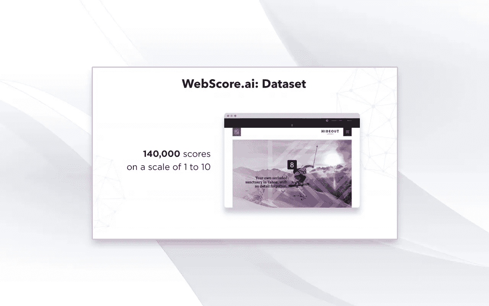
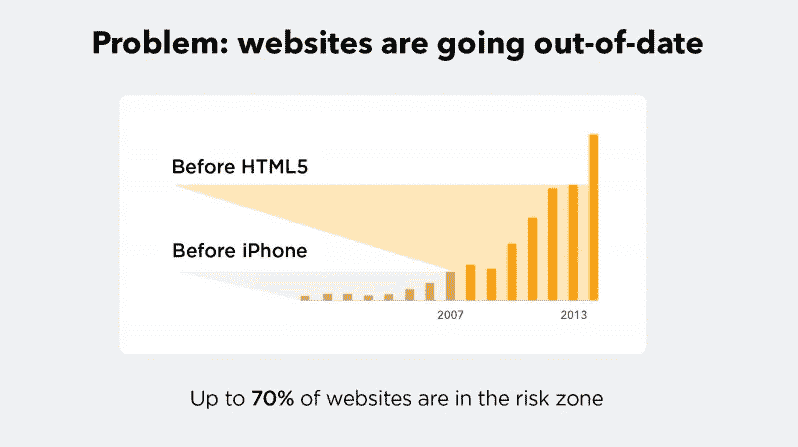
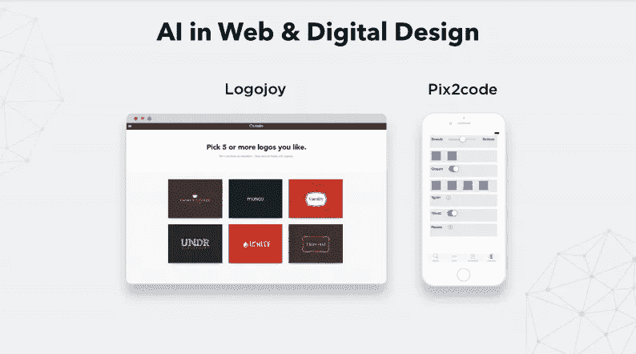
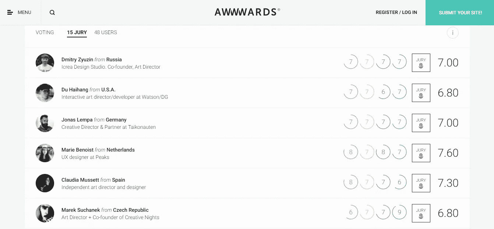
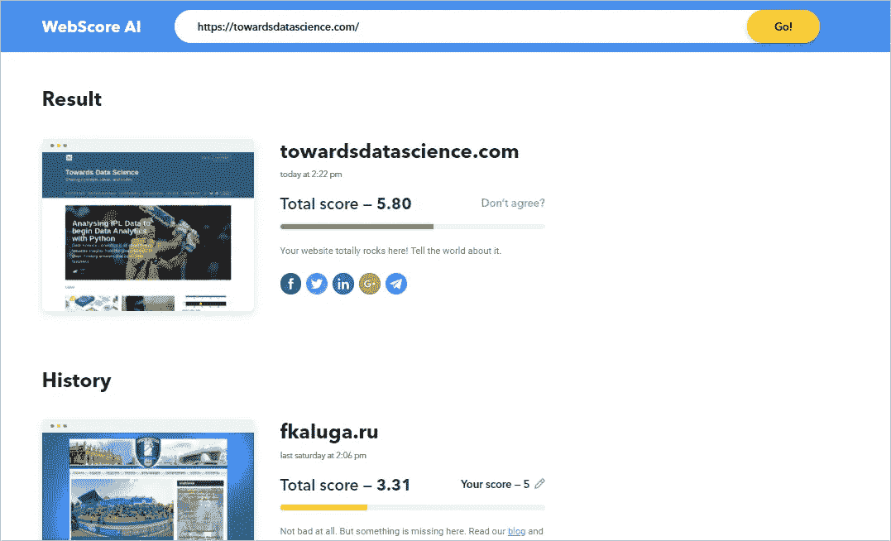

# 使用深度学习解决网站所有者的常见问题

> 原文：<https://towardsdatascience.com/using-deep-learning-to-solve-common-problems-of-website-owners-16d776fd34bd?source=collection_archive---------10----------------------->

作为一名数据科学家，我在一家管理三代网站建设平台的公司工作。这个行业启发我们的是，已经有超过 18 亿个网站，89%的企业家声称网站是吸引客户的最有效工具——比社交媒体或移动应用程序有效得多。

如果你看看[这篇文章](https://hackernoon.com/facts-about-websites-in-2018-and-why-tokenization-is-a-good-idea-for-this-industry-4009dd85dfde)，你会发现这部分网站仍有很大的增长潜力。增长的因素之一是当前网站建设工具的简单性。这种简单是由技术支持的。

***技术对不断增加的网站数量有很大影响。***

但是随着技术的过时，用它们建立的网站也会过时。

举个例子。Flash 技术在 21 世纪初被广泛用于网站动画，现在被官方宣布为过时——2020 年甚至被宣布为其“到期日”。采用 HTML5 作为新标准已经三年了，然而，许多网站所有者没有时间将他们的网站升级到 HTML5 和其他现代趋势。

***因为企业家必须专注于他们的事业。***

考虑到这一点，机器学习、深度学习和人工智能开始改善我们创建、更新和维护网站的方式。

# **让我们看看 AI 到目前为止取得了什么成就**

***技术在处理业务相关任务时是否足够高效？尽管我相信你已经知道人工智能变得更高效的例子，但我想强调一下最新的、最令人印象深刻的例子，如图像分类和阅读比赛，它们证明了机器可以超越人类。***

今天，人工智能经常被训练来减少你测试设计想法所需的时间。

LogoJoy 是一项服务，它会问你问题，试图了解你的偏好，然后为你生成名片、商标和其他东西的可视化效果，该服务已经声称它帮助了超过 160 万用户。去年, *pix2code* 展示了设计师可以用一个生成 HTML 代码的工具将他们的草图转化为交互界面。

已经有几十个概念和测试项目可以帮助业余爱好者和设计师创造几乎所有类型的数字对象。我们的同事兼朋友 Yuri Vetrov 收集了一些人工智能在网页设计中的应用实例——请随意查看。

# 现在想象你有一个商业网站

你肯定想知道你的网站的哪些部分真正吸引了你的访问者的注意力:是菜单、产品描述还是右上角的那张小图片？麻省理工学院的*visi importance*项目可以通过从网页截图中构建热图来帮助你。它预测访问者的注意力将如何在你的网站上传播。它给了你一些见解，但仍然…

你希望你的访问者和客户对你的网站感到满意。从你的角度来看，你的网站很好，但是其他人会怎么说呢？

即使你的页面是用现代技术开发的，有方便的菜单，高质量的产品图片和描述，还有支持表单——仍然有一个问题:“它是否足够吸引人，或者可能需要重新设计？”

*Scores assigned by design professionals for a fee*

直到 2018 年，还没有找到普通人的思维方式的选项，你只能使用像 AWWWARDS 这样的网站来询问创意专业人士。但是如果你是当地的中小企业，他们就不是你的客户。为了了解普通人的想法，我们[推出了](https://medium.com/@ico.ukit/ai-evaluates-websites-by-imitating-real-people-and-even-outmatches-them-how-its-done-44eead4374)服务，模拟普通用户对名片网站和在线商店的看法。

*Free website scoring tool,* [*WebScore AI*](https://webscore.ai/) *(machine learning model)*

我们已经处理了不同年份在不同平台上创建的 12，000 个网站和在线商店，收集了超过 140，000 个评估员的评估，并继续从 [https://webscore.ai](https://webscore.ai/) 的访问者那里收集网站示例及其得分。

# 让我们试着给一个网站打分

一个有好的字体、彩色图片、联系页面和社交网络链接的网站。大多数用户会认为这样的网站是好的。

***这一假设是我们开发“手工”功能的基础。***

特征提取过程由两部分组成:我们将使用 HTML/CSS 作为源的“手工”特征提取与使用截图作为源的卷积神经网络特征提取相结合。CNN 的特征是用流行的特征提取器 resnet50 获得的。

因此，我们的系统学会了寻找分数和特征之间的对应关系。结果，我们得到了一个平均误差为 0.5 点的模型。比评估员的平均误差要好。

# 现在任何人都可以检查他们的网站的美丽。但是网络上的人工智能仍然有一些高峰需要攀登

Webscore 项目是迈向 uKit 人工智能技术的一个步骤，这是我们今年的主要目标。

在使用基于人工智能的服务方面，企业有很大的潜力:推荐系统、聊天机器人、个性化设计等等。

但是，正如我之前说过的，数百万的网站已经过时了。聊天机器人不会让它们变得更有效，除非有人或事让这些页面再次变得有吸引力。深度学习也可以在这方面有所帮助——所以我们正在通过使用大数据来实现日常重新设计任务的完全自动化。网络包含大量数据，这些数据应该为企业所用。如果你有同样的感觉，我希望你继续关注我们团队的新闻。

***P.S.*** 基于 2018 年 3 月 16 日 uKits 首席数据科学家 Roman Steinberg 在零售深度学习峰会上的演讲。