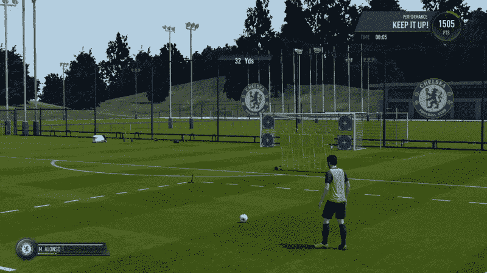
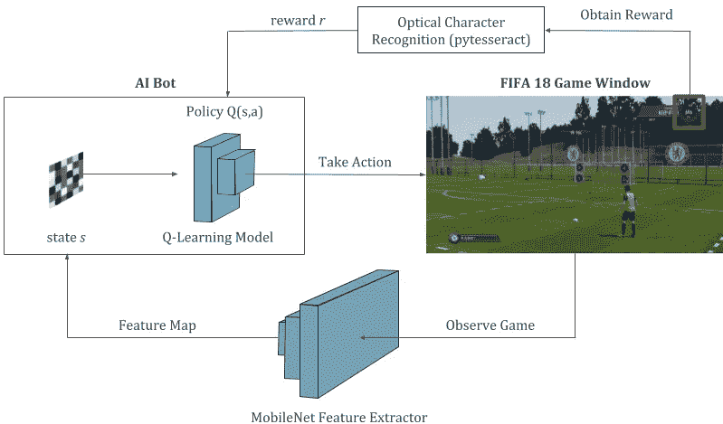
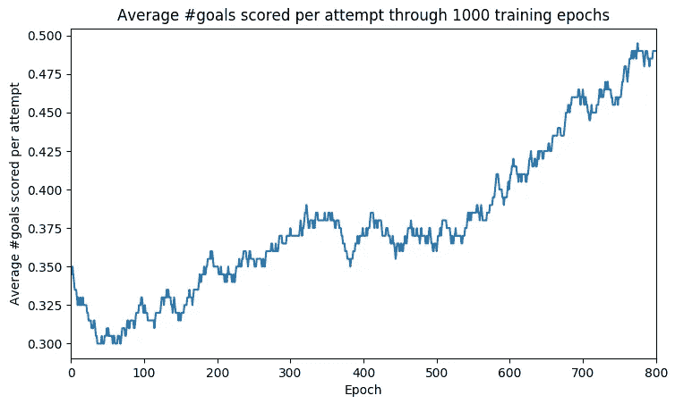
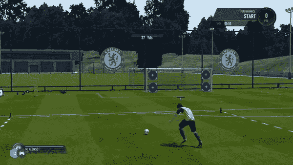
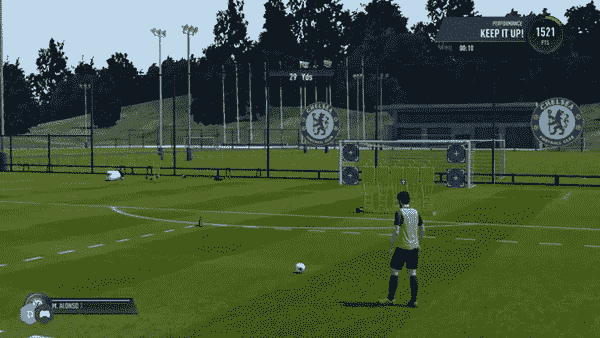

# 在 FIFA 18 中使用深度 Q-Learning 完善任意球艺术

> 原文：<https://towardsdatascience.com/using-deep-q-learning-in-fifa-18-to-perfect-the-art-of-free-kicks-f2e4e979ee66?source=collection_archive---------3----------------------->

## Tensorflow 中的一个代码教程，使用强化学习来踢任意球。

Free-kicks taken by the AI bot, trained through 1000 epochs of the Reinforcement Learning process.

在我的[上一篇文章](/building-a-deep-neural-network-to-play-fifa-18-dce54d45e675)中，我展示了一个使用监督学习技术训练来玩国际足联游戏的人工智能机器人。通过这种方法，机器人很快学会了传球和射门等游戏的基本知识。然而，进一步改进它所需的训练数据很快变得难以收集，并且几乎没有改进，使得这种方法非常耗时。出于这个原因，我决定转向强化学习，就像几乎所有评论那篇文章的人所建议的那样！

[Previous article: Building a Deep Neural Network to play FIFA 18](/building-a-deep-neural-network-to-play-fifa-18-dce54d45e675)

在这篇文章中，我将简要介绍什么是强化学习，以及我如何将它应用到这个游戏中。实现这一点的一个大挑战是我们无法访问游戏的代码，所以我们只能利用我们在游戏屏幕上看到的东西。由于这个原因，我无法在完整的游戏中训练 AI，但可以找到一个变通办法，在练习模式中为技能游戏实现它。在本教程中，我将尝试教机器人踢 30 码的任意球，但你也可以修改它来玩其他技能游戏。让我们从理解强化学习技术和我们如何制定我们的任意球问题来适应这一技术开始。

## 什么是强化学习(以及深度 Q 学习)？

与监督学习相反，在强化学习中，我们不需要手动标记训练数据。相反，我们与环境互动，并观察互动的结果。我们多次重复这个过程，获得正面和负面经验的例子，作为我们的训练数据。因此，我们通过实验而不是模仿来学习。

假设我们的环境处于一个特定的状态`s`，当采取一个动作`a`时，它会改变到状态`s’`。对于这个特定的动作，你在环境中观察到的直接回报是`r`。这个行动之后的任何一系列行动都会有它们自己的直接回报，直到你因为一个积极或消极的经历而停止互动。这些被称为未来奖励。因此，对于当前状态`s`，我们将尝试估计所有可能的行动中，哪个行动将为我们带来最大的当前+未来回报，用称为 Q 函数的`Q(s,a)`表示。这给了我们`Q(s,a) = r + γ * Q(s’,a’)`，它表示在状态`s`中采取行动`a`的预期最终回报。在这里，`γ`是一个贴现因子，用来考虑预测未来时的不确定性，因此我们希望更多地相信现在而不是未来。

[Image Source](http://people.csail.mit.edu/hongzi/content/publications/DeepRM-HotNets16.pdf)

深度 Q 学习是一种特殊类型的强化学习技术，其中 Q 函数由深度神经网络学习。给定环境的状态作为这个网络的图像输入，它试图预测所有可能行动的预期最终回报，如回归问题。具有最大预测 Q 值的行动被选为我们在环境中要采取的行动。因此得名深度 Q-Learning。

## 将国际足联的任意球视为一个 Q 学习问题

*   **状态:**通过 MobileNet CNN 给`128-dimensional flattened feature map`处理的游戏截图图片。
*   **动作:**四种可能采取的动作`shoot_low, shoot_high, move_left, move_right`。
*   **奖励:**如果按下射击键，游戏内得分增加超过 200，我们就进了一个球`r=+1`。如果我们错过了目标，得分保持不变，所以`r=-1`。最后，`r=0`为与向左或向右移动相关的动作。
*   **策略:**双层密集网络，以特征地图为输入，预测所有 4 个动作的最终总奖励。

Reinforcement Learning process for the bot interacting with the game environment. The Q-Learning Model is the heart of this process and is responsible for predicting the estimated future reward for all possible actions that the bot can take. This model is trained and updated continuously throughout this process.

**注:**如果我们在 FIFA 的开球模式中有一个像练习模式中那样的性能表，我们可能已经能够为玩完整场比赛制定这个问题，而不是限制我们自己只罚任意球。或者我们需要访问游戏的内部代码，但我们没有。不管怎样，让我们充分利用我们所拥有的。

## 结果

虽然机器人还没有掌握所有不同种类的任意球，但它已经很好地学会了一些情况。它几乎总是在没有玩家墙的情况下击中目标，但在有玩家墙的情况下却挣扎。此外，当它在训练中没有经常遇到像不面对目标这样的情况时，它会表现得疯狂。然而，随着每个训练时期，这种行为被发现平均减少。

The figure shows, for epoch 1 through 1000, average number of free-kicks that got converted per attempt, calculated over a moving average window of 200 attempts. So, for example, a value of 0.45 at epoch 700 means 45% of attempts got converted to a goal (on an average) around this epoch.

如上图所示，训练 1000 个时代后，平均进球率平均从 30%增长到 50%。这意味着当前机器人的任意球得分约为其尝试的一半(作为参考，人类的平均得分约为 75-80%)。请注意，国际足联倾向于表现出不确定性，这使得学习非常困难。

Good examples of free kicks (model trained till 1000 epochs). The bot almost always scores in absence of the yellow player cutouts blocking the goal. In presence of the player wall, it gives mixed results.

Bad examples of free kicks. In some cases like above, the bot keeps transitioning between two states by alternating between left and right actions, making it stuck in a never ending loop. Probably a weakness of Reinforcement Learning setup.

更多视频格式的结果可以在我的 [YouTube 频道、](http://youtube.com/c/DeepGamingAI)上找到，下面嵌入了视频。如果你想了解我所有的项目，请订阅我的频道。

## 代码实现

我们将使用深度学习的 Tensorflow (Keras)和 OCR 的 pytesseract 等工具在 python 中实现这一点。下面提供了 git 链接以及存储库描述中的需求设置说明。

 [## ChintanTrivedi/DeepGamingAI _ FIFARL

### DeepGamingAI_FIFARL -使用强化学习玩 FIFA

github.com](https://github.com/ChintanTrivedi/DeepGamingAI_FIFARL) 

出于理解本教程的目的，我推荐下面的代码，因为为了简洁起见，已经删除了一些代码。运行 g it 时，请使用 git 的完整代码。让我们看一下代码的 4 个主要部分。

## 1.与游戏环境互动

我们没有任何现成的 API 可以让我们访问代码。所以，还是自己做 API 吧！我们将使用游戏的截图来观察状态，模拟按键来在游戏环境中采取行动，光学字符识别来读取我们在游戏中的奖励。在我们的 FIFA 类中有三个主要方法:`observe(), act(), _get_reward()`和一个额外的方法`is_over()`来检查任意球是否被罚。

## 2.收集培训数据

在整个培训过程中，我们希望存储我们所有的经验和观察到的奖励。我们将用它作为 Q-Learning 模型的训练数据。因此，对于我们采取的每一个行动，我们都将经验`<s, a, r, s’>`和一个`game_over`标志存储在一起。我们的模型将尝试学习的目标标签是每个行动的最终回报，它是我们回归问题的实数。

## 3.培训过程

现在，我们可以与游戏进行交互，并将我们的交互存储在内存中，让我们开始训练我们的 Q-Learning 模型。为此，我们将在**探索**(在游戏中采取随机行动)和**开发**(采取我们的模型预测的行动)**之间取得平衡。通过这种方式，我们可以在游戏中进行试错以获得不同的体验。参数`epsilon`用于此目的，它是一个平衡勘探和开采的指数递减因子。起初，当我们一无所知时，我们想做更多的探索，但随着时代数量的增加和我们了解的更多，我们想做更多的开发和更少的探索。因此。`epsilon`参数的衰减值。**

在本教程中，由于时间和性能的限制，我只训练了`1000 epochs`的模型，但在未来，我想把它推到至少 5000 个纪元。

## 4.模型定义和开始培训过程

Q 学习过程的核心是一个具有 ReLU 激活的 2 层密集/全连接网络。它将 128 维特征图作为输入状态，并为每个可能的动作输出 4 个 Q 值。具有最大预测 Q 值的动作是根据给定状态的网络策略要采取的期望动作。

这是执行这段代码的起点，但你必须确保游戏 FIFA 18 在第二台显示器上以窗口模式运行，并在技能游戏:射门菜单下加载任意球练习模式。确保游戏控件与 FIFA.py 脚本中硬编码的按键同步。

## 结论

总的来说，我认为结果相当令人满意，尽管它未能达到人类的性能水平。从监督学习转换到强化学习有助于减轻收集训练数据的痛苦。如果有足够的时间探索，它在学习如何玩简单游戏等问题上表现得非常好。然而，强化设置在遇到不熟悉的情况时似乎会失败，这使我相信将其公式化为回归问题不能像在监督设置中公式化为分类问题一样外推信息。也许两者的结合可以解决这两种方法的缺点。也许在那里我们会看到为游戏构建人工智能的最佳结果。以后给我尝试的东西！

## **致谢**

我要感谢[这个](https://medium.freecodecamp.org/deep-reinforcement-learning-where-to-start-291fb0058c01)深度 Q-Learning 教程和[这个](https://github.com/Sentdex/pygta5) git 游戏库提供了大部分代码。除了 FIFA 的“自定义 API ”,大部分代码的主干都来自这些来源。多亏了这些家伙！

感谢您的阅读！如果你喜欢这个教程，请关注我的[媒体](https://medium.com/@chintan.t93)、 [github](https://github.com/ChintanTrivedi) 或者订阅我的 [YouTube 频道](http://youtube.com/c/DeepGamingAI)。