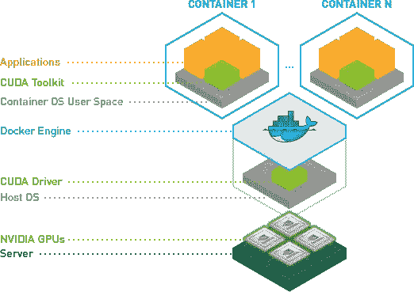
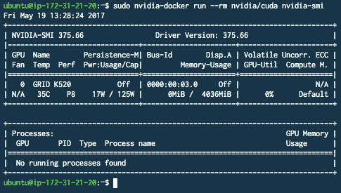
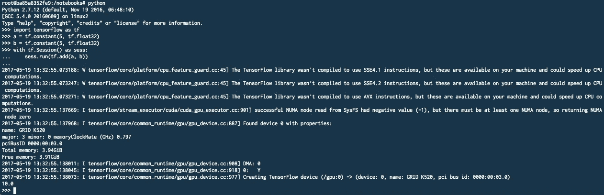

# 使用 Docker 在 AWS 上建立深度学习环境

> 原文：<https://towardsdatascience.com/using-docker-to-set-up-a-deep-learning-environment-on-aws-6af37a78c551?source=collection_archive---------2----------------------->



在[我之前的文章](https://medium.com/towards-data-science/how-to-set-up-a-deep-learning-environment-on-aws-with-keras-theano-b0f39e3d861c)中，我一步一步地解释了如何在 AWS 上建立深度学习环境。重要的一步是安装 [CUDA 工具包](https://developer.nvidia.com/cuda-toolkit)和 [cuDNN](https://developer.nvidia.com/cudnn) 。然而，这一步非常耗时。在本文中，我将使用 docker，特别是 nvidia-docker 来简化安装过程，从而加快安装过程。

我们将使用与上次相同的[亚马逊的 EC2 GPU 实例](https://aws.amazon.com/ec2/instance-types/):

*   图片:ami-b 03 ffedf(Ubuntu Server 16.04 LTS(HVM)，SSD 卷类型)
*   区域:欧盟中部-1(欧盟法兰克福)
*   实例类型:g2.2xlarge
*   存储:30 GB(建议至少 20gb 以上)

# 1.创建新的 EC2 GPU 实例


Select the Ubuntu Server 16.04 LTS AMI.


Take the g2.2xlarge GPU Instance. Alternatively, you could also take the g2.8xlarge if you need more computing power.


Change the standard storage size to 30 GB.


Launch the cluster and assign an EC2 key pair.

# 2.更新 NVIDIA 驱动程序并安装 docker+nvidia-docker

## NVIDIA 驱动程序

更新图形驱动程序:

```
$ sudo add-apt-repository ppa:graphics-drivers/ppa -y
$ sudo apt-get update
$ sudo apt-get install -y nvidia-375 nvidia-settings nvidia-modprobe
```

## 码头工人

安装 [Docker 社区版](https://www.docker.com/community-edition)(查看[官方指南](https://docs.docker.com/engine/installation/linux/ubuntu/#install-using-the-repository)了解更多关于安装的信息):

```
$ curl -fsSL https://download.docker.com/linux/ubuntu/gpg | sudo apt-key add -
# Verify that the key fingerprint is 9DC8 5822 9FC7 DD38 854A E2D8 8D81 803C 0EBF CD88
$ sudo apt-key fingerprint 0EBFCD88
$ sudo add-apt-repository \
   "deb [arch=amd64] https://download.docker.com/linux/ubuntu \
   $(lsb_release -cs) \
   stable"
$ sudo apt-get update
$ sudo apt-get install -y docker-ce
```

## 英伟达-Docker

安装 nvidia-docker 及其插件:

```
$ wget -P /tmp https://github.com/NVIDIA/nvidia-docker/releases/download/v1.0.1/nvidia-docker_1.0.1-1_amd64.deb
$ sudo dpkg -i /tmp/nvidia-docker_1.0.1-1_amd64.deb && rm /tmp/nvidia-docker_1.0.1-1_amd64.deb
```

# 3.测试您的环境:

现在，我们可以使用 nvidia-docker 来测试一切是否按预期工作:

```
$ sudo nvidia-docker run --rm nvidia/cuda nvidia-smi
```

*注意:如果您第一次运行该命令，它将首先提取图像。此外，如果您不想作为* `*sudo*` *运行，那么您需要将 EC2 用户添加到 docker 组* `*sudo usermod -a -G docker ubuntu*` *(更多详细信息，请参见* [*AWS 指南*](http://docs.aws.amazon.com/AmazonECR/latest/userguide/docker-basics.html) *)。*

这是您应该看到的输出:



你现在可以使用[官方 TensorFlow docker 映像](https://hub.docker.com/r/tensorflow/tensorflow/)或 [Theano 映像](https://hub.docker.com/r/kaixhin/theano/)来启动你的深度学习环境，或者你可以编写自己的[docker 文件](https://docs.docker.com/engine/reference/builder/)并将其推送到 [docker hub](https://hub.docker.com/) 。

## 张量流示例:

在 shell 中启动最新的 TensorFlow 容器(对于其他选项，如作为 Jupyter 笔记本运行 TensorFlow 程序，请查看[官方 TensorFlow 指南](https://www.tensorflow.org/install/install_linux#installing_with_docker)):

```
$ sudo nvidia-docker run -it tensorflow/tensorflow:latest-gpu bash
```

在 python 中运行一个简单的示例，检查 TensorFlow 在 GPU 支持下能否正常工作:

```
import tensorflow as tfa = tf.constant(5, tf.float32)
b = tf.constant(5, tf.float32)with tf.Session() as sess:
    sess.run(tf.add(a, b)) # output is 10
```

这是您应该预期的输出:



# 结论

在这篇博文中，我用 docker 在 AWS 上搭建了一个深度学习环境。这大大加快了安装过程。这对于家里没有自己的 GPU 的人来说特别有用；)

在推特上关注我: [@datitran](https://twitter.com/datitran)