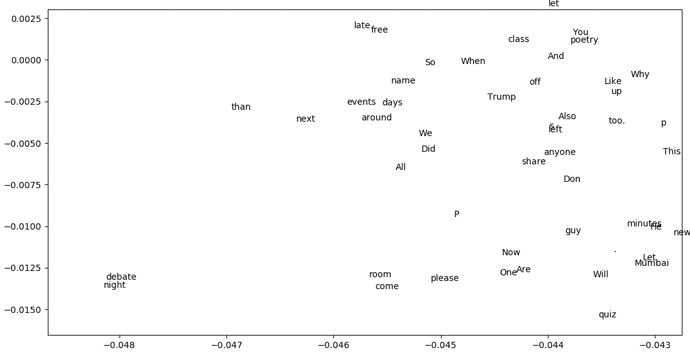

# 使用 FastText 和 SVD 即时可视化单词嵌入

> 原文：<https://towardsdatascience.com/using-fasttext-and-svd-to-visualise-word-embeddings-instantly-5b8fa870c3d1?source=collection_archive---------4----------------------->

不久前，当我开始学习自然语言处理的基础知识时，我对单词被表示为向量的方式很感兴趣。更吸引人的是单词被标绘在图表上，那些具有相似含义和上下文的单词被组合在一起。因此，我努力生成自己的嵌入，这是一场“斗争”，因为我缺乏计算能力。用于生成向量的 Word2Vec 和用于可视化的 T-SNE 是流行的选择，但是花费了我很多时间。

嗯，到现在也没变。然而，我发现脸书的快速文本让我大吃一惊。过去需要几个小时才能完成的事情，现在只需几秒钟就能完成，而且性能几乎相同。除此之外，我使用了一些线性代数来找出可能是“最快”生成你自己的单词嵌入可视化的方法。让我们现在就开始这个过程，写一些代码。

**1。获取数据**

我决定从 Whatsapp 获取聊天数据。我占用了我大学的文学和辩论俱乐部(LDC)的数据。这是因为我们已经讨论了广泛的话题，而且数据总量接近 1.1 Mb，对于任务来说已经足够了。

**2。一些预处理**

有些问题需要注意。首先，如果没有保存联系人姓名，在每一个新行的开头都有联系人的电话号码。此外，在聊天中有一些奇怪的特殊字符代表表情符号，但这对我们的任务来说是一个头痛的问题。所以，我使用了一些正则表达式技巧来清理文本。

**3。设置快速文本**

现在让我们来看看这个大家伙。设置脸书的快速文本是小菜一碟。你所需要的只是一个现代的 C++编译器(C++ 11)和一个 make 命令。FastText 是用纯 C++编写的，这也是它实现如此之快的另一个原因。

a.去[https://github.com/facebookresearch/fastText](https://github.com/facebookresearch/fastText)克隆回购。

b.切换到下载的目录，在你的终端上输入 *make* 命令

c.瞧啊。FastText 可以使用了。

**4。对我们的数据使用 fast text**

我们现在将使用 fasttext 库为我们清理的数据生成单词向量。为此，在 fasttext 目录中打开您的终端并键入-

'''.' '/fast text skip gram-input LDC _ clean . txt-output model ' ' '

让我给你解释一下这个声明。

。/fasttext —使用我们刚刚编译的 fasttext 模块退一步，咄？

skigram —有两种流行的方法来生成单词的矢量表示。CBOW 和 Skipgram。我们在这里选择 skipgram。

-input ldc_clean.txt —我们将包含文本数据的文件名指定为输入参数。

-output model——它指定了 FastText 将生成的两个输出文件的名称。`model.vec`是包含单词 vectors 的文本文件，每行一个。`model.bin`是一个二进制文件，包含模型参数、字典和所有超参数

**5。从生成的 model.vec 设置 python 列表**

现在，我们在一个. vec 文件中有了单词和向量，但是为了绘制它们并对向量执行 SVD，我们需要将单词转换为一个列表，并将相应的向量转换为另一个列表。在此过程中，我们还需要将向量值从 string 转换为 numpy 的 float32 类型，以实现上述操作。

**6。利用奇异值分解降低维数。**

当我第一次在谷歌上搜索时，我发现 T-SNE 到处都在通过降低维度来产生一些令人惊讶的可视化效果。毫无疑问，我是它的忠实粉丝。但可悲的是我的计算能力没有。所以，我决定，为什么不用老式的奇异值分解。它非常有效。这也是使用 FastText 的首要目的，也就是说，给出真正快速的结果。

**7。有趣的部分。绘制我们的数据以创建有洞察力的可视化**

现在，我们需要的东西都有了。一个很好的列表，包含了所有的单词和一个非常简化的表示，我们最初的高维向量表示。我们现在要做的就是使用 Matplotlib 并生成一些视觉效果。

就在那里，伙计们，这可能是你能找到的最快的方法，用脸书的快速文本在几秒钟内训练它生成单词的向量表示，然后做一点线性代数魔法，让可视化完全不实时。

我计划发布一个帖子来解释隐藏在幕后的所有复杂的数学问题。它将讨论 FastText 如何在如此短的时间内实现 SOTA 结果，以及如何帮助它击败现有的竞争对手，如 Word2Vec，特别是在训练时间方面。所以，如果你喜欢这个，你肯定会喜欢那个。所以，敬请期待，继续嵌入！

Who’s up for a debate night?

页（page 的缩写）图像被高度放大，因为视觉化的密度极高。使用 matplotlib 的缩放功能来做到这一点。