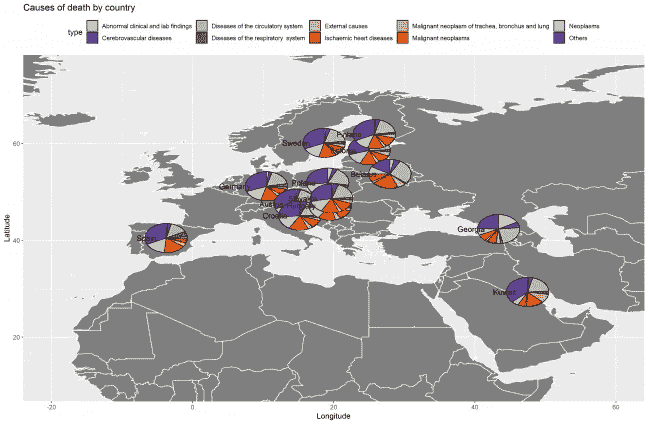
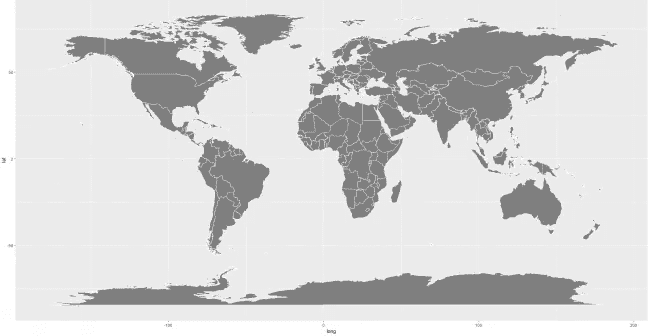
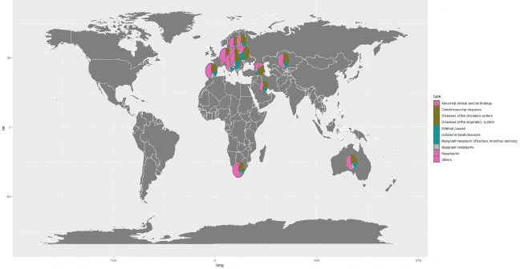

# 使用 ggplot 在地理地图上绘制饼图

> 原文：<https://towardsdatascience.com/using-ggplot-to-plot-pie-charts-on-a-geographical-map-bb54d22d6e13?source=collection_archive---------8----------------------->

在这篇文章中，我们将详细介绍在世界地图上绘制饼图的步骤，如下图所示。

Plot showing the leading causes of death in the year 2014 for various countries

当我意识到我需要创造一个和这个一样的东西时，这张图片可能让你和我一样害怕。“我连 R 编程都不擅长，事实上，还是个新手，我该怎么做这件事呢？”你可能正在问自己这个问题，或者你已经问过了。我理解你，但我得到了你。我在做我的第一个地图绘制时挣扎了很久，这就是为什么我将与你分享如何使用 ggplot 一步一步完成它的方法，让你从所有的谷歌搜索和试错中解脱出来。

这样，在我们进行这些步骤时，我们将使用真实世界的数据来回答一个特定的问题。

"每个国家的死亡原因分布有差异吗？"

我设法从[kaggle.com](https://www.kaggle.com/dataquantum/death2014)获得了一个关于世界上每个国家死亡原因的体面数据，这些数据将用于我们的插图和模拟。

**准备数据**

我们需要做的第一件事是确保我们的数据是完整的，在绘图之前我们有我们需要的东西。在这种情况下，我们需要每个国家的死亡原因数据以及每个国家的坐标。然后，我们将它加载到我们的工作环境中，如下所示。

一旦我们完成了所有需要的数据，我们将继续决定我们将要做的地图绘制的方法。我们有几个选项用于 ggplot，因为它很容易获得世界地图数据。

Rdocumentation.org 有一个非常友好的文档，包含了大部分 r 包和函数，所以如果你是 r 新手，我真的建议你去看看

其中 map 是 *maps* 包中提供的地图的名称。map_data("world ")即时获取我们绘制世界地图所需的数据。

其中 database 是要绘制的地图数据(查看 maps::map()以获取可用的地图)。borders("world ")获取数据以创建世界的边界。

最后，使用形状(。shp)文件。我们需要获得我们感兴趣的地图的形状文件。在这种情况下，我研究了一个. shp 文件并使用

其中 dsn 是我们感兴趣的形状文件。从 readOGR 获得的数据还不能用于绘图。我们将使用

其中“模型”是需要转换为数据框的模型或 R 对象。fortify(world)将我们从。shp 文件转换为有用的数据框，以备打印。

我已经决定使用这三个工具，但是你可以在你的项目中选择一个，最简单和最适合你的。

**基础地图地块**

这些代码的输出看起来很接近。

World map

**添加馅饼**

为了将饼图添加到地图绘图中，我们将在原始 ggplot 公式中添加一个 geom_scatterpie 函数，如下所示。

World map with the distribution of death causes per country

**添加标签、图表标题、轴标题等**

为了改善我们可视化的外观，我们将通过向 ggplot 公式添加一些新函数来为图表添加一些附件。

这就对了。我们在世界地图上标出了每个国家的死亡原因分布。我们可以看到，除了白俄罗斯和格鲁吉亚之外，几乎所有这些国家都有相同的分布，因为与其他国家相比，白俄罗斯和格鲁吉亚的循环系统疾病发病率较高。

我上面给你展示的方法只是一种方法。其他可以尝试的地图绘制方法有:tmap 包中的 [ggmap](https://www.rdocumentation.org/packages/ggmap/versions/2.6.1/topics/ggmap) 、 [mapplot](https://www.rdocumentation.org/packages/latticeExtra/versions/0.6-28/topics/mapplot) 、 [qtm](https://www.rdocumentation.org/packages/tmap/versions/2.1-1/topics/qtm) 、[传单](https://www.rdocumentation.org/packages/leaflet/versions/2.0.2/topics/leaflet)等。我强烈建议你也试一试。

在这个[库](https://github.com/mfmakahiya/Map-plot)中可以获得在这个模拟中使用的所有文件的副本。

*原载于 2018 年 10 月 25 日*[*www.spectdata.com*](http://www.spectdata.com/index.php/2018/10/25/how-to-use-ggplot-to-plot-pie-charts-on-a-map/)*。* Marriane Makahiya，作者是 SpectData 的数据科学家。SpectData 是一家数据分析公司，旨在帮助公司更好地利用他们的数据。