# 从 Git 到 Colab，通过 SSH

> 原文：<https://towardsdatascience.com/using-git-with-colab-via-ssh-175e8f3751ec?source=collection_archive---------9----------------------->

## 如何将 Git 与 Colab 集成，以便克隆您的公共/私有存储库。

当你使用谷歌的联合实验室(Colab)来运行你的深度学习模型时，访问大型数据集最明显的方法是将它们存储在谷歌驱动器上，然后将驱动器安装到 Colab 环境中。但是许多用于研究目的的开源大型数据集都托管在 Github/Gitlab 上。幸运的是，Colab 提供了一种集成 Github 和访问存储库的简单方法。那么，让我们来详细看看这些步骤。

# Colab — Git —集成:

我将在两种情况下解释集成:

1.  使用公共 Git 存储库(没有 SSH)
2.  使用私有 Git 存储库(使用 SSH)

# 克隆一个公共 Git Repo:(没有 SSH)

集成只是几行代码——当您想要克隆的 git 存储库是一个公共存储库时。

*   将 Google Drive 安装到您的 Colab 环境中。

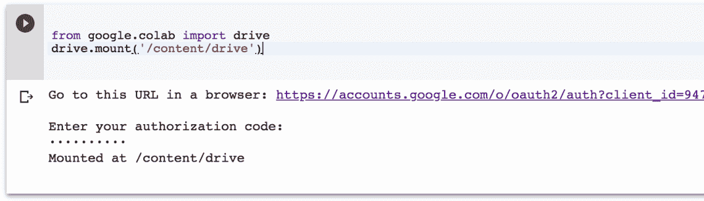

在执行上面的 2 行代码时，系统会提示您转到所示的 Google Accounts URL 进行身份验证。单击显示在笔记本单元格输出部分的 URL。这将带您进入如下页面:

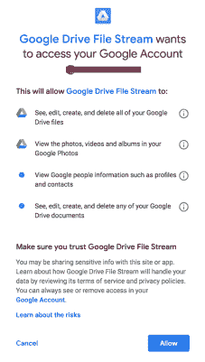

点击允许按钮。这将把你带到下一页，在那里显示一个授权码(我用红色标出)。

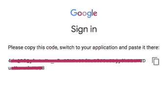

复制此代码并将其粘贴到单元格(如第一个图像所示)中显示“输入您的授权码”的位置，然后单击 Enter。Google Drive 现在已安装，您会收到确认消息。

*   将您的公共 Git repo 克隆到您的驱动器文件夹中。执行上述步骤后，驱动器文件将出现在路径 *"/content/drive/My Drive"* 中，您可以使用左侧的面板浏览它们。

然后，您可以将任何驱动器文件夹设置为工作目录。然后将公共 git repo 克隆到您的工作目录中。这两个步骤的实现如下:

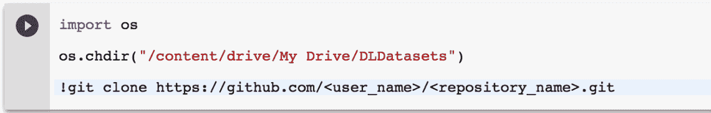

# 克隆一个私有 Git Repo:(使用 SSH)

不幸的是，你不能轻易地克隆你的私有库。事实上，在这种情况下，您可以使用一行程序，如下所示:

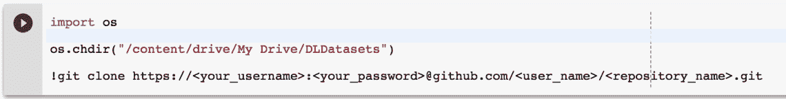

也就是说，提供您的*用户名:密码*以及存储库链接来克隆一个私有存储库。这是可行的，但是问题是密码存储在 git/config 和 bash 历史日志中。因此，以上述方式克隆您的私有回购协议是不可取的。相反，我们将使用 SSH 协议将您的私有 github/gitlab repo 连接到 colab。

*   第一步是在本地机器上生成 ssh 密钥对(私有-公共)。你可以通过[这篇优秀的文章](https://www.digitalocean.com/community/tutorials/how-to-set-up-ssh-keys--2)(文章的第 1 步和第 2 步)来了解如何做到这一点。但是我会马上提供必要的步骤:

> ssh-keygen-t RSA-C " your _ email @ your email . com "
> 
> #出现提示时输入文件名:~/。ssh/id_rsa_<some_name></some_name>
> 
> #输入密码短语:只需按“Enter”(无密码短语)

*   私钥保存在文件: *~/。ssh/id _ RSA _<some _ name>*并且公钥保存在文件: *~/。ssh/id_rsa_ < some_name >。pub* 将这两个文件复制到一个文件夹中。我将这两个文件的副本放在一个文件夹中，并将其命名为*‘ssh-colab’*。
*   接下来创建一个配置文件

> 触摸配置
> 
> 编辑配置

*   配置文件的内容应该如下所示:

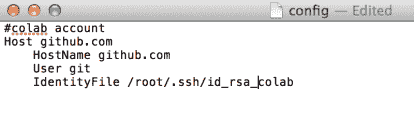

*   现在将配置文件也放在在*‘ssh-colab’*之前创建的文件夹中。然后存档为 *'ssh.tar.gz'* :

> tar-czvf ssh.tar.gz ssh-colab

*   这个包含私钥、公钥和配置文件的归档文件夹必须上传到 Colab。我们马上就会看到这一点。但在此之前，我们先把公钥放在服务器上(Github/Gitlab)。
*   将文件 *id_rsa_ < some_name >中的公钥内容复制到剪贴板。发布会*
*   登录 Github
*   点击你的*个人资料>设置> SSH 和 GPG 键>新建 SSH 键*
*   粘贴剪贴板的内容并保存
*   现在是在 Colab 上执行的步骤。首先让我们上传档案文件*‘ssh . tar . gz’。*

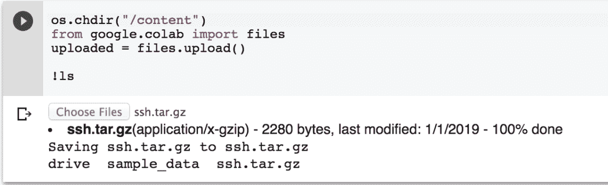

*   现在我们需要将密钥对文件和配置文件移动到/root/中。ssh 文件夹。下图详细给出了要执行的 shell 命令:

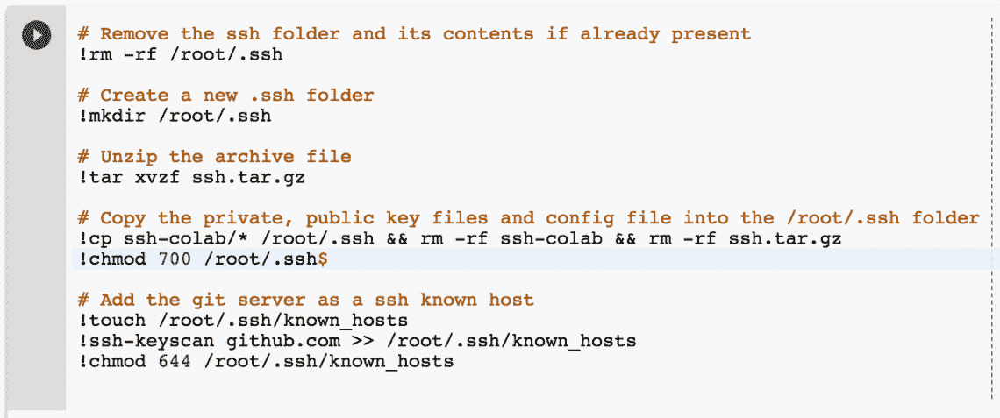

*   下一步是将私钥加载到本地 ssh-agent 中。这背后的原因在[这个 stackoverflow 帖子](https://stackoverflow.com/questions/10054318/how-to-provide-username-and-password-when-run-git-clone-gitremote-git?noredirect=1&lq=1)的标记答案中解释得很清楚。我将在下面给出它的要点:

> “您希望在登录时在后台运行`ssh-agent`。一旦你登录，这个想法就是运行`ssh-add`一次并且只运行一次，以便给代理你的密码，解码你的密钥。然后，代理将您的密钥解锁并加载到内存中，随时准备在您每次 ssh 时使用。然后，所有 ssh-family 命令 1 将咨询代理，并自动能够使用您的私钥。”

*   因此，要运行您的 ssh-agent，请使用以下命令

*   在单元的输出部分，您会收到一条警告消息，ssh-agent 开始运行。您会得到一个可以执行 shell 命令的提示。请参见下图，我们在其中添加了私钥，然后检查新密钥是否已保存:

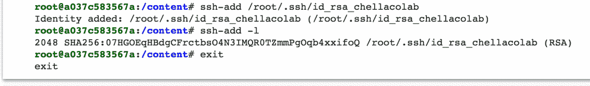

*   在下一步中设置您的 Git 帐户

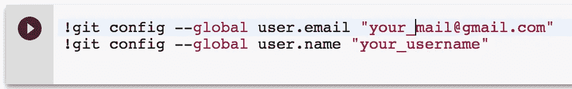

*   我们现在可以克隆我们的私有 git 存储库了。将工作目录更改为驱动器内的一个文件夹。然后运行 git clone。

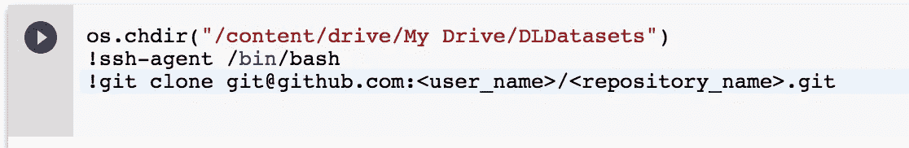

仅此而已！我们已经从 Colab SSH-ed 进入我们的 Git 帐户，并克隆了我们的私有存储库。

参考资料:

1.  [https://stack overflow . com/questions/48350226/methods-for-use-git-with-Google-colab](https://stackoverflow.com/questions/48350226/methods-for-using-git-with-google-colab)
2.  [https://stack overflow . com/questions/10054318/how-to-provide-username-and-password-when-run-git-clone-git remote-git？noredirect=1 & lq=1](https://stackoverflow.com/questions/10054318/how-to-provide-username-and-password-when-run-git-clone-gitremote-git?noredirect=1&lq=1)

*谷歌搜索商标的图片。版权分别属于 Colaboratory 和 Github。其他图片是我的作品截图。*

*原载于 2018 年 6 月 5 日*[*techsupportallbugs.wordpress.com*](https://techsupportallbugs.wordpress.com/2018/06/05/using-git-with-colab-via-ssh/)*。*