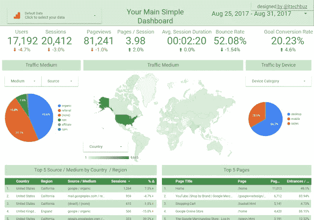
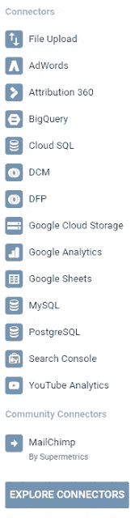

# 使用谷歌数据工作室

> 原文：<https://towardsdatascience.com/using-google-data-studio-55ccf4a828c4?source=collection_archive---------6----------------------->

Simple Explorer Dashboard

谷歌推出谷歌数据工作室已经有一段时间了，并提供免费使用(其中一个版本)。谷歌数据工作室是一个报告和可视化工具。

在设计报告、仪表板和/或演示文稿时，我们应考虑并阐述以下问题:

*   这个仪表板是给谁的？
*   仪表板的用途是什么？
*   我们将回答哪些问题？
*   什么是比较期？
*   理解起来简单吗？
*   信息的处置情况如何？

如果我们回答了这些问题，我们将拥有一个简单的、包含我们需要的信息的仪表板！

这是一个示例仪表板，您可以使用此 [Google Data Studio 报告和 Google Analytics 数据源](https://datastudio.google.com/open/0B6kVJH4fgWj8OVF6LUhBVUVwU0k)(拥有一个 Google 帐户并为您自己制作一份副本)默认情况下在 Google Analytics 中使用演示 Google 帐户，但您可以使用默认数据按钮更改为您自己的数据。

Data Sources Connectors on Data Studio

Google Data Studio 用户社区现在创建了多个数据源来进一步扩展它的用途！

在我们的左边，你可以看到本地数据源连接器。

有一些超级用户对谷歌分析和谷歌数据工作室的区别感到困惑？
嗯，它们是不同的工具谷歌分析是一个网络分析工具，而谷歌数据工作室是一个报告和仪表板的生成器，谷歌分析是一个数据源，还有其他数据源，如谷歌广告词。