# 通过机器学习图像分割增加发展中国家对太阳能的采用

> 原文：<https://towardsdatascience.com/using-image-segmentation-to-identify-rooftops-in-low-resolution-satellite-images-c791975d91cc?source=collection_archive---------9----------------------->

> 这项工作由 Jatinder Singh 和 Iresh Mishra 共同完成。也感谢[索拉博·辛格](https://www.linkedin.com/in/saurabhdotio/)的指导。

过去，我曾写过[机器学习如何在清洁能源领域带来一个新时代](https://medium.com/savera-ai/machine-learning-bringing-a-new-era-in-the-energy-sector-distributed-abundant-and-a-clean-world-cf06365c29ff)，以及我们如何利用[一个 ML 爱好者社区来构建解决方案](https://becominghuman.ai/the-potential-of-communities-and-machine-learning-for-good-8a165691184d)。在本文中，我将分享其中一项任务的结果(从卫星图像中识别屋顶)。

由于来自印度(和大多数发展中国家)的卫星图像的质量是低分辨率的，手头的任务的复杂性增加了。类似的解决方案如[谷歌天窗项目](https://www.google.com/get/sunroof#p=0)仅适用于高分辨率图像，不适用于大多数发展中国家。

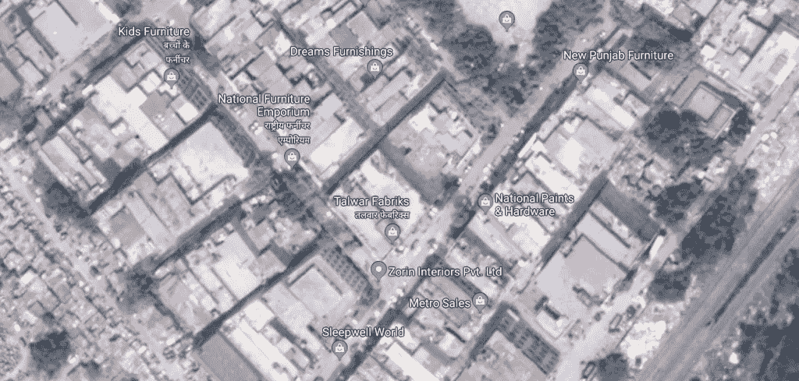

Satellite images of Delhi

我们的第一步是确定最适合这项任务的算法。

# 步骤 1:算法的识别

我们最初开始使用计算机视觉的图像分割算法。目标是通过识别屋顶的边缘将图像分割成屋顶和非屋顶。我们的第一次尝试是使用分水岭图像分割算法。当提取图像中的接触或重叠对象时，分水岭算法特别有用。该算法速度很快，计算量小。在我们的例子中，一幅图像的平均计算时间是 0.08 秒。

以下是分水岭算法的结果。

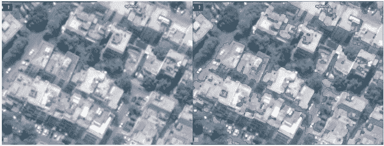

Original image(left). The output from the Watershed model(right)

如你所见，输出不是很好。接下来，我们实现了 Canny 边缘检测。像 Watershed 一样，这种算法也广泛用于计算机视觉，并试图从不同的视觉对象中提取有用的结构信息。在传统的 Canny 边缘检测算法中，有两个固定的全局阈值来滤除伪边缘。然而，随着图像变得复杂，不同的局部区域将需要非常不同的阈值来准确地找到真正的边缘。所以有一种技术叫做 auto canny，自动设置下限和上限。下面是自动报警的 Python 函数:

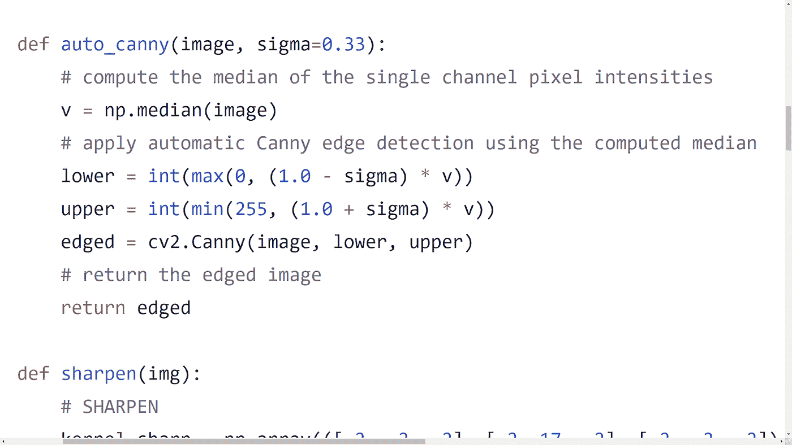

Canny 边缘检测器处理一幅图像的平均时间约为。0.1 秒，很不错了。其结果优于分水岭算法，但精度仍不足以满足实际应用。

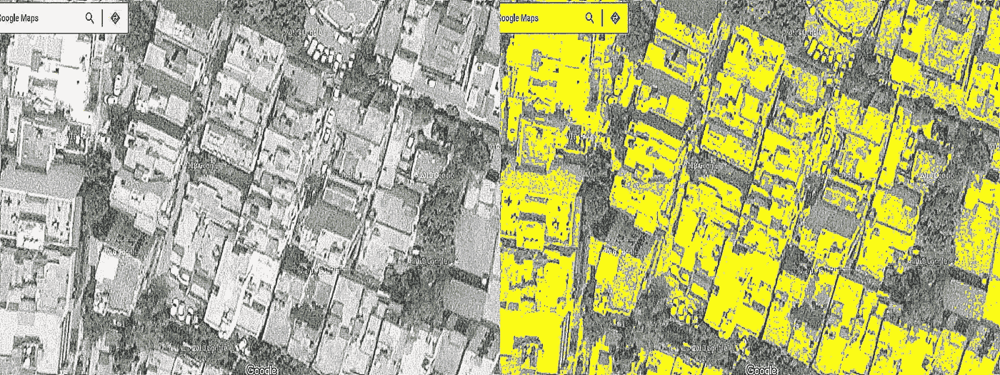

The output from the Canny Edge detection algorithm

上述两种技术都使用图像分割，并且在不理解我们试图检测的对象(即屋顶)的上下文和内容的情况下工作。当我们用物体(即屋顶)的样子来训练算法时，我们可能会得到更好的结果。卷积神经网络是理解图像上下文和内容的最先进技术。

如前所述，我们希望将图像分割成两部分——屋顶或非屋顶。这是一个语义切分问题。语义分割试图将图像划分成语义上有意义的部分，并将每个部分分类到预定的类别之一。

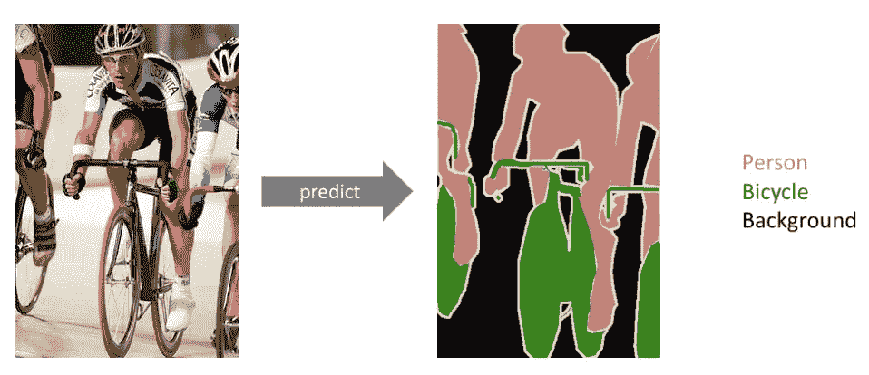

Semantic Segmentation (picture taken from [https://www.jeremyjordan.me/semantic-segmentation/](https://www.jeremyjordan.me/semantic-segmentation/))

在我们的例子中，图像的每个像素都需要被标记为屋顶的一部分或者不是。

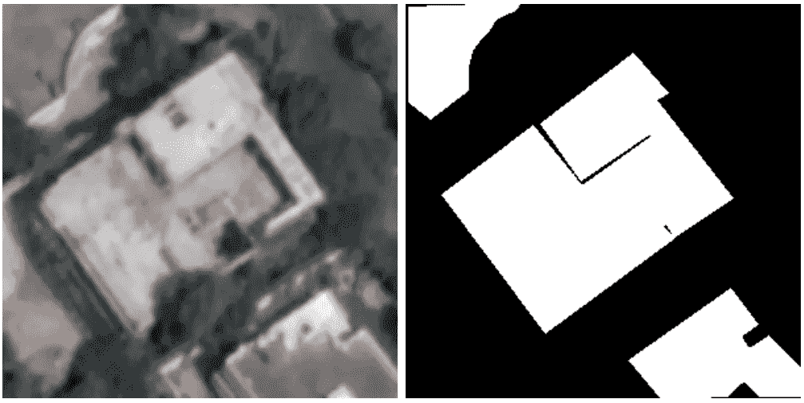

We want to segment the image into two segments — roof and not roof(left) for a given input image(right).

# 步骤 2:生成训练数据

为了训练 CNN 模型，我们需要一个带有印度建筑及其相应面具的屋顶卫星图像的数据集。没有可用于印度建筑物带有面具的屋顶图像的公共数据集。所以，我们必须创建自己的数据集。一组学生标记了图像并创建了蒙版图像(如下)。

Generating dataset by marking the edges

这是屏蔽后的最终输出。

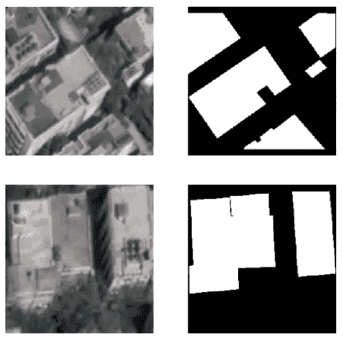

虽然我们知道 U-Net 模型使用较少数量的图像作为数据，但首先，我们的训练集中只有 20 张图像，这远远低于任何模型，甚至我们的 U-Net 也无法提供结果。处理较少数据的最流行的技术之一是数据扩充。通过数据扩充，我们可以使用数据集中的图像生成更多的数据图像，只需在原始图像中添加一些基本的改变。

例如，在我们的例子中，任何屋顶图像当旋转几度或水平或垂直翻转时，将作为新的屋顶图像，假设旋转或翻转是以精确的方式，对于屋顶图像和它们的遮罩。我们在已经标记的图像上使用 Keras 图像生成器来创建更多的图像。

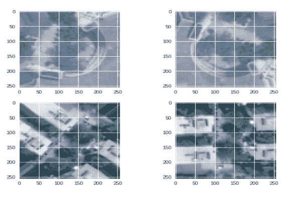

Data Augmentation

# 步骤 3:预处理输入图像

我们试图锐化这些图像。我们使用了两种不同的锐化滤镜——低/软锐化和高/强锐化。锐化之后，我们应用双边滤波器来减少锐化产生的噪声。下面是一些用于锐化的 Python 代码行

低锐化滤波器:

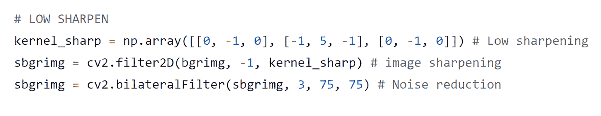

高锐化滤波器

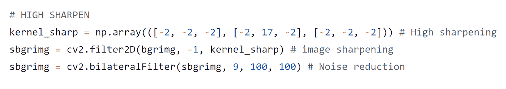

下面是输出。

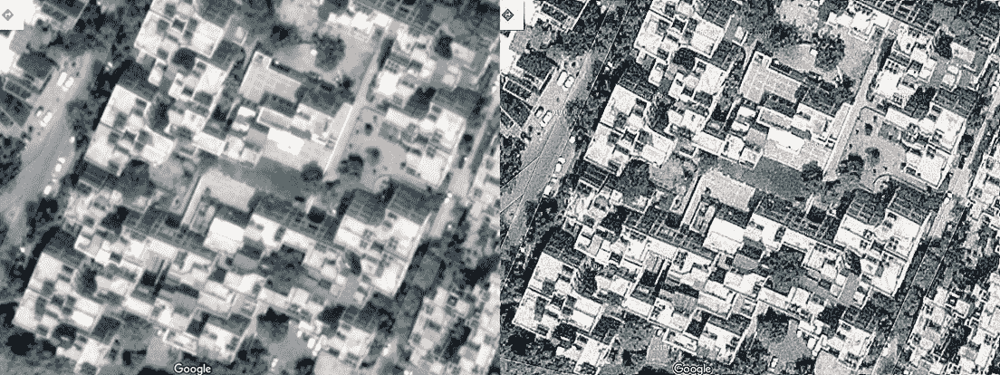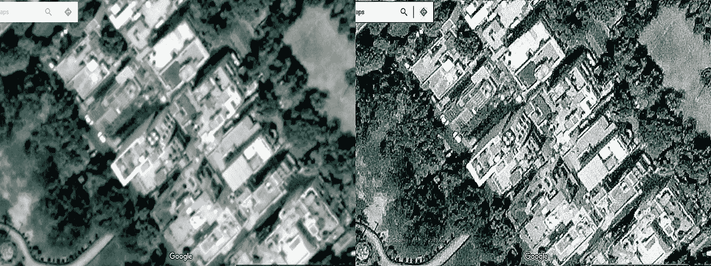

我们将单独写一篇关于锐化图像的文章，所以这里将跳过更多的细节。

# 步骤 4:训练和验证模型

我们生成了 445 幅图像的训练数据。接下来，我们选择使用 [U-Net](https://arxiv.org/abs/1505.04597) 架构。U-net 最初用于生物医学图像分割，但由于它能够达到良好的效果，U-net 正在应用于各种其他任务。是图像分割的最佳网络架构之一。在我们使用 U-Net 模型的第一种方法中，我们选择使用学习率为 0.0001 的 [RMSProp 优化器](/a-look-at-gradient-descent-and-rmsprop-optimizers-f77d483ef08b)，具有[骰子损失](https://arxiv.org/abs/1707.03237)的[二元交叉熵](https://rdipietro.github.io/friendly-intro-to-cross-entropy-loss/#entropy)(这里的[实现来自](https://github.com/brine-io/u-net-segmentation-example/blob/master/model/losses.py))。我们运行了 200 个时期的训练，平均(最后 5 个时期)训练骰子系数是. 6750，验证骰子系数是. 7168

以下是我们从验证集(40 幅图像)中获得的第一种方法的结果:

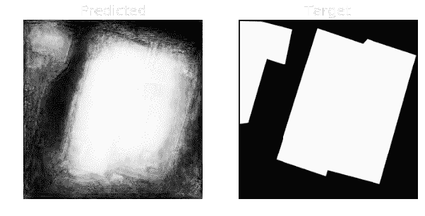

Predicted (left), Target (right)

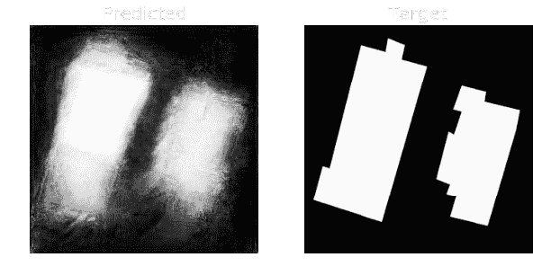

Predicted (left), Target (right)

正如你所看到的，在预测的图像中，在预测的遮罩的中间和角落有一些建筑物结构的 3D 痕迹。我们发现这是由于骰子的丢失。接下来，我们使用学习速率为 1e-4、衰减速率为 1e-6 的 [Adam](https://arxiv.org/abs/1412.6980) 优化器来代替 RMSProp。我们使用 IoU 损耗而不是 BCE+Dice 损耗和 Keras 的二进制精度指标。训练进行了 45 个周期。平均(最后 5 个时期)训练精度为:0.862，平均验证精度为:0.793。以下是来自第二种方法的验证集上的一些预测掩码:

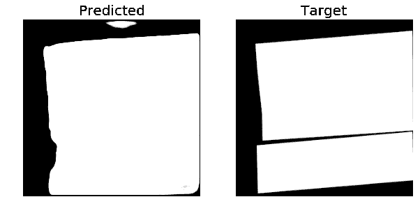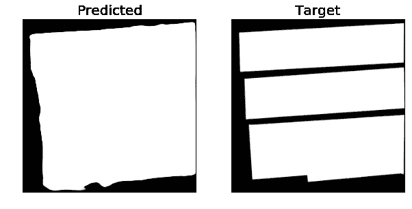

这是测试数据的结果

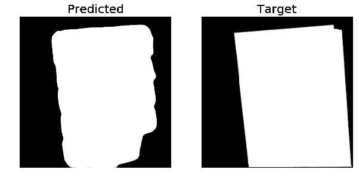

Test data

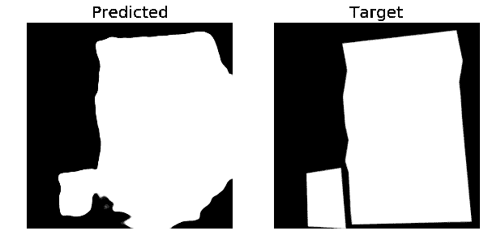

Test data

我们很高兴看到目前的结果，并希望通过更多的数据进一步改善结果。

最后，我们还要感谢 Abhigyan 和 Aman 提供的训练数据。如果有人想进一步帮助我们，请加入我们的 git 回购或联系 rudradeb@omdena.com