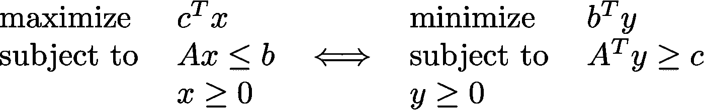
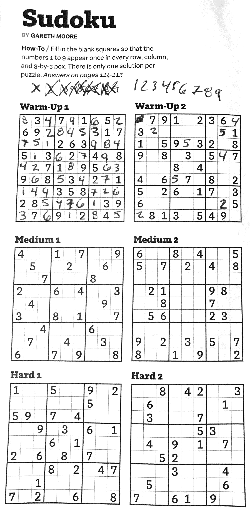
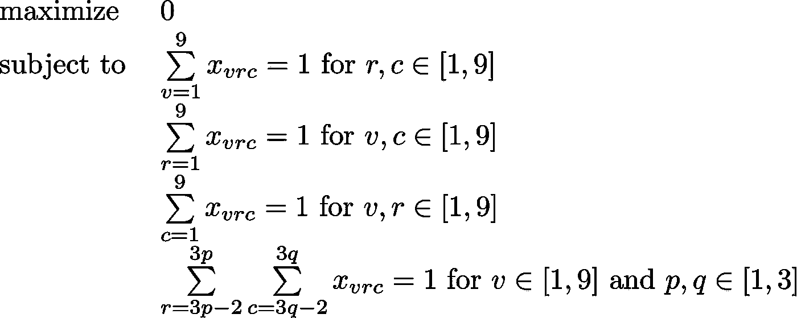
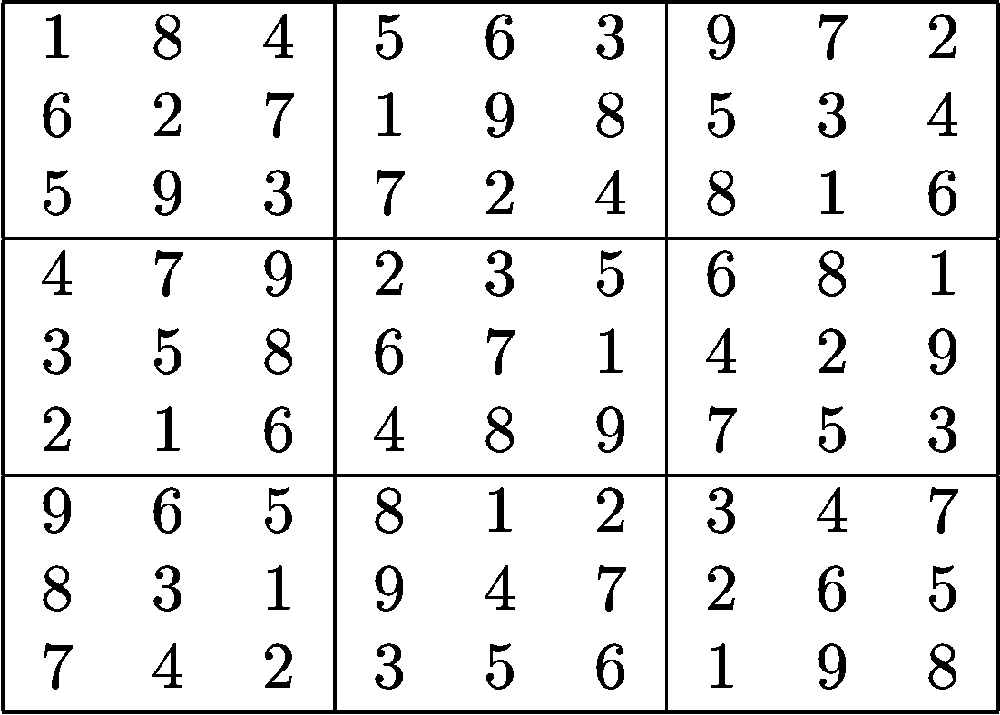

# 用整数线性规划解决数独难题

> 原文：<https://towardsdatascience.com/using-integer-linear-programming-to-solve-sudoku-puzzles-15e9d2a70baa?source=collection_archive---------1----------------------->

如果你更擅长线性编程，而不是用传统的方法解决数独难题，那么这篇博文就是为你准备的！

我刚刚结束了研究生院的第三个学期，我想写一篇关于我在算法课程中学到的一些东西的短文。我最喜欢的话题是线性编程，事实证明同样的原理也适用于解决数独难题。

如果你可以用一个线性**目标函数**和线性**不等式约束**，[线性规划](https://en.wikipedia.org/wiki/Linear_programming) (LP)来表述一个问题，那么它就是寻找其最优解的有力工具。换句话说，如果你能把一个问题写成:

Primal (left) and dual (right) formulations of linear programming problems — maximize or minimize an objective function, subject to inequality constraints where b, c, x and y are vectors and A is a matrix.

你可以找到最优参数 *x* 或者 *y.* (比如 LP 可以用来[分配工作，最小化运输成本](https://www.math.ucla.edu/~tom/LP.pdf)，或者创造[健康饮食](https://jeremykun.com/2014/06/02/linear-programming-and-the-most-affordable-healthy-diet-part-1/)。)LP 的一种特殊类型是[整数线性规划](https://en.wikipedia.org/wiki/Integer_programming) (ILP)，由此我们将参数 *x* 或 *y* 限制为整数*。*

在这篇文章中，我想研究 ILP 的一个特殊应用:解决数独。(感谢西南航空机组提供我的拼图和零食！)

Courtesy of the December 2017 issue of [Southwest Magazine](https://www.southwestmag.com). I will show how to solve “Hard 1” using LP.

## 目标函数

与典型的 LP 或 ILP 问题不同，数独没有比另一个更好的解决方案。在我们的例子中，我们希望找到任何可行的解决方案——一个满足我们的约束的方案。因此，我们可以指定一个任意的目标函数。

## 线性约束

一个难题包括填充一个 9×9 的网格，这样每一行、每一列和每一个 3×3 的子网格只包含一个整数值。换句话说，你不能在左下方的第一行、第一列或第一个子格子中输入另一个数字。

因为每个框可以填充九个值，并且我们被约束在九行九列中的每一行，所以我们有 9 = 729 个参数。下面我们将用 *v* (值) *r* (行) *c* (列)*来索引 *x* 中的这些值。*

更具体地，我们可以将我们的目标函数和线性约束公式化如下:

Primal formulation for solving a generic sudoku problem. Note the arbitrary objective function mentioned earlier. Most of the heavy lifting occurs within the four constraints above. Adapted from [http://profs.sci.univr.it/~rrizzi/classes/PLS2015/sudoku/doc/497_Olszowy_Wiktor_Sudoku.pdf](http://profs.sci.univr.it/~rrizzi/classes/PLS2015/sudoku/doc/497_Olszowy_Wiktor_Sudoku.pdf).

第一个约束要求每个单元格(由其行和列表示)包含一个值。第二个和第三个约束保持列和行中分别只包含一个值。最后一个约束确定了在每个子网格中只能找到一个值。

当您试图解决任何特定的数独时，甚至需要指定更多的约束，即每个非空单元格的初始状态。

## 解开谜题

我使用名为 [PuLP](https://github.com/coin-or/pulp) 的用于解决 LP 问题的 Python 包来解决上面的“困难 1”数独。纸浆有一些很好的[现有文档](https://www.coin-or.org/PuLP/CaseStudies/a_sudoku_problem.html)关于如何使用它的软件来解决这个问题。这是用 LP 解决数独难题的又一个[详解](https://diego.assencio.com/?index=25ea1e49ca59de51b4ef6885dcc3ee3b)，附带[补充码](https://github.com/dassencio/sudoku)。

我改编的[纸浆的数独例子](https://github.com/coin-or/pulp/blob/master/examples/Sudoku1.py)可以在这里找到[。请注意，我的](https://gist.github.com/allisonmorgan/c2f831cb01532fe51834f471634f4d58)[编辑约束](https://gist.github.com/allisonmorgan/c2f831cb01532fe51834f471634f4d58#file-sudoku-py-L52-L79)只是满足我的特定谜题的起始状态。

我希望你喜欢我解决数独难题的乐趣。说到捣乱，请注意:**以下是我的谜题解答。**

## 相关阅读

*   [达斯古普塔、帕帕迪米特里奥和瓦齐拉尼的算法](https://www.amazon.com/Algorithms-Sanjoy-Dasgupta/dp/0073523402)，第 7 章
*   [CLRS](https://en.wikipedia.org/wiki/Introduction_to_Algorithms) ，第 29 章