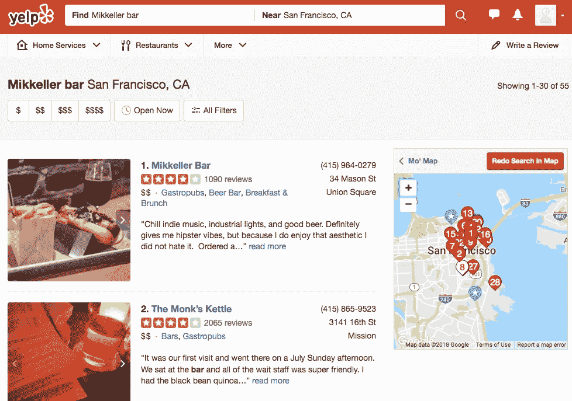
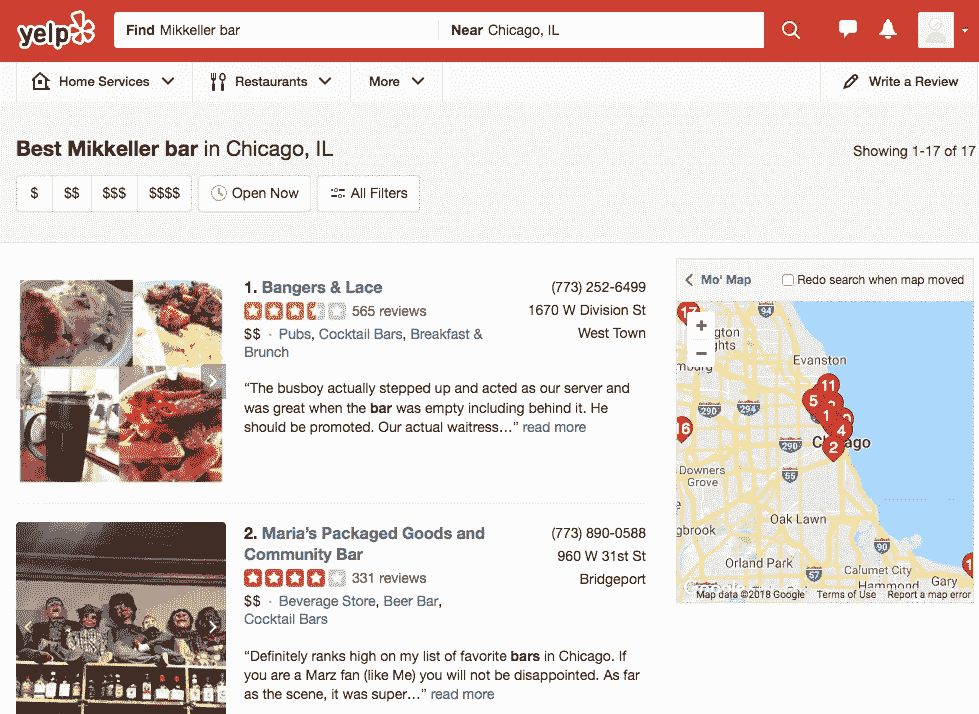
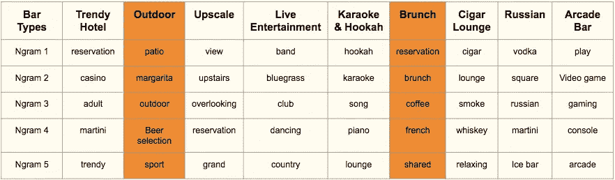
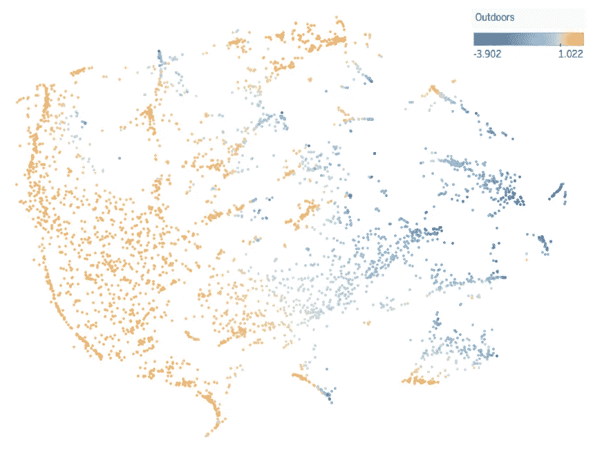
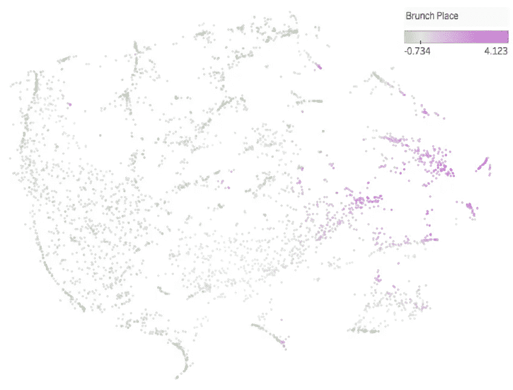
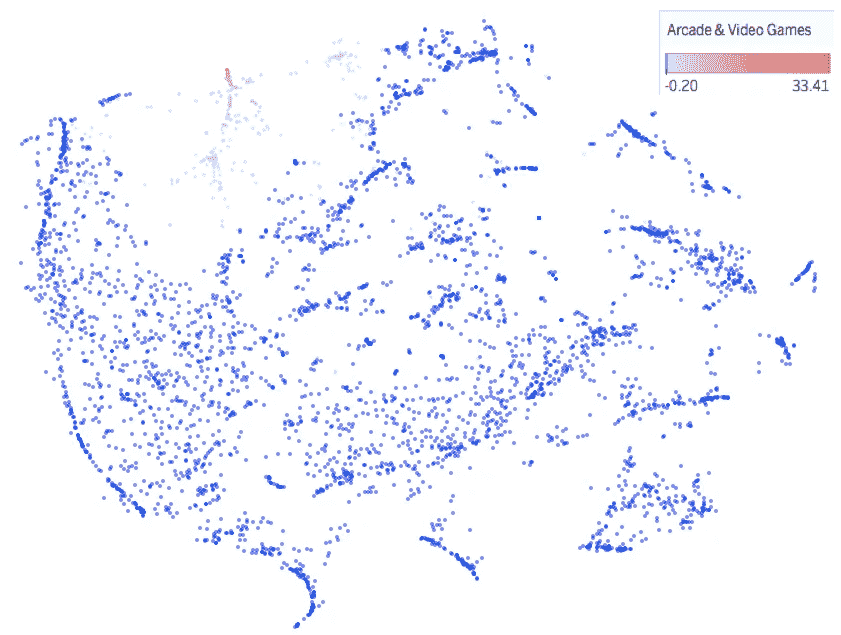
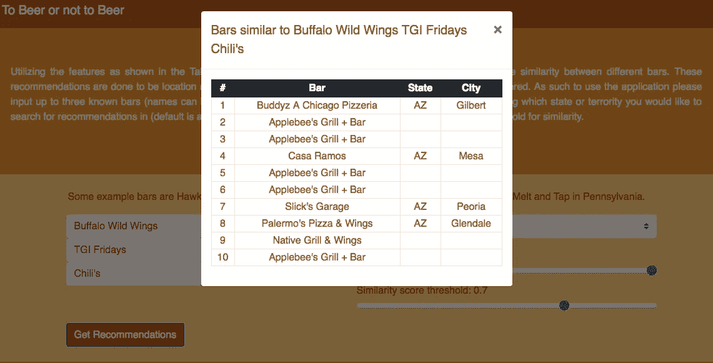
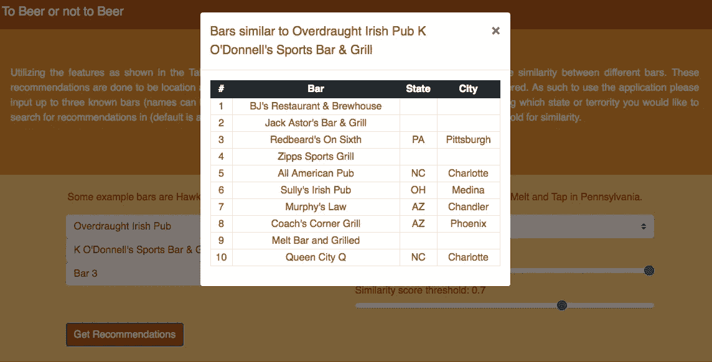
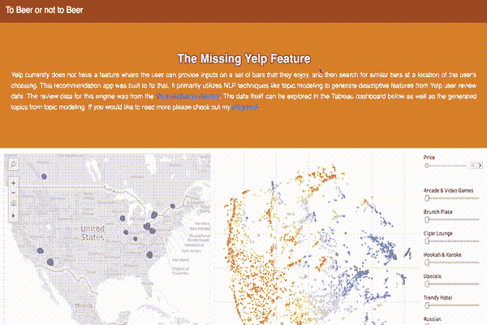

# 使用 LDA 构建缺失的 Yelp 特征

> 原文：<https://towardsdatascience.com/using-lda-to-build-a-missing-yelp-feature-43436e575d65?source=collection_archive---------9----------------------->

如果你曾经在旧金山的金融区外出喝酒，你可能会偶然发现 [Mikkeller 酒吧](https://www.yelp.com/biz/mikkeller-bar-san-francisco)。这家丹麦啤酒馆是下班后和朋友一起去的好地方，这里的气氛非常活跃，足以进行精彩的交谈。有着丰富的名单和选择，这是我想经常去喝酒的地方。

现在，如果我在 Yelp 上搜索 Mikkeller，我不仅会得到酒吧本身，还会得到该地区类似简介的酒吧，如果我想尝试一个有类似氛围的地方，这很好。



但是，当您在不同的位置搜索时，这种类型的搜索不会转换。例如，如果我试图搜索芝加哥的 Mikkeller 酒吧:



虽然通过搜索特定的关键字(如 beer hall 或腹肌)可能会得到类似的结果，但我觉得应该实现更具体的搜索方法。为什么 Yelp 没有一个功能可以让用户在他们喜欢的栏上输入内容，然后在用户选择的位置上扩展搜索？这种搜索方法也能够捕捉到不太明显的方面，如环境。因此，我决定在我的第四个 [Metis](https://www.thisismetis.com/) 项目中，我将使用无监督学习和 NLP 技术来构建这个功能。

# 数据

## 数据来源:

为了这个项目，我最终从 [Yelp 挑战数据集](https://www.yelp.com/dataset/challenge)中获得了我的数据。Yelp 提供了一个公开的数据集，这是一个无价的资源，因为 Yelp 的 TOS 是非常反网络抓取的。该数据集本身非常庞大，因为有超过 600 万条针对 800，000 多家不同企业的评论，分布在美国和加拿大的 10 多个不同的大都市地区。如此多的地理多样性是我的项目的额外收获，因为我希望它是位置不可知的。Yelp 的数据存储在。json 格式，所以我使用本地 MongoDB 实例查询和过滤数据。回想起来。json 文件非常大(评论文本 JSON 为 4.72 GB)，如果我将所有内容都转移到一个大内存 AWS 实例中，那么这个项目的数据分析会更加高效。我的 Macbook Air 的 8 GB 内存不足以在不微观管理计算机资源的情况下对数据进行分析。

## 数据过滤:

将我的数据加载到 MongoDB 后，我进行数据处理的第一步是只过滤酒吧的企业列表。我的第一个方法(使用 [pymongo](https://api.mongodb.com/python/current/) )是执行一个正则表达式，匹配其类别类型中包含“bar”的任何业务。“酒吧”还必须有至少 50 个评论，以便有足够的文本数据进行推断:

```
# Create subset of business that contain bars in question
db.business.aggregate([
     {"$match": {'categories': {'$regex': 'Bars'}}},
     {"$match": {"review_count": {"$gte": 50}}},
     {"$out": "bars"}]);
```

这种方法最终将搜索的企业数量从 180，000+减少到 5000+。然而，我很快意识到的一个怪癖是，regex 方法不仅捕获酒吧或体育酒吧等酒吧类型，还捕获寿司店。我最终变得更加严格，编写了两个函数来返回一个只包含特定类别(在本例中为“酒吧”)的企业:

```
def check_for_cat(categories, cat_type):
    """
    Returns whether business is a given type, returns a boolean
    """
    # splits input category list from json file
    categories_list = categories.split(',')
    # loop through each category to see if it is equal to cat_type
    for category in categories_list:
        # lowercase the category & strip any extra spaces
        mod_cat = category.strip().lower()
        if mod_cat == cat_type:
            return True

    return False

def filter_yelplist(locations, cat_type):
    """
    Function that returns list of filtered yelp locations
    """
    return [loc for loc in locations
            if check_for_cat(loc['categories'], cat_type) == True]
```

这种额外的过滤给了我大约 4000+条。

接下来，我必须将每个酒吧的评论加入酒吧列表。通常在 SQL 数据库中，这可以通过一个简单 join 命令来完成。然而，MongoDB 有一个 NoSQL 数据库结构，所以我不能这样做(我用$lookup 命令做了实验)。我最终编写了以下查询来获取相关数据:

```
# Create subset of reviews that contain the bar ids
locations = list(db.bars.find({}, {'_id': 0, 'business_id': 1, 'categories': 1}))
filtered_bars = filter_yelplist(locations, 'bars')
allbar_ids = [i['business_id'] for i in filtered_bars]db.reviews.aggregate([
   {'$match': {'business_id': {'$in': allbar_ids}}},
   {"$out": "bar_reviews"}]);
```

在所有的数据处理之后，我最终得到了一个包含 4000 多个棒线的数据子集，每个棒线至少有 50 条评论。总共有 800，000 多条评论可供我分析。

## 文本处理

在过滤了数据之后，我仍然需要处理评论文本本身，然后将它传递给分词器。我做了三件事:

1.  使用正则表达式删除数字和标点符号
2.  将所有大小写类型转换为小写
3.  将所有单词词条化

[词汇化](https://en.wikipedia.org/wiki/Lemmatisation)很重要，因为我不想让模型包含同一个单词的不同形式。词汇化完成这个任务是因为它返回单词的词汇或“词典形式”，所以给定单词的复数和分词形式被替换为基本形式。例如，“行走”的引理会是“行走”，而“更好”的引理会是“好”。

# 特征工程

我觉得酒吧的氛围非常重要，因此我在用户评论中使用了 NLP 来捕捉这种氛围。在尝试了不同的令牌矢量化工具和降维技术之后，我最终使用了计数矢量化和潜在狄利克雷分配(LDA)的组合来给我最大的可解释性。

## …向量化…

在执行矢量化的过程中，我需要从评论文本中生成一个相关的标记列表。虽然 NLTK 提供了要排除的英语停用词的基本集合，但是在主题生成中还需要排除一些额外的标记。最终出现在排除列表中的令牌类型分为两类:与位置相关的和与食物相关的。为了使模型不可知位置，排除了与位置相关的标记，同时排除了与食物相关的标记，以便主题集中在饮料和环境上。就矢量器的类型而言，CountVectorizer 模型最终比 TFIDF 的性能更好。我相信 CountVectorizer 比 TFIDF 表现得更好，因为描述一个酒吧的重要词(如啤酒、音乐、饮料)会重复出现，CountVectorizer 最终会促进重复，而 TFIDF 则会惩罚它。

## 主题建模

通过使用 LDA，我能够执行主题建模并生成 9 个主题，我认为这些主题代表了我的数据集中不同类型的条形:



其中两个酒吧原型最终成为最具描述性的(户外和早午餐)，因为大多数酒吧最终都被这两个主题所描述。这可以通过这两个主题如何映射到 TSNE 图来证明:



其余的 7 个主题最终变得更加具体，因为它们通常描述了数据集中的几个条形。举例来说，街机和视频游戏酒吧最终被映射到我的 TSNE 情节如下:



## 分类特征

除了 NLP 生成的特征之外，模型中还添加了一些有价值的分类特征。Yelp 数据集实际上包含许多分类特征:例如，一个地方是否适合跳舞，或者他们是否有电视可用。然而，我决定不利用这些特性，因为我想通过主题建模来确定这些特性的代理。因此，我最终直接从数据集中提取的唯一分类特征是企业的价格范围。

虽然主题建模让我了解了酒吧的氛围，但我也希望我的模型关注酒吧的主要酒精类型。为了做到这一点，我决定在评论中放大某些关键词的存在。例如，对于每个小节，我检测到标记“威士忌”被提及的次数。将该计数除以总评论数，我得到了一个比例，它表明了一个给定的酒吧有多少是威士忌酒吧。我最终在关键词上创建了这些存在类型分类特征:威士忌、伏特加、啤酒、葡萄酒、龙舌兰酒、朗姆酒、烈酒、杜松子酒、白兰地、烧酒、苹果酒和清酒。

# 推荐引擎

## 给出建议

随着要素的建立，我创建了一个管道来为我的数据集中的每个条生成要素。通过将输入条形图的[余弦相似度](https://alan-j-lin.github.io/2018/08/24/project-fletcher/www.google.com/cosine_similarity)与数据集中的所有其他条形图进行比较，给出了一个建议。如果有多个条形图作为输入，则使用输入条形图平均矢量的余弦相似度。这种相似性比较形成了我的推荐引擎的基础。基于数据集，以下是一些可能的建议:



Some recommendations if you are the TGIF’s type of person



If you are interested in Irish pubs there appears to be plenty of options

该推荐引擎随后通过 dashboard 应用程序和交互式 Tableau 仪表板部署在 Heroku 上，如下所示:



如果您想自己尝试一些建议，您可以在这里访问应用程序[。](https://radiant-sea-47344.herokuapp.com/)

# 未来的工作

如果给我更多的时间来扩展这个项目，我会做一些改进:

*   **更多相关数据**:当前的数据集不包括旧金山或纽约州等主要都会区的酒吧位置，我认为这将有助于创建更相关的建议
*   **链接交互图形**:如果这个功能真的是通过 Yelp 或者类似的服务部署的，我觉得交互图形会是一个很大的卖点。因此，我希望链接 Tableau 仪表盘和 dashboard 界面，以便对最终用户进行更大程度的控制。

如果你想了解更多关于这个项目的信息，你可以在我的 [Github repo](https://github.com/alan-j-lin/new_yelp_feature) 找到代码和数据。