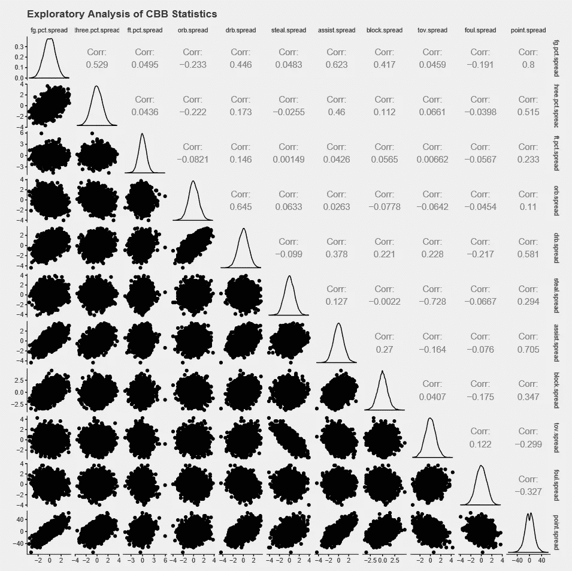
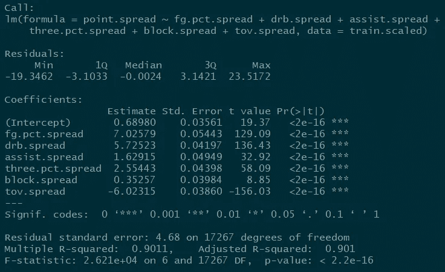
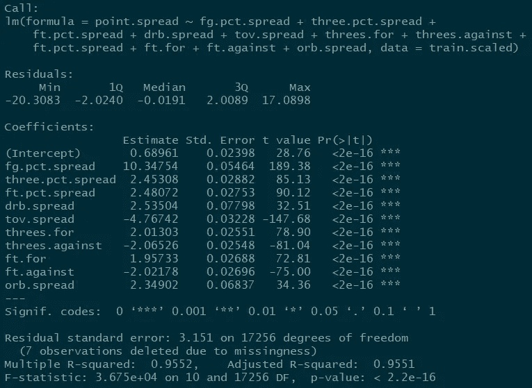
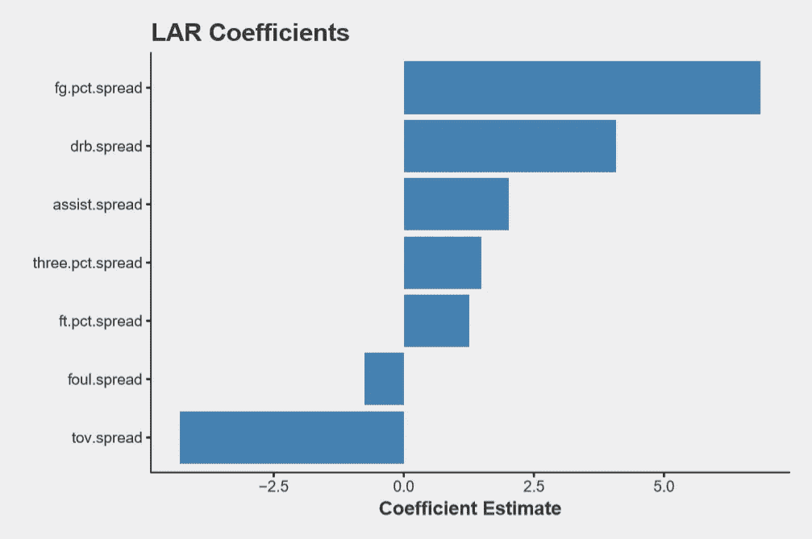
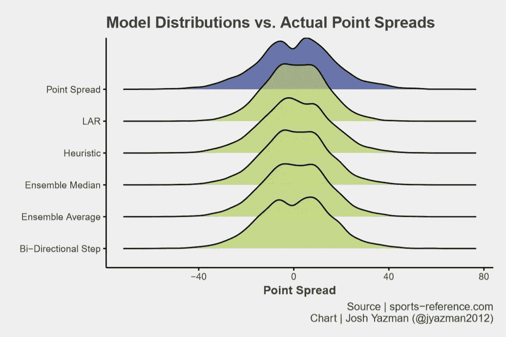
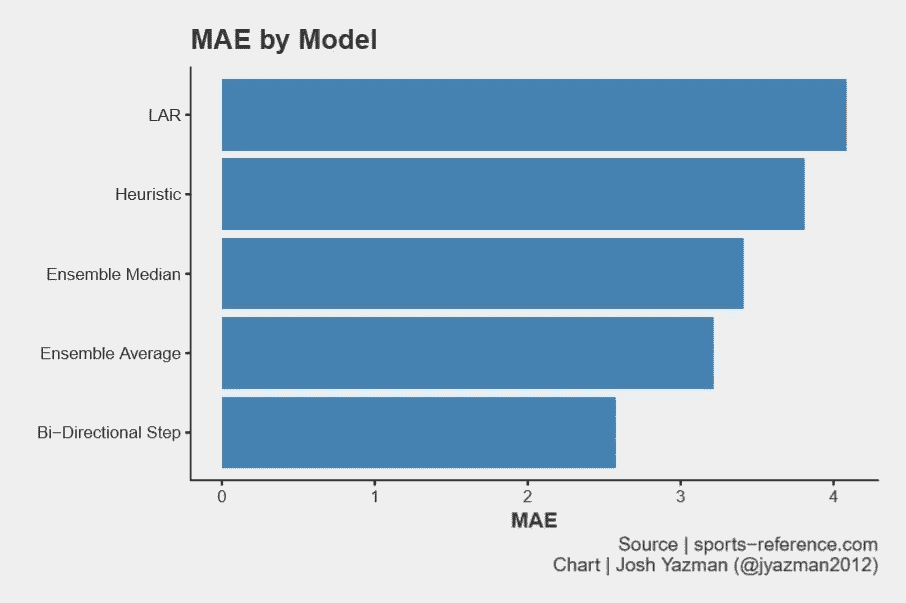

# 用线性回归法模拟大学篮球比赛中的得分差距

> 原文：<https://towardsdatascience.com/using-linear-regression-to-model-point-spreads-in-college-basketball-f7da5811c3da?source=collection_archive---------3----------------------->

显而易见，预测谁将赢得大学篮球赛的最简单的方法就是预测谁将获得更多的分数。维加斯簿记员预测的点差可以高度预测获胜概率，但有时点差不可用，例如当你为锦标赛整理数据并试图预测第二轮、第三轮和第四轮比赛的结果时。对于这些情况，这篇文章描述了三种预测分数分布的尝试:

1.  试探法:一种线性模型，使用分析师根据直觉或探索性分析的结果选择的预测值。
2.  双向逐步模型:一种线性模型，使用由算法选择的预测因子，该算法根据赤池信息标准(AIC)设计用于优化模型拟合。
3.  最小角度回归:一种线性模型，使用数据集中的所有预测值，但对不同的预测值赋予不同的权重。这是一个与双向逐步相似的过程，但它不是从模型中删除预测值，而是降低其系数的权重。

这些模型是使用从 sports-reference.com 的[下载的 351 支甲级队的游戏日志数据构建和测试的。训练数据由 2014–2017 年的游戏日志组成，模型在 2017–18 年的游戏日志上进行测试。](http://sports-reference.com/cbb/)

# 模型拟合

## 启发式模型

尝试的第一个模型是线性模型，使用从领域专业知识和探索性分析的组合中选择的预测器。这里考虑的所有数据都是差距——一个队与另一个队在某些事件(如盖帽)上的差异。说`tov.spread = 5`意味着一个队比他们的对手多失误五次。

一个方便的探索工具是`GGally::ggpairs()`绘图工具。它生成一个图形矩阵，显示数据集中每对变量之间的关系以及它们的相关性和分布。最下面一行显示了不同变量与点扩散的相互作用。

关注图的底部行，其显示了各种表现指标和分差之间的线性关系，投篮命中率、三分命中率、助攻、防守篮板和失误似乎与分差有很强的关系。

使用这些变量的线性模型是一个好的开始！调整后的 R 平方为 0.901 意味着我们已经解释了数据中 90%的方差。残差——单个预测值与其实际值之间的差异——似乎以零为中心，这很好。但当点差最大时，错误率会更高，这表明可能还有改进的空间。

也许更多的算法方法会产生更好的模型！

## 双向逐步

一种这样的算法方法是使用双向逐步变量选择的线性建模-一种迭代测试预测变量组合并选择最小化 AIC 的模型的方法。在每一次迭代中，新的变量被添加到模型中，模型被测试，如果变量不能提高拟合度，就被删除( [ISLR](http://www-bcf.usc.edu/~gareth/ISL/) )。

用这种方法选出的最佳模型包括 10 个变量。这次我们包括价差，但也包括三分球和罚球的数量以及进攻篮板的价差。

这个模型更好！它解释了点差变化的 95.5%。投篮命中率仍然是模型中最强的预测因素，但加入其他变量显然是有帮助的。

我们的残差仍然具有重尾分布，换句话说，当利差非常高或非常低时，我们的预测仍然不太准确。

到目前为止，我们尝试的每一个模型都是“贪婪的”,在某种意义上，预测变量被包括或不被包括在没有灰色区域的范围内。最终尝试的模型采用了不同的方法。

## 最小角度回归

最小角度回归(LAR)也是一种迭代预测值选择方法，但它不是包含或排除变量的二元决策，而是包含有助于提高模型拟合度的变量。

使用与目标具有最高相关性的变量来启动模型。然后调整预测变量的系数，直到另一个变量具有比它更高的相关性，此时第一个系数被锁定到下一个系数的运动中。重复该过程，直到找到最佳模型。如果变量的系数缩小到零，变量可以从模型中排除，但这个过程允许在决策中有更多的细微差别( [ESLR](https://web.stanford.edu/~hastie/ElemStatLearn/) )。

LAR 产生的变量和系数看起来比双向逐步方法更类似于启发式，更侧重于分布变量(A 队比 B 队多 5 次失误)，而不是计数变量(A 队有 15 次失误，B 队有 10 次失误)。

至于模型拟合，LAR 正好介于其他两种方法之间。该模型解释了数据中 92%的差异。

# 模型评估

测试数据由 2017–2018 游戏日志组成，涵盖 3316 款游戏。我们的三个模型是根据误差项的分布以及平均绝对误差(MAE)来评估的。除了上述三个模型拟合，还测试了另外两个集合预测:

1.  总体平均值—三次初始预测的平均值
2.  总体中值-三个模型的预测中值

没有一个模型完美地反映了实际分数的分布，特别是在极端情况下。但是，这就是说，双向逐步看起来相当不错！在零附近有一个适当的倾斜，重尾描绘了实际点差分布的大致轮廓。

双向逐步回归也使 MAE 最小化，然后是总体平均值和中位数模型。

# 结论

双向逐步模型证明了样本外的准确性，并解释了数据中的最大差异。这显然是预测点扩散的最佳模型。

接下来，我计划使用点数分布作为分类模型的输入，来预测团队获胜的可能性。

测试集中的游戏日志于 2018 年 1 月 27 日下载

代码和数据可以在这里找到: [github](https://github.com/joshyazman/medium-posts/tree/master/linear-modeling-point-spreads) 。