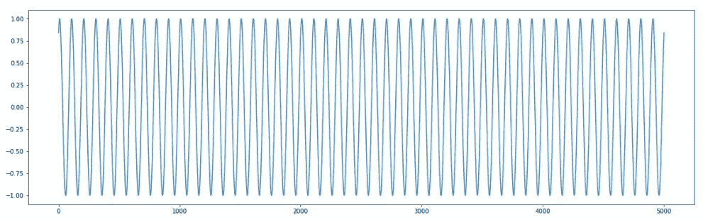
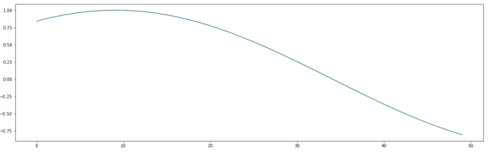
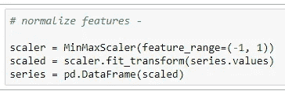
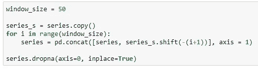
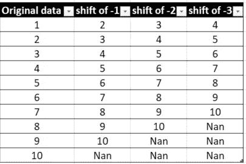
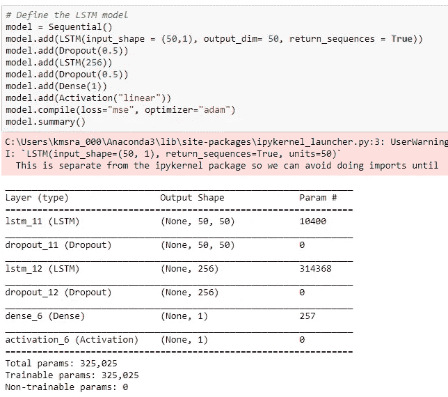
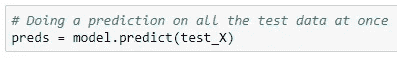
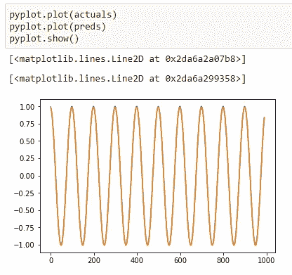
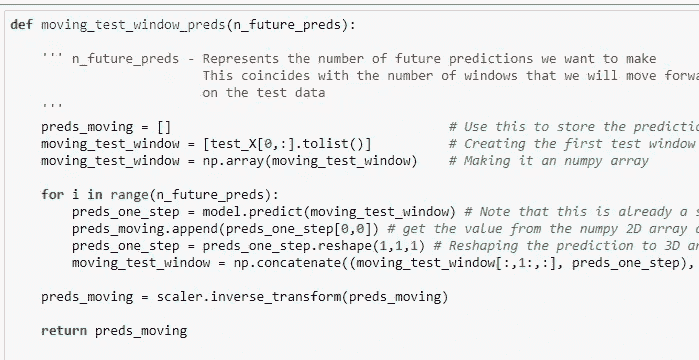
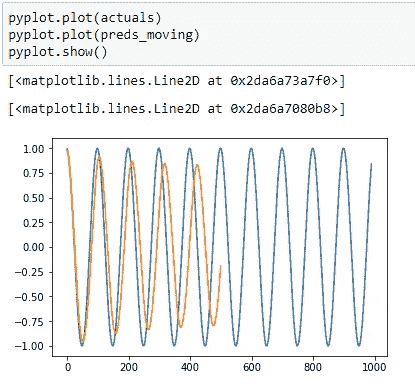

# 利用 LSTMs 预测时间序列

> 原文：<https://towardsdatascience.com/using-lstms-to-forecast-time-series-4ab688386b1f?source=collection_archive---------1----------------------->

Photo by [Nick Chong](https://unsplash.com/@nick604?utm_source=medium&utm_medium=referral) on [Unsplash](https://unsplash.com?utm_source=medium&utm_medium=referral)

有几种时间序列预测技术，如自回归(AR)模型、移动平均(MA)模型、霍尔特-温特斯、ARIMA 等。，不一而足。那么，还有什么必要用另一个像 LSTM-RNN 这样的模型来预测时间序列呢？这是一个非常合理的问题，以下是我能想到的理由(如果你知道更多，我很想知道，请在下面回答)—

*   RNN(LSTM)非常擅长在输入特征空间中提取模式，其中输入数据跨越长序列。鉴于 LSTM 的门控结构具有操纵其记忆状态的能力，它们是解决这类问题的理想选择。
*   LSTMs 几乎可以无缝地模拟具有多个输入变量的问题。我们需要的只是一个 3D 输入向量，它需要被输入到 LSTM 的输入形状中。只要我们找到一种方法，将所有的输入变量转换成三维矢量形式，我们就可以很好地使用 LSTM。这在时间序列预测中增加了很大的好处，在这种情况下，经典的线性方法可能很难适应多变量或多输入预测问题(此处对多变量预测的补充说明—请记住，当我们使用多变量数据进行预测时，我们还需要“未来多变量”数据来预测未来的结果！)
*   总的来说，在使用 LSTM 的方法时，我发现它们在建模问题时提供了很大的灵活性——这意味着我们可以很好地控制时间序列的几个参数。特别是我们可以—
*   灵活使用 seq2seq LSTM 模型的多种组合来预测时间序列——多对一模型(当我们希望在给定所有先前输入的情况下预测当前时间步长时有用),多对多模型(当我们希望在给定所有先前输入的情况下一次预测多个未来时间步长时有用)以及这些模型的其他几种变体。我们可以定制一些东西，例如，在当前步骤进行预测的回顾窗口的大小，我们希望预测未来的时间步骤的数量，将当前预测反馈到窗口中以在下一个时间步骤进行预测(这种技术也称为向前移动窗口)等等。

另一方面，在使用 LSTM(或任何 DNN 架构)时，有一些常见的缺点需要小心——需要大量数据，需要调整多个超参数等。，我也看到一些文章提到 LSTM 并不擅长自回归类型的序列。所以不要全信这个。

使用一个简单的正弦波作为模型数据集来模拟时间序列预测。你可以在我的 github 简介中找到我自己对这个例子[的实现。这个例子的核心思想和数据取自](https://goo.gl/wC9ZaG)[的博客](http://www.jakob-aungiers.com/articles/a/LSTM-Neural-Network-for-Time-Series-Prediction)，但为了便于理解，我做了自己的修改。

那么我们给定的数据是什么样的呢？下面是整个正弦波数据集的曲线图。

fig 1: Plot of entire sine wave data

***在我们深入研究细节之前，先简要介绍一下整体方法—***

1.  使用大小为 50 的向前移动窗口，这意味着我们将使用前 50 个数据点作为输出输入 X 来预测 y1-第 51 个数据点。接下来，我们将使用 1 到 51 个数据点之间的窗口作为输入 X 来预测 y2，即第 52 个数据点，依此类推…这是前 50 个数据点的图—

2.使用两层 LSTM 架构和密集输出层进行预测。

3.我们将查看预测输出的几种方法，a .)*逐步预测测试数据集， ***b.)*** 通过向前移动一步，将先前的预测反馈到输入窗口，然后在当前时间步进行预测。*

****现在让我们深入细节—****

***数据准备—***

1.  *使用 minmax scaler 标准化数据(参见下面的代码片段)*

**

*2.将移动窗口大小固定为 50。为此，我们使用 pandas shift 函数，按照我们指定的数字移动整个列。在下面的代码片段中，我们将列 ***向上*** 移动了 1(因此使用了-1。如果我们想将 ***向下*** 移动 1，我们必须使用+1)，然后将其连接到原始数据。*

**

*我试图在下面的一个玩具数据集上说明这一点，上面的循环 的 ***是如何为 3 的*窗口大小*工作的。****

**

**注意——在上面的代码片段中，我们删除了所有包含 Nan 值的行。**

*如果仔细观察玩具数据集，您会发现它以我们希望输入到 LSTM 中的方式模拟了输入数据。上表中的最后一列成为目标 *y* ，前三列成为我们的输入 *x1、x2* 和 *x3* 特征。如果你熟悉在自然语言处理中使用 LSTM，那么你可以把它看作是一个长度为 3 的句子的固定序列，每个序列包含 3 个单词，我们的任务是预测第 4 个单词。*

*3.为 LSTM 准备 3D 输入矢量。记住，LSTM 的输入向量是 3D 数组:(样本数，时间步数，特征数)。在这种情况下，我们有*时间步数= 50* 和*数量 _ 特征= 1* (扩展我们在上一点中看到的相同类比，我发现这在理解为什么输入形状必须是这样非常有用——比方说，我们在一个句子中有 50 个单词，每个单词由一个单词向量表示。因此，我们需要 50 个时间步长来遍历句子中的每个单词向量，作为每个时间步长的 LSTM 的输入。每个观察有一个句子，因此 *num_features = 1* 。像这样，我们需要迭代训练数据中的所有句子，以提取所有句子中单词之间的模式。这也正是我们在时间序列预测中想要的—我们想要识别窗口中每个先前值之间存在的所有模式，以预测当前时间步长！)*

***模型架构—***

*下面是所使用的模型架构，这一点不言而喻—(它是一个双层堆叠的 LSTM 层，第一个 LSTM 在每个时间步的输出被馈送到第二个 LSTM)*

**

*Model architecture*

***做预测—***

1.  *逐步预测测试数据(参考下面的代码片段)。这很简单。给定从训练数据中学习到的所有参数，我们使用它们来一次一个地预测所有的测试序列。*

**

**预测值与实际值*的曲线几乎相互重叠，以至于我们无法区分下图中的蓝色曲线和红色曲线。*

**

*然而，以上通常不是进行预测的现实方式，因为我们不会有所有可用的未来窗口序列。*

*2.因此，如果我们想要预测未来的多个时间步长，那么更现实的方法是一次预测未来的一个时间步长，并将该预测反馈到后面的输入窗口，同时在窗口开始时弹出第一个观察值(以便窗口大小保持不变)。参考下面做这部分的代码片段—(如果你浏览我上面提到的 github 链接中的代码，代码中的注释是不言自明的)—*

**

*使用这个预测模型，结果绘制如下—*

**

*可以看出，可以理解的是，我们试图预测的时间越远，在每个时间步上建立在先前预测误差上的误差就越大。然而，该函数的行为仍然像一个阻尼正弦波！正如我前面说过的，这是任何时间序列问题的更现实的模型，因为我们没有所有的未来序列。*

*这个代码可以很好地扩展到预测任何时间序列。请注意，您可能需要注意数据准备的其他方面，如在将数据提供给 LSTM 进行预测之前，对序列进行去趋势化、差分以使数据稳定等。*

*就是这样！希望这篇文章对使用 LSTM 预测时间序列有一个很好的理解。如果这篇文章中有一些摘录，请鼓掌表示感谢:)*