# 使用机器学习模型推荐航空公司——第一部分

> 原文：<https://towardsdatascience.com/using-machine-learning-models-to-recommend-airline-carriers-part-i-ed02fcb729a0?source=collection_archive---------10----------------------->

Photo by [Gary Lopater](https://unsplash.com/@glopater?utm_source=medium&utm_medium=referral) on [Unsplash](https://unsplash.com?utm_source=medium&utm_medium=referral)

机器学习是任何数据科学家都必须拥有的一项技能，但这并不是一项容易获得的技能。我是一名训练有素的物理学家，在欧洲核子研究中心和 T2 BNL 等实验室做过物理研究，数据分析对我来说很自然。但是，我不得不承认，当我想为机器学习解渴的时候，我纠结了！在这篇博客中，我的目的是通过一个真实的例子来展示机器学习的力量，从而帮助任何数据科学爱好者。

# 问题形式化

> **目标是根据数据集中提供的信息预测航班是否会被取消。该机构只能出售三家航空公司(AA、UA 和 DL)的机票，并且希望能够告知其客户哪家航空公司的取消最少。**

当你在旅行中寻找一个可以休息的地方时，酒店评论在预订住宿时相当重要。为什么，因为你至少会在一个特定的地方住一晚，舒适和预算是非常重要的。然而，在预订航空公司时，人们的观点大相径庭。我个人想预订最便宜的航班，而不去关注评论。原因很简单，如果我在国内旅行，我只会花几个小时。这在假期会变得特别棘手，因为大多数人都会去见家人。至少在美国，当你带着孩子旅行并且你的航班延误时，感恩节和圣诞节会是一个非常紧张的时刻。机器学习算法如何在这样的场景中派上用场？我的目的是证明这一点。

我学了很多课程来学习机器学习。我将在这里总结一些最有用的材料。[吴恩达在 coursera 上的机器学习](https://www.coursera.org/learn/machine-learning?utm_source=gg&utm_medium=sem&campaignid=685340575&adgroupid=32639001341&device=c&keyword=coursera%20machine%20learning&matchtype=p&network=g&devicemodel=&adpostion=1t1&creativeid=273169971736&hide_mobile_promo&gclid=CjwKCAjw9sreBRBAEiwARroYm5iw4z-1FcKHIpSEa0iiXC4uy0jY87d2kl4QYvUrBq8dZZy5BzBIWBoC1agQAvD_BwE)；在 udemy 上进行深度学习的 t[ensorflow](https://www.udemy.com/complete-guide-to-tensorflow-for-deep-learning-with-python/)；和[这本](https://books.google.com/books/about/Hands_On_Machine_Learning_with_Scikit_Le.html?id=bRpYDgAAQBAJ&printsec=frontcover&source=kp_read_button#v=onepage&q&f=false)书是我学习这套技能的旅程中最有用的垫脚石。

我在这个博客中的大部分工作都是受威尔·科尔森的 [GitHub 资源库](https://github.com/WillKoehrsen/machine-learning-project-walkthrough/blob/master/Machine%20Learning%20Project%20Part%201.ipynb)的启发。请参考我的 [GitHub](https://github.com/monika0603/MachineLearning/blob/master/FlightCancellationAnalysis.ipynb) 资源库，完整了解这篇博客中定义的问题，以及这里使用的数据集。

**关于数据集的信息**

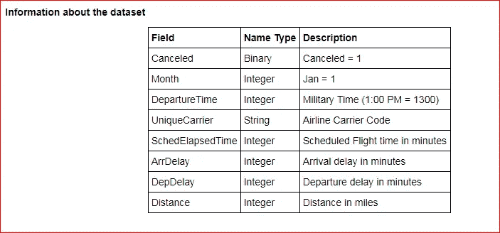

Figure I: Data set information

首要任务是确定我们正在处理什么类型的问题？基于上面的问题定义和数据集信息，这可以被归类为监督分类类型的问题。

> 这是一个**监督问题，**因为数据集包含预期结果的例子，也称为标签，这是一个**分类类型**问题，因为结果是二元的。代理商希望根据对未来取消率的预测来推荐某家航空公司。

好了，现在我们已经定义了我们正在处理的问题的类型，在我们深入数据分析部分之前，让我们首先建立一个机器学习清单。清单帮助我对手头的问题有更全面的了解，并保持专注。

# **机器学习项目清单**

1.  定义问题，看大局。
2.  执行探索性数据分析(EDA)以获得洞察力。
3.  清理和准备数据，以更好地揭示其中的潜在模式。
4.  探索许多不同的机器学习模型，并选择最佳模型。
5.  执行模型交叉验证，以确保分析是稳健的。

既然我们已经定义了更大的图片，让我们从将数据加载到 pandas 数据框中开始，并查看前五条记录。

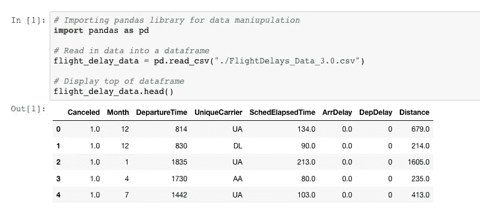

Using pandas library for data manipulation

**数据类型和缺失值**

dataframe.info()方法是一种快速评估数据的方法，它显示每一列的数据类型和非缺失值的数量。查看下面的输出，这是一个相对容易分析的数据集，因为这里没有重大的数据质量问题。在给定的数据集中有 6000 个实例，只有四列缺少一些数据值。在这种情况下，我们将直接进入数据的探索性分析。

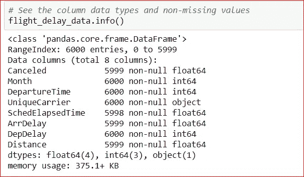

# **探索性数据分析**

EDA 是一种数据分析的图形化方法，允许我们最大限度地洞察我们的数据集；发现潜在模式；启用特征提取；发现异常值和异常情况；并测试潜在的假设。

**单变量分析**

让我们首先分析“距离”变量，以获得关于我们拥有什么类型的航空公司数据的信息，国内的还是国际的。

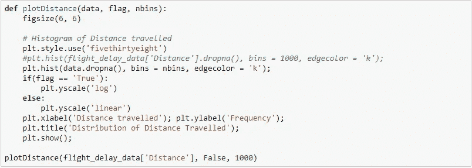

Python method for plotting a variable using matplotlib library.

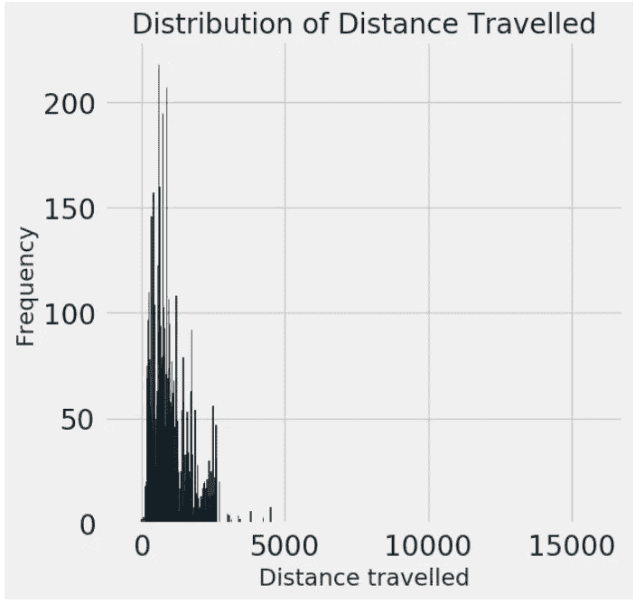

Figure 2: Distribution of distance as observed in the data set.

上面的图 2 显示了一个偏离正态分布的分布。它是一种概率分布，描述了变量的值是如何填充的。这种分布是对称的，其中大部分观察值聚集在中心峰值周围，并且距离平均值较远的值的概率在两个方向上逐渐变小。大自然的大部分现象都倾向于遵循正态分布。例如，身高、血压测量误差、智商得分等..

距离不遵循正态分布是不足为奇的，然而，图 2 显示了大于大约 3000 英里的距离的非常稀疏的值。还建议将对数标度图可视化，以便能够评估距离中的异常值。假设这些数据仅对应于美国境内的国内航班，那么谨慎地移除可能导致对航班取消的有偏见和/或不正确预测的数据点是很重要的。很难解释飞行距离约为 10000 英里的国内航班。上面的“距离”图显示了一个带有长尾的[朗道](https://en.wikipedia.org/wiki/Landau_distribution)(向右倾斜的分布)型分布。同样，假设这些航班仅是国内航班，下一步是想出一个策略来删除这些数据点。我再怎么强调也不为过，仅仅因为数据点看起来可疑，就在删除任何数据点时保持谨慎是极其重要的。它们可能是需要进一步调查的实际现象的结果。

**移除异常值**

对于这个项目，我使用了一种标准的物理方法来消除异常值，在这种情况下，这是平均值周围的三个标准偏差。

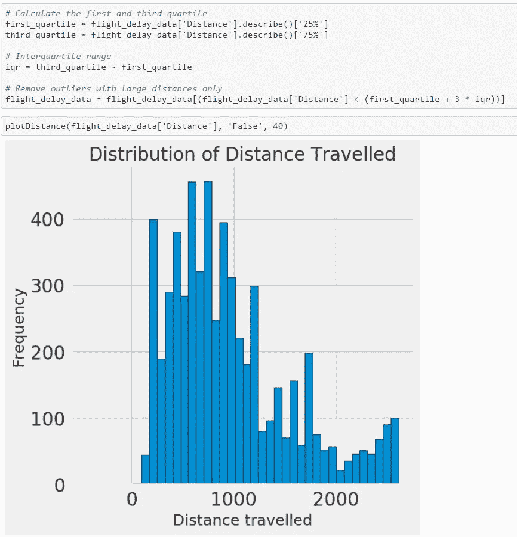

Figure 4: Distribution of flight distance after dropping values greater than three standard deviations.

查看数据点是否确实被删除。

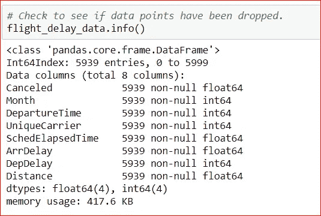

当去除大于三个标准偏差的距离观察值时，大约 1%的数据点被丢弃。

**由于有限的统计数据导致的偏差**

我想提醒我的读者，我们正在处理的数据集只有非常有限的统计数据，只有 6000 个实例。请记住，从下面的分析中推断出的结论可能会有偏差。由偏差引起的误差被定义为我们的模型的预期预测和我们试图预测的正确值之间的差异。最小化这种偏差的最好方法是多次重复整个模型建立过程；在每次迭代中，您运行新的分析，在新收集的数据集上创建新的模型。由于基础数据集中的随机性，生成的模型将具有一系列预测。偏差衡量的是这些模型的预测与正确值的差距。

**最常用的航空公司**

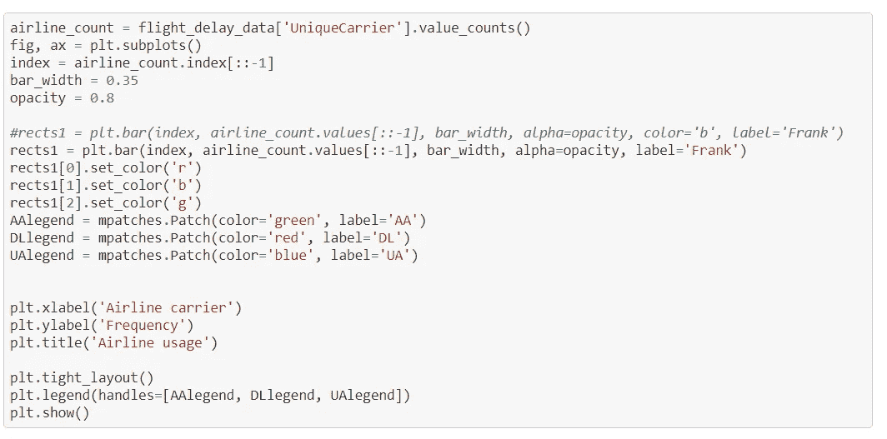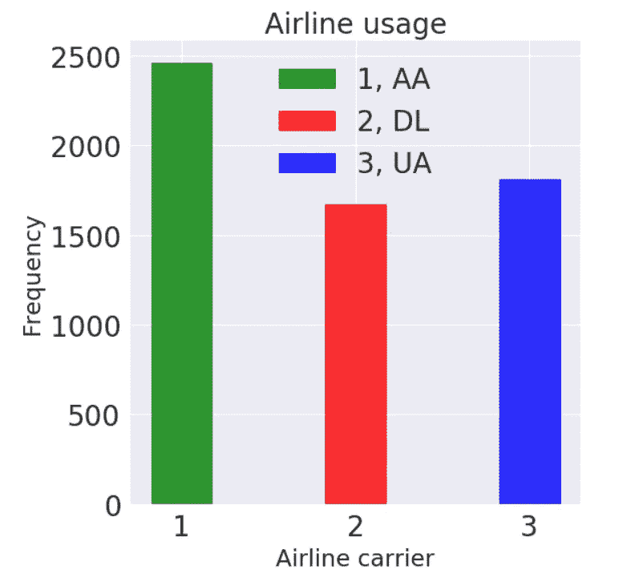

Figure 5: Most used airline carrier.

上面的图显示，在给定的数据集中，美国航空公司是使用最多的航空公司，但它是最可靠的航空公司吗？

**最可靠的航空公司**

现在，我们已经很好地理解了手头的数据集，让我们进行分析，以确定最可靠的航空公司。

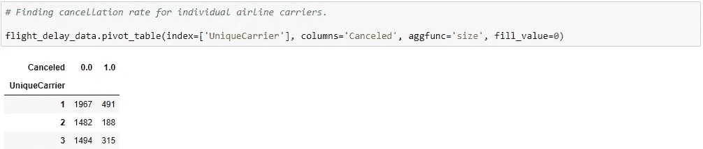

Figure 6: Flight cancellation rate for individual carriers.

下面我简单地绘制了图 6 中获得的取消率，显示在图 7 中。

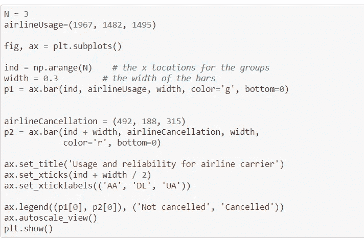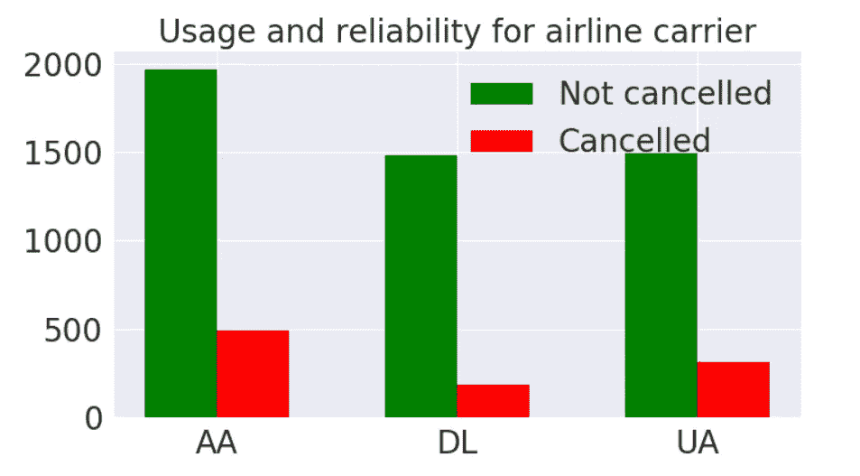

Figure 7: Usage and reliability for each airline carrier.

1.  根据数据集，上述数字不足为奇，AA 航空公司是使用率最高的航空公司，使用率为 41%，相比之下，UA 为 30%，DL 为 28%。
2.  AA 航空公司未被取消的可靠度为 80%,而 UA 的可靠度为 81 %, DL 航空公司的可靠度约为 90%。

**所以达美航空是这个数据集中最靠谱的航空公司。**借助 EDA，我们能够证明达美航空是最可靠的航空公司。我们现在可以使用机器学习模型来预测这家航空公司未来的取消率。

**双变量分析**

图 8(下图)显示了该数据集中不同变量之间的相关矩阵。也称为热图，是一个强大的工具，可以直观地显示我们目标标签背后引人注目的特征。

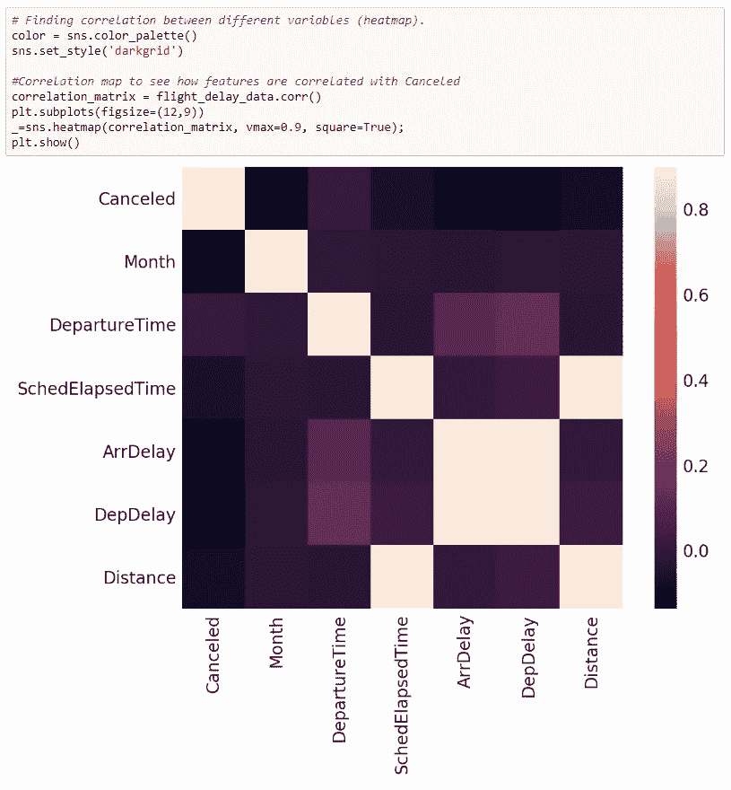

Figure 8: Correlation matrix between different variables present in this data set.

图 8 中的外卖信息:

1.  目标标签“已取消”与“月”、“SchedElapsedTime”、“ArrDelay”、“DepDelay”和“距离”呈负相关。
2.  取消列不依赖于“出发时间”。
3.  到达延误(ArrDelay)发生在有出发延误(DepDelay)的时候。这两个变量是高度相关的，这是理所应当的！
4.  鉴于给定数据集中的信息，航班取消可能会因技术故障而发生，但我们没有可用的信息。所以我们将使用“月”列。

下图 9 展示了每个航空公司每月的使用情况。除了 12 月份，美国航空公司仍然是最常用的承运人。

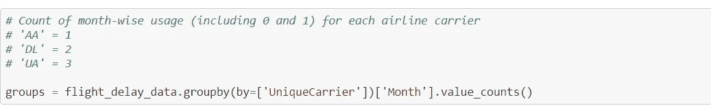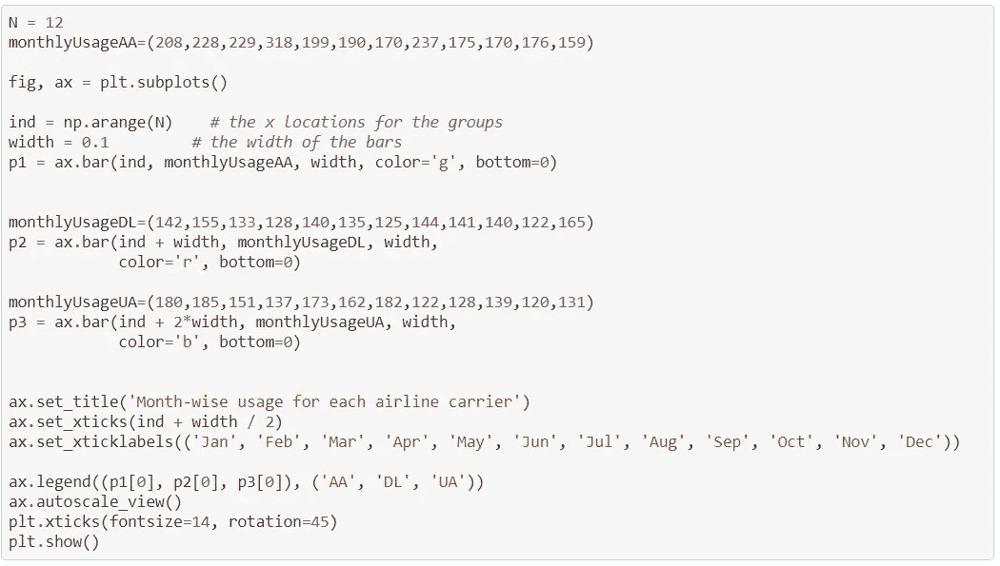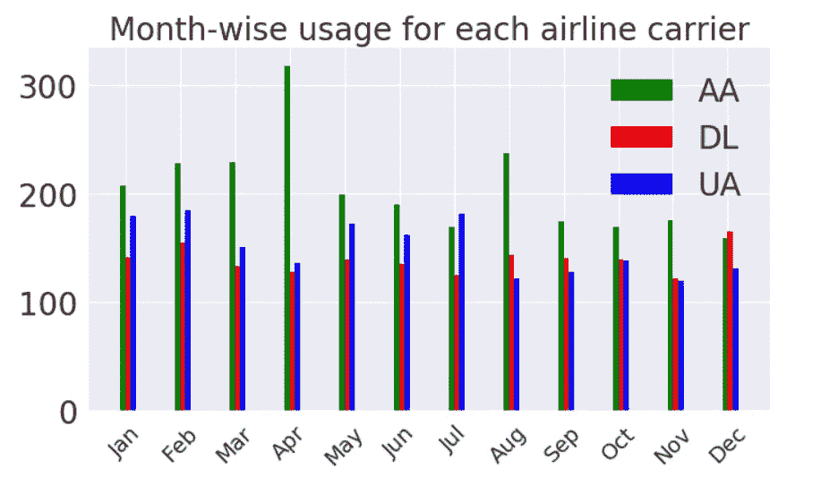

Figure 9: Month-wise usage for each airline carrier.

类似地，可以绘制每个航空公司每月的取消百分比。重要的是要看相对百分比值，而不是看绝对数字。有趣的是，我们发现 AA 在四月份的使用率最高。也许他们在那个月提供最便宜的票价？从 1 月到 4 月，AA 的取消趋势上升，而其他两家航空公司的趋势相反。尽管如此，除了 6 月、7 月、9 月和 11 月，达美航班取消的可能性最低。

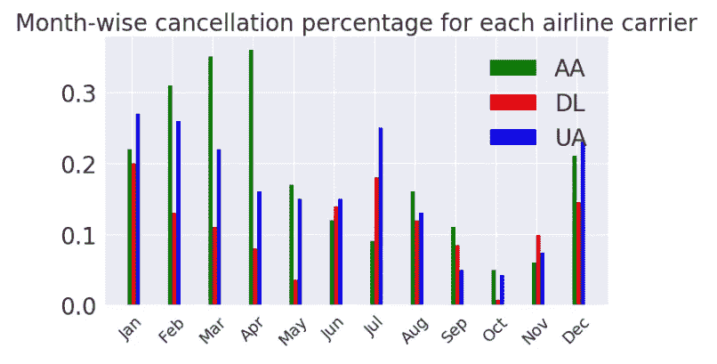

Figure 10: month-wise cancellation percentage for each airline carrier.

有了上述所有准备，我们现在将更深入地模拟未来航班取消的预测。请参考我博客的第二部分。