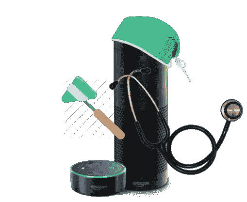
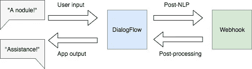
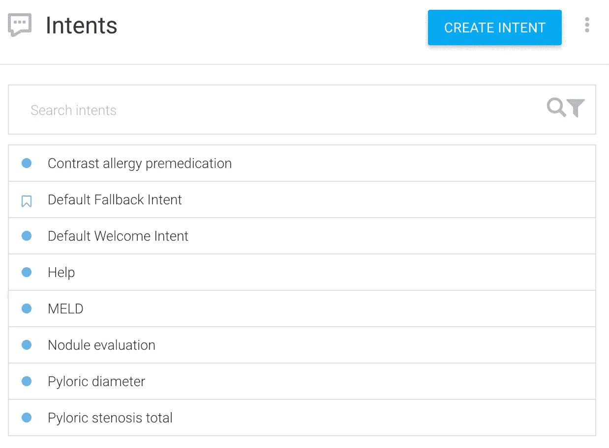
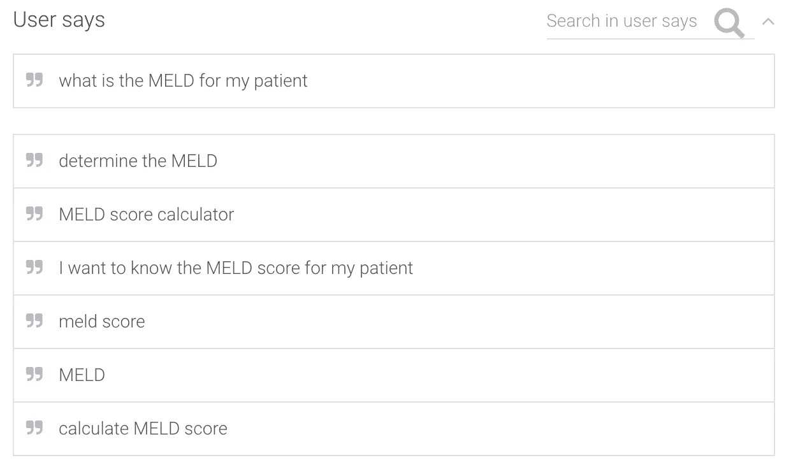
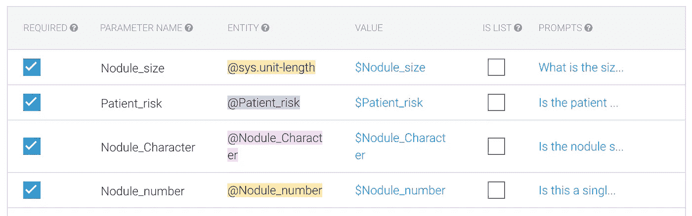
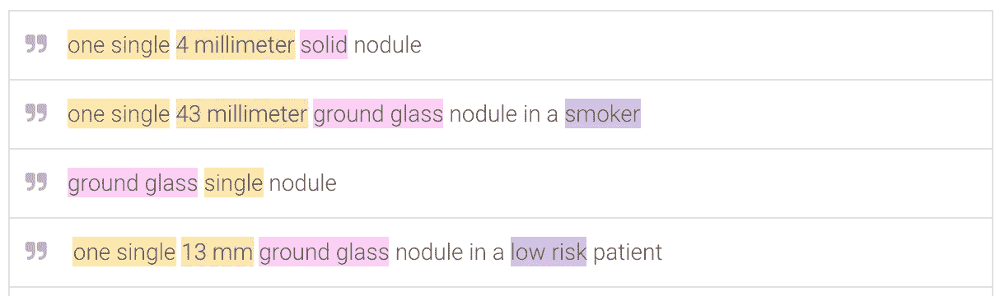
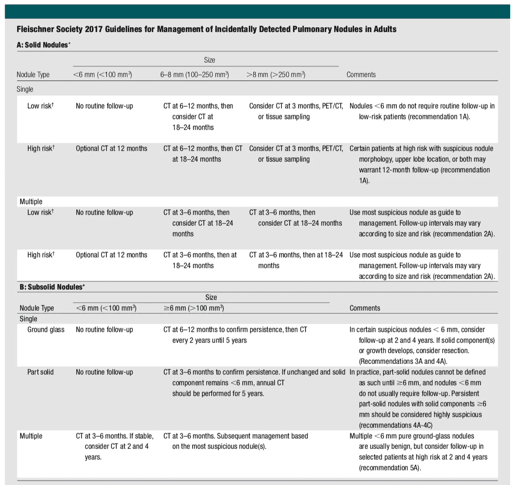
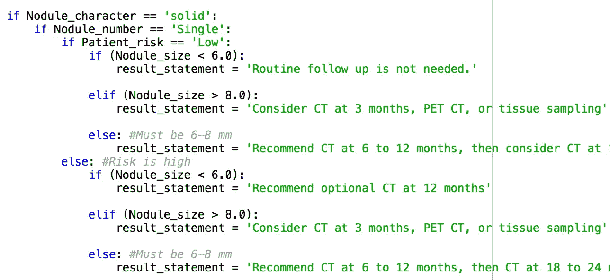

# 使用机器学习为 Google Home 构建对话式放射学助手

> 原文：<https://towardsdatascience.com/using-machine-learning-to-build-a-conversational-radiology-assistant-for-google-home-28ef210cb6fb?source=collection_archive---------4----------------------->

# 介绍

一段时间以来，我一直对对话代理感到兴奋，之前我构建了一个 iOS 聊天机器人[，模拟由](https://www.healthline.com/health-news/artificial-intelligence-car-radiology)[沃森](https://www.ibm.com/cloud/ai)驱动的人类放射科医生。

作为一个令人愉快的周末项目，我和我的[光荣的柯基犬](https://www.facebook.com/photo.php?fbid=10105899973328058&set=picfp.10703792.10105584532883238&type=3&theater)坐下来，喝了很多咖啡，为谷歌主页制作了一个放射学助手。它旨在以快速、对话、免提的方式帮助医疗保健提供者满足其放射学需求。一些视频演示:

智能扬声器是一项革命性的技术，像 Google Home 和 Amazon Echo 这样的工具有潜力为医疗保健提供巨大的价值。这项技术强大而有趣，原因如下:

1.  **方便查看和联系我们的患者**。患者[讨厌医生持续盯着电脑或平板电脑，这种行为有损医患关系。智能扬声器有助于绘制数据和获取信息，同时继续与患者进行眼神交流。](https://www.wsj.com/articles/is-your-doctor-getting-too-much-screen-time-1450118616)
2.  **无菌的需要**。在无菌手术室中访问信息很麻烦，外科医生基本上无法使用标准的桌面/智能手机技术。智能音箱很好地解决了这个问题。
3.  **独有的低摩擦信息检索**。医疗保健提供商面临着不堪重负的工作负载，无缝访问即时信息非常重要。当然，我*可以*花 3 分钟查找 Fleischner 标准，但是如果我可以简单地“询问房间”并在 5 秒钟内得到答案，那就*好得多了。此外，新的 Google Home 应用程序可以立即使用，不需要单独下载和管理 100 个分散的应用程序。*
4.  交谈的力量。我们天生就被编程为通过对话与世界互动，精心制作的对话软件非常直观且易于使用。这对于不喜欢传统图形用户界面的老年患者/医生尤其有用。

您现在已经理解了为什么这个平台很酷，但是我们的放射科助理到底能做什么呢？当前功能的示例包括:

1.  偶发病变随访建议(例如肺结节 [Fleischner 标准](http://pubs.rsna.org/doi/full/10.1148/radiol.2017161659)
2.  对比过敏预处理方案
3.  大小阈值信息(例如肥厚性幽门狭窄的阈值)
4.  临床评分计算器(例如 MELD 评分)

在本文中，我将向您详细描述这个 Google Home 工具是如何构建的。

# 构建对话式放射学助理

## 步骤 1:使用 DialogFlow 理解语言

首先，我向您提交一个令人难以置信的图表，它提供了应用程序中信息流的概述:

When a user queries the Google Home device, natural language processing is performed by DialogFlow to understand the user input and parse it into useful variables of interest. These variables are passed to a webhook for further processing. Following webhook processing, information is returned to DialogFlow and used to create the Google Home output message.

要构建这种工具，首先需要强大的自然语言处理来理解用户输入，并将其分解成有意义的块。这可以通过使用 Google 提供的服务 [DialogFlow](https://dialogflow.com/) 来实现(通过收购流行的 API)。AI)。

在 DialogFlow 中，功能模块被称为意图。还记得应用程序如何为肺结节提供 Fleischner 随访建议吗？这就是肺结节的意图。同样，也有计算 MELD 评分、对比过敏预处理和幽门正常尺寸的意图。看看所有这些美妙的意图:

Intents!

但是程序如何获取给定的用户输入并将其与适当的意图配对呢？它能做到这一点，是因为训练数据让它变得聪明。也就是说，我们提供一堆用户可能会说的事情的例子来触发特定的意图——我们提供的越多，人工智能就越聪明——程序“学习”正确识别感兴趣的意图。下面是一个用于训练“MELD 分数”意图的数据类型的示例，这只是用户可能询问 MELD 分数的一系列方式:

所以，我们现在明白了程序是如何确定用户到底在问什么。DialogFlow 执行的下一个重要的 NLP 任务是将用户输入解析成可以理解和处理的有意义的块。

以肺结节评估为例。为了提供 Fleischner 建议，我们需要关于结节的四位信息:(1)结节特征(实性、部分实性、毛玻璃)，(2)结节大小，(3)患者风险水平(低或高)，以及(4)结节数量(单个或多个)。在 DialogFlow 中，像这样的数据位称为实体，我们为这四个变量中的每一个变量创建一个单独的实体(从技术上讲，我们使用通用的“单位长度”实体来表示结节大小，但在本讨论中可以忽略)。它最终看起来有点像这样:

DialogFlow 很酷的一点是，它提供了智能的自然语言处理，可以在给定适当的训练数据的情况下，自动从任意句子中提取感兴趣的实体。这意味着，当用户说“我在一个高风险患者中有一个 6 毫米的固体肺结节”时，DialogFlow 会自然地解析数据，并将结节大小(6 毫米)、结节特征(固体)和患者风险(高)存储为可用变量。在这种情况下，它认识到它仍然需要知道“结节数”,因此将使用上面列出的“提示”询问该变量。如果用户查询包含所有 4 个必要的信息，它会立即继续并给出推荐。相反，如果用户简单地说“肺结节”，它会询问所有四个参数。

DialogFlow 是如何聪明到可以知道句子的哪些部分代表哪个实体的？当然是训练数据！你只需将句子的相关部分标记为特定实体，它就会学习在新句子中识别这些实体。看起来是这样的:

Yellow label = nodule number; orange label = nodule size; pink label = nodule character; purple label = risk level. Note that you can specify that “smoker” is equivalent to saying “high risk.” Pretty cool!

## 步骤 2:使用 webhook 处理理解的语言

到目前为止，我们已经使用了奇特的自然语言处理来获取用户输入，理解用户想要什么(意图)，并将其分解为感兴趣的有意义的参数(实体)。

现在我们有了这些参数，我们使用一个“webhook”来处理它们，并向用户提供他们想要的信息(MELD 评分、Fleischner 推荐等。).出于我们的目的，您可以将 webhook 想象成一段代码，它接受来自 DialogFlow 的数据，对其进行处理，并返回感兴趣的最终值。

在肺结节的情况下，webhook 采用上述四个结节特征，并执行一系列简单的逻辑语句来识别和返回相关的 Fleischner 建议。也就是说，它采用了这里描述的基本逻辑:

变成了这样:

在这个 webhook 处理之后，一个适当的答案被返回给 DialogFlow，它将这个答案输入到 Google Home，然后，*瞧*，你就有了一个智能放射学助理。

# 结论

希望你觉得这个教程有用！此外，我希望你花些时间思考这个迷人的新平台如何为医生和他们的病人提供价值。如果你有任何问题，请告诉我，如果你想聊天，请随时联系 [twitter](https://twitter.com/kevinsealsmd) 或 [LinkedIn](https://www.linkedin.com/in/kevinsealsmd/) 。感谢阅读！