# 使用机器学习来模拟世界杯比赛

> 原文：<https://towardsdatascience.com/using-machine-learning-to-simulate-world-cup-matches-959e24d0731?source=collection_archive---------2----------------------->

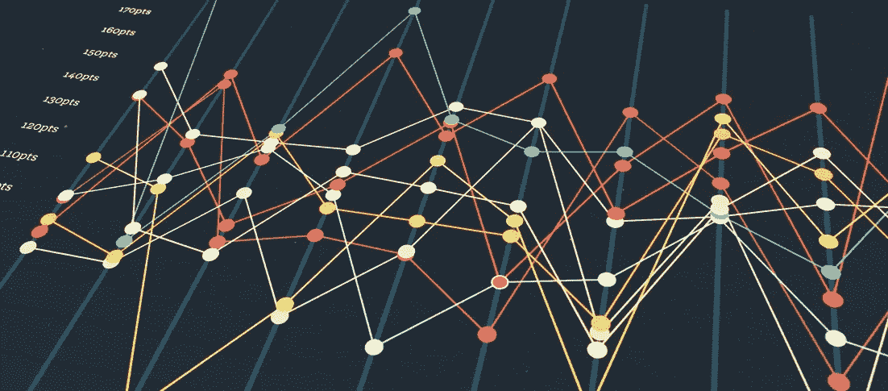

世界杯正在进入一个新的阶段，很少有人能够预测小组赛的结果。现在是时候进入一个更加激动人心的阶段了，世界上最伟大的人将会面对面。本文的目标是，通过 Python 使用数据科学的力量，尝试揭示这些游戏将呈现的一些统计数据。

在本帖中，我们将:

*   创建一个爬虫，从网上获取团队统计数据
*   预处理、探索和可视化数据
*   下载具有匹配结果的另一种数据
*   组合这两个数据集并构建一个模型来预测匹配结果
*   创建一个简单的蒙特卡洛模拟，并获得 2018 年世界杯淘汰赛阶段的赢家赔率

我们将要使用的一些库:

*   熊猫
*   Numpy
*   Sklearn
*   Plotly

这里的想法是制作一个机器学习算法来预测单场比赛的获胜者，并从那里建立一个蒙特卡洛模拟，可以推断出每个淘汰赛获胜者的概率，以及随后世界冠军的概率。

这篇文章将提供一些图表和代码，但是如果你愿意的话，可以随意跳过它，我会尽量让它更直观。

# 我们的策略

大多数游戏模拟器倾向于使用一个代表团队表现的总数。在这里，我们正在尝试一种不同的方法，以一种更复杂的方式，不仅与整体，而且与其他三个价值观(进攻、防守、中路)一起工作，以避免简单地将所有特征集中到一个决定球队实力的单一因素上。

该模型将建立在 Sklearn 库的基础上，使用 Pandas dataframes 来操作表中的数据，并 Plotly 来可视化一些有趣的功能。

# 获取数据

因此，获取数据的第一步是制作一个小爬虫，从国际足联索引中获取信息，这是从 2004 年开始收集国际队数据的一个很好的来源。以下是表格在网站上的排列方式:

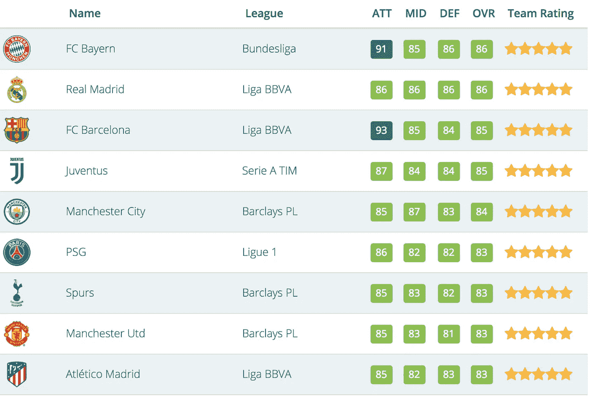

用这种方式显示表格，很容易就能得到这样一个网站。为此，我使用了漂亮的 Soup 库来访问 HTML 代码，并使用 Pandas [read_html](https://pandas.pydata.org/pandas-docs/stable/generated/pandas.read_html.html) 函数将其转换成可读的数据帧。

我必须承认这个爬虫有点懒惰，它可能会在我们的数据集上复制一些东西。不过，不用担心，因为我们可以稍后删除那些关于熊猫的重复数据(在本文中，我还将提供一些原始数据集的链接)。

我不会进入这个 scrapper 是如何建立的细节，但代码将留在下面，如果你想检查一下。如果你有其他兴趣，请随时联系我。

```
web_address = '[https://www.fifaindex.com/teams/fifa'](https://www.fifaindex.com/teams/fifa%27)df = pd.DataFrame()for day in range(1,260,1):
     for pag in range(1,30):

         source_address = web_address + '05_' + str(day) + '/' + str(pag) + '/' + '?type=1'
         print('Day:', str(day))
         print(pag)try:
             soup = get_soup(source_address)
             result_list =  soup.find('div', {'id': 'no-more-tables'})
         except:
             print('Page not found.')
             breakdate = str(soup.find('ol', {'class': 'breadcrumb'}))if df.empty:
             df = pd.read_html(str(result_list))[0]
             df['date'] = date
         else:
             temp_df = pd.read_html(str(result_list))[0]
             temp_df['date'] = date
             df = df.append(temp_df)
```

弄乱原始数据集后，我保存了一个更干净的版本(使用 [Pickle](https://docs.python.org/3/library/pickle.html) ),我们将使用这个数据集作为起点。

```
df = read_pickle('team_stats.pickle')
df.head()
```

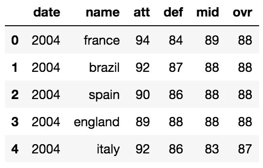

# 探索和可视化

该表包含了 2004 年至 2018 年国际足联对多支国际球队的评分。原始数据也包括月和日，但是为了简单起见，我将每个团队的表现按年进行了平均，因此我们需要处理的数据点很少。让我们使用 [Plotly](https://plot.ly/) 在散点图中查看各队每年的总得分:

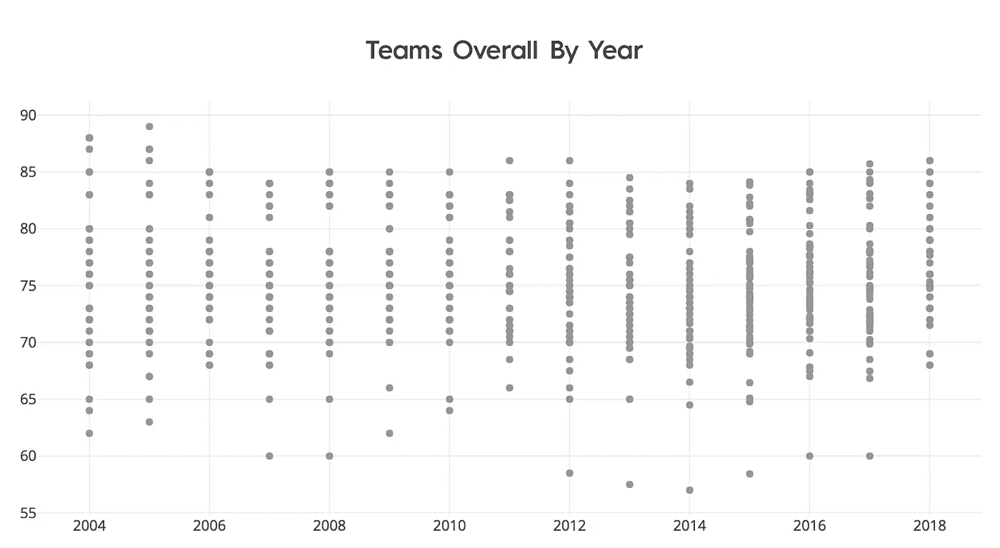

Plotly 拥有令人惊叹的交互式图表，当你悬停在它上面时，它实际上可以显示信息。不过，这份报告信息量不大。让我们试着在条形图中检查每个日期表现最好的团队，看看它们在这些年中是如何变化的。下图显示了按年度排名的最佳团队以及所有团队的平均表现(如白线所示)。

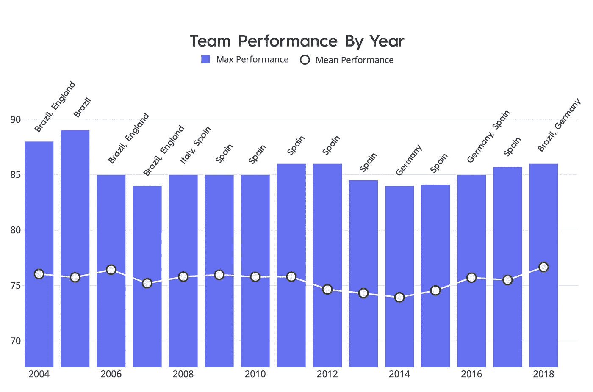

这是一个很好的图表！西班牙长期以来一直处于领先地位。现在让我们打开包含国际队比赛结果信息的 CSV 文件:

```
results = pd.read_csv('match_results.csv')
results.head()
```

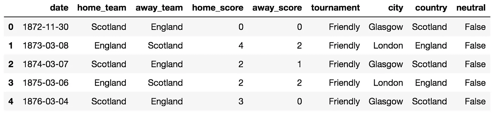

结果数据集来自 [github](https://github.com/ZenoZero/5100-project-world-cup-prediction-on-history) ，由 1872 年的足球比赛结果组成，包括球队、比分和其他一些信息。让我们清理一下，只保留对我们有用的特性。

```
results = results.drop(['city', 'tournament', 'country'], axis=1)
results.home_team = results.home_team.apply(text_norm) #lower_case
results.away_team = results.away_team.apply(text_norm) #lower_case
results.index = pd.DatetimeIndex(results.date).year
results = results.drop('date', 1)
results.head()
```

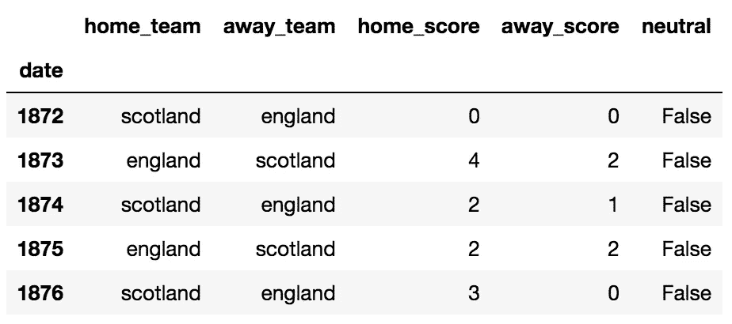

三个步骤对我们利用这些数据非常重要:

*   首先，由于我们只有 2004 年的统计数据，我们应该去掉其他年份的数据(不幸的是)。
*   其次，我们不应该与不在我们主要数据框架内的团队合作，因为我们没有他们的评分。
*   最后，我们必须解决这种主客场球队的情况，因为对于世界杯的预测，我们将考虑所有体育场是中立的。

```
results = results.loc[2004:2017]df_teams = list(df.name.unique())
results = results.reset_index()for index, row in results.iterrows():
    if row.home_team not in df_teams:
        results.loc[index, 'home_team'] = None
    if row.away_team not in df_teams:
        results.loc[index, 'away_team'] = None

results = results.dropna()
```

现在让我们将团队的统计数据输入到结果数据框中。为此，我们将创建 8 个新列，代表每个团队的 4 项技能(赢家和输家)。这是我们现在得出的结论:

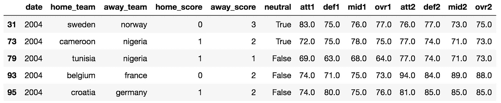

现在我们需要从 **away_score** 中减去 **home_score** ，这样我们就只有一个因素代表哪支球队赢了(负的或正的进球数)。请注意，我使用术语“主场”和“客场”只是因为这是原始数据集的来源，但这不会对我们的分析产生任何影响，因为我们将只研究世界杯比赛中的中立比赛。从现在开始，我将只称他们为**团队 1** 和**团队 2** (从左到右，团队 1 总是第一个出现在我们的数据集中)。

因此，让我们将每个团队的目标数量压缩到一个单独的特性中，并创建一个 winner 列，这将是要预测的目标。如果 winner > 0，表示**队 1** 胜，< 0 表示**队 2** 胜。我们也将丢弃有平局的数据点，因为淘汰赛总是有赢家。

```
results['score'] = results.home_score - results.away_score
results = results.drop(['home_score', 'away_score', 'home_team', 'away_team'], 1)results['winner'] = None
results['winner'][results.score > 0] = 1
results['winner'][results.score < 0] = -1
results['winner'][results.score == 0] = 0results = results[results.winner != 0]
```

为了进一步简化问题，我将“帮助”模型从数据中提取信息，提供技能之间的差异，而不是处理性能本身。例如，**的攻击** (att) 将会是**队的 1 次攻击**减去**队的 2 次攻击**。

```
results['att'] = results['att1'] - results['att2']
results['def'] = results['def1'] - results['def2']
results['mid'] = results['mid1'] - results['mid2']
results['ovr'] = results['ovr1'] - results['ovr2']to_drop = results[results.winner == 1].sample(247)
results = results.drop(labels=to_drop.index, axis=0)
```

这就是我们目前的数据:

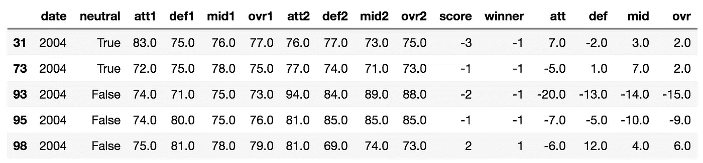

让我们检查一下**团队** 1 的**总体**和**得分**之间的相关性:


这对我们有好处。您可以看到这些特征之间的正相关，这表明我们的数据似乎是有意义的(团队的整体得分越高，我们应该期望的目标数量就越多)。

# 创建模型

为了应用机器学习，我构建了一个小函数来准备数据，删除不必要的属性，使用 Numpy 将其转换为数组格式，并将其分成**训练**和**测试**集，以便我们可以评估我们模型的精度。

在这个例子中，我将上下文视为一个[分类问题](https://machinelearningmastery.com/classification-versus-regression-in-machine-learning/)，我们的目标是:

*   1: **第一队**获胜
*   -1: **第二队**获胜

使用的分类器算法是逻辑回归、随机森林分类器和线性支持向量分类器:

```
lr = LogisticRegression()
lr.fit(x_train, y_train)rf = RandomForestClassifier()
rf.fit(x_train, y_train)svc = SVC(kernel='linear')
svc.fit(x_train, y_train)
```

以下是这些模型的准确度得分:

LR → 68.4%

射频→ 67.9%

SVC → 70.1%

在这里，SVC 似乎比其他产品的性能更好，让我们分别检查一下每个类的性能:

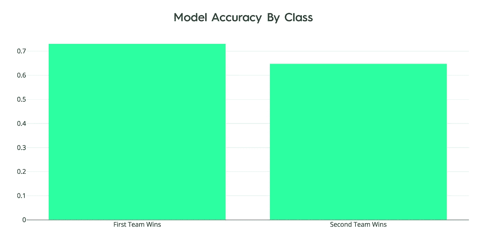

我们可以在 **Team 1 上观察到多一点的准确性。这可能与这样一个事实有关，即在原始数据集中，这支球队是主队，也许它有更多的胜利，这可能以某种方式影响了模型的行为。但除此之外，这也可能是随机的，所以我继续。**

好的。我们有一个预测器，可以以 70%的准确率猜测哪个队会赢。足够建立一个模拟。我们走吧。

# 模拟比赛

我们首先需要的是通过小组赛的世界杯球队的表现数据。我们将建立一个类似于我们前些年建立的刮刀，但现在使用的是国际足联指数中的 2018 年世界杯数据。

不幸的是，这一数据似乎与 2018 年(非世界杯)的数据没有太大差异，因为德国仍然占据排名第二的位置，而实际上它已经出局了。无论如何，我们将坚持这个来源来收集我们的数据。

```
wc = read_pickle('world_cup_teams.pickle')
wc.head()
```

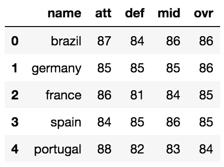

太好了。我们现在离拥有模拟器只有几步之遥。我们将使用我们的机器学习模型作为蒙特卡洛模拟的规则。如果你很少或没有接触过蒙特卡洛，我推荐你从麻省理工学院开放课程软件的这个课程开始。

让我们构建一个比较团队能力的函数，用我们的 SVC 模型评估获胜者(分别为**团队 1** 或**团队 2、**的 1 或-1)，并返回获胜者姓名。

```
def match(wc, team1, team2, model):

    match = pd.DataFrame(columns=['att1','def1','mid1','ovr1','att2','def2','mid2','ovr2'], index=[0])

    match['att1'] = wc[wc.name == team1]['att'].iloc[0]
    match['def1'] = wc[wc.name == team1]['def'].iloc[0]
    match['mid1'] = wc[wc.name == team1]['mid'].iloc[0]
    match['ovr1'] = wc[wc.name == team1]['ovr'].iloc[0]match['att2'] = wc[wc.name == team2]['att'].iloc[0]
    match['def2'] = wc[wc.name == team2]['def'].iloc[0]
    match['mid2'] = wc[wc.name == team2]['mid'].iloc[0]
    match['ovr2'] = wc[wc.name == team2]['ovr'].iloc[0]

    match['att'] = match['att1'] - match['att2']
    match['def'] = match['def1'] - match['def2']
    match['mid'] = match['mid1'] - match['mid2']
    match['ovr'] = match['ovr1'] - match['ovr2']

    match = match[['att', 'def', 'mid', 'ovr']]

    match_array = match.values

    prediction = model.predict(match_array)

    winner = None

    if prediction == 1:
        winner = team1
    elif prediction == -1:
        winner = team2

    return winner
```

嗯……巴西对西班牙会有什么表现？

```
match(wc, 'brazil', 'spain', svc)>>> 'spain'
```

哦不。没想到我们会有如此悲惨的结局！但是这里有一个主要的问题，球队的表现有很大的不同，本届世界杯的第一阶段就证明了这一点。因此，让我们添加一些随机性，以避免每次运行模拟时结果都相同。

```
def match(wc, team1, team2, model, random_scale=5):

    match = pd.DataFrame(columns=['att1','def1','mid1','ovr1','att2','def2','mid2','ovr2'], index=[0])

    att1 = wc[wc.name == team1]['att'].iloc[0]
    def1 = wc[wc.name == team1]['def'].iloc[0]
    mid1 = wc[wc.name == team1]['mid'].iloc[0]
    ovr1 = wc[wc.name == team1]['ovr'].iloc[0]att2 = wc[wc.name == team2]['att'].iloc[0]
    def2 = wc[wc.name == team2]['def'].iloc[0]
    mid2 = wc[wc.name == team2]['mid'].iloc[0]
    ovr2 = wc[wc.name == team2]['ovr'].iloc[0]

    match['att1'] = np.random.normal(att1, scale=random_scale)
    match['def1'] = np.random.normal(def1, scale=random_scale)
    match['mid1'] = np.random.normal(mid1, scale=random_scale)
    match['ovr1'] = np.random.normal(ovr1, scale=random_scale)match['att2'] = np.random.normal(att2, scale=random_scale)
    match['def2'] = np.random.normal(def2, scale=random_scale)
    match['mid2'] = np.random.normal(mid2, scale=random_scale)
    match['ovr2'] = np.random.normal(ovr2, scale=random_scale)

    match['att'] = match['att1'] - match['att2']
    match['def'] = match['def1'] - match['def2']
    match['mid'] = match['mid1'] - match['mid2']
    match['ovr'] = match['ovr1'] - match['ovr2']

    match = match[['att', 'def', 'mid', 'ovr']]

    match_array = match.values

    prediction = model.predict(match_array)

    winner = None

    if prediction == 1:
        winner = team1
    elif prediction == -1:
        winner = team2

    return winner
```

在这里， **random_scale** 将是决定我们想要对一个团队的表现应用多少随机性的因素。

下一步也是最后一步是创建一个函数，多次运行 **match** 函数，并计算每个团队的胜利概率。

```
def simulate_matches(team1, team2, n_matches=10000):

    match_results = []
    for i in range(n_matches):
        match_results.append(match(wc, team1, team2, svc, random_scale=5))

    team1_proba = match_results.count(team1)/len(match_results)*100
    team2_proba = match_results.count(team2)/len(match_results)*100

    print(team1, str(round(team1_proba, 2)) + '%')
    print(team2, str(round(team2_proba,2)) + '%')
    print('-------------------------')
    print()

    if team1_proba > team2_proba:
        overall_winner = team1
    else:
        overall_winner = team2

    return {'team1': team1,
            'team2': team2,
            'team1_proba': team1_proba, 
            'team2_proba': team2_proba, 
            'overall_winner': overall_winner,
            'match_results': match_results}
```

让我们看看下周日克罗地亚击败丹麦有多难:

```
simulation_test = simulate_matches('croatia', 'denmark', n_matches=10000)
```

> 克罗地亚:40.62%
> 丹麦:59.38%

好的，这里你看到模型估计丹麦击败克罗地亚的概率更高，那可能是因为 Fifa 指数数据集很可能没有考虑克罗地亚在世界杯开始后的表现。

随着我们进行越来越多的模拟，让我们来衡量两个团队概率之间的差异:

```
p_list = []
for i in range(len(simulation_test['match_results'])):
    denmark = simulation_test['match_results'][:i].count('denmark') / (i+1) * 100
    croatia = simulation_test['match_results'][:i].count('croatia') / (i+1) * 100
    p_list.append(denmark - croatia)
```

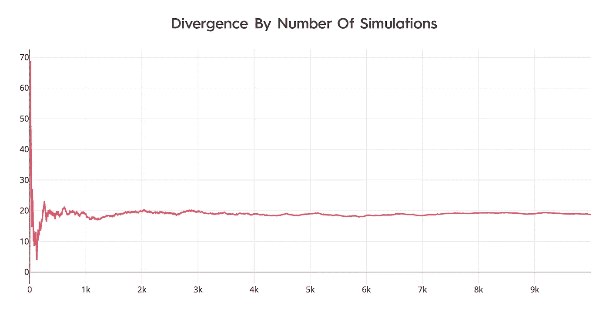

我们可以看到，赢家概率稳定在大约 8，000 场比赛模拟中，这就是我们要使用的值。让我们建立冠军树:

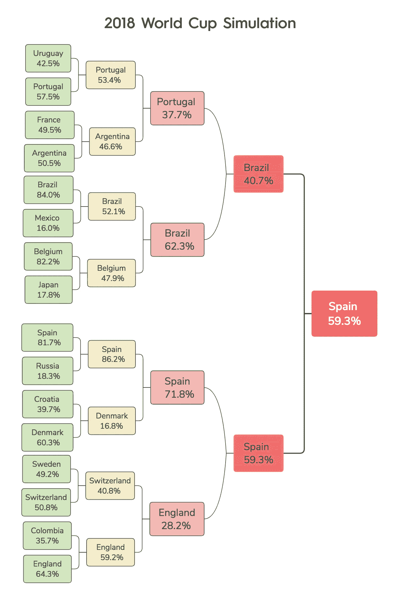

仅此而已。2018 世界杯全模拟——淘汰赛！

考虑到我们的模型有 30%的误差，让我们计算一下西班牙击败所有球队并实际成为冠军的几率:

```
spain_proba = 0.817 * 0.862 * 0.718 * 0.593 * 100 * (0.7 ** 4)print('Chance of Spain winning:', str(round(spain_proba,2)) + '%')
```

> 西班牙获胜的几率:7.2%

嗯，我觉得这很公平。只是仍然希望巴西证明它是错的！

这个帖子到此为止。本文旨在展示如何使用机器学习来计算模拟中的概率，并不试图实际获得正确的结果，因为使用的数据还不够(或者事件本身根本不可预测)。请把这当成一个教程，用世界杯比赛只是因为这是一个很酷的和最新的主题。应该使用更深入的方法来提高结果的清晰度，使它们在任何级别都有意义！

可以增加一些步骤来改进模型，包括:

*   尝试更复杂的机器学习算法和微调超参数
*   收集更多的数据，不仅仅是国际数据，还有国家队的训练数据
*   更进一步，基于玩家统计数据建立一个模型，[这篇文章](https://www.uruit.com/blog/2018/02/16/soccer-and-machine-learning-tutorial/)对这种方法有很好的介绍

这是我的第一篇文章，所以谢谢你一直读到最后。我会试着每个月发布一些与数据科学和机器学习相关的好材料。欢迎发表任何评论或关注，如果你喜欢，别忘了为**鼓掌！**谢谢，下次发帖再见。