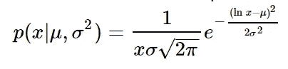
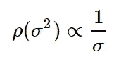
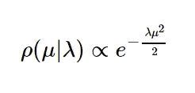
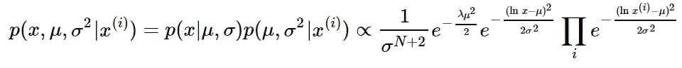
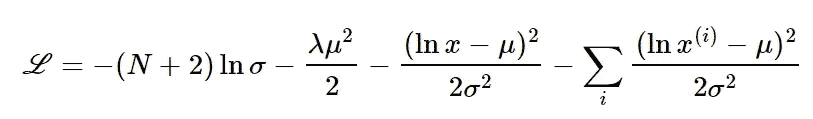
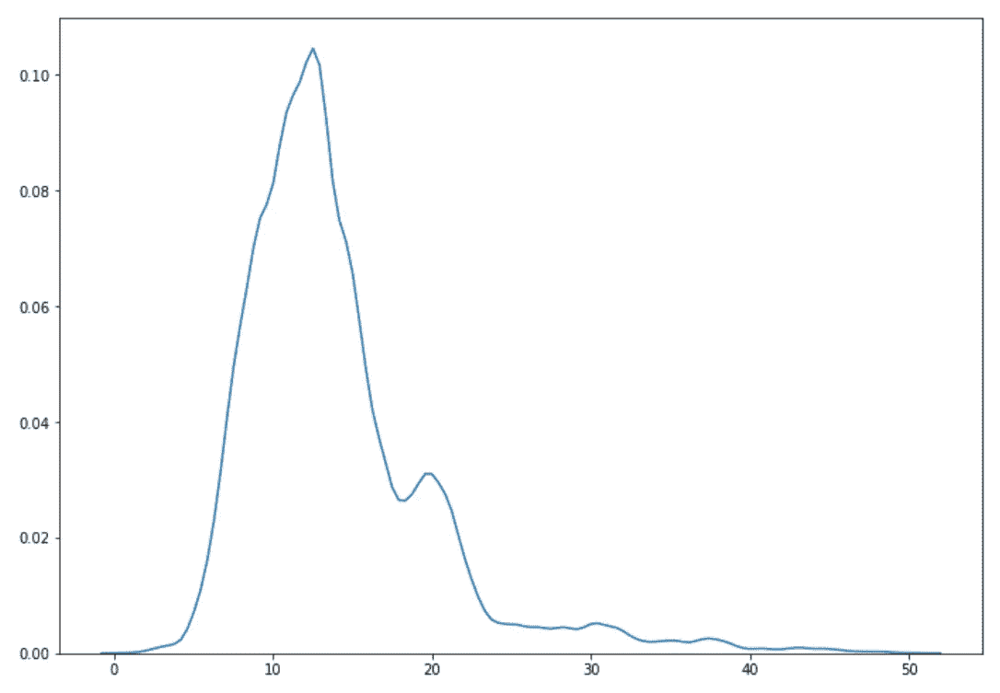

# 用马尔可夫链蒙特卡罗方法进行项目估算

> 原文：<https://towardsdatascience.com/using-markov-chain-monte-carlo-method-for-project-estimation-cd641f8038ce?source=collection_archive---------14----------------------->

## 用张量流概率进行哈密顿取样


Free photo from [https://pixabay.com](https://pixabay.com)

我收到的对[之前项目评估](/agile-estimation-part-ii-80bba09b9fc1)工作的一种批评是对数正态分布有短尾巴。这是真的，尽管对数正态分布有很多好处。原因很简单:当将数据拟合到分布形状时，我们选择最可能的参数μμ和σσ。这种方法，无论多么简单，总是导致短尾巴，特别是对于我们拥有的少量数据。事实上，对数正态分布的参数可能不同于我们基于五个数据点得到的最可能的参数。合适的方法是获得预测和参数的联合分布，然后根据参数进行边缘化。在正态分布的情况下，我们将得到具有漂亮长尾的学生 t 分布。对于对数正态分布，我们会得到一个更复杂的分布，但也有长尾。

为了提醒您我们正在处理的问题，我们的任务是根据历史数据来估计一个敏捷迭代/sprint 中可以容纳的故事点的数量。特别是，我们感兴趣的是找到我们可以在一次迭代中完成的故事点的数量，并且有 95%的置信度。

我们将从定义大小为 1 的样本的似然函数开始:



让我们选择μ和σ的先验。

对于σ，我们选择非信息先验:



对于μ，我们选择共轭先验，它是具有 L2 正则化超参数λ的正态分布:



这种情况下的后验概率正比于:


因此，让我们计算百分位数的联合概率分布是:



因此，我们可以通过忽略参数μ和σ来计算所有百分点。答案可以通过分析得出，但在我们的情况下，我想用 MCMC 哈密顿取样法数值求解。

这种方法的思想是得到一个联合分布 p(x，μ，σ2|x(i))的样本。之后，我们可以计算 x 的百分位数。这相当于通过后验分布的参数边缘化。

正如我前面说过的，答案可以通过分析得出，但是我们将使用一种可以用于分布的方法，对于这种分布，很难或者不可能获得样本。这种方法叫做[马尔可夫链蒙特卡罗](https://en.wikipedia.org/wiki/Markov_chain_Monte_Carlo)。该方法的思想是在变量空间中进行随机行走，但是尝试更频繁地访问更可能的区域，以便在结果样本中直方图遵循概率分布。在这种情况下，一些不太可能的值必须被拒绝。

MCMC 的一个特殊风格是哈密尔顿采样方法。它有点类似于梯度下降算法，除了 MCMC 中的步长足够大，而不是试图收敛到成本函数的最小值，因此它也探索变量空间中可能性较小的区域，但是倾向于更频繁地访问高可能性区域。

为此，我们需要取联合分布函数的对数(忽略常数):



有很多库做哈密顿取样。甚至还有为此优化的概率编程语言，比如 [Stan](https://en.wikipedia.org/wiki/Stan_(software)) 。但是这里我们将使用 TensorFlow Probability，这是一个由 Google 创建的概率库

```
**import** **numpy** **as** **np**
**import** **pandas** **as** **pd**
**import** **tensorflow** **as** **tf**
**import** **tensorflow_probability** **as** **tfp**lamb = 2e-1
**def** log_likelihood(x, mu, sigma2):
    'The (negative) log likelihood function for one sample'
    **return** (tf.log(x)-mu)**2/2.0/sigma2**def** get_unnormalized_log_probability(data):
    **def** joined_probability(x, mu, sigma2):
        result = -(2.0+len(data))/2*tf.log(sigma2) - lamb * mu**2/2.0 -log_likelihood(x, mu, sigma2) *#sigma2*
        **for** datum **in** data:
            result -= log_likelihood(float(datum), mu, sigma2)
        **return** result
    **return** joined_probability
```

我们希望确保我们的功能正常工作，最好的方法是编写一个单元测试

```
**import** **unittest**
**import** **math****class** **TestUnnormalizedLogProbability**(unittest.TestCase): **def** test_get(self):
        tf.reset_default_graph()
        data=np.array([1.0,1.0])
        x = tf.constant(value=1.0)
        mu = tf.constant(value=0.0)
        sigma2 = tf.exp(1.0)
        probability_function = get_unnormalized_log_probability(data)
        probability = probability_function(x, mu, sigma2)

        init = tf.global_variables_initializer() **with** tf.Session() **as** sess:
            sess.run(init)
            self.assertTrue(abs(-2-probability.eval())<1e-5)

unittest.main(argv=[''], verbosity=0, exit=**False**);*----------------------------------------------------------------------
Ran 1 test in 0.088s**OK*
```

我们将使用与之前相同的数据

```
data=np.array([14, 12,  7, 14, 13])
*# Create state to hold updated `step_size`.*
step_size = tf.get_variable(
    name='step_size',
    initializer=1e-1,
    use_resource=**True**,  *# For TFE compatibility.*
    trainable=**False**)*# Initialize the HMC transition kernel.*
hmc = tfp.mcmc.HamiltonianMonteCarlo(
    target_log_prob_fn=get_unnormalized_log_probability(data),
    num_leapfrog_steps=3,
    step_size=step_size,
    step_size_update_fn=tfp.mcmc.make_simple_step_size_update_policy(),
    seed=1398)*# Run the chain (with burn-in).*
samples, kernel_results = tfp.mcmc.sample_chain(
    num_results=int(1e5),
    *#num_burnin_steps=int(1e1),*
    current_state=[10.0,2.0,0.2],
    kernel=hmc)*# Initialize all constructed variables.*
init_op = tf.global_variables_initializer()**with** tf.Session() **as** sess:
    init_op.run()
    samples_, kernel_results_ = sess.run([samples, kernel_results])all_samples = np.array(samples_)
all_samples.shape*(3, 100000)*
```

我们的结果有三行，分别是 x，μ和σ。我们可以利用这三个变量

```
all_samples.mean(axis=1)*array([14.040146  ,  2.4572225 ,  0.21323058], dtype=float32)*
```

出乎意料的是，`x`的均值比我们想象的要高(12)。让我们绘制直方图来查看概率分布:

```
%**matplotlib** inline
**import** **matplotlib.pyplot** **as** **plt**
**import** **seaborn** **as** **sns**
fig, ax = plt.subplots(figsize=(11.7, 8.27))
sns.distplot(all_samples[0,:], hist=**False**);
```



我们看到最大值约为 12，因为我们将使用最大后验分布。

该曲线具有不规则的形状，但对于多变量 MCMC 结果来说，这在某种程度上是意料之中的。还要注意，对数正态分布的尾部更长。这是忽略后验分布参数的结果。让我们看看我们 95%的信心会落在哪里:

```
np.percentile(all_samples[0,:], q=5)*7.160015678405762*
```

95%的置信度也非常接近我们用更简单的方法得到的结果。然而，用 MCMC I 进行的实验发现，该方法不稳定，并且强烈依赖于播种、初始值和超参数的选择。随着维度的增加，这个问题变得更加严重。

# 结论

在这个故事中，我们试图在敏捷项目评估中使用贝叶斯方法，而不是分析性地计算百分位数，我们展示了如何使用马尔可夫链蒙特卡罗和哈密尔顿抽样来实现这个结果。我们还演示了如何在 TensorFlow 概率包中实现它。