# 利用最大似然法自动检测汽车牌照

> 原文：<https://towardsdatascience.com/using-ml-to-automatically-detect-vehicle-number-plates-8e5bebc8b7dc?source=collection_archive---------6----------------------->

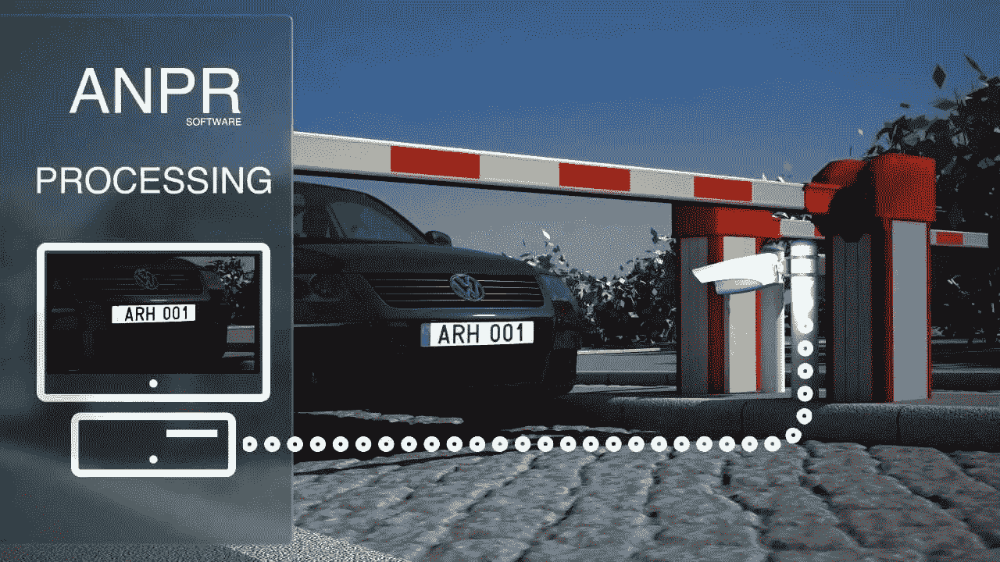

## 概观

我们讨论底层技术，它在不同领域的应用，如收费站，犯罪预防等。然后，我们给出了一个如何使用张量流实现这一点的演练。

然后我们讨论代码和算法，浏览最终的输出和精度数字。

# 简介:

LPR(license plate recognition)是一种技术，主要是软件，它使计算机系统能够从数字图片中自动读取车辆的注册号码(牌照号码)。

自动读取车牌号意味着将数字图像的像素转换成车牌的 ASCII 文本。

由于车辆的日益增多，车牌识别(LPR)在这个繁忙的世界中扮演着重要的角色。偷窃车辆、违反交通规则、进入受限空间也呈线性增长，因此想要阻止这种行为。

车牌识别是车辆自动识别的一种有效方法。在诸如车牌检测、字符分割和每个字符的识别的基本处理步骤中，分割起着重要的作用，因为识别的准确性基于分割的完美程度。这项工作特别处理印度车牌的识别，也可以扩展到识别。

# ANPR 是如何工作的？

当车辆到达指定的入口时，摄像头会自动检测并读取车牌。随后生成的数据被立即存储(在停车场的情况下),或者可以基于生成的数据和预先确定的设置来准许或拒绝访问。该数据被存储以供将来分析(在 IT 园区或门禁社区的情况下)。通过在两端安装不同的摄像机，可以并行管理入口和出口系统。每台摄像机都有一个 IP 地址，整个系统以高度的连通性连接在一起。

该系统利用互联网协议进行控制和通信，但该结构通过加密数据流保持高度安全。可以在安装时设置访问权限。

# 技术要求:

从 LPR/ANPR 的角度来看，图像质量始终是关键因素。捕捉快速运动的车辆需要特殊的技术来避免运动模糊，运动模糊会大大降低识别精度。为了确保正确的图像质量，短快门时间需要与高功率照明结合使用。

只有专用的 ANPR 相机才能满足这些要求，如 AHR 的 ANPR 相机，它提供灵活的快门控制，内置红外闪光灯，能够捕捉高达 250 公里/小时的车辆，适用于各种车牌读取应用。

# 使用案例:

**执法:**全国和世界各地的执法机构越来越多地采用自动车牌识别(ALPR)系统来增强他们的执法和调查能力，扩大他们的相关数据收集，并加快将车辆牌照与被盗、被通缉和其他相关车辆的列表进行比较的冗长耗时的过程。德国、瑞典、丹麦、加拿大等多个国家已经部署了 ALPR 用于执法目的。

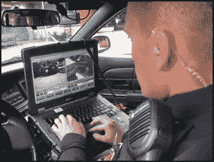

**交通控制:**软件可以分析视频数据，并可以计算交通流量参数，从而计算出以下标准交通特征:

*   平均速度[公里/小时]；
*   交通量(每小时车辆数)[车辆/小时]；
*   交通密度[车辆/公里]。

任何违反标准限制的车辆都可能被黑启动，并根据国家法律采取进一步的行动。

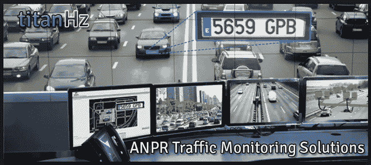

**收费公路:**借助这个 ANPR，我们可以减少整个收费过程中的人为交互，提高系统的安全水平。这项技术将用于全国各地的不同收费亭，在那里可以很容易地控制交通和有效地管理时间。

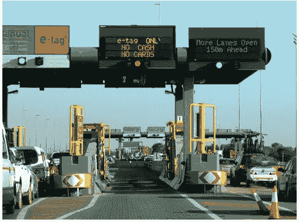

**犯罪威慑:**自动车牌识别(ANPR)技术用于在地方、部队、地区和国家层面帮助检测、威慑和破坏犯罪活动，包括打击流窜犯、有组织犯罪集团和恐怖分子。ANPR 为犯罪调查提供线索和证据，被英格兰、威尔士、苏格兰和北爱尔兰的执法机构广泛使用。

# 印度车牌的自动车牌检测:

印度车牌的数据集不可用，因此需要从头开始创建。为此，从谷歌下载了大约 700 张图片，并对数据进行了清理。清理后的数据集有 250 幅图像，这些图像被上传到 Dataturks 注释[工具](https://dataturks.com/features/image-bounding-box.php)(矩形边界框)并进行手动注释。

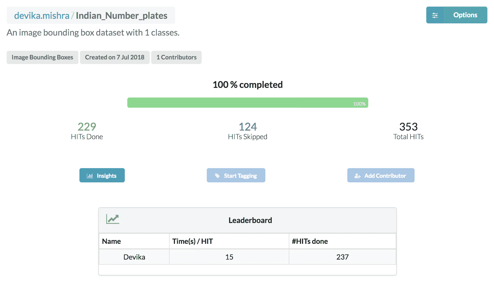

The Dataset on Dataturks

该工具自动解析图像，允许我们创建感兴趣的实体的注释，并生成 JSON 格式的训练数据，每行包含图像链接以及注释细节。

数据快照如下所示:

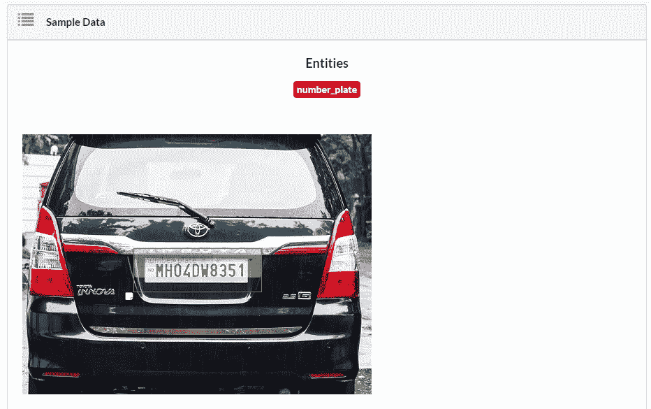

上面的[数据集由 230 张带注释的图像](https://dataturks.com/projects/devika.mishra/Indian_Number_plates)组成，可以在[这里](https://dataturks.com/projects/devika.mishra/Indian_Number_plates)找到。我们用 200 份简历数据训练模型，在 30 张图片上测试。

由 [Dataturks](https://dataturks.com/) 注释工具生成的 JSON 格式的数据示例如下:

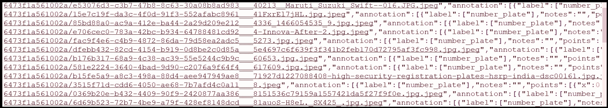

## **为运行 Tensorflow 模型准备数据集:**

带注释的数据被下载(到一个包含图像和 JSON 文档的文件夹中)并被分成训练和测试数据，如上所述。然后，训练和测试文件夹作为 python 脚本的输入，用于将数据转换为 Pascal VOC(这里是[演示](https://dataturks.com/help/ibbx_dataturks_to_pascal_voc_format.php))。

由代码生成的 pascal voc 的 XML 格式数据的示例如下:

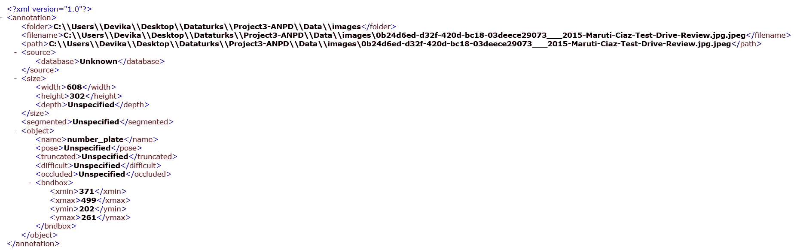

从 json 到 Pascal VOC 脚本获得的 xml 文档和图像然后被转换成一组 csv 记录和图像。最后，这些数据被转换成张量记录用于训练和测试。生成的张量记录示例如下:

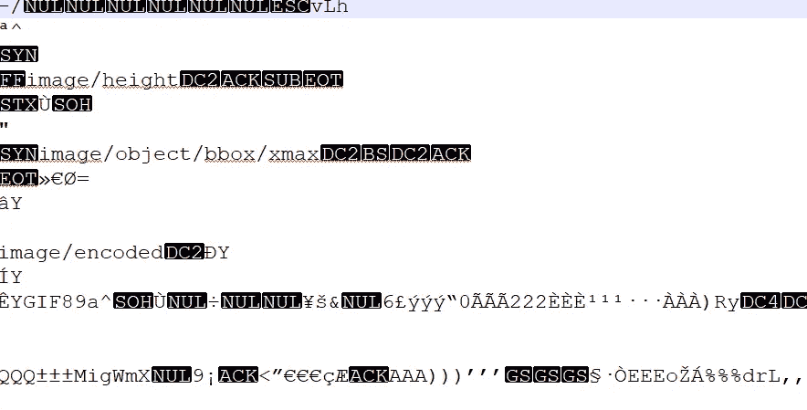

github 上提供了将数据转换为不同格式的代码:

# 培训:

模型的训练是在 Ubuntu 16.04 LTS GPU 箱上完成的，该 GPU 箱具有 NVIDIA TESLA K80 和 7GB RAM、12GB 显卡以及 30 GB 硬盘。训练进行了 10，000 步，耗时约 2.5 -3 小时。

可以在 Dataturks 博客帖子中找到详细的培训教程，标题为[使用 Tensorflow 和 GCP 在电子商务中自动标记服装](https://medium.com/@dataturks/automatic-tagging-of-clothing-in-e-commerce-using-tensorflow-and-gcp-d2b623cd2a78)。

因为我使用了 MobileNet 模型，所以我对相同的配置文件进行了更改。训练好的模型可以在这里下载[。](https://github.com/tensorflow/models/blob/master/research/object_detection/g3doc/detection_model_zoo.md)

**配置文件中的更改:**

**后面部分:**

**number-plate-detection . Pb txt:**

# 运行培训作业

可以使用以下命令运行本地培训作业:

其中`${PATH_TO_YOUR_PIPELINE_CONFIG}`指向流水线配置，而`${PATH_TO_TRAIN_DIR}`指向训练检查点和事件将被写入的目录。默认情况下，训练作业将无限期运行，直到用户终止它或者它完成了提到的步骤数。

# 运行评估作业

评估作为单独的作业运行。eval 作业将定期轮询 train 目录中的新检查点，并在测试数据集上对其进行评估。可以使用以下命令运行该作业:

其中`${PATH_TO_YOUR_PIPELINE_CONFIG}`指向流水线配置，`${PATH_TO_TRAIN_DIR}`指向保存训练检查点的目录(与训练作业相同)，而`${PATH_TO_EVAL_DIR}`指向保存评估事件的目录。与培训作业一样，默认情况下，eval 作业会一直运行，直到终止。

# 测试:

**模型准备**变量单元格:

## 在被检测的第一个单元中:

这将完成您的模型的测试。

对测试图像进行测试:

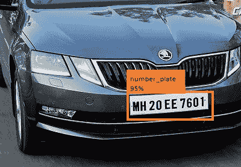

对真实视频帧的测试:

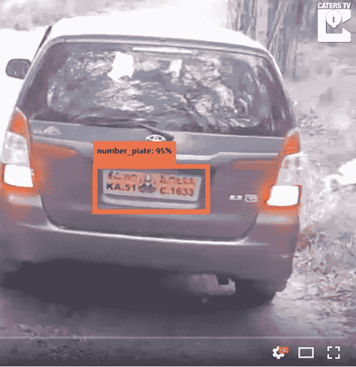

请不要说我没有在 CCTV 视频上测试过，而是在 CCTV 视频帧上测试过。为此，需要将 opencv 视频捕获附加到该代码上，并对每一帧运行它。这可能是一个有趣的扩展，并且将向实时部署迈进一步。

注意:关于培训、测试、tensorboard 和运行评估工作的详细教程可以在 Dataturks 博客帖子中找到，标题为[使用 Tensorflow 和 GCP 在电子商务中自动标记服装](https://medium.com/@dataturks/automatic-tagging-of-clothing-in-e-commerce-using-tensorflow-and-gcp-d2b623cd2a78)。

# 结论:

结果令人印象深刻，在 30 幅测试图像中，有 27 幅得到了正确的分类。分类的置信度在 85%到 99%之间。

移动互联网似乎在实时检测方面发挥了惊人的作用。许多类似的应用程序也已经使用 inception net 开发出来，但是移动网络的结果已经被证明比 inception net 更适合实时应用。

# 为什么选择 MobileNets？

研究表明，inception net 是 CPU 密集型的，全速运行时使用 25-30%。有道理，因为我们会以和汽车经过一样快的速度行驶。我们希望降低到 5%以下，我们将通过降低它运行的频率来做到这一点，因为我们的用例不需要连续运行推理来实现我们上面讨论的隐私目标。将它改为每 18 帧分类一次(大约每秒一次)会将平均使用率降低到大约 5.5%。所以 MobileNet 模型是 Inception 的 1/30 大。每帧运行速度提高了 3 倍以上。而且它使用的 CPU 资源要少得多。

# 应用:

这些用于图像分类的定制模型可以部署在停车场、科技园或任何其他门禁社区的现场汽车监控中。

我希望听到任何建议或疑问。请在 devika.mishra@dataturks.com 给我写信

## 资源:

所有代码:[车牌检测代码](https://github.com/DataTurks-Engg/Automatic_Number_Plate_Detection)

数据集:[车辆号牌检测数据集](https://dataturks.com/projects/devika.mishra/Indian_Number_plates)