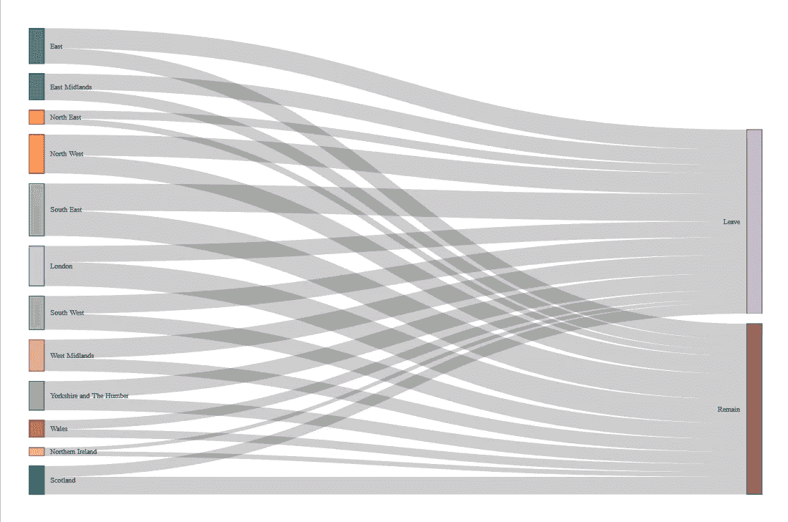

# 使用 R 中的 networkD3 创建简单明了的 Sankey 图

> 原文：<https://towardsdatascience.com/using-networkd3-in-r-to-create-simple-and-clear-sankey-diagrams-48f8ba8a4ace?source=collection_archive---------5----------------------->

我发现桑基图对于说明人员流动或偏好非常有用。R 中的`networkD3`包提供了一种直接生成这些图的方法，不需要知道实际 D3 代码的来龙去脉。

为了说明我的意思，我生成了一个桑基图，以显示英国的 12 个地区如何对 2016 年英国退出欧盟公投的整体结果做出贡献，在公投中，选民以 17，410，742 票对 16，141，241 票选择离开欧盟。

如果你想看到完全交互式的 Sankey 图，你可以在 RPubs [这里](http://rpubs.com/keithmcnulty/brexitsankey)通过 RMarkdown 文档查看代码。不幸的是，媒体上只能显示静态图像。

## 使数据成形

关于英国退出欧盟公投的非常详细的数据可以从英国选举委员会的网站上获得。第一步是加载我们的库，并将数据放入 r 中。由于数据非常详细，直到最本地化的投票中心，我们需要汇总所有的离开和剩余投票，以获得每个地区的总数。

```
## load librarieslibrary(dplyr)
library(networkD3)
library(tidyr)# read in EU referendum results datasetrefresults <- read.csv("EU-referendum-result-data.csv")# aggregate by regionresults <- refresults %>% 
  dplyr::group_by(Region) %>% 
  dplyr::summarise(Remain = sum(Remain), Leave = sum(Leave))
```

然后我们需要创建两个数据帧供`networkD3`在其`sankeyNetwork()`函数中使用:

1.  一个`nodes`数据帧，对源节点(即 12 个英国区域)和目的节点(即离开和留下)进行编号，从零开始。
2.  一个`links`数据框架，使用`source`、`target`和`value`列逐项列出每个流程。例如，西米德兰兹地区为休假投了 1，755，687 票，因此在这种情况下，`source`将是西米德兰兹的节点，`target`将是休假的节点，`value`将是 1，755，687 票。

以下是以这种方式构建数据的一些简单代码:

```
# format in prep for sankey diagramresults <- tidyr::gather(results, result, vote, -Region)# create nodes dataframeregions <- unique(as.character(results$Region))
nodes <- data.frame(node = c(0:13), 
                    name = c(regions, "Leave", "Remain"))#create links dataframeresults <- merge(results, nodes, by.x = "Region", by.y = "name")
results <- merge(results, nodes, by.x = "result", by.y = "name")
links <- results[ , c("node.x", "node.y", "vote")]
colnames(links) <- c("source", "target", "value")
```

现在我们已经以正确的方式构建了数据，我们可以简单地使用`networkD3::sankeyNetwork()`函数来创建图表。这产生了一个简单有效的图表，滚动交互显示每个投票流的细节。这里展示的是静态版本。

```
# draw sankey networknetworkD3::sankeyNetwork(Links = links, Nodes = nodes, 
                         Source = 'source', 
                         Target = 'target', 
                         Value = 'value', 
                         NodeID = 'name',
                         units = 'votes')
```



Brexit Referendum 2016 vote flows by region

最初我是一名纯粹的数学家，后来我成为了一名心理计量学家和数据科学家。我热衷于将所有这些学科的严谨性应用到复杂的人的问题上。我也是一个编码极客和日本 RPG 的超级粉丝。在 [*LinkedIn*](https://www.linkedin.com/in/keith-mcnulty/) *或*[*Twitter*](https://twitter.com/dr_keithmcnulty)*上找我。*