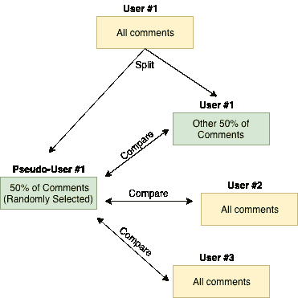
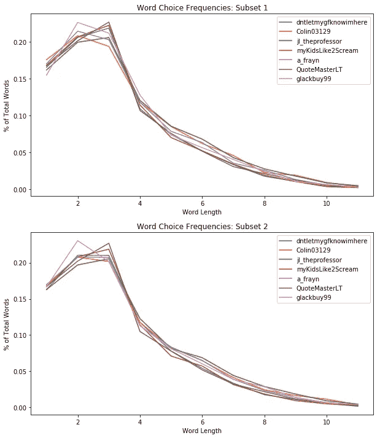
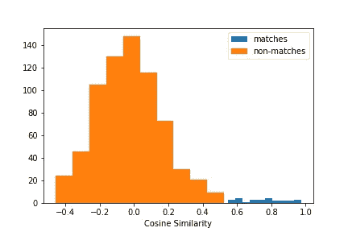
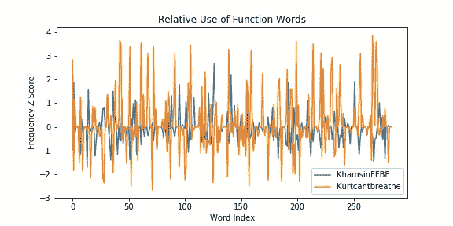
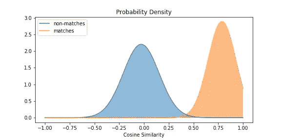
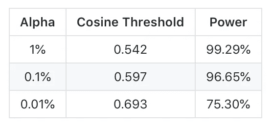
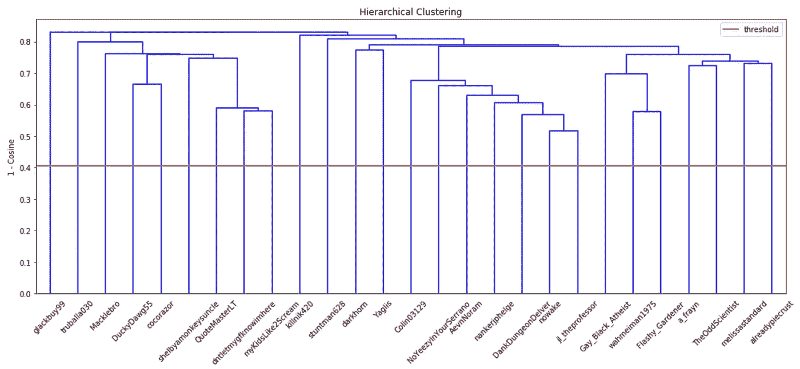

# 使用 NLP 识别控制多个帐户的 Redditors

> 原文：<https://towardsdatascience.com/using-nlp-to-identify-redditors-who-control-multiple-accounts-837483c8b782?source=collection_archive---------7----------------------->

Photo by [Daniel Monteiro](https://unsplash.com/@danielmonteirox?utm_source=medium&utm_medium=referral) on [Unsplash](https://unsplash.com?utm_source=medium&utm_medium=referral)

# 介绍

我建立了一个模型，可以确定两个 Reddit 帐户是否由同一个用户控制，仅仅基于他们的写作风格。代码是用 Python 和 Spark 写的，可以在我的 [Github](http://www.github.com/jabraunlin/reddit-user-id) 上找到。如果您有任何问题或改进建议，可以通过 [Linkedin](http://www.linkedin.com/in/john-braunlin) 联系我。

## 语境

几个世纪以来，作者可以匿名写作，认为他们的真实身份永远不会被揭露。然而，在过去的几年里，这一切都改变了，因为机器学习方法提高了笔形测量的效率。文体学是对写作风格的研究，涉及通过揭示单词选择、句子结构、标点符号等方面的独特模式来识别作者的写作倾向。

一些最著名的文体分析的例子包括使用它来确定詹姆斯·麦迪逊和亚历山大·汉密尔顿是匿名撰写的《联邦党人文集》的作者，成功地将 J.K .罗琳与《布谷鸟的呼唤》一书的匿名作者联系起来，并确定莎士比亚实际上写了哪些莎士比亚戏剧，哪些是他合写的，哪些是由完全不同的人写的。

但这些都是分析专业人士撰写的大量文本的例子。文体学在文本样本较少的非正式场合(如社交媒体)是否仍然有效？在我们开始区分一个作者的写作风格和另一个作者的写作风格之前，我们需要多少单词？在我们开始看到两个写作风格非常相似的用户之前，我们可以比较多少个作者的匿名文本？

# 履行

对于这个项目，我想看看能否通过分析 Reddit 上的用户来回答这些问题。网站上的所有用户都以给定的用户名匿名提交帖子和评论，每个人的评论都是公开的。创建 Reddit 帐户所需的唯一信息是一封电子邮件，因此一些用户创建了多个帐户。当一个用户的账户因为不文明的讨论而被禁止进入子编辑时，这就产生了一个问题。他们可以简单地创建另一个帐户来重新获得子编辑访问权。也许，如果我幸运的话，我可以识别两个或更多属于同一个用户的账户，以此帮助 subreddit 版主在他们的社区中保持更健康的讨论。

因为这是一个无监督的学习问题，我需要一些方法来验证我的模型的准确性。为了做到这一点，我获取了一个用户的全部评论历史，并随机抽取了一半的评论，用这些评论创建了一个新的伪用户。然后，我测量了我的模型是否成功地将这个伪用户与包含另外 50%评论的原始用户正确匹配。

## 基线

文体学中最古老的技术之一可以追溯到 19 世纪，当时通过使用不同长度单词的频率来比较作者。一些人倾向于更多地使用两三个字母的单词，而另一些人倾向于使用更大的词汇量。使用这些单词长度的频率的技术被称为门登霍尔的组成特征曲线(MCCC)。虽然这种技术相当粗糙，但仍然可以用来准确地识别作者。我们可以通过确定具有最低平均 RMSE 的曲线来确定谁的合成曲线与匿名文本的曲线最相似。在 7 个用户的评论历史被分成子集 1 中的伪用户和子集 2 中的原始用户之后，MCCC 首先在 7 个随机选择的 Redditors 的小组上进行测试。

通过遍历子集 1 中的每个伪用户，并将其与子集 2 中的每个用户进行比较，MCCC 实际上能够正确识别 7 个用户中的 5 个。虽然很有希望，但这种技术过于简单，无法大规模使用。

## 模拟陋居的三角洲

许多自然语言处理应用，如主题建模，通常使用词频-逆文档频率(TF-IDF)来识别可用于帮助描述文本的罕见关键词。在文体学中，最重要的词实际上是虚词，常见的词如“大约”、“因为”、“之上”、“而”。作者通常会写一个广泛的主题，因此他们使用的词汇变化很大。然而，虚词出现在每篇文章中，并且对于给定的作者，它们在不同的文档中的使用频率往往保持相当一致。

在我的分析中，150 个最常用的虚词被用来通过 Delta 方法识别用户的写作风格。记录每个功能词的频率，然后通过减去平均值并除以标准偏差进行标准化，给出每个特征值的 z 得分表示。结果是一个 150 维的向量，在作者比普通用户更频繁地使用一个词的特征维度上是正的，而在作者比普通用户更少地使用一个词的特征维度上是负的。然后，通过余弦相似性的测量，可以最精确地将伪用户的向量与每个用户的向量进行比较。

这种方法大大改善了结果。之前分析的 7 个用户现在以 100%的准确度匹配回他们的正确用户。从一个随机的 40 人小组中识别用户(过滤掉那些评论少于 200 条的用户，这些用户的历史太小，无法识别写作倾向)返回了 95%的准确率。

Cosines of pseudo-users to their original matching accounts vs non-matches

除了词法分析，我们还可以用句法来区分独特的写作风格。使用 nltk 的词性(POS)标记和跳格，我找到了 100 个最常用的词性跳格序列，并对每个用户使用它们的频率进行了矢量化，就像对虚词进行矢量化一样。对于同样的 40 个用户，该模型返回了 90%的准确率。然而，通过将这两种技术结合在一起，我达到了 100%的准确率。

## 按比例放大

通过继续添加随机用户，该模型继续完美地预测多达 100 个用户的作者身份。超过这一点，当从 3000 个用户中识别出一个用户时，准确率开始稍微下降，一直下降到 92.2%。

准确度下降的原因主要是由于缺乏数据。所有超过 1000 条评论的用户仍然被 100%准确地预测到。评论历史较少的人不容易被识别出来。我还发现某些用户的写作风格不是很独特；它们的绝大多数特征值都在平均值附近徘徊。下图所示的用户 KhasminFFBE 就是这种情况。此外，更多用户的引入增加了一些用户将具有高度相似的写作风格的机会。如果用户倾向于“代码转换”，即在不同的上下文中改变他们的写作风格，他们可能会被意外地识别为具有非常相似的写作倾向的另一个用户。

comparing the feature vectors of two users

为了进一步改进模型，我在特征向量中加入了标点符号的使用和 Reddit 上常用的某些 markdown 格式化方法(比如“”用于显示超链接)。我还添加了一些社交媒体上常见的俚语词，这些词类似于之前的一些虚词。这些包括像“耶”、“将要”和“哈哈”这样的词。这使得我的模型在一组 3000 个用户中正确匹配用户的准确率提高到了 93.8%。

Probability distribution of the final model

Alpha for non-matching accounts

从分布中，我能够确定临界值，在该临界值上，我可以拒绝用户不匹配的无效假设。因为错误地禁止用户为假阳性比确定假阴性更有害，所以α应该尽可能小，但是也应该相对于用户总数来选择。

## 最终应用

使用分层聚类模型来确定任何随机选择的账户实际上是否是由共同用户创作的。下面的树形图显示了 40 个用户的作者聚类分析。选择 0.1%的α水平是考虑到被比较的用户相当少，并且发现误报的可能性极小。对所有 3000 名随机选择的用户也进行了聚类，毫不奇怪，他们都不匹配。

## 解释结果

当应用于一小群用户或者一个很长的匿名文本(超过 1000 条评论)时，所创建的模型非常准确。较小的子编辑的版主肯定可以使用这种方法来查看他们的用户，看看他们中是否有属于被禁止用户的备用帐户。对于具有较大社区的子街道，这将更加困难，除非在进行风格比较之前可以将可能的嫌疑人缩小到较小的群体。

## 来源

数据是从[谷歌大查询](https://bigquery.cloud.google.com/table/fh-bigquery:reddit_comments.all_starting_201501)获得的

引用的研究:

[理解和解释作者归属的 Delta 度量](https://academic.oup.com/dsh/article/32/suppl_2/ii4/3865676)

[使用频繁词类跳转图的小集合的作者归属](https://www.aaai.org/ocs/index.php/FLAIRS/FLAIRS16/paper/download/12985/12546)

[更好地理解伯罗斯的文学作者归属三角](http://www.aclweb.org/anthology/W15-0709)

也非常感谢 [Shlomo Argamon](https://medium.com/u/e49b6ab3f69?source=post_page-----837483c8b782--------------------------------) ，他在 2008 年首次引入余弦相似度作为用于作者身份识别的最佳距离度量(并在上述资料中引用)。