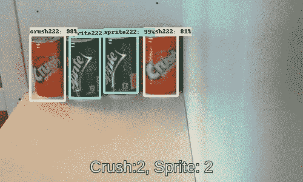
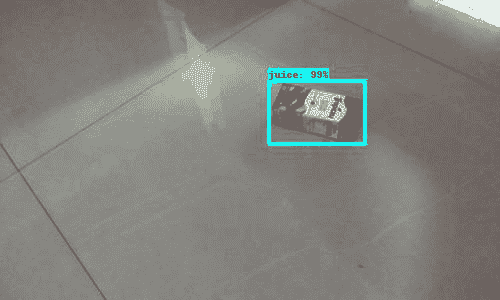
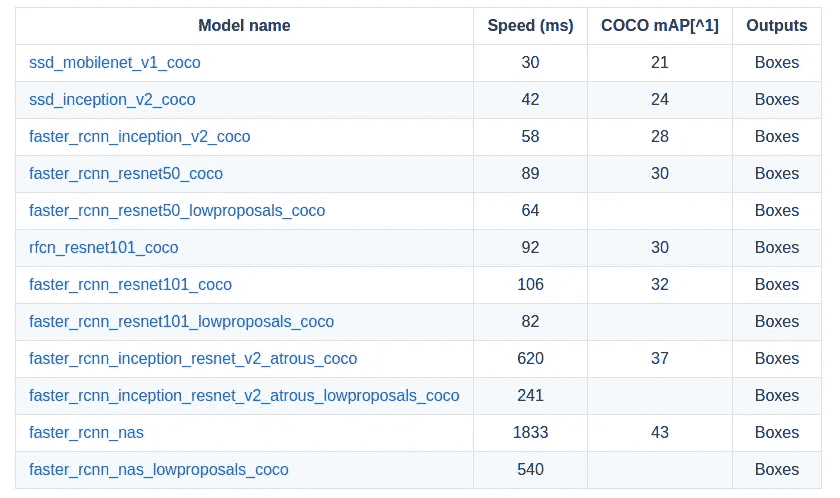

# 使用物体检测实现更智能的零售结账体验

> 原文：<https://towardsdatascience.com/using-object-detection-for-a-smarter-retail-checkout-experience-3f39acef857b?source=collection_archive---------2----------------------->

*用数据做酷事！*

我一直在玩 [Tensorflow 对象检测 API](https://github.com/tensorflow/models/tree/master/research/object_detection) ，对这些模型的强大感到惊讶。我想分享一些实际用例的 API 的性能。

第一个用例是更智能的零售结账体验。在[亚马逊 Go](https://www.amazon.com/b?node=16008589011) 商店宣布后，这是一个热门领域。

商店可以设计成智能货架，跟踪顾客从里面挑选的商品。我通过构建两个对象检测模型来做到这一点——一个跟踪手并捕捉手拾取的东西。第二个独立的模型监控货架空间。见下图 GIF。通过使用两个模型，你可以最小化单一方法的误差。

Hand Tracking and Inventory Monitoring

计算机视觉在零售结账中的另一个应用是，在结账系统中，不是一件一件地扫描物品，而是将所有东西放在一起，摄像头能够检测和记录所有东西。也许我们甚至不需要收银台。购物车可以安装摄像头，你可以推着购物车走出来，当你走出商店时，购物车会给你开账单。这不是很酷吗！我用 API 设计了一个有 3 个随机物品的“迷你”模型，该模型可以很容易地检测出放置了什么和数量。见下图 GIF。通过各种实验，我发现该 API 甚至在仅部分可见的项目上表现得非常好。

Detection of items with high accuracy

那么我们如何建造它呢？

1.  **收集数据**

可以通过查看在线公开的数据集或创建自己的数据来收集图像。每种方法都有其优点和缺点。我通常混合使用两种。例如，可以通过使用公开可用的数据集，如 [Ego Hand](http://vision.soic.indiana.edu/projects/egohands/) 数据集，来构建手部检测器。该数据集在手形、颜色和姿势方面有很多可变性，当该模型应用于现实世界时，这将是有用的。另一方面，对于货架上或购物车中的商品，最好收集您自己的数据，因为我们不希望有太多的可变性，也希望确保从各个方面收集数据。在你建立你的模型之前，通过使用像 PIL 和 OpenCV 这样的图像处理库来增加你的数据来创建额外的图像总是一个好主意，这些图像在亮度、缩放、旋转等方面有随机的变化。这个过程可以创建大量的额外样本，使模型稳健。

对于对象检测模型，我们需要注释——感兴趣对象周围的边界框。为此，我使用了[标签](https://github.com/tzutalin/labelImg)。用 Python 写的，接口用 Qt。这是一个非常方便的工具，注释是以 Pascal VOC 格式创建的，这使得使用 Tensorflow Github — `[create_pascal_tf_record](https://github.com/tensorflow/models/blob/master/research/object_detection/create_pascal_tf_record.py).py`和`[create_pet_tf_record.py](https://github.com/tensorflow/models/blob/master/research/object_detection/create_pet_tf_record.py).`中共享的脚本创建 [TFRecord 文件](https://www.tensorflow.org/api_guides/python/python_io#tfrecords_format_details)变得很容易

**2。建立模型**

我写过一个非常详细的教程，关于在你的自定义数据集上训练 Tensorflow 物体检测 API——[用 Tensorflow 物体检测 API](/building-a-toy-detector-with-tensorflow-object-detection-api-63c0fdf2ac95) 构建一个玩具检测器。以及关联的 [Github](https://github.com/priya-dwivedi/Deep-Learning/tree/master/tensorflow_toy_detector) 。请用这个开始。

在构建模型时，您必须做出的一个重大决定是将哪个对象检测模型用作微调检查点。已在 COCO 数据集上接受培训的可用[型号](https://github.com/tensorflow/models/blob/master/research/object_detection/g3doc/detection_model_zoo.md)的最新列表如下:

Tensorflow COCO Trained Models

黑白速度和准确性之间存在直接的权衡。对于实时手部检测，最好使用 SSD 模型或更快的 RCNN 初始，这是我个人更喜欢的。对于货架或购物车上的物品检测，我更喜欢速度较慢但精度较高的模型，如更快的 RCNN Resnet 或更快的 RCNN Inception Resnet。

**3。测试和改进模型**

我个人认为真正的工作是在你建立了模型的第一个版本之后才开始的！由于没有一个模型是完美的，当你开始使用它时，你会注意到它的性能差距。然后，您将需要使用您的直觉来决定是否可以填补这些缺口并改进模型，或者是否需要另一个模型或非模型来达到您期望的准确性。如果幸运的话，您只需要添加额外的数据来提高性能。

如果你想了解更多关于物体检测和 Tensorflow 物体检测 API 的知识，请查看我的文章—[Google tensor flow 物体检测 API 是实现图像识别最简单的方法吗](https://medium.com/towards-data-science/is-google-tensorflow-object-detection-api-the-easiest-way-to-implement-image-recognition-a8bd1f500ea0)？

给我一个❤️，如果你喜欢这个职位:)希望你拉代码，并尝试自己。如果你对这个话题有其他想法，请在这篇文章上发表评论，或者给我发邮件，地址是 priya.toronto3@gmail.com

**其他著述**:【http://deeplearninganalytics.org/blog】T4

PS:我有自己的深度学习咨询公司，喜欢研究有趣的问题。我已经帮助几家初创公司部署了基于人工智能的创新解决方案。请到 http://deeplearninganalytics.org/的[来看看我们吧。](http://deeplearninganalytics.org/)

如果你有一个我们可以合作的项目，请通过我的网站或 priya.toronto3@gmail.com 联系我

**参考文献:**

*   [Google Tensorflow 物体检测 Github](https://github.com/tensorflow/models/tree/master/research/object_detection)