# 在复杂图像分类场景中使用对象检测第 1 部分:

> 原文：<https://towardsdatascience.com/using-object-detection-for-complex-image-classification-scenarios-part-1-779c87d1eecb?source=collection_archive---------10----------------------->

## 人工智能计算机视觉革命

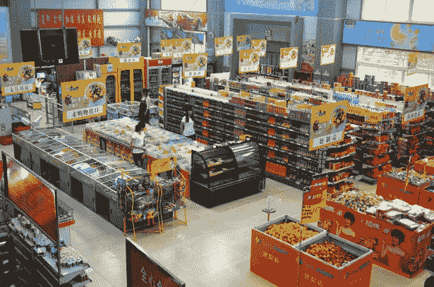

TLDR；本系列基于在下面的[现实生活代码故事](https://www.microsoft.com/developerblog/2017/07/31/using-object-detection-complex-image-classification-scenarios/)中检测复杂策略的工作。该系列的代码可以在[这里](https://github.com/aribornstein/cvworkshop)找到。

# 第 1 部分:人工智能计算机视觉革命

计算机视觉的最新发展已经改变了计算机视觉的前景。很多曾经被认为只有科幻才有可能的场景，最近变得和消费一个 API 一样容易。

例如，仅在四年前，以下漫画出现在 XKCD 上。

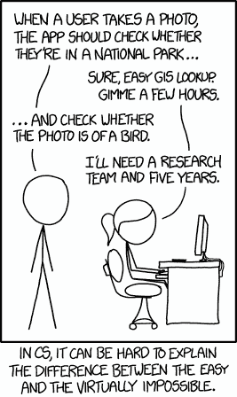

XKCD **September 24th 2014**

早在 2014 年，对普通开发人员来说，执行基本图像分类的能力被认为接近科幻小说，仅仅三年后，我们不仅可以确定图片是否是鸟类，我们还可以告诉你鸟类的种类，鸟在图片中的位置，并实时跟踪鸟类的迁徙模式。

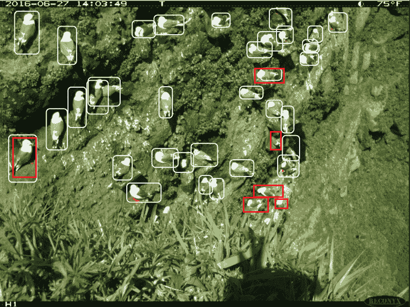

**Microsoft Developer Blog** [**Bird Detection with Azure ML**](https://www.microsoft.com/developerblog/2017/10/24/bird-detection-with-azure-ml-workbench/) **and** [**Active Learning for Object Detection in Partnership with Conservation Metrics**](https://www.microsoft.com/developerblog/2018/11/06/active-learning-for-object-detection/) **November 6, 2018**

# 实际上，并不是每一个计算机视觉问题都与鸟、花、猫和狗有关。

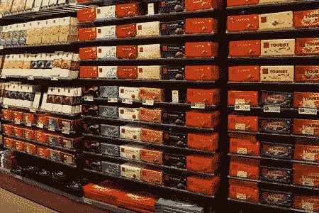

在本系列中，我们将回顾一个来自零售业的真实世界计算机视觉用例，并比较和对比一些可用于解决该问题的不同方法和技术。

一年多前，微软与中欧和东欧的一家大型糖果产品制造商合作，建立了一个机器学习模型，用于验证经销商是否正确库存巧克力。我们合作的公司在超过 14 个国家拥有庞大的连锁超市分销网络。这些经销商中的每一个都被要求根据标准化的政策来安排他们摊位上的巧克力。每个政策都描述了给定的巧克力应该放在哪个货架上，以及应该以什么样的顺序储存。

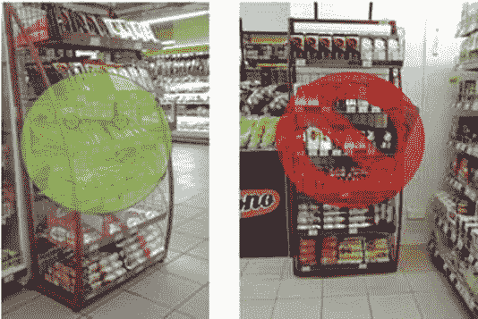

执行这些政策的“例行”审计活动会产生巨大的成本。我们的合作伙伴希望开发一个系统，让审计员或商店经理可以拍一张照片，并立即被告知货架的库存是否正确，如上图所示。

即使采用最先进的方法，这也具有挑战性，原因有很多，例如:

*   图像质量
*   图像角度
*   微妙的违反政策行为

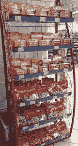

It’s easy for state of the art models to tell that there are no chocolates in this

尽管一些错误存储货架的图像(如上图右侧所示)是公然违反政策的行为，很容易分类，但其他图像(如下面的“违反一次”图像)则更加微妙，更难正确分类。

It is very difficult to for image recognition models to know that this image is off by one chocolate.

# 系列挑战

在本系列中，我们将构建一个复杂的策略分类器，类似于上述场景中的分类器。对于要有效存储的图像，必须按以下顺序存储。

*   顶层搁板(苏打水)
*   中间搁板(果汁)
*   底部搁板(水)

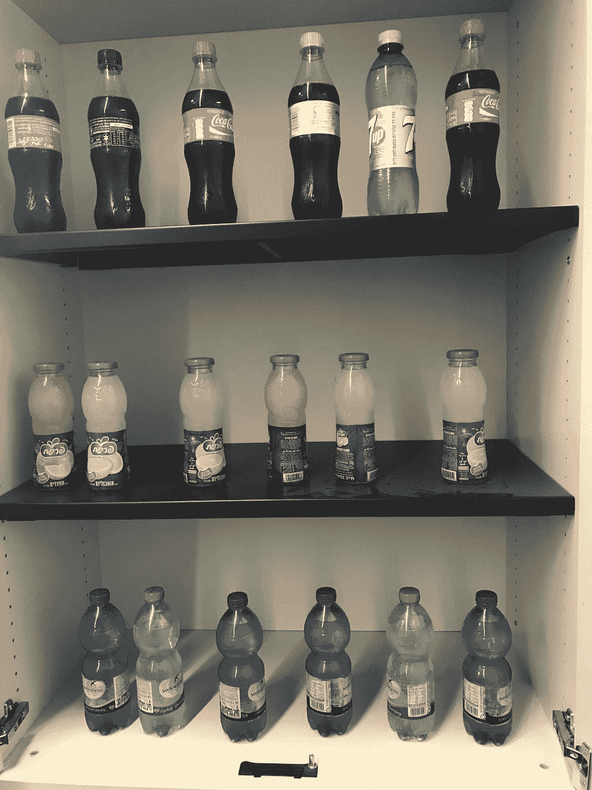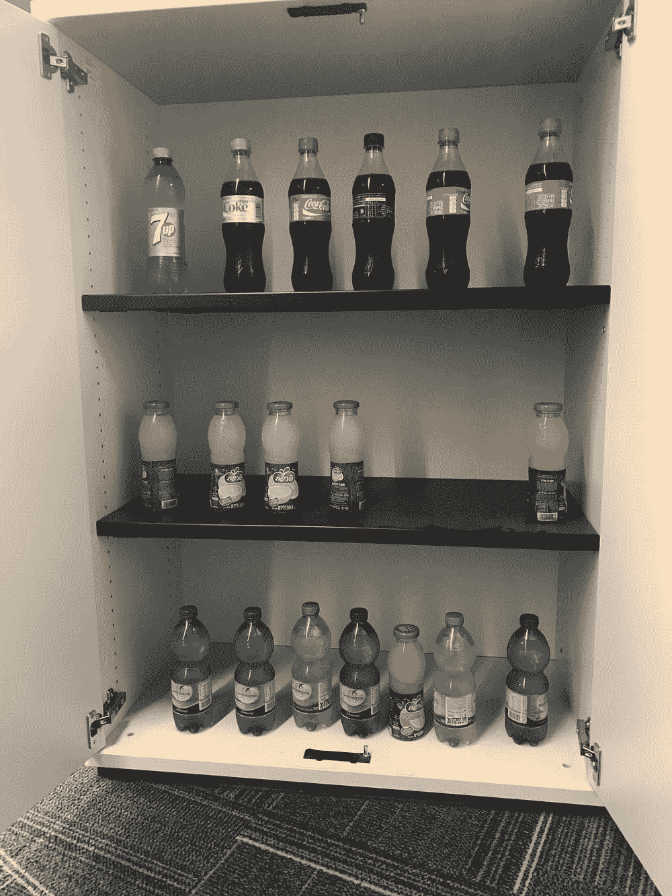

On the left we have a Valid Image on the Right we have an Invalid Image

# 这个问题的潜在技术解决方案

微软提供了一系列人工智能服务，可以用来解决像这样的计算机视觉任务，每个解决方案都可以在 Azure 上运行。

从 [Azure Cognitive Services](https://docs.microsoft.com/azure/cognitive-services/welcome?WT.mc_id=blog-medium-abornst) 到 [Azure DSVM](https://azure.microsoft.com/services/virtual-machines/data-science-virtual-machines/?WT.mc_id=medium-blog-abornst) 和 [Azure Machine Learning](https://docs.microsoft.com/azure/machine-learning/service/?WT.mc_id=medium-blog-abornst) 每种技术和方法都有不同的优势和权衡，符合计算机视觉用例的范围。

# [认知服务](https://docs.microsoft.com/en-us/azure/cognitive-services/welcome?WT.mc_id=blog-medium-abornst)

[Azure 认知服务](https://docs.microsoft.com/en-us/azure/cognitive-services/welcome?WT.mc_id=blog-medium-abornst)是一组开箱即用的 API 和高级服务，帮助您在不需要任何领域经验的情况下开始人工智能任务。

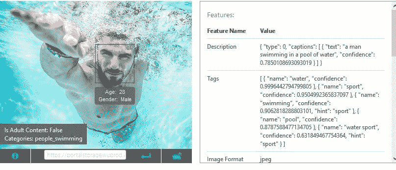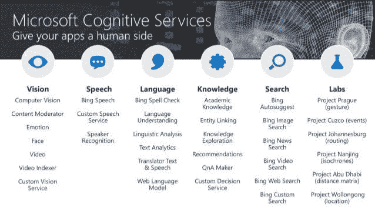

# [Azure DSVM](https://azure.microsoft.com/en-us/services/virtual-machines/data-science-virtual-machines/?WT.mc_id=medium-blog-abornst) & [ML 服务](https://docs.microsoft.com/en-us/azure/machine-learning/service/?WT.mc_id=medium-blog-abornst)

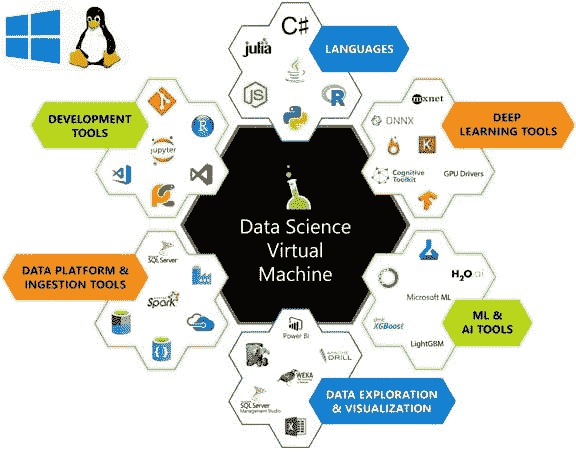

[数据科学虚拟机](https://azure.microsoft.com/en-us/services/virtual-machines/data-science-virtual-machines/?WT.mc_id=medium-blog-abornst)是 Azure 上的一个虚拟机(VM)映像。它已经安装和配置了许多流行的数据科学和深度学习工具。这些图片附带了流行的数据科学和机器学习工具，包括 Microsoft R Server Developer Edition、Microsoft R Open、Anaconda Python、Julia、Jupyter notebooks、Visual Studio Code、RStudio、xgboost 等等。您可以配置一个 DSVM，而不是自己部署一个类似的工作区，从而在安装、配置和软件包管理过程中节省大量时间。一旦部署了 DSVM，您就可以立即开始您的数据科学项目。

有关 DSVM 的更多信息，请参见[在 Azure 上使用 Linux 数据科学虚拟机的数据科学](https://docs.microsoft.com/azure/machine-learning/data-science-virtual-machine/linux-dsvm-walkthrough)

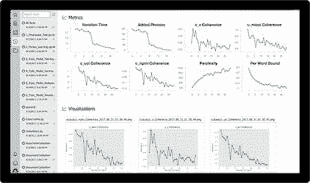

[Azure Machine Learning Service](https://docs.microsoft.com/en-us/azure/machine-learning/service/?WT.mc_id=medium-blog-abornst)

[**Azure ML 服务**](https://docs.microsoft.com/en-us/azure/machine-learning/service/?WT.mc_id=medium-blog-abornst) 让你可以更快地建立和训练机器学习模型，并通过 Azure 机器学习服务轻松部署到云或边缘。使用最新的开源技术，如 TensorFlow、PyTorch 或 Jupyter。在本地进行试验，然后通过云中支持 GPU 的大型集群快速向上或向外扩展。通过自动化机器学习和超参数调整加快数据科学的发展。使用集成的 CI/CD 工具跟踪您的实验、管理模型并轻松部署。

# 深度学习框架和 Keras

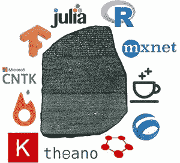

通常，深度学习工程师不会完全手动实现矩阵代数运算。相反，他们使用 PyTorch 或 TensorFlow 等框架。Keras 是用 Python 编写的开源神经网络库。它能够在 TensorFlow、微软认知工具包或 Theano 上运行。旨在实现深度神经网络的快速实验，它专注于用户友好、模块化和可扩展。维基百科(一个基于 wiki 技术的多语言的百科全书协作计划ˌ也是一部用不同语言写成的网络百科全书ˌ 其目标及宗旨是为全人类提供自由的百科全书)ˌ开放性的百科全书

 [## 在数据科学虚拟机上使用 Jupyter、Docker 和 PyTorch 进行交互式深度学习…

### 学习使用 Jupyter、PyTorch 和数据科学虚拟机来训练深度学习模型。

docs.microsoft.com](https://docs.microsoft.com/learn/modules/interactive-deep-learning/?WT.mc_id=medium-blog-abornst) 

在接下来的系列文章中，我们将探索其中的一些技术和架构，以解决我们自己复杂的策略分类场景。

# 系列目标

在本系列结束时，您应该更好地

*   了解人工智能计算机视觉领域
*   能够构建和部署定制的愿景服务模型
*   用 Keras 和迁移学习建立 CNN 图像识别模型
*   使用 VoTT 和 FasterRCNN 来注释和训练用于复杂分类场景的对象检测模型
*   使用 Azure ML 服务和 ACI 在云上训练和部署定制的计算机视觉模型

# 资源

 [## Pythic Coder 推荐的 Azure 机器学习入门内容

### Tldr 由于 DevOps 资源上的帖子很受欢迎，而且很难找到文档，所以我…

medium.com](https://medium.com/microsoftazure/the-pythic-coders-recommended-content-for-getting-started-with-machine-learning-on-azure-fcd1c5a8dbb4)  [## aribornstein -概述

### @ pythiccoder。aribornstein 有 68 个存储库。在 GitHub 上关注他们的代码。

github.com](https://github.com/aribornstein)  [## 认知服务|微软 Azure

### 微软 Azure Stack 是 Azure 的扩展——将云计算的灵活性和创新性带到您的…

azure.microsoft.com](https://azure.microsoft.com/en-us/services/cognitive-services/?v=18.44a) 

# [下一个帖子](https://medium.com/@aribornstein/using-object-detection-for-complex-image-classification-scenarios-part-2-54a3a7c60a63)

本系列的下一篇文章将讨论如何使用定制视觉服务完成这项任务。后续文章将讨论以下内容:

*   【Keras CNNs、MobileNet 和迁移学习的政策识别
*   [使用 Keras RetinaNet 进行策略检测](/using-object-detection-for-complex-image-classification-scenarios-part-4-3e5da160d272)
*   使用 Azure ML 服务在云上训练和计算机视觉模型
*   使用 Azure 机器学习在远程集群上训练计算机视觉模型

如果您有任何问题、评论或希望我讨论的话题，请随时在 [Twitter](https://twitter.com/pythiccoder) 上关注我。如果您认为我错过了某个里程碑，请告诉我。

## 关于作者

亚伦(阿里)博恩施泰因 是一个狂热的人工智能爱好者，对历史充满热情，致力于新技术和计算医学。作为微软云开发倡导团队的开源工程师，他与以色列高科技社区合作，用改变游戏规则的技术解决现实世界的问题，然后将这些技术记录在案、开源并与世界其他地方共享。