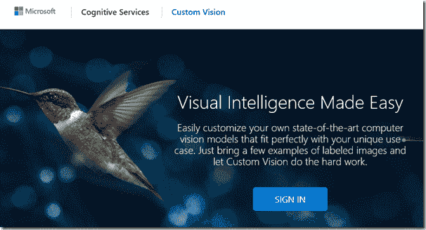
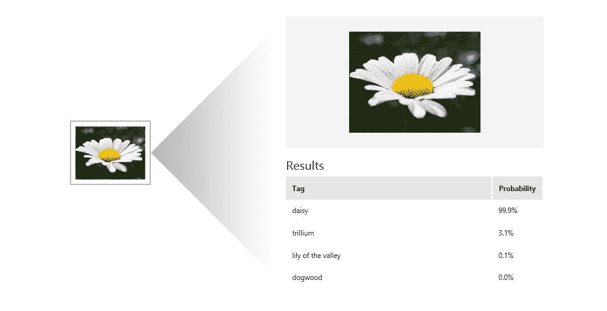
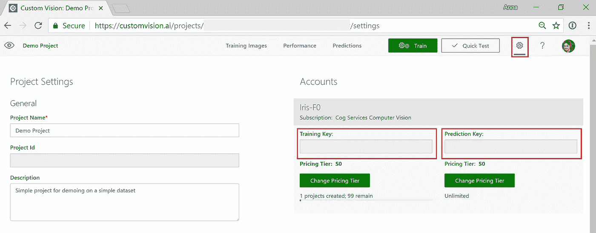
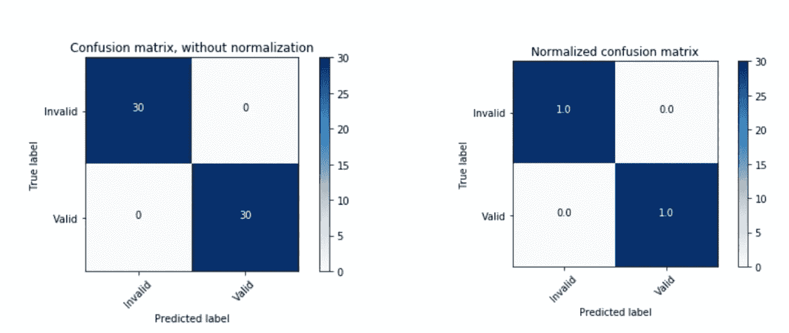

# 将对象检测用于复杂的图像分类场景第 2 部分:

> 原文：<https://towardsdatascience.com/using-object-detection-for-complex-image-classification-scenarios-part-2-54a3a7c60a63?source=collection_archive---------10----------------------->

## 定制视觉服务


TLDR；本系列基于在下面的[现实生活代码故事](https://www.microsoft.com/developerblog/2017/07/31/using-object-detection-complex-image-classification-scenarios/)中检测复杂策略的工作。该系列的代码可以在[这里](https://github.com/aribornstein/cvworkshop)找到。

# 第二部分:[定制视觉服务](https://customvision.ai/)

在系列文章的最后一篇文章[中，我们概述了复杂图像分类任务的挑战。在这篇文章中，我们将介绍并评估 Azure Custom Vision 服务作为解决我们挑战的技术。](/using-object-detection-for-complex-image-classification-scenarios-part-1-779c87d1eecb)

# 定制视觉服务为您的应用带来了机器学习的力量



自定义视觉服务是一个用于构建自定义图像分类器的工具。它使得构建、部署和改进图像分类器变得简单而快速。我们提供了一个 REST API 和一个 web 界面来上传您的图像和训练。

# 定制视觉服务能做好什么？

[定制视觉服务](/using-object-detection-for-complex-image-classification-scenarios-part-1-779c87d1eecb)是一个工具，用于构建定制图像分类器，并随着时间的推移使它们变得更好。例如，如果你想要一个可以识别“雏菊”、“水仙花”和“大丽花”图像的工具，你可以训练一个分类器来做这件事。为此，您可以为每个想要识别的标签提供定制视觉服务。



当您尝试分类的项目在您的图像中很突出时，定制视觉服务效果最佳。自定义视觉服务进行“图像分类”，但不进行“对象检测”这意味着自定义视觉服务识别图像是否属于特定对象，但不识别该对象在图像中的位置。

创建一个分类器只需要很少的图像— **每个类 30 张图像就足够启动你的原型**。Custom Vision Service 使用的方法对差异具有很强的鲁棒性，这使您可以用很少的数据开始原型制作。但是，这意味着定制视觉服务不太适合您想要检测非常细微差异的情况(例如，质量保证情况下的微小裂缝或凹痕)。)

定制视觉服务旨在简化分类器的构建，并帮助您随着时间的推移提高分类器的质量。

开发者还可以导出他们的模型，在边缘设备上运行，比如 iOS、Android 或 RaspberryPi

下面的步骤将指导您使用 python 和自定义视觉服务为我们的挑战训练一个模型。

以下步骤基于[文档快速入门](https://docs.microsoft.com/azure/cognitive-services/custom-vision-service/python-tutorial?WT.mc_id=medium-blog-abornst)。

# 准备密钥:

通过登录自定义视觉服务并导航至如下所示的帐户设置，获取您的[培训和预测密钥](https://customvision.ai)。



# 创建自定义视觉服务项目

接下来，我们需要使用您在上面获得的密钥，有计划地创建一个新的定制视觉服务项目。

```
**from** **azure.cognitiveservices.vision.customvision.training** **import** CustomVisionTrainingClient
**from** **azure.cognitiveservices.vision.customvision.training.models** **import** ImageUrlCreateEntryENDPOINT = "https://southcentralus.api.cognitive.microsoft.com"*# Replace with a valid key*
training_key = '' *#<your training key>*
prediction_key = '' *#<your prediction key>*trainer = CustomVisionTrainingClient(training_key, endpoint=ENDPOINT)*# Create a new project*
print("Creating Beverage Policy Classifier...")
project = trainer.create_project("Beverage Policy Classifier")
```

```
Creating Beverage Policy Classifier...
```

# 将标签添加到项目中

运行以下代码，为我们的**有效**和**无效**示例创建标签

```
*# Make two tags in the new project*
valid_tag = trainer.create_tag(project.id, "Valid")
invalid_tag = trainer.create_tag(project.id, "Invalid")
```

# 将图像上传到项目

要将图像添加到项目中，请在标记创建后插入以下代码。这将上传带有相应标签的图像。

```
print ("Adding images...")**import** **os**
**from** **multiprocessing.dummy** **import** Pool **as** ThreadPool**def** upload(filepath):
    **with** open(filepath, mode="rb") **as** img_data:
        **if** "Invalid" **in** filepath:
            trainer.create_images_from_data(project.id, img_data.read(), [ invalid_tag.id ])
        **else**:
            trainer.create_images_from_data(project.id, img_data.read(), [ valid_tag.id ])
    print('.', end='')

**def** upload_parallel(filepaths, threads=5):
    pool = ThreadPool(threads)
    results = pool.map(upload, filepaths)
    pool.close()
    pool.join()valid_dir = "dataset/Beverages/Train/Valid/"
invalid_dir = "dataset/Beverages/Train/Invalid/"
valid_paths = [valid_dir + os.fsdecode(image) **for** image **in** os.listdir(os.fsencode(valid_dir))]
invalid_paths = [invalid_dir + os.fsdecode(image) **for** image **in** os.listdir(os.fsencode(invalid_dir))]
img_paths = valid_paths + invalid_paths
upload_parallel(img_paths)print("Added **{}** images, **{}** valid, **{}** invalid.".format(len(img_paths), len(valid_paths), len(invalid_paths)))
```

```
Adding images...
....................................................................................................................................................................................Added 180 images, 90 valid, 90 invalid.
```

# 培训项目

既然我们已经向项目添加了标签和图像，我们就可以训练它了。这将创建项目中的第一个迭代。然后我们可以将这个迭代标记为默认迭代。

```
**import** **time**print ("Training...")
iteration = trainer.train_project(project.id)
**while** (iteration.status == "Training"):
    iteration = trainer.get_iteration(project.id, iteration.id)
    print ("Training status: " + iteration.status)
    time.sleep(1)
```

```
Training...
Training status: Training
Training status: Training
Training status: Training
Training status: Training
Training status: Training
Training status: Training
Training status: Training
Training status: Training
Training status: Training
Training status: Completed
```

# 评估模型

现在让我们在服务从未见过的本地测试数据集上评估模型。

**从****azure . cognitive services . vision . custom vision . prediction****导入**customvisionpedictionclient

```
*# Now there is a trained endpoint, it can be used to make a prediction*predictor = CustomVisionPredictionClient(prediction_key, endpoint=ENDPOINT)project_id = project.id
**def** predict(filepath):
    **with** open(filepath, mode="rb") **as** test_data:
        results = predictor.predict_image(project_id, test_data.read(), iteration.id)
    pred  = max(results.predictions, key=**lambda** x:x.probability).tag_name
    true ='Invalid' **if** "Invalid" **in** filepath **else** 'Valid'
    print('.', pred , end='')
    **return** (true, pred)

**def** predict_parallel(filepaths, threads=2):
    pool = ThreadPool(threads)
    results = pool.map(predict, filepaths)
    pool.close()
    pool.join()
    **return** zip(*results)test_valid_dir = "dataset/Beverages/Test/Valid/"
test_invalid_dir = "dataset/Beverages/Test//Invalid/"
test_valid_paths = [test_valid_dir + os.fsdecode(image) **for** image **in** os.listdir(os.fsencode(test_valid_dir))]
test_invalid_paths = [test_invalid_dir + os.fsdecode(image) **for** image **in** os.listdir(os.fsencode(test_invalid_dir))]
test_img_paths = test_valid_paths + test_invalid_pathsy_true, y_pred = predict_parallel(test_img_paths)
```

```
. Valid. Valid. Valid. Valid. Valid. Valid. Valid. Valid. Valid. Valid. Valid. Valid. Valid. Valid. Valid. Valid. Valid. Valid. Valid. Valid. Valid. Valid. Valid. Valid. Valid. Valid. Valid. Valid. Invalid. Valid. Invalid. Valid. Invalid. Invalid. Invalid. Invalid. Invalid. Invalid. Invalid. Invalid. Invalid. Invalid. Invalid. Invalid. Invalid. Invalid. Invalid. Invalid. Invalid. Invalid. Invalid. Invalid. Invalid. Invalid. Invalid. Invalid. Invalid. Invalid. Invalid. Invalid
```

# 第七步:基准测试

```
**from** **utils** **import** classification_report
classification_report(y_true, y_pred)
```



```
precision    recall  f1-score   support Invalid       1.00      1.00      1.00        30
       Valid       1.00      1.00      1.00        30 micro avg       1.00      1.00      1.00        60
   macro avg       1.00      1.00      1.00        60
weighted avg       1.00      1.00      1.00        60Confusion matrix, without normalization
[[30  0]
 [ 0 30]]
Normalized confusion matrix
[[1\. 0.]
 [0\. 1.]]
```

# 结论

正如您所看到的，custom vision 服务是一个很好的工具，可以用相对较少的数据和较少的工作生成强大的模型。在大多数用例中，它是一个 go too 工具，也是一个很好的起点。当您尝试分类的项目在您的图像中很突出时，定制视觉服务效果最佳。

该服务是任何分类任务的起点。但是，在为生产进行部署时，有几个事项需要考虑。

1.  服务失败的情况有哪些(可能是 2%的错误情况在生产中出现 30%,或者是您的用例中要考虑的最重要的情况。
2.  您正在对多少个类别/策略进行分类(2-10 个策略的模型效果更好)
3.  你的任务是什么领域？

# 资源

[](https://medium.com/microsoftazure/the-pythic-coders-recommended-content-for-getting-started-with-machine-learning-on-azure-fcd1c5a8dbb4) [## Pythic Coder 推荐的 Azure 机器学习入门内容

### Tldr 由于 DevOps 资源上的帖子很受欢迎，而且很难找到文档，所以我…

medium.com](https://medium.com/microsoftazure/the-pythic-coders-recommended-content-for-getting-started-with-machine-learning-on-azure-fcd1c5a8dbb4) [](https://github.com/aribornstein) [## aribornstein —概述

### @ pythiccoder。aribornstein 有 68 个存储库。在 GitHub 上关注他们的代码。

github.com](https://github.com/aribornstein) [](https://azure.microsoft.com/services/cognitive-services/?v=18.44a&v=18.44a&v=18.44a&WT.mc_id=medium-blog-abornst) [## 认知服务|微软 Azure

### 微软 Azure Stack 是 Azure 的扩展——将云计算的灵活性和创新性带到您的…

azure.microsoft.com](https://azure.microsoft.com/services/cognitive-services/?v=18.44a&v=18.44a&v=18.44a&WT.mc_id=medium-blog-abornst) 

# [下一篇文章](/using-object-detection-for-complex-image-classification-scenarios-part-3-770d3fc5e3f7)

本系列的下一篇文章将回顾如何通过 Keras CNNs、MobileNet 和迁移学习的[政策认可来完成这项任务](/using-object-detection-for-complex-image-classification-scenarios-part-3-770d3fc5e3f7)后续文章将讨论以下内容:

*   [使用 Keras RetinaNet 进行策略检测](/using-object-detection-for-complex-image-classification-scenarios-part-4-3e5da160d272)
*   使用 Azure ML 服务在云上训练和计算机视觉模型
*   使用 Azure 机器学习在远程集群上训练计算机视觉模型

如果您有任何问题、评论或希望我讨论的话题，请随时关注我的 [Twitter](https://twitter.com/pythiccoder) 如果您认为我错过了某个里程碑，请告诉我。

## 关于作者

[**亚伦(阿里)博恩施泰因**](https://www.linkedin.com/in/aaron-ari-bornstein-22aa7a77/) 是一个狂热的人工智能爱好者，对历史充满热情，致力于新技术和计算医学。作为微软云开发倡导团队的开源工程师，他与以色列高科技社区合作，用改变游戏规则的技术解决现实世界的问题，然后将这些技术记录在案、开源并与世界其他地方共享。