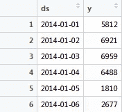
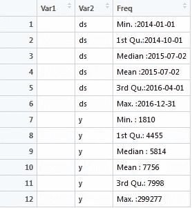
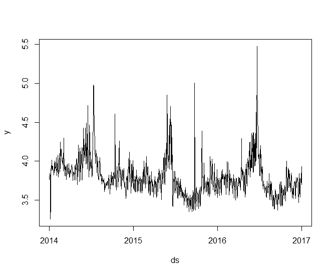
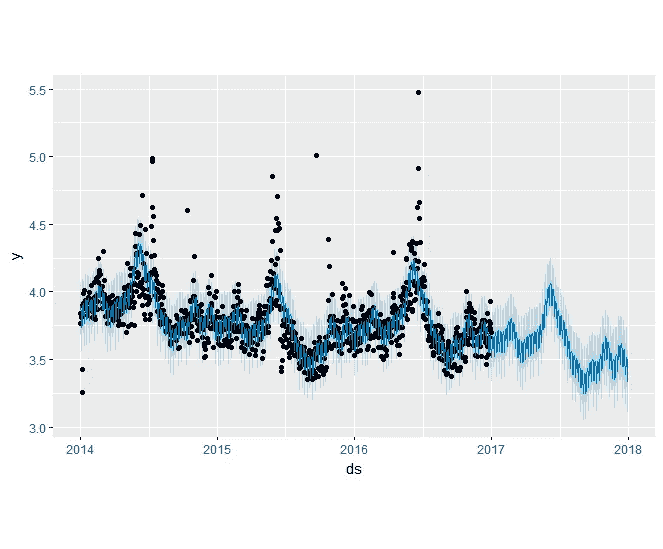
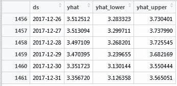
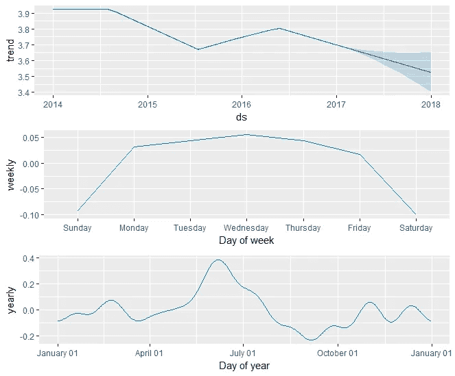
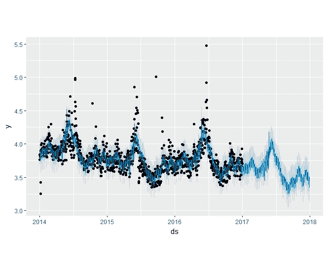
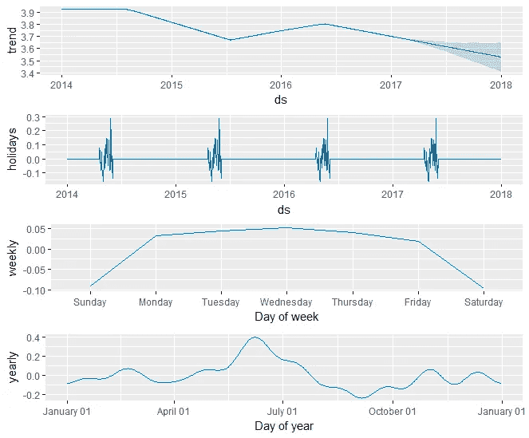
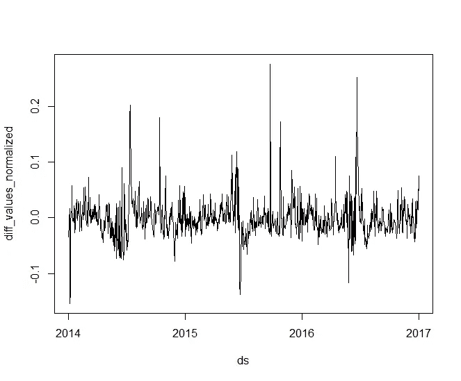

# 使用开源 Prophet 包在 R

> 原文：<https://towardsdatascience.com/using-open-source-prophet-package-to-make-future-predictions-in-r-ece585b73687?source=collection_archive---------2----------------------->

几乎每个公司都希望回答一周/一月/一年后他们会在哪里。在规划公司的基础设施、KPI(关键绩效指标)和员工目标时，这些问题的答案可能很有价值。
因此，使用数据预测工具是数据专业人员需要承担的常见任务之一。

最近作为开源发布的一个工具是脸书的时间序列预测包 [Prophet](https://facebookincubator.github.io/prophet/) 。R 和 Python 都可以使用，这是一个相对容易实现的模型，带有一些非常需要的定制选项。
在这篇文章中，我将回顾 Prophet，并接着介绍一个简单的 R 代码示例。这个代码流的灵感很大程度上来自于[官方软件包用户指南](https://facebookincubator.github.io/prophet/docs/quick_start.html)。

我们将使用从 wikishark 提取的开放数据集，保存勒布朗·詹姆斯维基百科文章页面的每日数据入口。接下来，我们将基于历史数据构建每日预测。
* wikishark 在文章发布后被关闭。你可以使用另一个有用的网站[获取数据](http://tools.wmflabs.org/pageviews/?project=en.wikipedia.org&platform=all-access&agent=user&range=all-time&pages=LeBron_James)。

## 阶段 1 —安装和导入 prophet

```
**install.packages(‘prophet’)
library(prophet)
library(dplyr)**
```

## 阶段 2 —加载数据集

```
**stats <- read.csv(“lebron.csv”, header=FALSE, sep=”,”)
colnames(stats) <- c(“ds”, “y”)
head(stats)
#daily data points starting from 2014–01–0**
```



```
**stats$y <- log10(stats$y)**
```

对于我们的代码示例，我们将转换数据并使用入口日志。这将有助于我们理解预测可视化。

## 第 3 阶段—探索数据

```
**View(summary(stats))
plot(y ~ ds, stats, type = "l")**
```



我们可以看到这些数据是从 2014 年 1 月 1 日到 2016 年 12 月 31 日，从 4 月到 6 月有一些年度季节性高峰。

## 第 4 阶段—基本预测

```
**m <- prophet(stats)
future <- make_future_dataframe(m, periods = 365)
forecast <- predict(m, future)**
```

像机器学习模型一样，第一个命令适合数据帧上的模型，接下来将使用 predict 命令部署模型，以便接收所需天数的预测。

```
**plot(m, forecast)**
```

prophet 软件包的开箱即用可视化非常好，具有预定义的刻度线、数据点和不确定性区间。这是这个开源包的优点之一，不需要额外的定制，第一个结果足够快和好，可以满足大多数需求。



predicting one year of future data points

使用这个图表，我们可以更清楚地发现年度趋势和季节性，以及如何利用它们进行预测。

```
**tail(forecast[c(‘ds’, ‘yhat’, ‘yhat_lower’, ‘yhat_upper’)])**
```



预测对象保存原始数据以及按天和不确定间隔的预测值。还可以通过以下方式访问预测趋势和季节性成分:

```
**tail(forecast)**
```

## 阶段 5-检查模型组件

```
**prophet_plot_components(m, forecast)**
```

为了保持简单性，查看模型的组件很容易。显示总体趋势、每周和每年的季节性。



Model components

## 第 6 阶段—定制假期和活动

最后一个组件图显示了在 NBA 季后赛和 NBA 总决赛期间对勒布朗·詹姆斯的兴趣增加。此时，模型识别每年返回的年度季节性。另一方面，勒布朗·詹姆斯目前保持着连续 6 年参加 NBA 季后赛的记录，从迈阿密开始，继续在骑士队。所以我们应该期待年复一年的季节性。

增加假期和活动是该套餐的一大优势。首先，通过使预测更准确，并允许用户考虑已知的未来事件。开发人员已经使这种定制比以前的时间序列包更容易，在以前的时间序列包中，为了进行预测，应该手动更改或忽略事件和假日。设想一个电子商务网站，它可以添加所有重复出现的活动和促销，并根据已知的未来活动日期设定收入目标。

添加事件和假日是通过创建一个新的数据帧来完成的，在该数据帧中，我们传递事件的开始或结束日期以及天数。在这个例子中，我们将添加 NBA 季后赛和 NBA 总决赛作为事件

```
**playoff_brackets <- data_frame(
 holiday = ‘playoffs’,
 ds = as.Date(c(‘2017–04–16’ ,’2016–04–17', ‘2015–04–19’, ‘2014–04–19’)),
 lower_window = 0,
 upper_window = 45
)****playoff_finals <- data_frame(
 holiday = ‘playoff_finals’,
 ds = as.Date(c(‘2016–06–02’, ‘2015–06–04’, ‘2014–06–05’)),
 lower_window = 0,
 upper_window = 20
)**
```

使用较低和较高的窗口参数，用户可以设置假期的长度。这些映射将被行绑定到单个对象，并在 holidays 参数中传递。

```
**holidays <- bind_rows(playoff_brackets, playoff_finals)
m <- prophet(stats, holidays = playoff_brackets)
forecast <- predict(m, future)
plot(m, forecast)**
```



请注意，该模型可以更好地预测峰值期间的值。再次打印出组件将显示增加的假日行对预测的影响。从理论上讲，您可以绘制许多对业务至关重要的事件，并获得更好的预测。



## 第 7 阶段—去除异常值

构建预测时，从历史数据中移除异常值非常重要。尽管这些数据点是单次事件或者只是错误的事件日志，但是模型使用这些数据点将它们的影响添加到预测中。与其他包不同，当传递安娜值和历史数据时会崩溃，Prophet 将忽略这些日期。

在本例中，我们将删除一系列单次事件，其中 NBA 球员宣布他将离开迈阿密前往克利夫兰，这可能会引起人们对他的维基百科页面的注意。

```
**outliers <- (as.Date(stats$ds) > as.Date(‘2014–07–09’)
 & as.Date(stats$ds) < as.Date(‘2014–07–12’))
stats$y[outliers] = NA**
```

## 第 8 阶段—更多功能

此时，我们可以看到开发人员在创建这个包时所考虑的简单性和健壮性。一些我没有展示但应该使用的额外功能:

*   变化的季节性和假日效应量表
*   绘制关键趋势变化点
*   编辑不确定性区间

## 使用 Prophet 进行异常检测

我希望开发人员的下一步是使用这个包，并利用它对时间序列数据进行异常检测。先前的软件包提供了这样的功能，但是严重依赖于数据结构和严格的季节性。

让我们使用现有的模型来映射数据中的异常。我们将原始值(y)与预测模型值(yhat)进行比较，并创建一个名为 **diff_values 的新列。**

```
**combined_data <- cbind(head(forecast, nrow(stats)), stats[order(stats$ds),])
combined_data$diff_values <- (combined_data$y - combined_data$yhat)
summary(combined_data$diff_values)**Min. 1st Qu. Median Mean 3rd Qu. Max. 
0.05269 0.07326 0.10780 0.13490 0.16520 0.29480
```

为了更好地概括异常检测，我们还将添加标准化的 diff 值，表示与实际值的百分比差异。

```
**combined_data$diff_values_normalized <-
(combined_data$y - combined_data$yhat) / combined_data$y**
```

让我们继续观察随时间变化的标准化 diff 值。

```
**plot(diff_values_normalized ~ ds, combined_data, type = “l”)**
```



Normalized difference prediction to actual values

大多数预测值都非常接近实际值，因为图表倾向于在 0 值附近移动。我们还可以通过过滤 **diff_values_normalized 列的绝对值来询问异常数据点的百分比。**设置一个数据点被视为异常的阈值是一种观察方法。在这个例子中是 10%

```
**nrow(combined_data[abs(combined_data$diff_values_normalized) > 0.1
& !is.na(combined_data$y),]) / nrow(combined_data)**
```

我们得到 0.02，这表明基于给定的阈值，2%的数据点是异常的。

## 结束语

做预测是数据专业人员的一项重要技能。感谢像 Prophet 这样的开源项目，这不需要太困难。这个软件包平衡了简单性、计算速度和适当的定制量，因此初学者和高级用户都可以使用它。

感谢阅读，
[Harel Rechavia](http://linkedin.com/in/harelrechavia) ，
Viber 的数据分析师