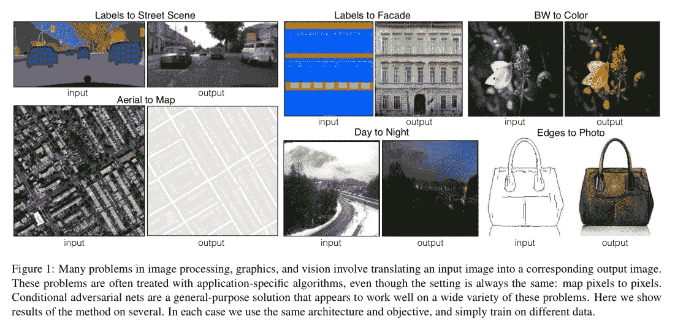

# 如何使用 pix2pix 创建 SnapChat 镜头

> 原文：<https://towardsdatascience.com/using-pix2pix-to-create-snapchat-lenses-e9520f17bad1?source=collection_archive---------12----------------------->

## 我们都喜欢 SnapChat 镜头/滤镜，但有没有想过如何自己制作？

是的，我知道副标题来自我的[上一篇文章](https://hackernoon.com/how-to-make-snapchat-lenses-f9eae861b5db)，在那里我展示了如何使用 dlib 和 openCV 使 SnapChat 像 live filters 一样。但今天我想展示我们如何使用名为 pix2pix 的深度学习网络来创建相同的过滤器。这种方法有助于从以前的方法中消除手动特征工程步骤，并且仅通过神经网络的一次推理就可以直接输出目标图像。那么，我们开始吧。


Demo

# pix2pix 是什么？

它发表在论文[用条件对抗网络进行图像到图像的翻译](https://arxiv.org/abs/1611.07004)(俗称 pix2pix)。

名称“pix2pix”来自于网络被训练成从输入像素映射到输出像素，其中输出是输入的某种转换。你可以在下图中看到一些例子，



Source [Paper](https://arxiv.org/pdf/1611.07004.pdf)

pix2pix 真正吸引人的地方在于它是一种通用的*图像到图像的转换。它不是为上面的每个任务设计定制的网络，而是处理所有任务的同一模型——只是在每个任务的不同数据集上进行训练。Pix2pix 可以用更少的训练图像和更少的训练时间产生有效的结果。给定一个只有 400 个(外观，图像)对的训练集，并且在单个 Pascal Titan X GPU 上进行不到两个小时的训练，pix2pix 可以做到这一点:*


Source [Paper](https://arxiv.org/pdf/1611.07004.pdf)

# pix2pix 网络如何工作？

pix2pix 网络使用 2 个网络进行训练。

1.  发电机
2.  鉴别器

这里，生成器将尝试从输入训练数据生成输出图像，鉴别器将尝试识别输出是假还是真。因此，两个网络都将努力提高精度，最终形成一个真正优秀的发电机。所以，你可以把网络的基本结构想象成编码器-解码器。

例如，生成器被输入一个实际的图像(输入)，我们想把它“翻译”成另一个结构相似的图像(实际输出)。我们的生成器现在产生假输出，我们希望它与真实输出无法区分。因此，我们简单地收集大量“真实事物”的例子，并要求网络生成无法与它们区分的图像。

# 方法

今天，我们将使用上述模型来创建 SnapChat 过滤器。我将使用下面的图像来显示结果。所有的图像都是 256x256 因为我是在同样的尺寸上训练的(是的，我没有足够的 GPU 能力来训练高清)

现在，让我们收集训练数据！为此我将使用我以前的 [**教程代码**](https://github.com/smitshilu/SnapChatFilterExample) **。**我下载了一堆人脸图像数据集，还用谷歌下载了人脸图像。

我将**“暴徒生活眼镜”**应用到所有的图像上，并将它们并排放置，因为训练数据需要这种格式。我使用下面的 pix2pix 训练库，它使用 tensorflow 来训练和显示结果。

[](https://github.com/affinelayer/pix2pix-tensorflow) [## affini layer/pix2pix-tensor flow

### 有条件对抗网络的图像到图像翻译的张量流端口 https://phillipi.github.io/pix2pix/…

github.com](https://github.com/affinelayer/pix2pix-tensorflow) 

一旦您完成生成训练数据，它将如下所示:


现在我们开始训练。为了训练，我们应该在 pix2pix-tensorflow 存储库中使用以下命令

```
python pix2pix.py --mode train --output_dir dir_to_save_checkpoint --max_epochs 200 --input_dir dir_with_training_data --which_direction AtoB
```


这里，AtoB 定义了训练模型的方向。例如，在上面的图像中，AtoB 表示模型将学习将正常的脸转换为戴眼镜的脸。

您可以在 tensorboard 中的训练数据和图形上看到结果，您可以通过以下命令启动 tensor board:

```
tensorboard --logdir=dir_to_save_checkpoint
```

一旦你开始看到你的模型有不错的结果，就停止训练，用评估数据来检查实时表现。如果您认为结果对于实时性能来说不够好，可以从最后一个检查点开始训练。

```
python pix2pix.py --mode train --output_dir dir_to_save_checkpoint --max_epochs 200 --input_dir dir_with_training_data --which_direction AtoB --checkpoint dir_of_saved_checkpoint
```

# 结论

条件对抗网络是许多图像到图像翻译任务的有前途的方法。你需要适当地训练，请使用一个好的 GPU，因为我得到了以下输出，训练较少，没有太多的训练数据差异。


如果你喜欢这篇文章请在 [***上关注我***](https://medium.com/@smitshilu)*或者*[***Github***](https://github.com/smitshilu)*或者订阅我的 [***YouTube 频道***](http://www.youtube.com/c/SmitShilu) 。***