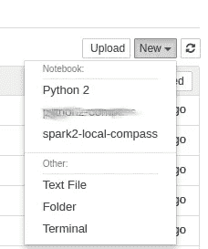

# 在本地计算机上使用 pyspark 和 Jupyter

> 原文：<https://towardsdatascience.com/using-pyspark-with-jupyter-on-a-local-computer-edca6ae64bb6?source=collection_archive---------4----------------------->


Image orogin: [LinkedIn](https://www.linkedin.com/pulse/how-run-apache-spark-jupyter-notebook-praneeth-bellamkonda/)

在版本 2.0 发布之后，随着许多新特性和改进的 SQL 功能的出现， [Apache Spark](https://spark.apache.org/) 成为我所掌握的更强大的工具之一。
因此，我想通过添加从 Jupyter notebook / IPython 控制台使用它的功能来增加这一强大工具的易用性。由于能够添加[自定义内核](https://github.com/jupyter/jupyter/wiki/Jupyter-kernels)，我创建了一组非常简单的指令(在 Ubuntu / CentOS 上测试)来在本地机器上安装带有 Jupyter 内核的 Spark。

# 在 Linux 上安装 Spark

本手册在 2.2.0 版上进行了测试，但应该适用于所有版本。我假设您已经安装了 Python 和 Java。为了在您的机器上安装 Spark，请遵循以下步骤:

1.  从 Apache [网站](http://spark.apache.org/downloads.html)下载 tar.gz 文件(我假设你是下载到 */opt* ):
    `wget [https://www.apache.org/dyn/closer.lua/spark/spark-2.2.1/spark-2.2.1-bin-hadoop2.7.tgz](https://www.apache.org/dyn/closer.lua/spark/spark-2.2.1/spark-2.2.1-bin-hadoop2.7.tgz)`
2.  提取文件并创建一个软链接到文件夹:
    `tar -xvzf spark-2.2.1-bin-hadoop2.7.tgz
    ln -s spark-2.2.1-bin-hadoop2.7 spark`
3.  验证 py4j 版本(我们将需要它来连接 Spark 和 Jupyter):
    `ls -1 /opt/spark/python/lib/py4j* | awk -F "-" '{print $2}'` 我得到的输出是 0.10.4，我们稍后将使用它作为*<<PY4J _ VERSION>>*
4.  验证你使用的 Python 路径:
    `which python` 我得到的输出是*/HOME/Nimrod/miniconda/envs/compass/bin/Python 2，*我们将此作为<<*Python _ HOME*>>

完成以上操作后，创建一个内核 json 文件:
`mkdir -p ~/.local/share/jupyter/kernels/spark2-local`

编辑文件:
`vim ~/.local/share/jupyter/kernels/spark2-local/kernel.json` ，添加以下内容(不要忘记替换两个占位符):

```
{
 "display_name": "spark2-local-compass",
 "language": "python",
 "argv": [
  "*<<PYTHON_HOME>>*",
  "-m",
  "IPython.kernel",
  "-f",
  "{connection_file}"
 ],
 "env": {
  "SPARK_HOME": "/opt/spark/",
  "PYTHONPATH": "/home/Nimrod/dev/theGarage/:/opt/spark/python/:/opt/spark/python/lib/py4j-*<<PY4J_VERSION>>*-src.zip",
  "PYTHONSTARTUP": "/opt/spark/python/pyspark/shell.py",
  "PYSPARK_SUBMIT_ARGS": "--master local[*] --driver-memory 3g --executor-memory 2g pyspark-shell",
  "PYSPARK_PYTHON": "*<<PYTHON_HOME>>*"
 }
}
```

现在，您应该能够观察到在`jupyter kernelspec list`中列出的新内核，或者在 jupyter UI 中的*新笔记本*类型下。



Example of The new kernel in the Jupyter UI

上面提到的当前问题是，使用`--master local[*]`参数是将 Derby 作为本地 DB 使用，这导致无法在同一个目录下打开多个笔记本。

对于大多数用户来说，论文并不是一个真正的大问题，但是自从我们开始使用[数据科学 Cookiecutter](https://drivendata.github.io/cookiecutter-data-science/) 以来，文件系统的逻辑结构将所有笔记本放在同一个目录下。每当我们想要在多台笔记本电脑上同时工作时，这会导致一个问题。

我花了很长时间寻找解决方案，最终在很长时间后，Amit Wolfenfeld 很快找到了解决方案。第一步是安装 [postgresql](https://www.postgresql.org/) 并确保其运行！

为了让 pySpark 使用 postgresql，我们需要 JDBC 驱动程序，从这里的[下载它们并保存到 */opt/spark/jars/中。*](https://jdbc.postgresql.org/download.html)

接下来，将用户更改为 postgres ( `sudo su postgres`)并运行`psql` :
`CREATE USER hive;
ALTER ROLE hive WITH PASSWORD 'mypassword';
CREATE DATABASE hive_metastore;
GRANT ALL PRIVILEGES ON DATABASE hive_metastore TO hive;
\q`

运行该命令后，确保**重启 postgreql 服务**。最后一步是在 Spark 的 config 目录下创建一个文件(假设您遵循了我上面建议的路径，命令应该是:`vim /opt/spark/conf/hive-site.xml`

将以下内容添加到文件中:

```
<configuration>
<property>
  <name>javax.jdo.option.ConnectionURL</name>
  <value>jdbc:postgresql://localhost:5432/hive_metastore</value>
</property><property>
  <name>javax.jdo.option.ConnectionDriverName</name>
  <value>org.postgresql.Driver</value>
</property><property>
<name>javax.jdo.option.ConnectionUserName</name>
  <value>hive</value>
</property><property>
  <name>javax.jdo.option.ConnectionPassword</name>
  <value>mypassword</value>
</property></configuration>
```

就是这样！现在，您可以开始尽可能多的 pyspark 笔记本。