# 在 Power BI 中使用 Python

> 原文：<https://towardsdatascience.com/using-python-in-power-bi-ee95a6b71443?source=collection_archive---------3----------------------->

自【2019 年 4 月 Python 集成已经在 Power BI 中普遍可用。就像 R 支持一样，现在您可以使用 Python 来导入数据、数据转换和数据可视化。在本文中，我们将一步一步地准备 Python 环境，在 Power BI 中启用 Python，导入数据并将聚类应用于数据，并使用 Python 在 Power BI 中创建自定义的可视化效果。复制该示例所需的所有材料都可以在 [GitHub](https://github.com/tompp4/data-science-blog/tree/master/python_in_powerbi) 中找到。本文假设您有一个工作的 Python 环境，并且安装了 Power BI。

# 在 Python 中创建数据导入脚本

我们将使用的数据集是[波士顿住房数据集](http://lib.stat.cmu.edu/datasets/boston)，可在 [scikit-learn](https://scikit-learn.org/stable/modules/generated/sklearn.datasets.load_boston.html) 中获得。数据集最常用于回归示例，但我们将采用不同的方法，并将其用于聚类。我们将使用[主成分分析](https://en.wikipedia.org/wiki/Principal_component_analysis)来降低维度，以便在二维空间中可视化数据。在此之后，我们将应用 [k 均值聚类](https://en.wikipedia.org/wiki/K-means_clustering)来尝试识别数据中的任何同质组。

由于本文的主要重点是展示如何在 Power BI 中使用 Python，所以我不会详细介绍创建导入代码的步骤。数据准备阶段可以作为 [Jupyter 笔记本](https://github.com/tompp4/data-science-blog/blob/master/python_in_powerbi/boston_housing.ipynb)提供给那些有兴趣了解它是如何创建的人。我建议创建您将要使用的代码的独立脚本，以便在 Power BI 中使用它之前测试和调试任何问题。Power BI 提供的错误消息并不总是那么有用。

# 在 Power BI 中启用 Python

## 使用所需的库设置 Python 虚拟环境

有几种方法可以管理您的 Python(虚拟)[环境](https://docs.python-guide.org/dev/virtualenvs/)。除了`virtualenv`和`pipenv`你也可以使用`conda`分布。

在这个例子中，我使用 [pipenv](https://docs.pipenv.org/) 来管理 Power BI 将使用的 Python 环境。为了开始，打开一个`Command Prompt`或`Power Shell`控制台，导航到您想要用作 Python 代码工作目录的文件夹。如果您正在使用我的 GitHub 库，请转到您克隆/下载示例代码的位置。我们将运行以下命令来创建 Python 环境并安装所需的库。

```
pipenv install numpy pandas matplotlib seaborn scikit-learn
```

如果你用的是我从 GitHub 下载的代码，运行`pipenv install`就足够了，因为它会自动从现有的`Pipfile`安装所需的库。

最后，我们希望检查这个虚拟环境的实际 Python 路径，因为我们需要引用 Power BI 中的路径。

```
pipenv --venv
```

我的虚拟环境的位置是`C:\Users\tomra\.virtualenvs\python_and_powerbi-0r4DNLn9`，所以我把路径复制到剪贴板。

**注意:**您可以使用`conda`来管理 Power BI 的虚拟环境。如果你和我使用过类似的 conda 安装/配置，conda 环境安装在 Windows `%userprofile%\AppData`的一个系统文件夹中。默认情况下，您不能从 Power BI 导航到该文件夹来选择您的 Python 主目录。解决方法是在 Windows 资源管理器中显示隐藏文件。请注意，在常规的 Windows 使用中，不要意外删除任何系统文件。另一种选择是将 conda 环境放在非系统文件夹中。

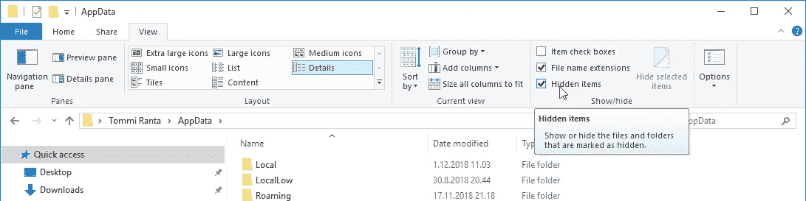

## 配置 Power BI 以使用 Python

启动电源 BI 并转到`Options`处，您应该会看到左侧的`Python scripting`部分。点击该按钮打开`Python script options`。默认情况下，Power BI 列出了能够在系统中检测到的 Python 环境。我们需要更改这些设置，因为我们为 Power BI 创建了单独的虚拟环境。从`Detected Python home directories`中选择`Other`选项。将 Python 主目录设置为虚拟环境所在路径中的`Scripts`文件夹。我的情况是`C:\Users\tomra\.virtualenvs\python_and_powerbi-0r4DNLn9\Scripts`。

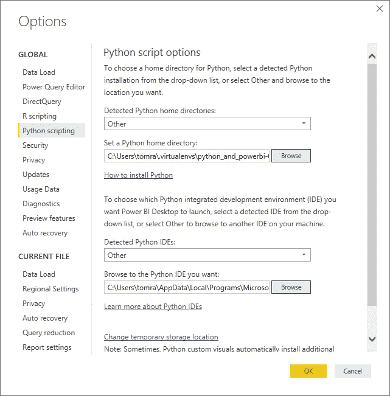

现在我们已经准备好在 Power BI 中使用 Python 代码，所以准备好吧！

# 功率 BI

## 使用 Python 脚本导入数据

我们转到功能区中的`Home`选项卡，单击`Get data`并选择`More`选项开始我们的数据导入。转到`Other`面板，在那里你会找到`Python script`选项。选择并点击`Connect`。将打开一个 Python 脚本对话框，您可以在其中添加自己的代码。将以下代码复制并粘贴到`Script`文本区，然后点击`OK`。

```
import pandas as pd
import numpy as np
from sklearn.datasets import load_boston
from sklearn.preprocessing import StandardScaler
from sklearn.decomposition import PCA
from sklearn.cluster import KMeans# utilize the sklearn.datasets package to load the Boston Housing dataset
boston = load_boston()# scale the data to same value range first since PCA
# is sensitive to the scaling of data
sc = StandardScaler()
X = sc.fit_transform(boston.data)# create PCA with n_components=2 to allow visualization in 2 dimensions
pca = PCA(n_components=2)
X_pca = pca.fit_transform(X)# divide data into 5 clusters (refer to .ipynb for motivation)
kmeans = KMeans(n_clusters=5, init='k-means++', max_iter=300, n_init=10)
y_kmeans = kmeans.fit_predict(X_pca)# create pandas dataframe of the housing data for Power BI
columns = np.append(boston.feature_names, ['MEDV', 'PC1', 'PC2', 'CLUSTER'])
data = np.concatenate((boston.data,
                       boston.target.reshape(-1, 1),
                       X_pca,
                       y_kmeans.reshape(-1, 1)),
                      axis=1)
df_housing = pd.DataFrame(data=data, columns=columns)
# we need to convert all columns as string because of different
# decimal separator in Python (.) and Finnish locale (,) that Power BI uses.
# comment out below line if Power BI uses dot as a decimal separator.
df_housing = df_housing.astype('str')# create pandas dataframe of the pca data for Power BI
columns = np.append(boston.feature_names, ['VARRATIO'])
data = np.concatenate((pca.components_,
                       pca.explained_variance_ratio_.reshape(-1, 1)),
                      axis=1)
df_pca = pd.DataFrame(data=data, columns=columns, index=['PC1', 'PC2'])
df_pca = df_pca.astype('str')
```

在下一个窗口中，我们可以选择要导入的数据集。选择`df_housing`和`df_pca`数据集，并点击`Load`。接下来，我们将对导入数据进行最后的调整。点击功能区中的`Edit Queries`。

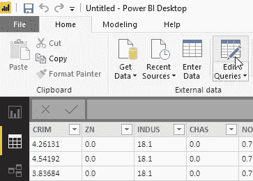

由于 Python 和 Power BI 中的[区域设置](https://en.wikipedia.org/wiki/Decimal_separator)可能存在差异，我选择在 Python 脚本中将所有列保存为字符串。需要设置正确的数据类型，根据您的地区/设置，我们可能需要采取不同的路线。目标是将每一列转换成数字。

**带小数点的幂 BI**

虽然我还没有测试过，但是您应该能够移除`Changed Type`步骤，选择所有列，并从功能区的`Transform`选项卡中选择 Power BI `Detect Data Type`，以便获得正确的数据类型。对两个数据集重复上述步骤。

另一个选项是修改导入脚本，删除/注释我们将数据类型设置为字符串`df_housing = df_housing.astype('str')`和`df_pca = df_pca.astype('str')`的行。Power BI 应该在导入过程中正确识别数据类型。

**带十进制逗号的幂 BI**

我们需要替换点(.)改为逗号(，)，以便设置正确的数据类型。选择所有列，并从功能区的`Transform`选项卡中单击`Replace Values`。用逗号替换点，点击`OK`。

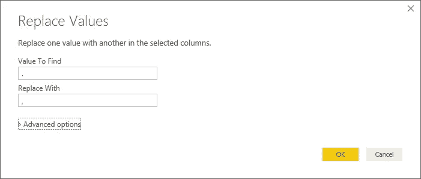

之后，点击`Detect Data Type`，让 Power BI 检测正确的数据类型。对两个数据集重复这些步骤。

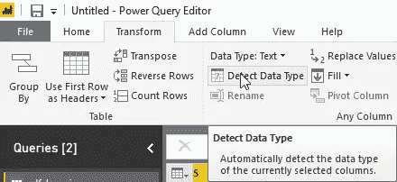

最后一步是将一个`Index Column`添加到`df_housing`数据集。这可以通过功能区中的`Add Column`选项卡来完成。完成后，转到`Home`选项卡并点击`Close & Apply`。

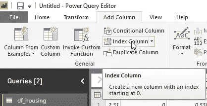

## 使用 Python 创建自定义可视化

我们回到`Reports`视图，开始我们的可视化工作。计划是使用主成分作为轴在图表上可视化聚类。散点图是这种可视化的一个很好的替代方案。点击`Scatter chart`将其添加到页面中。按照以下方式将`df_housing`列拖动到可视化效果窗格:

*   将`PC1`拖至`X Axis`。
*   将`PC2`拖至`Y Axis`处。
*   将`CLUSTER`拖到`Legend`上，以可视化集群的分组方式。
*   将`Index`拖至`Details`，因为这将删除图表中的聚合。

最终结果应该类似于下图。由于 k-means 聚类中初始质心的随机选择，您可能会有不同的聚类顺序(着色)。

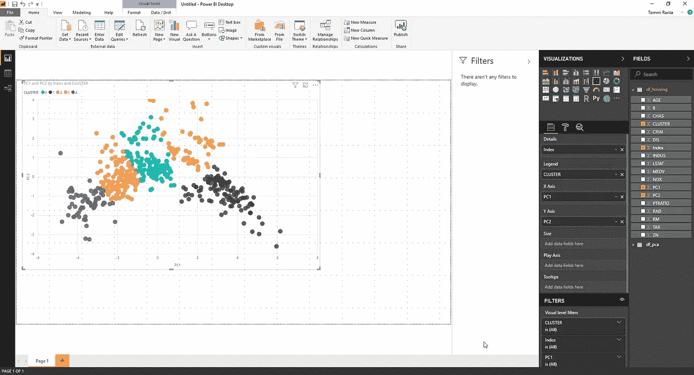

接下来，我们将想象每个特征如何影响每个主要成分。该信息可在`df_pca`数据集中获得。我们将通过热图展示这些信息。`Seaborn` Python 库提供了一种创建热图的简单方法，因此我们将向页面添加一个`Python visual`。Power BI 可能会警告您脚本视觉效果，请单击`Enable`继续。每个特征需要单独拖到`Data fields`区域。从数据集中拖动除`VARRATIO`之外的每一列。将下面的代码片段复制到代码区，点击`Run script`。

```
import matplotlib.pyplot as plt
import seaborn as snsdataset.index = ['PC1', 'PC2']
plt.figure(figsize=(8, 2))
plt.xticks(rotation=45)
data = dataset.loc['PC1', :].to_frame().sort_values(by='PC1').transpose()
sns.heatmap(data,
            cmap='plasma',
            square=True,
            annot=True,
            cbar=False,
            yticklabels='')
plt.show()
```

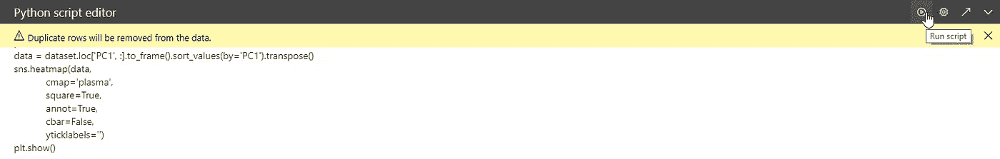

您现在应该会看到类似下图的热图。根据您的屏幕分辨率，您可能需要隐藏脚本窗格才能看到视觉效果。

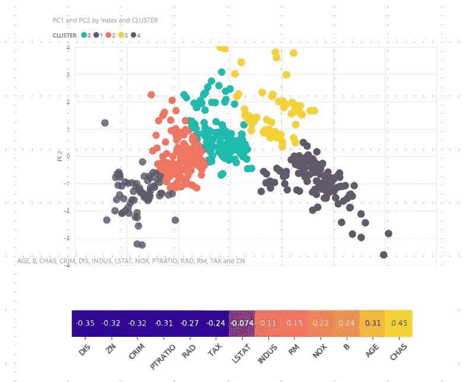

重复相同的步骤为第二个主成分创建热图，但使用下面的代码片段来使用来自第二个主成分的数据，并制作可放置在散点图左侧的垂直可视化效果。

```
import matplotlib.pyplot as plt
import seaborn as snsdataset.index = ['PC1', 'PC2']
plt.figure(figsize=(2, 8))
data = dataset.loc['PC2', :].to_frame().sort_values(by='PC2', ascending=False)
sns.heatmap(data,
            cmap='plasma',
            square=True,
            annot=True,
            cbar=False,
            xticklabels='')
plt.show()
```

我建议在其他工具中测试你的 Python 可视化，例如使用 Jupyter Notebook，特别是在可视化很复杂或者你想微调可视化的所有小细节的情况下。还值得考虑在 Python 可视化中使用与 Power BI 报告中相同的字体，以获得统一的外观和感觉。这很容易用 Matplotlib 和它的兄弟实现。

**注意:**有些 python 包只生成 HTML，为了克服这个限制，绘图被保存为图像，然后使用 matplotlib 显示。要写入 png 文件，你需要安装 chrome 驱动程序，例如将 exe 文件放在`C:\chromedriver`中。一旦你这样做了，你应该把这个文件夹放在`PATH`环境变量中。在我们的情况下，不需要这一步。

我们现在已经可视化了关于两个主成分的已识别数据簇，这两个主成分一起解释了数据中的大部分差异。热点图显示了哪些要素以积极或消极的方式影响主成分值的每个主成分。让我们做一些最后的润色，使报告看起来更好一点:

*   将其中一种灰色聚类颜色更改为紫色。
*   为数据添加标题和引用。
*   添加显示每个分类的平均中值价格的可视化效果。
*   添加解释功能的文本框。
*   添加一个可视化，说明每个主成分解释的差异。

这就是我的版本最后的样子。

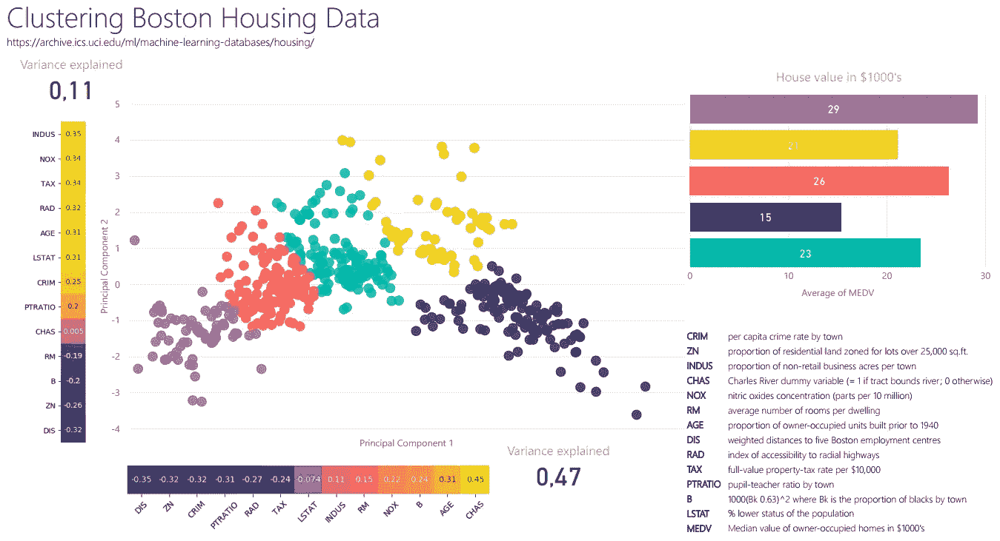

最重要的是，我们只需再创建一个报告，在该报告中，我们将仔细查看所选要素、中值住房价值(目标)和已识别的聚类之间的关系。通过观察可视化，我们可以得出结论，仅第一主成分就解释了数据中几乎一半的差异。此外，我们可以从图表中看到，较低的主成分值平均转化为较高的中值房价。`Distance`功能对小幅降低 PC1 值的影响最大，因此让我们更仔细地看看它在不同集群中的表现。我们创建了一个新页面，并进行了以下更改:

*   添加描述性标题。
*   添加一个`Scatter chart`，其中`X Axis`值为`DIS`列，`Y Axis`值为`MEDV`，并且`Legend`和`Details`字段的设置与之前的散点图类似。
*   右键单击`DIS`列，选择`New group`，创建尺寸为 1 的箱子。
*   添加一个`Stacked column chart`，通过使用`DIS`新创建的装箱列显示距离值的分布。按轴而不是计数对图表进行升序排序。

这就是我对这份报告的看法。

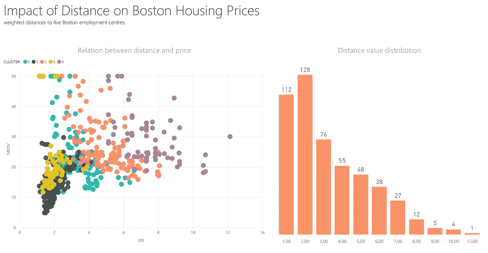

# 摘要

在本文中，我们建立了一个 Python 虚拟环境，并安装了数据转换和可视化所需的库。如果您想利用一些 Python 库，可以在环境中安装额外的库。接下来，我们设置 Power BI 来利用 Python 脚本。这是一次性设置，这意味着您不必在下一个报告中重复这些相同的步骤。最后，我们利用 Python 脚本来导入数据和创建定制的视觉效果。还可以使用 Python 脚本对已经导入 Power BI 的数据集进行数据清理和转换。相对于在 Power BI 之外准备数据并导入可用于可视化的数据集，在哪些用例中利用 Python 脚本更有意义还有待观察。Python 视觉效果的表现也可以更好。但是请记住，这仍然是一个预览功能，它看起来非常有前途！您认为在 Power BI 中使用 Python 有哪些用例？加入讨论，分享你的想法。