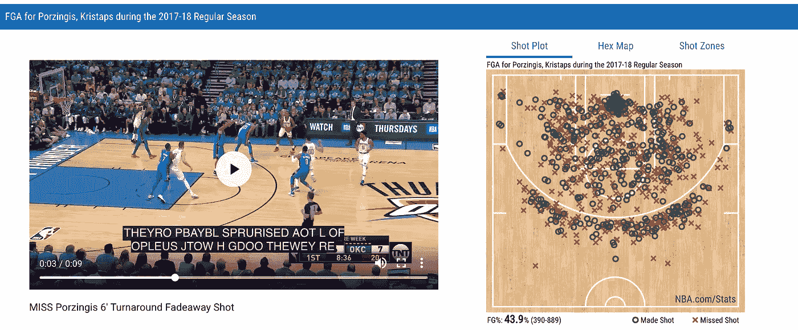
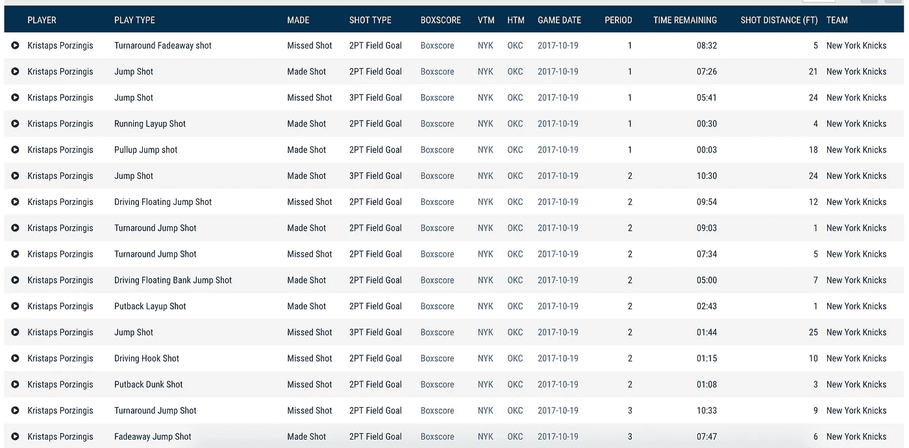
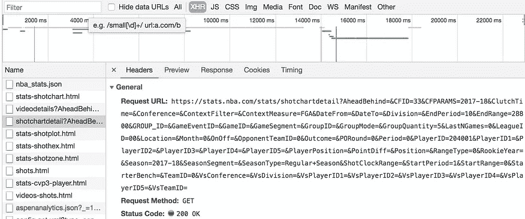
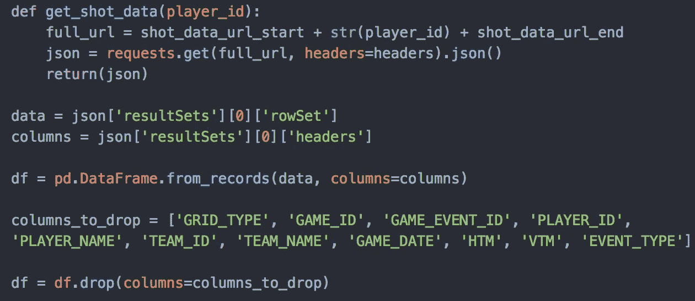
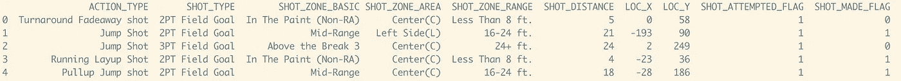
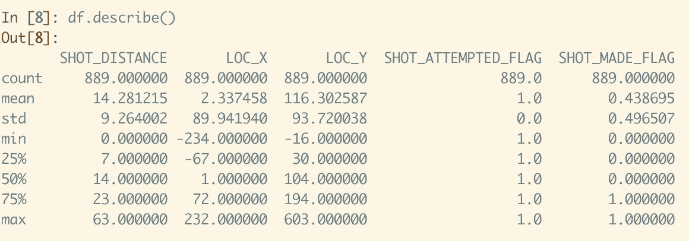
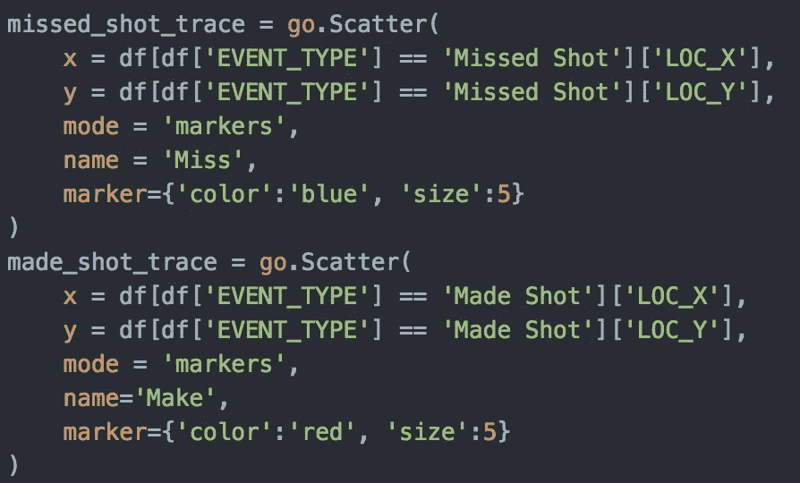
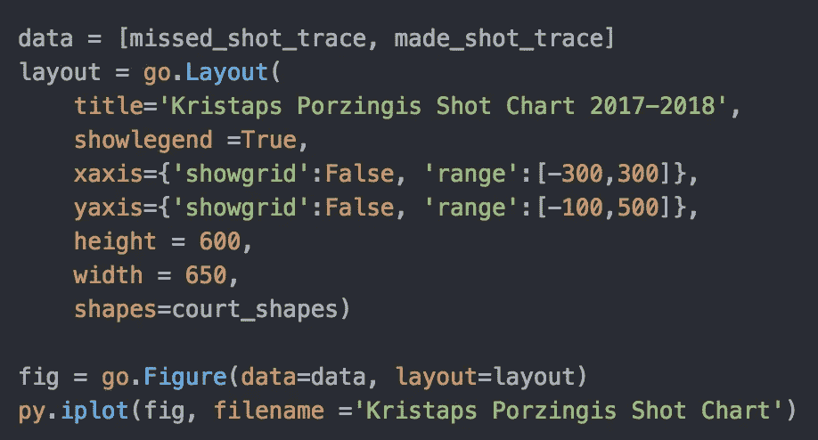
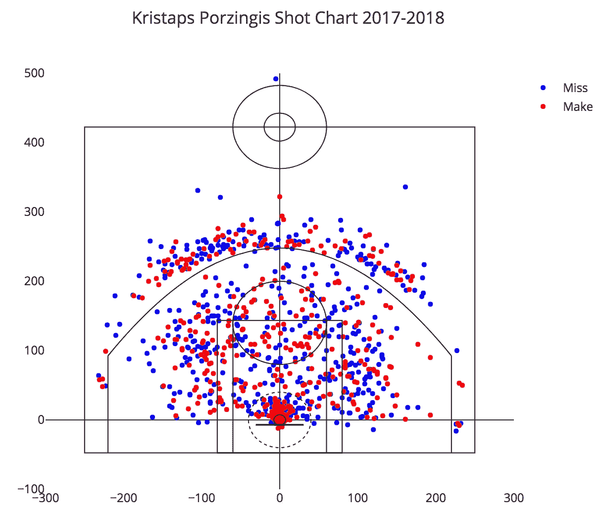

# 用 Python、Pandas 和 Plotly 生成 NBA 投篮图表

> 原文：<https://towardsdatascience.com/using-python-pandas-and-plotly-to-generate-nba-shot-charts-e28f873a99cb?source=collection_archive---------4----------------------->

自从我在阅读 Kirk gold berry court vision 关于 Grantland.com 的一篇文章时偶然发现 NBA 投篮图表可视化以来，我就对体育数据可视化着迷，并对它们如何能够增强球队和球员的决策产生兴趣。因此，当我最近开始学习数据科学时，我很自然地知道，我的第一个兼职项目之一将是试图重建一个 NBA 球员的投篮图表。

## 收集数据

我的第一步是收集每个镜头的位置数据。随着体育分析发展到几乎每个球队都有专门的分析部门，职业联盟也纷纷效仿，加强了他们的统计部门。NBA 在其[网站](https://stats.nba.com/)上提供了一系列详细的统计数据，这些数据是使用安装在每个赛场的[第二光谱](https://www.secondspectrum.com/index.html)摄像机收集的，这些摄像机跟踪球员和球的实时运动。从第二光谱收集的数据示例包括速度、行驶距离、油漆接触等。

不幸的是，NBA 不允许在其统计页面上访问 API，所以我不得不深入挖掘以找到我想要的东西——每个球员的详细投篮数据。在每个球员的击球细节页面上，如下所示，你可以查看各种击球情节，并筛选出每个击球的基本细节的电子表格，只需点击播放按钮，就可以看到每个击球的视频。

Kristaps Porzingis Shot Detail Page — [https://stats.nba.com/events/?flag=3&CFID=33&CFPARAMS=2017-18&PlayerID=204001&ContextMeasure=FGA&Season=2017-18&section=player&sct=hex](https://stats.nba.com/events/?flag=3&CFID=33&CFPARAMS=2017-18&PlayerID=204001&ContextMeasure=FGA&Season=2017-18&section=player&sct=hex)

尽管网页上有大量的数据，但这些数据的结构无法让我对其进行正确的分析，我也无法获得我所寻求的全部数据。然而，使用谷歌 Chrome 开发工具，特别是 XHR (XMLHttpRequest)，我能够获得一个 json 文件，可以使用 Pandas 轻松读取和转换。

Chrome XHR tab and resulting json linked by url

虽然这正是我在寻找的数据，但我渴望有一种方法来收集任何玩家或一组玩家的数据，而不必重复这些繁琐的步骤。在注意到 725 个字符的 url 字符串只有一个条件值——player _ ID——需要更改才能调出其他人的击球数据后，我编写了一个 python 脚本来收集给定了 nba.com ID 的任何球员的数据。使用 Requests python 库，我能够获取 json 数据，而不必实际访问网站。

Code to grab json data from stats.nba.com and transform into Pandas DataFrame

## **清理数据**

一个不可思议的 python 库中的 Pandas，除了其他特性之外，它还允许我将 json 转换成 DataFrame，并清理数据，只显示我想要的值和列。Pandas 不费吹灰之力就将难看的 json 结构转换成了一种干净、易读的格式。Pandas 还提供了一些简洁的功能，比如。describe()方法，该方法自动计算并输出相关统计数据的样本，例如所有数值列的平均值、中值和标准偏差。如下图所示，这一行代码让我立即了解了纽约尼克斯队的明星前锋克里斯塔普斯·波尔津吉斯的投篮选择。例如，波尔津吉斯的平均投篮距离是 14.28 英尺，他的典型投篮距离篮筐左侧非常近。

Sampling of data from Pandas DataFrame

.describe() method for Kristaps Porzingis’ DataFrame

## **策划拍摄**

现在，我已经以正确的格式获得了我需要的所有数据，我可以使用 Plotly(一个图表和可视化库)绘制每个镜头了。首先，我用 [Savvas Tjortjoglou 的](https://github.com/savvastj/nbashots/blob/master/nbashots/charts.py)惊人的模板画出一个精确尺寸的球场轮廓。接下来，我将所有的镜头分为两类——成功和失败——然后我可以用不同的颜色绘制出来。使用 Plotly graph objects 模块，我能够将所有的得分和失误绘制为球场轮廓上的散点图，将 X 和 Y 值分别设置为 X_LOC 和 Y_LOC，这表示每次击球尝试的坐标。

Code for creating scatter plot for all shots.

从那里，我需要做的就是运行我的程序，就像变魔术一样，每一个镜头都按照设计的那样被绘制出来。

## 结论

对我来说，这是一个非常有趣和充实的兼职项目。它将我对体育的热情与我开始编程后一个月左右学到的各种技能结合了起来。在未来，我想让我的拍摄情节互动，并润色它们，使它们在视觉上更具吸引力，并增强可读性。我还打算引入一些变化，比如用代表每个投篮位置的频率和效率的六边形代替重叠的单个投篮数据点，或者增加一个与联盟平均水平的比较。