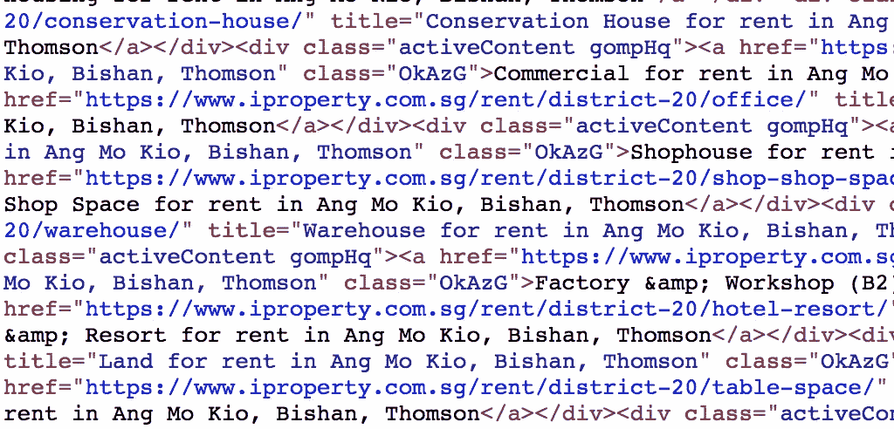
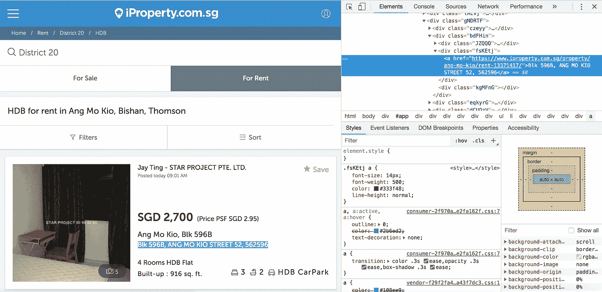
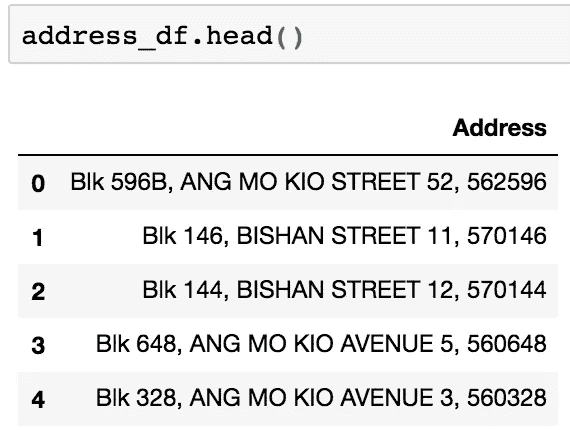
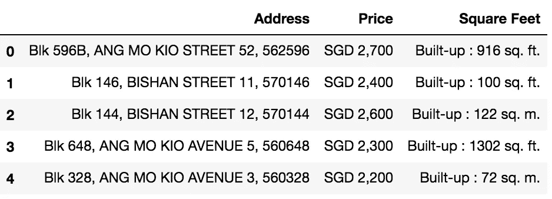
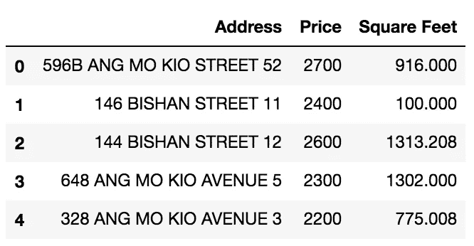
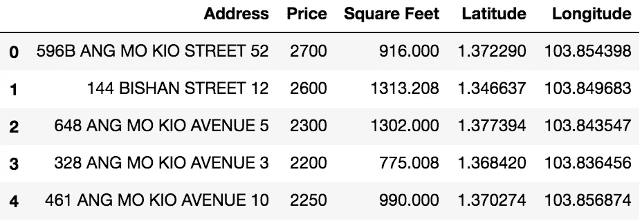
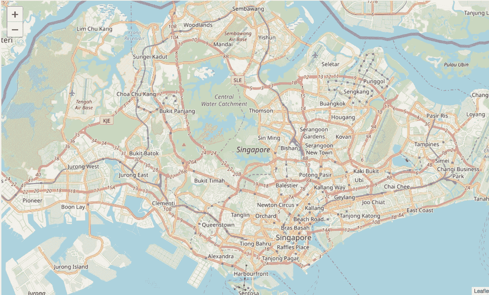
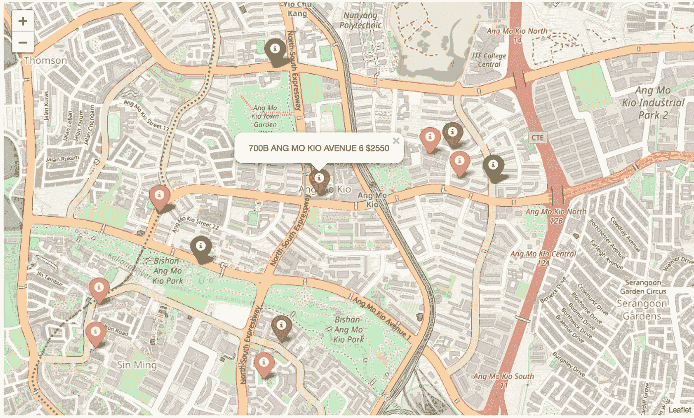
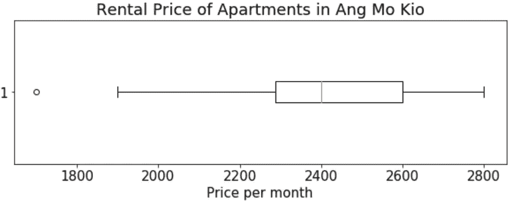

# 用 Python 给自己找了个出租房

> 原文：<https://towardsdatascience.com/using-python-to-find-myself-a-rental-home-a0b1bf6f02e?source=collection_archive---------8----------------------->

## 通过网络抓取、网络地图和数据可视化缩小我对房屋的搜索范围


HDB flats in Singapore

“你好，世界！”

随着我在欧洲的冬季交流项目接近尾声，我意识到了现实:我需要在新加坡找到一个新的公寓。

这个简单！我所要做的就是登录这些网站，输入一些搜索参数来找到我的理想公寓。以前租过房子，这个过程相当熟悉和舒适。然而，在快速浏览 Python 一段时间后，我认为这将是创建一个更加**高效的**搜索过程的好方法，并通过处理一个真实世界的问题来测试我的技能。

***在我们深入研究这个项目之前，先花些时间浏览一下 iProperty 的***[***robot . txt***](https://www.iproperty.com.sg/robots.txt)***文件。虽然他们确实允许机器人抓取他们的网站，但保持谨慎和不滥用赋予我们的这一特权总是很重要的。***

# 语境

现在，当我找到一个出租公寓时，我寻找什么？简单地说，我的最优出租公寓可以描述为这两个变量的函数:

*   靠近捷运(地铁)站，方便随时随地通勤。
*   价格合理(因为我是一个破产的学生)。

通常，我会采取以下步骤来找到最佳公寓:

1.  在房产网站上搜索，找到一个价格合适的单位。
2.  在谷歌地图上查找地址，看看它是否位于捷运站附近。
3.  如果位置是我想要的，太好了！不管怎样，我会把它记在某个地方。
4.  如果位置不是我想要的，那么我会再次重复步骤 1 到 3。

如果重复 3 到 4 次，上面的步骤看起来很容易。然而，对于任何潜在的租户来说，我们知道这种情况很少发生。我们通常必须运行许多迭代来创建足够大的单元池，以便我们进行比较并做出决定。此外，在上面提到的过程之后，接下来是与代理人交谈的过程，根据我的喜好找到单位都是循规蹈矩的，等等。如果在任何时间点出了问题，那么将再次回到步骤 1 到 4。

必须有一种方法，我可以在一个工作空间中编辑所有我想要的搜索结果，只需点击一个按钮就可以进行更有效的比较。

我已经下定决心要在一个叫 Ang Mo Kio 的地方找到一套三居室公寓，这个地方位于新加坡的 20 区。至于网站，我将主要关注 [iProperty](https://www.iproperty.com.sg/) 。**记住这些参数，因为它们会在这篇文章中反复出现:地区= 20，卧室= 3。**

考虑到这一点，我想到了可以帮助我做出这样一个决定的视觉辅助形式。它们是:

*   一个交互式地图，它可以显示我在一个地区的所有出租屋的位置。
*   描绘该地区价格分布的图表，这样我就知道会发生什么。

让我用 Python 来做这件事吧！这个项目回购的链接可以在[这里](https://github.com/reubenlee3/real-estate-rental)找到。现在让我们开始吧。

# 第 1 部分:数据源

我需要的数据可以从房地产网站上获得。问题是，这不是我习惯的通常的 excel 或 csv 文件。数据以 HTML 的形式出现，看起来有点不同…



为此，我可以使用 Python 漂亮的 Soup 4 包。它允许我从网站上删除 HTML 数据。不过在刮之前，需要增加一些手续:

我需要什么信息？也许是公寓的价格、地址和大小。让我从抓取*地址*的数据开始。我不是 HTML 专家，但我知道一些元素类型中包含各种形式的信息。图 1 将演示这一点。通过检查源代码，我们可以看到，对于这个特定的单元，关于它的地址的信息包含在这个元素< a >中，在类‘fsKEtj’的 main < div >下。



Figure 1: Inspecting the source code

提取信息并将其存储在空的“地址”列表中的代码如下:

Figure 2

地址输出？



Figure 3: First five rows of the addresses scraped from the website

太好了！现在已经完成了，我们只需重复同样的过程来查找包含*价格*和*大小*信息的元素，并通过调整图 2 中的代码来提取这些信息。

这是 iProperty 搜索页面的第一页，显示了 10 套公寓。我需要更多的信息来进行适当的比较。在这篇文章中，我会选择从 5 页搜索结果中提取数据，给自己一个可供选择的公寓池。如何做到这一点？幸运的是，iProperty 的 URL 相当简单:

```
[https://www.iproperty.com.sg/rent/district-20/hdb/?bedroom=3&page=1](https://www.iproperty.com.sg/rent/district-20/hdb/?bedroom=3&page=1)
```

如您所见，它只包含三个部分:*地区、卧室数量和页码*。这让生活变得容易多了，因为我现在可以循环浏览第 1 页到第 5 页。在每个循环之间，我还植入了一个 *time.sleep* 函数，只是为了让我的网页抓取器表现得有点像人类，并防止我自己被阻止访问网站。

有了这个，我现在有了一个合理大小的公寓池，有三个变量:*价格、地址和大小*。在使用 pandas 将它们组合成一个数据框之后(还要注意，没有错误显示行数不同，这意味着显示的每个单元都有地址、价格和大小)，我现在需要清理数据。让我们看一下数据集的前五行。



Figure 4: First five rows of the full data set

在球棒的右边，你可以看到数据的各个方面需要调整。首先，我希望*价格*和*尺寸*列是数字。因此，SGD、build-up 和必须删除。此外，仔细检查 size 列，有几个单位用“sq”表示。m 而不是 sq。英尺。。这些也需要清洗。所有采取的数据清理步骤都可以在我的[项目报告](https://github.com/reubenlee3/real-estate-rental/blob/master/script.py)中的脚本中看到。请看一下图 5 中清理过的数据集！



Figure 5: The cleaned data set

快到了！注意到单元有什么问题吗？似乎有一个“流氓”公寓(指数 1)，面积很小(100 平方英尺)，但非常昂贵(2400 美元/月)。作为一项预防措施，我检查了移除这些单元。

现在我有了 iProperty 上列出的所有公寓的完整数据集，参数区= 20，卧室= 3，让我们开始创建一个交互式地图。

# 第 2 部分:创建交互式地图

诚然，这部分是项目中最具挑战性的方面。为了在地图上绘制我的数据集中的公寓，我需要上述公寓的坐标。在这里，我将使用 Geopy 包根据我的数据集中的地址检索坐标，并使用 follow 利用这些坐标来创建地图及其交互功能。

首先，我们遍历数据集中包含的所有地址，并提取出每个公寓的纬度和经度。然后，这两个变量将被添加到主数据集中。

Figure 6



Figure 7: Full data set with new latitude and longitude columns

在获得每个公寓的坐标后，我们现在准备将它们全部标绘在新加坡地图上！让我们创建基本地图:

```
location = [1.3521,103.8198]
sgmap = folium.Map(location,zoom_start = 12)
```



Figure 8: Base map of Singapore

现在该添加标记了！对于我的记号笔，我包含了两个可以帮助我更有效地整合信息的特性。

*   每个标记都根据其价格进行了颜色编码。所有租赁价格都是有序的，并计算它们各自的百分位数。绿色标记表示公寓的租金在 0-30%之间，橙色标记表示 30-70%之间，红色标记表示 70%以上的租金价格。
*   每个标记处都会弹出一个窗口，显示公寓的地址和价格。

最终产品看起来像这样:



Figure 9: Interactive map with all rental units in the Ang Mo Kio area

从地图上，我可以看到大约有 5 个单位靠近捷运站。有两个相对昂贵的单位(红色)，两个价格适中的单位(橙色)和一个相对便宜的单位(绿色)。如果我点击这些单位的标记，将会出现一个如地图所示的弹出窗口。

# 第 3 部分:显示租金价格分布

这部分相当简单，因为我有我们需要的所有数据。我现在需要做的就是使用 Matplotlib 和 plot charts 来帮助我更好地理解这个地区的价格分布。我更喜欢使用箱线图:



箱线图显示了价格的分布和平均价格。它让我推断出，在 Ang Mo Kio 的大多数三居室单元每月花费大约 2300 美元到 2600 美元。

# 结论和未来的改进

这个项目有许多方面可以改进。我将来非常想探索的一个领域是在展示公寓时加入一个排名系统。例如，可以使用诸如到 MRT(地铁)的距离、到超市的距离、到学校的距离等因素来给特定公寓分配分数，并且具有较高分数的公寓将更有利地显示在地图上。现在，我的空闲时间到了，我不得不满足于现有的模式。

另一个方面是，所有这些都是在笔记本 IDE 上完成的。如果我想让其他人使用这个工具，他们首先需要访问一个笔记本环境。在未来，我一定会把这变成一个基于网络的应用程序！

通过这个项目，我创造了一个简单的工具，可以帮助我更有效地找到未来的家。摆弄 Python 和它的库是一次愉快的旅程，我一定会回来学习更多！

# 参考

[https://towards data science . com/master-python-through-building-real-world-applications-part-2-60d 707955 aa3](/master-python-through-building-real-world-applications-part-2-60d707955aa3)—一份精彩的使用 real 的指南