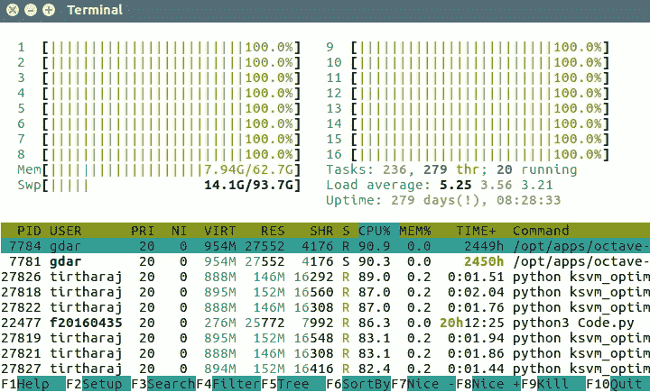

# 使用 Python 的多重处理模块高效地评估一组算法。

> 原文：<https://towardsdatascience.com/using-pythons-multiprocessing-module-to-evaluate-a-set-of-algorithms-efficiently-1412d29ff849?source=collection_archive---------9----------------------->

Power.

有时，在看到数据集后，您的第一直觉是想到可能对其有效的多种算法。然后，您自然会想尝试所有这些方法，看看它们在基线结果上的表现如何。但是有一个因素总是让你重新考虑这个决定。时间的因素。那么，我们如何绕过它呢？让我们试试多重处理。

进程是计算机中的一个工作单元。就 python 而言，您可以将流程视为程序的实例(例如 Jupyter notebook、Python 解释器、独立脚本)。您的操作系统能够同时运行多个进程，您可以将进程映射到系统中的内核数量。如果您有多个内核(这种情况很常见)，您可以在不同的内核上同时并行运行多个进程。

我们面临的问题是在同一个数据集上评估多种算法，获取它们的指标，并查看哪种算法的性能最好。这非常适合在分布式内核上轻松运行。这是因为它们彼此独立。也就是说，随机森林训练和测试运行不关心 SVM 训练测试评估的中间结果。因此，我们可以在不同的内核上同时运行它们，并更快地获得结果，而不是在一个内核上逐个运行它们。

不幸的是，python 代码默认作为单个进程在单个内核上运行。幸运的是，使用内置的多处理模块可以很容易地使代码并行运行，并利用所有的 CPU 内核。现在让我们开始研究代码，看看它是如何工作的。

Use them all! (Image Source:Vindictus)

假设我们已经将我们的训练和测试数据分开，并准备好像在常规机器学习管道中一样使用。我们还有一个函数 find_rmse(reg ),它接受 sklearn 的回归算法函数，并使用它来训练，然后在数据集上进行测试，并提供我们获得的平均均方根误差。该问题是一个监督回归问题，我们希望在同一数据集上看到四种算法的结果，即随机森林、nuSVM、岭回归和 ElasticNet。

首先，我们将从多处理模块中导入池函数。Pool 对象提供了一种方便的方法，可以跨多个输入值并行执行一个函数，并将输入数据分布到多个进程中。它需要一个参数，这个参数等于您想要生成的工作进程的数量。为了最大限度地利用资源，您可以将其保持为 CPU 中的核心数。但是，请记住，因为所有这些都将主要由这个 python 程序使用，所以在程序执行时，您可能无法在系统上执行另一个处理器繁重的工作。

然后，让我们创建一个我们想要比较结果的回归变量列表。我们的工作非常方便，因为 python 可以将函数作为函数的参数。

现在，让我们将使用回归器训练模型并对其进行测试后计算 rmse 的函数映射到我们的回归器列表。这将把这些回归函数列表并行传递给我们的父函数 find_rmse(reg )!

最后，让我们埋葬我们的池对象的遗骸。

瞧啊。我们只是大大减少了比较这么多回归算法所需的时间。如果你大规模地这样做，这是我目前正在做的研究项目的一部分，这是我们正在谈论的几天和几个月的差异。我的系统有 64 个 CPU 内核，使用它们可以帮助我以指数级的速度实现这一目标。但是如果不使用这种技术，这 64 个内核将会被浪费掉。即使您的个人计算机通常也有 4 个以上的内核，因此您也可以使用这种技术来大幅提高速度。祝您愉快地并行学习！