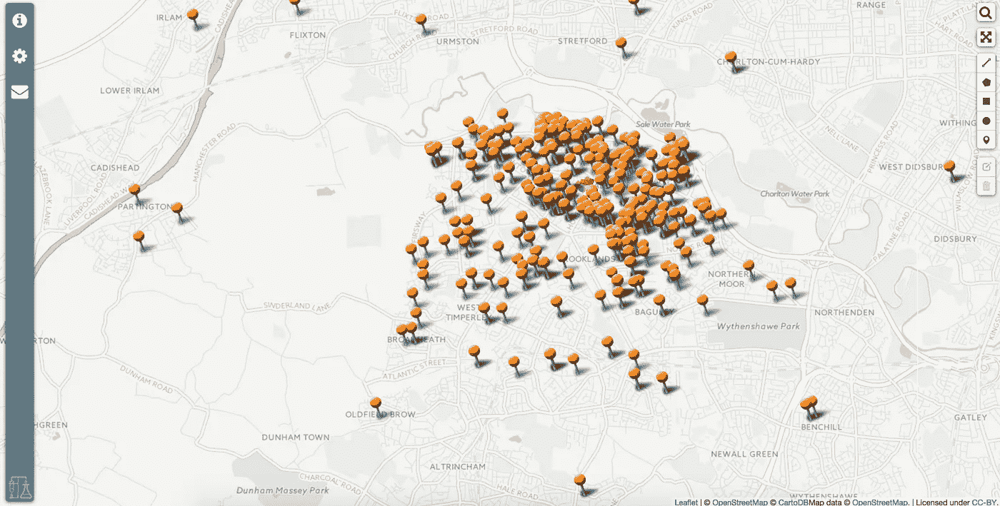
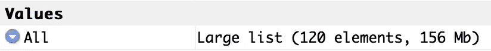
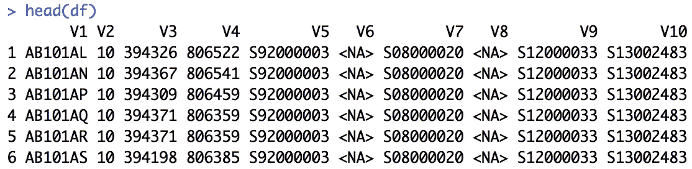

# 用 R 将代码点打开的 CSV 文件合并成一个大文件

> 原文：<https://towardsdatascience.com/using-r-to-merge-the-csv-files-in-code-point-open-into-one-massive-file-933b1808106?source=collection_archive---------0----------------------->



Map courtesy Trafford Innovation and Intelligence Lab

如果你有一个有邮政编码的数据集，例如客户数据或资产信息，你可以做的最有用的事情之一就是把数据放到地图上。为此，需要对每条记录进行地理参考。英国国家测绘局有一个开放的数据集，叫做 [Code-Point Open](https://www.ordnancesurvey.co.uk/business-and-government/products/code-point-open.html) ，你可以从他们的开放数据网站上获得。该数据集允许您在自己的数据中查找邮政编码，以找到它们的坐标，这样您就可以将它们放在地图上。

英国国家测绘局的数据集包含在一个 zip 文件中，当您提取它时，它由 120 个 csv 文件组成。这可能是一个棘手的问题，所以我将展示如何使用 R(实际上是 R Studio)将所有这些 csv 文件合并成一个文件。还有其他方法可以做到这一点——手动(😱)、编写批处理文件、MS Visual Basic 等，但这是一种优雅而快速的完成方式。

首先，打开 R Studio，创建一个新项目。在项目文件夹中新建一个文件夹，命名为‘temp’。你现在需要从英国测绘局复制 120 个 csv 文件到这个文件夹。

之后，在 R Studio 控制台中，我们需要将这个项目的工作目录设置为 temp 文件夹:

```
setwd(‘temp/’)
```

然后，我们需要将该文件夹中所有内容的文件名传递到一个变量中:

```
filenames <- list.files(full.names=TRUE)
```

这将遍历该文件夹中的文件，挑选出文件名，并将它们传递到变量‘filenames’中。我们现在将使用这些文件名来遍历文件，从每个 csv 文件中提取数据，并将其合并到一个列表中(注意，这将需要几秒钟的时间来完成):

```
All <- lapply(filenames,function(i){
read.csv(i, header=FALSE, skip=4)
})
```

这会将数据推入变量“All”中。如果我们查看“环境”选项卡，我们可以看到这是一个包含 120 个元素的“大列表”，大小为 156Mb。



为了使用数据集，或者在 R 中进行匹配，或者保存为它自己的 csv 文件，我们需要将它转换为 dataframe。为此，我们可以运行以下命令:

```
df <- do.call(rbind.data.frame, All)
```

为了检查数据帧的内容，我们可以使用 head 函数显示前几行数据:

```
head(df)
```

这给了我们这个:



这看起来不错(尽管将列重命名为更有意义的名称可能是个好习惯)。V1 有邮政编码，V3 和 V4 是英国坐标系参考。最后，要将这个大的邮政编码列表保存为一个新的 csv 文件，我们可以使用 write.csv:

```
write.csv(df,”all_postcodes.csv”, row.names=FALSE)
```

这将在 R Studio 项目文件夹的 temp 文件夹中创建一个新的(大量的)csv 文件。从这里，您可以将邮政编码文件与您自己的数据合并，以便在 R 中进行地理参考，或者您可以在 Excel 中进行 vlookups。

请注意，本练习之所以有效，是因为每个 csv 文件在数据列数方面具有相同的形状。对于不同的数据集，这种过程变得更加复杂。

下面是一次性完成的所有代码:

```
setwd(‘temp/’)
filenames <- list.files(full.names=TRUE)
All <- lapply(filenames,function(i){
read.csv(i, header=FALSE, skip=4)
})
df <- do.call(rbind.data.frame, All)
write.csv(df,”all_postcodes.csv”, row.names=FALSE)
```