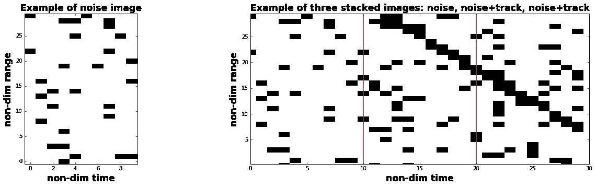
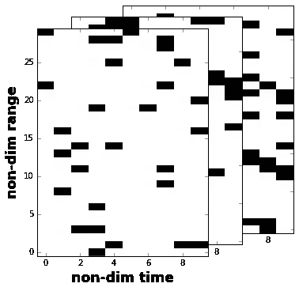
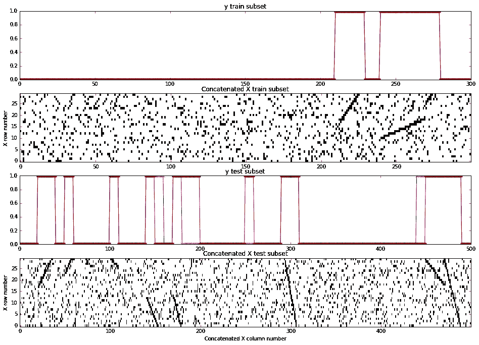

# 用递归神经网络进行噪声中的轨迹检测

> 原文：<https://towardsdatascience.com/using-recurrent-neural-networks-for-track-detection-in-noise-5e6395c8afae?source=collection_archive---------9----------------------->

# ***动机***

通过观察[声纳](https://en.wikipedia.org/wiki/Sonar)或[雷达](https://en.wikipedia.org/wiki/Radar)屏幕，人类可以很容易地探测到轨迹，这些轨迹是由通常距离很远且只能作为点来观察的物体形成的。即使在有噪声的图像中，也可以在视觉上检测到相应的点图案。此外，当轨迹在噪音中不断出现和消失时，训练有素的操作员可以快速判断不相关的轨迹本身是否形成了可能与同一物体相关的轨迹模式。

需要上述观察来做出关于物体存在或不存在的决定。例如，如果物体与噪声相比非常亮，那么可以通过观察(或检测)单个亮点来做出这样的决定。然而，如果与噪声相关的点表现出与感兴趣的对象相当的亮度，我们最终会得到许多错误的检测。作为对象检测的下一步，我们假设噪声是均匀的，因此与噪声相关的点不会形成轨迹。然而，如果噪声分布不均匀，与噪声相关的点也会形成短轨迹。因此，我们以错误的轨迹检测结束。当由于噪声，感兴趣对象的轨迹很短，使得它们出现和消失，表现出噪声轨迹间歇性时，就会出现这种情况。在这种情况下，人类观察者会寻找与单个物体相关的轨迹模式。一旦发现这种轨迹模式，就可以宣布感兴趣的物体的存在。

另一方面，随着噪声水平的增加和要跟踪的对象数量的增加，现有的基于对象运动建模的[跟踪算法](https://en.wikipedia.org/wiki/Track_algorithm)必须处理指数级增加的计算复杂度。还应该注意，执行各自的计算增加了数据处理功耗，同时需要强大的处理器和增加的存储器。

最近在机器学习(例如深度学习， [DL](https://en.wikipedia.org/wiki/Deep_learning) )的各种应用中取得的重大进展已经证明了匹配甚至超过人类能力的结果(例如在下棋或下围棋方面)。在 Raspberry Pi 等小型单板计算机上成功实现训练好的 DL 表明，使用廉价的自主、低功耗机器人解决目标检测、跟踪和定位问题可能是 DL 应用的新方向。

# 方法

在这项工作中，我将研究二进制(即黑白)图像中轨迹检测的玩具问题。各自的 Python 代码，写为 Jupyter notebook，使用 [Keras](https://keras.io/) 框架，可在[这里获得。下面，我展示了这段代码的主要模块和计算的输出。](https://github.com/GeorgeMadlis/Track-detection-in-noise)

下面显示的问题不是一个小问题，它的成功保证了在这个领域的进一步研究。下面我实现了一种循环神经网络( [RNN](https://en.wikipedia.org/wiki/Recurrent_neural_network) )，叫做长短期记忆( [LSTM](https://en.wikipedia.org/wiki/Long_short-term_memory) )网络。想法是应用可以同时使用空间和时间信息的算法，以便能够捕获在噪声中呈现间歇出现和消失的对象的模式。

在开始具体示例之前，我导入了这项工作所需的所有 Python 模块。

现在我加载 **LSTM** 训练和测试所需的预先生成的人工数据。注意，我分别使用了 3000 和 300 幅图像进行训练和测试。这些图像被堆叠成 3D 矩阵，每个图像具有 10×30 像素的尺寸。每个图像被标记为噪声( *y[i] = 0* )或包含轨迹( *y[i]=1* )。

接下来，为了展示数据的结构，我们看几个示例图像。

# 例子

上图中，左图显示了由黑色矩形标记的典型噪波分布。在右边，三个图像被连接在一起。从左到右，第一个图像对应于左侧显示的噪声，接下来的两个图像显示了一个线性轨迹，看起来像一个由黑色小矩形框组成的楼梯，向下穿过中间和最右侧的图像。

为了 LSTM 处理的目的，在这项工作中，图像按 10 的顺序进行处理。下面，我只展示了前三个，以强调数据的 3D 排列。

# 利用长短时记忆模型学习检测轨迹

我在带有 [Tensorflow](https://www.tensorflow.org/) 后端的 [Keras](https://keras.io/) 框架中使用 LSTM 模型架构。下面，如果“keras_model_load”设置为 True，将使用预训练模型。如果“keras_model_load”设置为 False，则从头开始训练模型。

现在，我们使用经过训练的模型来预测用于训练和测试的输入图像的标签。

为了估计每个图像的一个标签，我们需要对每个图像的 10 个时间步长生成的 10 个标签进行平均。

由于预测输出是实值，使用阈值 0.5，我将输出分为两类:对应于轨道存在的输出( *y* =1)，以及对应于轨道不存在的输出( *y* =0)。下面的 *y* 对应于 *Y_estim_test* 或 *Y_estim_train* 。

# 结果

下面显示了训练和测试结果的子集。在每个连接图像的顶部，绘制了平均标签的分布。蓝色和红色分别显示真实和估计的标签。请注意，对于下面显示的训练子集，这两种标签类型完全匹配。

最后，我估计了应用于测试和训练数据的检测概率(Pd)和虚警概率(Pfa)。该指标通常用于[接收器操作特性](https://en.wikipedia.org/wiki/Receiver_operating_characteristic)估计。

# 讨论

查看上面显示的输出，可以看到训练的模型倾向于过度拟合(比较训练的 Pd=0.988 和测试数据的 Pd=0.629)。我对大量测试运行的经验(此处未显示)表明，对于该数据集，过度拟合往往会随着训练数据大小的增加而减少，这是意料之中的。

通过寻找更好的 RNN 结构和微调超参数来提高精度是未来潜在的研究课题之一。

尽管所呈现的数据生成算法简单，但是数据生成模型输出非常类似于活动声纳的真实场景。

在这项工作中分析的情况，在任何给定的时间，仅限于检测一个单一的轨道。轨迹检测是在没有对象运动建模算法的帮助下进行的。后者不需要任何训练(除了一些微调)，但在操作上需要更昂贵的计算。

这项研究是基于 LSTM 神经网络的第一步，旨在通过发现和检测属于同一物体的轨迹(或轨迹拼接)模式来提高物体检测的可信度，这些轨迹由于噪声而在声纳或雷达屏幕上出现和消失。