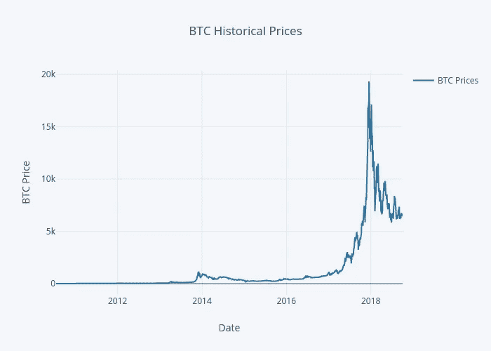
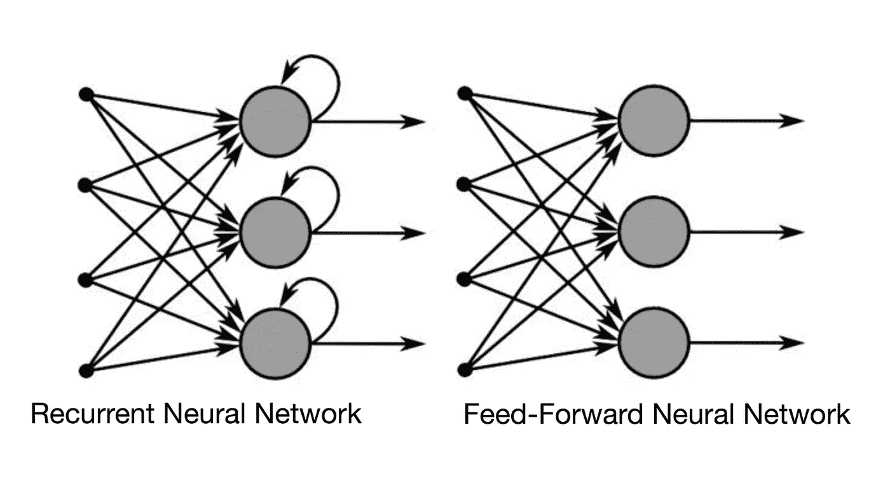
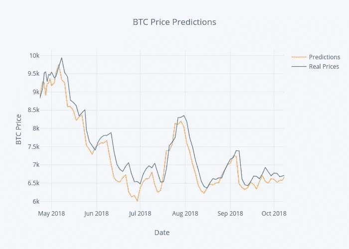

# 用递归神经网络预测明天的比特币(BTC)价格

> 原文：<https://towardsdatascience.com/using-recurrent-neural-networks-to-predict-bitcoin-btc-prices-c4ff70f9f3e4?source=collection_archive---------5----------------------->

## 深度学习案例研究

## 利用 TensorFlow 和 Keras |监督深度学习，使用递归神经网络预测第二天的加密货币价格

如果你正在阅读这篇文章，我确信我们有着相似的兴趣，并且现在/将来会从事相似的行业。那么我们就通过 [*Linkedin*](https://linkedin.com/in/orhangaziyalcin/) *来连线吧！请不要犹豫发送联系请求！*[*Orhan g . yaln—Linkedin*](https://linkedin.com/in/orhangaziyalcin/)

Photo by [Andre Francois](https://unsplash.com/photos/iGYiBhdNTpE?utm_source=unsplash&utm_medium=referral&utm_content=creditCopyText) on [Unsplash](https://unsplash.com/search/photos/bitcoin?utm_source=unsplash&utm_medium=referral&utm_content=creditCopyText)

如果你能以某种方式预测明天的比特币(BTC)价格，这不是很棒吗？众所周知，加密货币市场在过去一年经历了巨大的波动。比特币的价值在 2017 年 12 月 16 日达到顶峰，攀升至近 2 万美元，然后在 2018 年初出现了急剧下降。然而不久前，确切地说是一年前，它的价值几乎是现在的一半。因此，如果我们看看每年的 BTC 价格图表，我们可以很容易地看到，价格仍然很高。仅在两年前，BTC 的价值仅为其当前价值的十分之一，这一事实更令人震惊。您可以使用下图亲自探索 BTC 的历史价格:

Historical Bitcoin (BTC) Prices by [CoinDesk](https://www.coindesk.com/price/)

关于这种波动背后的确切原因有几个阴谋，这些理论也被用来支持加密价格的预测推理，特别是 BTC。这些主观论点对预测加密货币的未来很有价值。另一方面，我们的方法评估历史数据，从算法交易的角度预测加密货币的价格。我们计划使用数值历史数据来训练一个递归神经网络( **RNN** )来预测 BTC 价格。

# 获取历史比特币价格

我们可以使用相当多的资源来获取历史比特币价格数据。虽然其中一些资源允许用户手动下载 CSV 文件，但其他资源提供了一个 API，用户可以将其与自己的代码挂钩。因为当我们使用时间序列数据训练模型时，我们希望它做出最新的预测，所以每当我们运行程序时，我更喜欢使用 API 来获得最新的数字。经过快速搜索，我决定使用 CoinRanking.com 的 API，它提供了我们可以在任何平台上使用的最新硬币价格。

# 递归神经网络

由于我们使用的是时间序列数据集，使用前馈神经网络是不可行的，因为明天的 BTC 价格与今天的最相关，而不是一个月前的。

> 递归神经网络(RNN)是一类人工神经网络，其中节点之间的连接沿着序列形成有向图。— [维基百科](https://en.wikipedia.org/wiki/Recurrent_neural_network)

RNN 显示时间序列的时间动态行为，它可以使用其内部状态来处理序列。实际上，这可以通过 LSTMs 和 GRUs 层来实现。

这里您可以看到常规的仅前馈神经网络和递归神经网络(RNN)之间的区别:

RNN vs. Regular Nets by Niklas Donges on [TowardsDataScience](/recurrent-neural-networks-and-lstm-4b601dd822a5)

# 我们的路线图

为了能够创建一个根据历史 BTC 价格进行训练并预测明天 BTC 价格的程序，我们需要完成如下几个任务:

1-获取、清理和规范化历史 BTC 价格

2 —与 LSTM 共建 RNN

3-训练 RNN 并保存训练好的模型

4 —预测明天的 BTC 价格，并将其“反序列化”

**奖励:**反序列化 X_Test 预测并创建 Plot.ly 图表

# 获取、清理和规范化历史 BTC 价格

## 获取 BTC 数据

正如我上面提到的，我们将使用 CoinRanking.com 的 API 来处理 BTC 数据集，并使用以下代码将其转换为熊猫数据框架:

Obtaining the BTC Prices with CoinRanking API

默认情况下，该函数针对 5 年期 BTC/美元价格进行调整。但是，您可以通过传入不同的参数值来更改这些值。

## 使用自定义函数清理数据

在获得数据并将其转换为 pandas 数据框架后，我们可以定义自定义函数来清理我们的数据，对神经网络进行标准化，因为这是获得准确结果的必要条件，并应用自定义训练-测试分割。我们创建了一个定制的训练测试分割函数(不是 scikit-learn 的),因为我们需要保持时间序列，以便正确地训练我们的 RNN。我们可以通过下面的代码实现这一点，您可以在下面的代码片段中找到进一步的函数解释:

Defining custom functions for matrix creation, normalizing, and train-test split

定义这些函数后，我们可以用下面的代码调用它们:

Calling the defined functions for data cleaning, preparation, and splitting

# 与 LSTM 共建 RNN

在准备好我们的数据之后，是时候构建模型了，我们稍后将使用清理和规范化的数据来训练该模型。我们将从导入我们的 Keras 组件开始，并使用以下代码设置一些参数:

Setting the RNN Parameters in Advance

然后，我们将使用以下代码创建具有两个 LSTM 和两个密集层的顺序模型:

Creating a Sequential Model and Filling it with LSTM and Dense Layers

# 训练 RNN 并保存训练好的模型

现在是时候用清理后的数据训练我们的模型了。您还可以测量训练过程中花费的时间。遵循这些代码:

Training the RNN Model using the Prepared Data

不要忘记保存它:

Saving the Trained Model

我热衷于保存模型并在以后加载它，因为知道您实际上可以保存一个训练好的模型并在下次使用时重新加载它，这是非常令人满意的。这基本上是 web 或移动集成机器学习应用的第一步。

# 预测明天的 BTC 价格并将其“反序列化”

在我们定型模型之后，我们需要获取用于预测的当前数据，因为我们对数据进行了规范化，所以预测也将被规范化。因此，我们需要反规范化回它们的原始值。首先，我们将使用以下代码以类似的、部分不同的方式获取数据:

Loading the last 30 days’ BTC Prices

我们将只有用于预测的标准化数据:没有训练测试分割。我们还将手动重塑数据，以便能够在我们保存的模型中使用它。

在清理和准备我们的数据后，我们将加载训练好的 RNN 模型进行预测，并预测明天的价格。

Loading the Trained Model and Making the Prediction

但是，我们的结果将在-1 和 1 之间变化，这没有太大意义。因此，我们需要将它们反规范化回它们的初始值。我们可以通过一个自定义函数来实现这一点:

We need a deserializer for Original BTC Prediction Value in USD

定义自定义函数后，我们将调用这些函数，并用以下代码提取明天的 BTC 价格:

Calling the deserializer and extracting the Price in USD

使用上面的代码，您实际上可以获得模型对明天 BTC 价格的预测。

# 反序列化 X_Test 预测并创建 Plot.ly 图表

你也可能对 RNN 模型的总体结果感兴趣，更喜欢把它作为一个图表来看。我们也可以通过使用本教程培训部分的 X_test 数据来实现这些。

我们将首先加载我们的模型(将其视为单一预测案例的替代方案)并对 X_test 数据进行预测，以便我们可以使用以下代码对适当的绘图天数进行预测:

Loading the Trained Model and Making Prediction Using the X_test Values

接下来，我们将导入 Plotly 并设置属性以获得良好的打印体验。我们将通过以下代码实现这一点:

Importing Plotly and Setting the Parameters

设置完所有属性后，我们最终可以用下面的代码来绘制我们的预测和观察值:

Creating a Dataframe and Using it in Plotly’s iPlot

当您运行此代码时，您将得到以下图形的最新版本:

Plot.ly Chart for BTC Price Predictions

# 这些结果有多可靠？

如你所见，它看起来一点也不差。但是，您需要知道，即使模式非常匹配，如果您每天都检查结果，结果仍然彼此相差很大。因此，必须进一步开发代码以获得更好的结果。

# 恭喜

您已经成功创建并训练了一个可以预测 BTC 价格的 RNN 模型，甚至还保存了训练好的模型以备后用。通过切换到面向对象编程，您可以在 web 或移动应用程序上使用这种经过训练的模型。为自己成功开发了一个与人工智能、区块链和金融相关的模型而沾沾自喜。我认为用这个简单的项目同时触及这些领域听起来很酷。

# 订阅邮件列表获取完整代码

如果你想在 Google Colab 上获得完整的代码，并获得我的最新内容，可以考虑订阅邮件列表:✉️

> [立即订阅](http://eepurl.com/hd6Xfv)

# 喜欢这篇文章

如果你喜欢这篇文章，可以考虑看看我的其他类似文章:

 [## 使用卷积自动编码器在 10 分钟内降低图像噪声

### 在时尚 MNIST 的帮助下，使用深度卷积自动编码器清洁(或去噪)有噪声的图像

towardsdatascience.com](/image-noise-reduction-in-10-minutes-with-convolutional-autoencoders-d16219d2956a)  [## 使用 MNIST 数据集在 10 分钟内完成图像分类

### 利用 TensorFlow 和 Keras |监督深度学习使用卷积神经网络来分类手写数字

towardsdatascience.com](/image-classification-in-10-minutes-with-mnist-dataset-54c35b77a38d)  [## 利用生成性对抗网络在 10 分钟内生成图像

### 使用无监督深度学习生成手写数字与深度卷积甘斯使用张量流和…

towardsdatascience.com](/image-generation-in-10-minutes-with-generative-adversarial-networks-c2afc56bfa3b)  [## TensorFlow Hub & Magenta 在 5 分钟内实现快速神经风格转换

### 利用 Magenta 的任意图像风格化网络和深度学习，将梵高的独特风格转移到照片中

towardsdatascience.com](/fast-neural-style-transfer-in-5-minutes-with-tensorflow-hub-magenta-110b60431dcc) 

## 一般建议警告

本网站发布的信息仅供一般参考，并不作为对任何特定人士的具体建议。本文包含的任何建议都是一般性建议，不考虑任何人的特定投资目标、财务状况和特殊需求。

*在根据本建议做出投资决定之前，无论是否有合格顾问的帮助，您都应该考虑本建议是否适合您的特定投资需求、目标和财务状况。金融产品过去的表现并不能保证未来的表现。*

***来自《走向数据科学》编辑的提示:*** *虽然我们允许独立作者根据我们的* [*规则和指导方针*](/questions-96667b06af5) *发表文章，但我们并不认可每个作者的贡献。你不应该在没有寻求专业建议的情况下依赖一个作者的作品。详见我们的* [*读者术语*](/readers-terms-b5d780a700a4) *。*