# 使用 sci kit-学会发现恶霸

> 原文：<https://towardsdatascience.com/using-scikit-learn-to-find-bullies-c47a1045d92f?source=collection_archive---------14----------------------->

到目前为止，我所做的大部分工作都是关于神经网络的。然而，这些有一个明显的缺点:它们需要大量的数据。

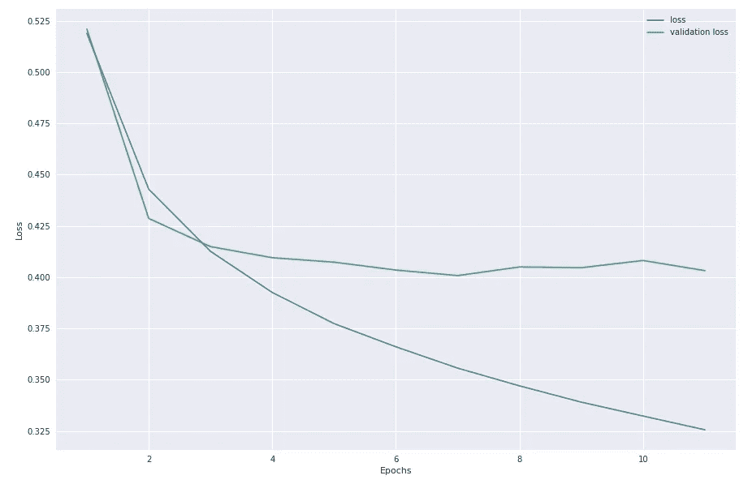

The loss of my Quora NLP neural network. The fact that validation loss is much greater than training loss is indicative of overfitting, and this happens quite early in the training.

当我训练一个自然语言处理神经网络来[识别相似的 Quora 问题](https://medium.com/towards-data-science/natural-language-processing-with-quora-9737b40700c8)时，这一点非常清楚。即使有 300，000 个数据点可用于训练网络，它仍然没有花很长时间就开始过度拟合。

在本文中，我将使用一个小得多的数据集来练习分类。我将使用各种工具来完成这项工作，包括 [SpaCy](https://spacy.io/) (一种自然语言处理工具)，以及不同的 [scikit-learn](http://scikit-learn.org/stable/) 算法。

在这个过程中，我将探索我所使用的算法到底是做什么的。

内容:

1.  问题定义和设置
2.  用 scikit-learn 算法求解
    a. [逻辑回归](#1afe)
    b. [随机森林](#ba80)
    c. [支持向量机](#27f5)
3.  结论

# 问题定义和设置

[链接到代码](https://github.com/GabrielTseng/LearningDataScience/blob/master/Natural_Language_Processing/Detecting_Bullies/1-Making_GloVe_vectors.ipynb)

为了找到一个小数据集来玩，我找到了一个很久以前的 Kaggle 比赛:[检测社会评论中的侮辱](https://www.kaggle.com/c/detecting-insults-in-social-commentary)。训练集有 3000 个数据点，比我上次解决的自然语言处理挑战小 100 倍。

**挑战:**确定一条评论是否会被认为是对对话中另一位参与者的侮辱。

这些评论来自评论网站、留言板等，以 csv 文件的形式提供。

下面是一个非侮辱性评论的例子:

```
"Celebrity Big Brother IS a mistake."
```

和一个侮辱性的评论:

```
"You are stuck on stupid obviously...give me a break and don\'t vote.\\nmoron"
```

## 清理数据

正如上面的例子所示，清理句子是必要的。我将使用单词嵌入来量化单词，所以我想在句子中分离出单词，没有任何诸如换行符或撇号之类的无用信息。

为了做到这一点，我把注释中的换行符都去掉了(`'\\n'`在数据中特别常见，所以我专门做了一点去掉)，只保留字母。

这样做将上面的注释更改为:

```
You are stuck on stupid obviously give me a break and don t vote  moron
```

## 符号化

[SpaCy](https://spacy.io/) 非常擅长文字处理，尤其是非常擅长将数据符号化。这意味着它善于识别不同单词在句子中的位置(这很有用，因为它们不总是由空格分隔)。

SpaCy 的另一个非常酷的部分是，它根据[手套词嵌入](https://nlp.stanford.edu/projects/glove/)(我在这里探索)自动为这些令牌分配 300 维向量。因此，对我来说，获取一个句子，并从中生成一个嵌入矩阵非常容易。

然而，使用嵌入从句子创建矩阵的直观方法不适用于小数据集。如果我在训练一个神经网络，我的方法只是将所有嵌入向量附加在一起:

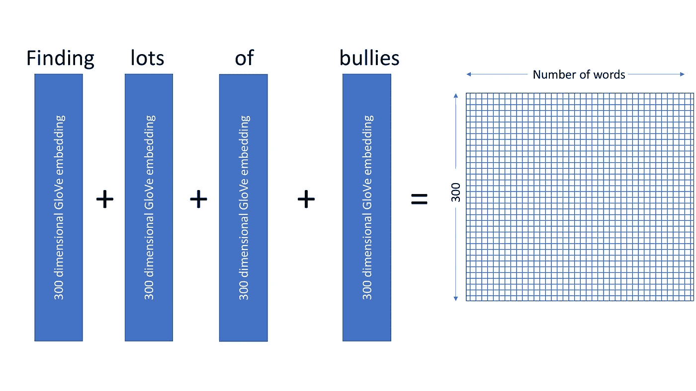

The intuitive approach to generating a matrix using word embeddings. Each word has its own 300 dimensional embedding. They are all appended together to create a ‘sentence matrix’.

这样做的问题是，随着句子长度的增加，特征的数量(即矩阵的大小)会激增。该数据集中的平均句子长度为`33`个单词；这将产生一个大小为`(33, 300)`的矩阵，有 9900 个元素。

鉴于我的 3000 训练点，这是乞求超负荷。

我的解决方案是找到矩阵中每个元素的平均值，因此我最终得到了每个句子的 300 维“平均值”向量:

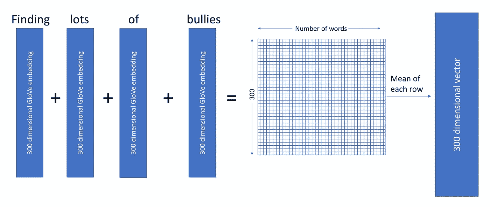

这意味着每个输入将有 300 个特征；这要合理得多。

# 使用 scikit 求解-学习

[链接至代码](https://github.com/GabrielTseng/LearningDataScience/blob/master/Natural_Language_Processing/Detecting_Bullies/3-Scikit_learn_algorithms.ipynb)

本次竞赛的指标是 [AUC ROC](https://stats.stackexchange.com/questions/132777/what-does-auc-stand-for-and-what-is-it) 。粗略地说，AUC ROC 分数可以解释为积极分类项目实际上是积极的可能性有多大，以及消极分类项目是消极的可能性有多大。

这比简单的准确性要好，因为它也考虑了数据集中的偏差。例如，如果我的评论中有 95%是侮辱性的，那么一个将每个评论都归类为侮辱性的分类器将有 95%的准确率，但它将是一个无用的分类器。AUC ROC 避免了这一点。

考虑到这一点，现在让我们分别研究每一种算法。

## 逻辑回归

**它是如何工作的？**该分类器将为我的输入特征中的每个变量定义系数(因此，因为我的输入是 300 维变量，所以定义了 300 个系数)。这就定义了一个函数:

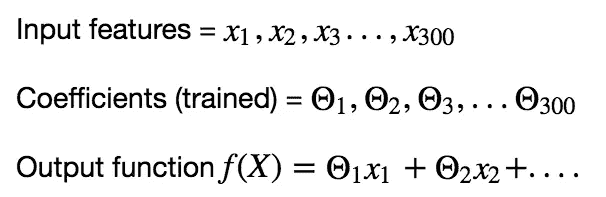

This relationship does not have to be linear; different x terms could be multiplied together, for instance. However, [LIBLINEAR](https://www.csie.ntu.edu.tw/~cjlin/papers/liblinear.pdf), the library used by scikit-learn, does assume a linear relationship.

然后训练这些系数，使得如果输入特征是侮辱，则输出为 1，否则输出为 0。通常使用 sigmoid 函数来简化最后一步:

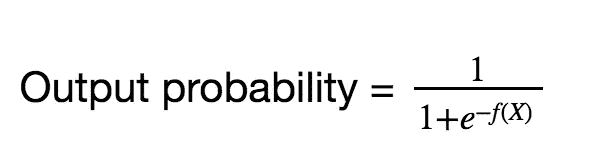

This function is called the sigmoid function, and restricts the output to between 1 and 0, which is ideal for classification, where something either is an insult (1) or is not (0). Particularly, it allows f(X) to get very large or small if it is confident in a classification, as the function is [asymptotic.](https://www.wikiwand.com/en/Sigmoid_function)

它做得怎么样？微调这个模型非常容易，因为它只有一个真正可以改变的参数:C，或者正则化强度的倒数(基本上，C 控制系数可以变化的程度。这防止了数据的过度拟合)。

逻辑回归得出以下训练曲线:

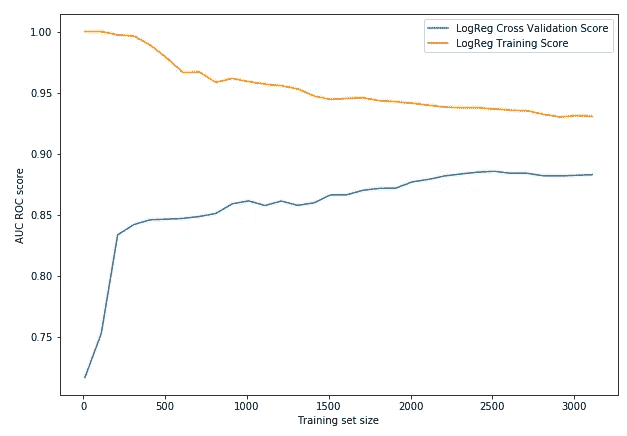

These plots show the success of the models on a training set and cross validation set (the cross validation set was made with 20% of the data) as the training set grew from just 100 samples to all the training data available (to 80% of the data). The size of the cross validation set remains fixed. Making these plots of model success against training set size is useful to uncover the performance of the model, and [to identify under/overfitting](https://datascience.stackexchange.com/questions/361/when-is-a-model-underfitted).

这种算法的简单性解释了为什么它训练起来如此之快。它的成功表明，取句子中单词向量的平均值是捕捉句子中情感的高效方式，因为它线性地映射到一个句子是否令人不快。

## 随机森林

**它是如何工作的？为了理解随机森林，理解决策树是有帮助的。[这篇文章](http://dataaspirant.com/2017/01/30/how-decision-tree-algorithm-works/)在这方面做得很好，我不会试图重复，但非常广泛:给定一些数据集(即下面的一些工作机会)，信息被用来将数据分成越来越小的子集，直到它被分类为“接受”或“拒绝”(在我的例子中，或者是“侮辱”或“不侮辱”)。更好的数据被用在树的更高层——所以在下面的例子中，薪水将是关于一份工作是否应该被接受或拒绝的最具指示性的指标。**

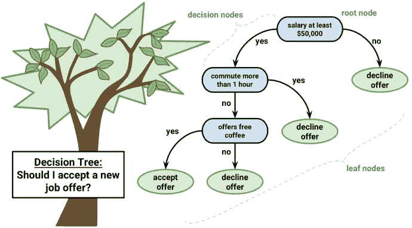

Credit: [http://dataaspirant.com/2017/01/30/how-decision-tree-algorithm-works/](http://dataaspirant.com/2017/01/30/how-decision-tree-algorithm-works/)

随机森林(直观地)通过将数据随机分成(许多)子集来使用许多决策树。然后，在组合结果以生成结论之前，它对每个子集训练决策树。

怎么办到的？训练随机森林时要调整的重要参数是决策树的数量(大约 100 是一个好的起点)和每个数据子集中的特征数量(这里，建议使用特征数量的平方根-大约 17，300 个特征)。

这对我来说证明是最成功的，产生了下面的训练曲线:

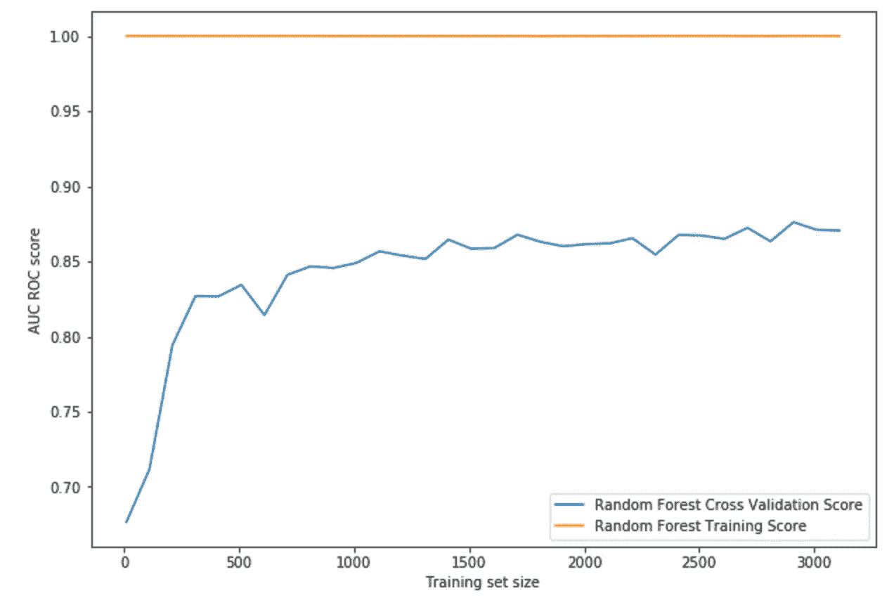

这里发生了一些严重的过度拟合。训练集的 AUC-ROC 得分接近 1，而交叉验证集的最终得分为 0.87。

当考虑随机森林如何工作时，这确实是有意义的；绝大多数决策树将会是垃圾(并且将会过拟合)。然而，它们应该互相抵消，留下几棵树，这些树可以归纳到交叉验证集(然后是未来的数据)。

## 支持向量机

**它是如何工作的？**逻辑回归使用线性系数来定义函数，然后使用该函数来预测数据的类别。

支持向量机不是线性系数，而是将数据的每个维度的距离与某个标志进行比较。这定义了一个新的特征空间，然后可以用它来预测数据的类别。

这有点令人困惑，所以让我们考虑一维数据(想象一下，如果不是长度为 300 的输入向量，而是长度为 1):

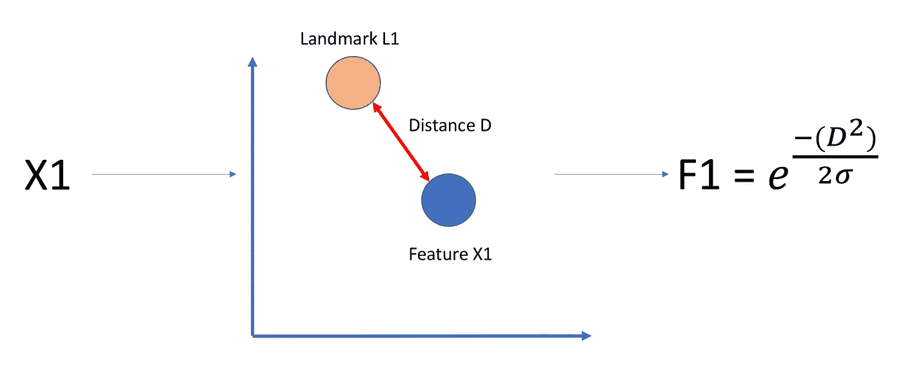

The sigma defines L1’s ‘circle of influence’. If it is larger, then F1 will be big even if D is large (if X1 and L1 are further apart). If it is smaller, then F1 will vanish if D gets large.

我的特征 X1 现在已经转换为一个特征，然后我可以在一个方程中使用它，就像逻辑回归一样:

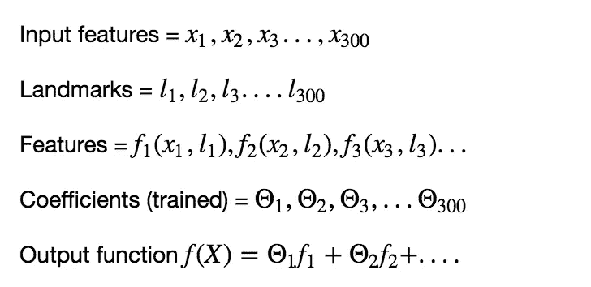

这使我能够以比简单的线性逻辑回归更复杂的方式分离数据，从而获得更好的性能。

它是怎么做的？与逻辑回归一样，最重要的训练超参数是正则化常数 c。

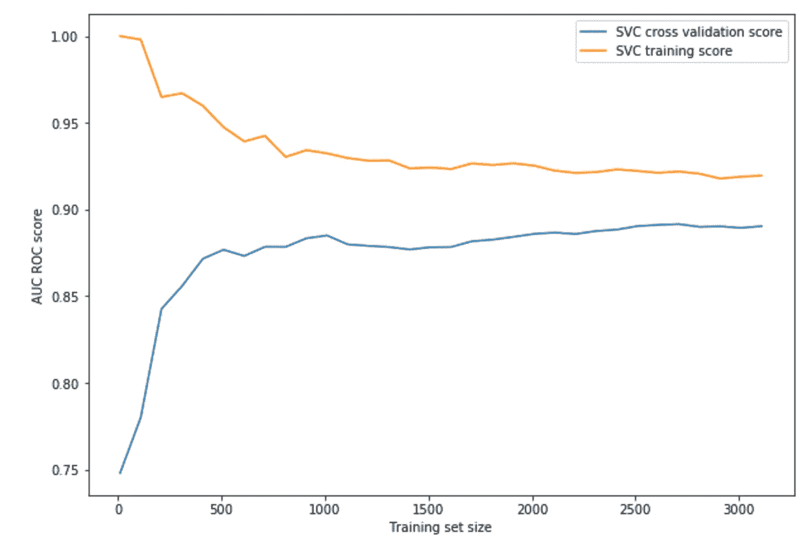

Note: SVC stand for support vector classification

最终 AUC ROC 为 0.89，是迄今为止最好的分类器。然而，因为它需要定义一个全新的特征空间来进行分类，所以它也比其他算法慢得多，在这个数据集上训练需要 14.8 秒(相比之下，逻辑回归需要 421 毫秒)。

# **算法对比**

这些都是怎么做的？

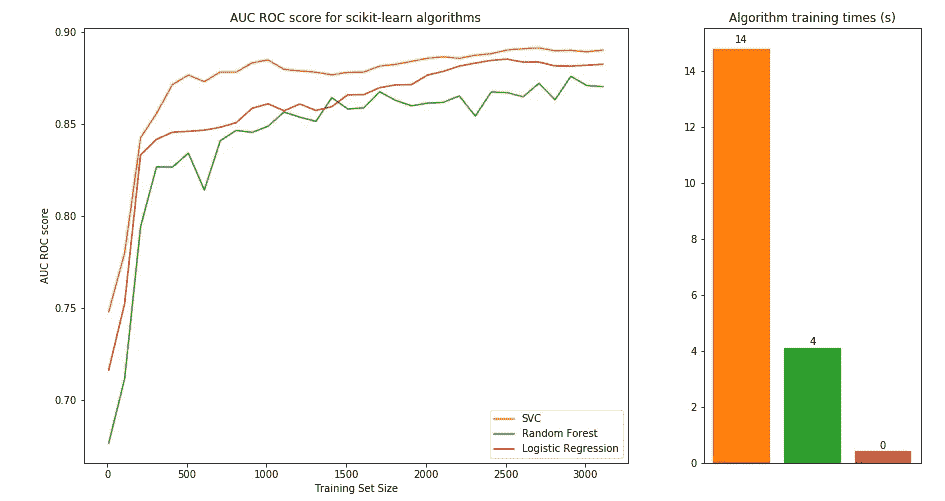

SVM 是最好的，但是定义新的特征空间导致显著的计算成本，并且它比逻辑回归花费 35 倍的时间来训练(对于 0.01 AUC ROC 的相对小的改进)。

# 结论

从这里可以得到一些启示:

1.  我一直惊讶于单词嵌入有多棒，尤其是考虑到[它们是如何产生的](http://colah.github.io/posts/2014-07-NLP-RNNs-Representations/)。2012 年在 Kaggle 上发起这个比赛的时候(单词嵌入之前)，获胜分数是 0.84249。单词嵌入让我不费吹灰之力就把这个分数提高到了 0.89。
2.  除了准确性，还有其他指标需要考虑。SVM 和逻辑回归之间的训练时间差异的重要性给我留下了深刻的印象，尽管 SVM 最终更好，但它可能不是最好的算法。
3.  所有这些算法都被设计用来处理扔给它们的任何东西，因此相当健壮。考虑到这些算法处理问题的不同，它们的表现非常相似；AUC ROC 评分最大差距只有 0.019——ka ggle 比赛第 1 名和第 10 名的差距。